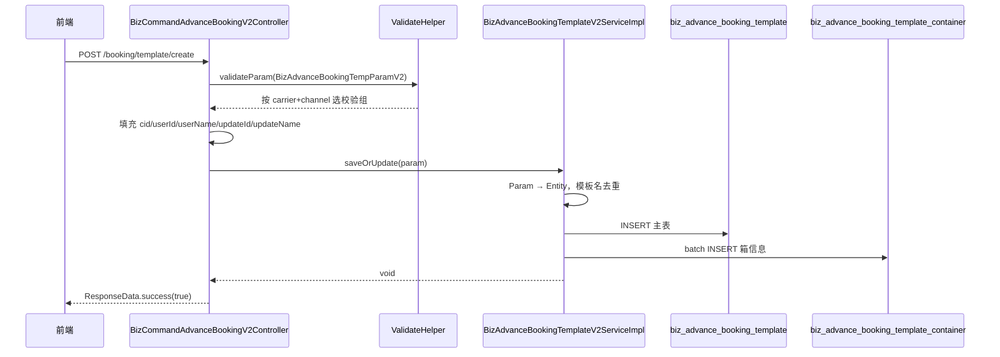
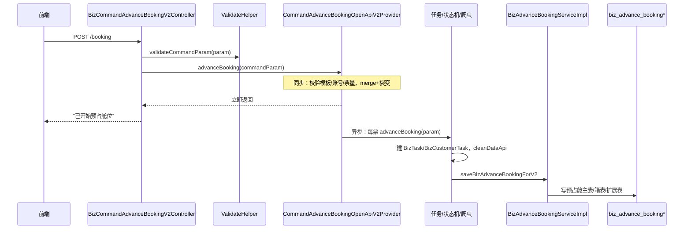

# V2 预占舱接口梳理

> *Controller：**`BizCommandAdvanceBookingV2Controller`*
> *路由前缀：**`/api/v2/command/advance`*
> *鉴权：需要 SSO 登录态（**`LoginContext`**）；类上 **`@ApiPermission(false)`** 表示不走额外 API 权限注解。*
> 
> 

---

## 一、Controller 接口总览

> *V2 Controller 没有 模板删除接口；删除仍在 V1：**`GET /api/v1/command/advance/booking/template/delete`**。*
> 
> 

---

## 二、模板创建：`POST /booking/template/create`

### 2\.1 做什么

保存一份「预占舱模板快照」，供后续立即占舱引用。不创建订舱任务、不调用爬虫、不写 `biz_advance_booking`。

### 2\.2 调用链



### 2\.3 Controller 层

```Java
@PostMapping(value = "/booking/template/create")
public ResponseData<Boolean> createTemplate(@RequestBody BizAdvanceBookingTempParamV2 param) {
    validateHelper.validateParam(param);
    LoginUser loginUser = LoginContext.getLoginUser();
    param.setUserId(loginUser.getUserId());
    param.setUserName(loginUser.getUserName());
    param.setUpdateId(loginUser.getUserId());
    param.setUpdateName(loginUser.getUserName());
    param.setCid(loginUser.getTenantId());
    templateV2Service.saveOrUpdate(param);
    return ResponseData.success(true);
}
```

要点：

- 请求体：`BizAdvanceBookingTempParamV2`（JSON 字段多为大写下划线，如 `CARRIER`、`TEMPLATE_NAME`）

- 校验：`validateHelper.validateParam` → 按 `carrier + bookingChannel` 动态选择 Bean Validation 分组（如 `EmcWebsiteGroup`、`CoscoWebsiteGroup`）

- 用户上下文由服务端注入，前端不传 `cid` / `userId`

- 不返回 新建 `templateId`，需通过列表或 detail 再查

### 2\.4 Service 层：`saveOrUpdate`

核心逻辑在 `BizAdvanceBookingTemplateV2ServiceImpl.saveOrUpdate`：

① 主表转换

② 模板名去重（create 专属）

同租户 \+ 同用户 \+ 同名 \+ 未删除（`deleteFlag=1`）→ 抛 `"此名称已存在，请重新命名"`。

③ 箱信息保存（二选一）

批量写入 `biz_advance_booking_template_container`。

### 2\.5 涉及数据表

### 2\.6 与 update 的差异

---

## 三、立即预占舱：`POST /booking`

### 3\.1 做什么

基于已有模板 \+ 前端表单，真正发起预占舱：创建订舱任务、参数清洗、写预占舱业务记录。接口异步执行，立即返回「已开始预占舱位」。

### 3\.2 调用链



### 3\.3 Controller 层

```Java
@PostMapping("/booking")
public ResponseData<String> saveBizAdvanceBooking(@RequestBody BizAdvanceBookingCommandParamV2 param) {
    validateHelper.validateCommandParam(param);
    advanceBookingOpenApiV2Provider.advanceBooking(param);
    String msg = "已开始预占舱位";
    return ResponseData.success(msg);
}
```

请求体：`BizAdvanceBookingCommandParamV2`（必含 `TEMPLATE_ID`、占舱表单字段、`BOOKING_GROUP_LIST` 等）。

### 3\.4 编排层：`advanceBooking(commandParam)`

`CommandAdvanceBookingOpenApiV2Provider.advanceBooking`

#### 同步阶段（返回前）

1. 设置租户 `cid`

2. 判断是否走 `BOOKING_GROUP_LIST` 分组模式，统计总票数

3. 业务校验

    - 模板存在且属于当前租户

    - 单次票量 ≤ `advanceBookingMaxTicket`（Redis，默认 10）

    - 订舱账号存在且渠道匹配

    - 账号主体当日次数未超限

    - CMA 外运：业务编号数量与票数一致

4. 参数 merge \+ 裂变

    - 读模板 `BizAdvanceBookingTemplate`

    - 模板默认值 \+ 前端 `commandParam` merge

    - 按 `ticketNumber` 裂变为多条 `BizAdvanceBookingTempParamV2`（一票一任务）

5. `CompletableFuture.runAsync` 异步执行后续逻辑

#### 异步阶段（每票）

Step A：单票 `advanceBooking(bookingParam)`

1. 创建 `BizTask` \+ `BizCustomerTask`（`parentCommandId = ADVANCE_BOOKING`）

2. 写 `BizCustomerTaskExt`（船司等）

3. 组装 `BookingParam`，触发订舱状态机

4. 调用 `clusterOpenApiService.cleanDataApi` 清洗

5. 清洗成功/失败推进状态机，失败写业务日志

6. 返回 `taskId` / `taskStatus` / `failMsg`

Step B：`saveBizAdvanceBookingForV2(bookingParam, commandParam)`

写预占舱业务数据（见下节）。

### 3\.5 Service 层：`saveBizAdvanceBookingForV2`

`BizAdvanceBookingServiceImpl.saveBizAdvanceBookingForV2`

额外处理：港口 fallback（装货港/卸货港为空时用收货地/交货地）；非占舱计划来源时清空 remark。

### 3\.6 涉及核心对象

### 3\.7 与模板 create 的对比

---

## 四、Controller 其他接口简要说明

### 4\.1 `POST /booking/template/page` — 模板分页

- 注入当前租户、用户、是否管理员（`SUPADMIN` 可看更多）

- 调用 `templateV2Service.pageList`

- 列表项附带模板箱信息（扁平 `containerList`）

### 4\.2 `GET /booking/template/detail?templateId=` — 模板详情

- 校验：存在、未删除、属于当前租户

- 主表字段 \+ JSON 反序列化（用户参考、相关方）

- 箱信息按 `groupId` 组装为 `BOOKING_GROUP_LIST` 结构返回

### 4\.3 `POST /booking/template/update` — 修改模板

- 与 create 类似，但 `templateId` 必填

- 更新时会删除旧箱再插入新箱；支持清空部分字段

### 4\.4 `POST /queryBookingPermissions` — 订舱权限校验

前端在选船司/渠道/网点等时调用，三层检查：

1. 租户 `biz_booking_carrier_config`（类型 `ACTUAL_BOOKING`）是否含该船司\+渠道

2. `booking_configuration` 是否有对应配置项

3. 失败则抛「没有开通…」或「暂不支持当前请求的订舱」

### 4\.5 `POST /queryBookingCarrier` — 已开通船司列表

- 返回当前租户 `ACTUAL_BOOKING` 类型的 `BizBookingCarrierConfig` 列表

- 用于占舱/模板页船司下拉

---

## 五、关键代码索引

---

## 六、注意事项

1. 模板 create 不返回 templateId，前端需再查列表/详情获取。

2. 占舱是异步的，接口返回不代表订舱成功，需查任务/预占舱记录状态。

3. 校验按船司分组，不同 carrier 必填字段不同；新增船司需在 Param 类挂对应 `*WebsiteGroup`。

4. 箱结构优先 `BOOKING_GROUP_LIST`；仅传 `CONTAINER_LIST` 且为 null 时，saveOrUpdate 可能 NPE。

5. V2 无模板删除，删除走 V1 接口。


