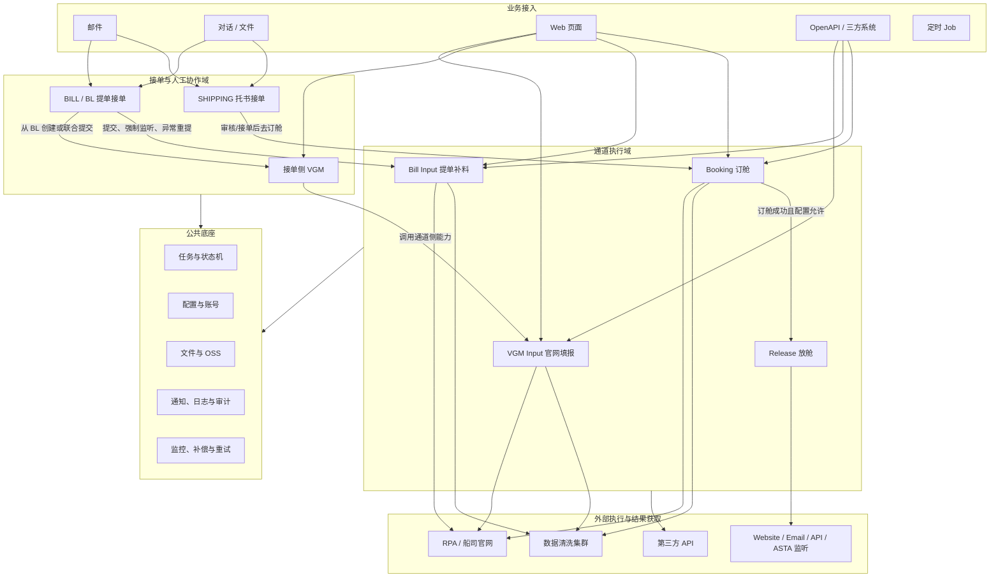
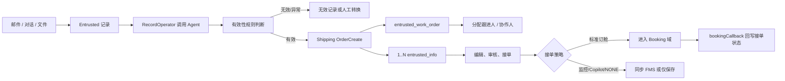
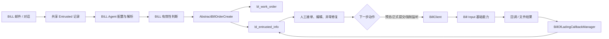
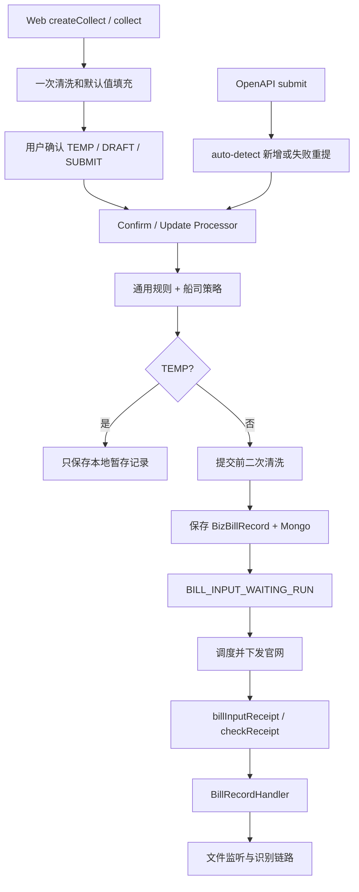
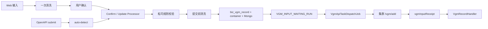

# 全项目主要业务链路总览

## 1\. 文档目的

本文从项目整体视角说明 `cube-control-desk` 承担的业务、主要模块的职责，以及各业务域之间如何衔接。

本文重点回答以下问题：

1. 系统从哪些入口接收业务数据。

2. 接单、订舱、放舱、提单补料和 VGM 分别负责什么。

3. 各业务域如何通过任务、清洗、外部执行、回调和监听形成闭环。

4. 哪些数据是当前状态真源，哪些数据只是历史、快照或共享基础设施。

5. 修改某条链路时，应该优先定位哪些模块和代码入口。

本文是宏观业务地图，不替代各业务域的详细设计、接口文档和排障手册。需要深入某条链路时，可继续阅读：

- \[接单（Entrusted）业务流程\]\(entrusted\-quick\-start\.md\)

- \[订舱与放舱新人上手指南\]\(booking\-release\-quick\-start\.md\)

- \[提单接单迁移设计\]\(\.\./design/bill/bill\_intake\_migration\_design\.md\)

- \[VGM 独立模块与 BL 接入设计\]\(\.\./design/bill/bl\_vgm\_submission\_design\.md\)

- \[VGM Input 独立模块设计\]\(\.\./design/vgm/vgm\_input\_design\.md\)

---

## 2\. 项目整体定位

`cube-control-desk` 不是单一的订舱系统，也不是单纯的工单系统。它同时承担两类职责：

### 2\.1 接单与人工协作

系统接收邮件、对话、文件和人工操作，将非结构化业务资料转成可处理的工单，并支持分配、审核、接单、编辑、异常修复、关闭、备注和协同。

这一侧的核心业务域包括：

- SHIPPING 托书接单。

- BILL / BL 提单接单。

- 接单侧 VGM。

### 2\.2 船司通道执行

系统把已经确认的标准业务数据转换成船司官网、API、邮件或 RPA 可执行的数据，创建任务，等待外部系统执行，并消费回执或持续监听结果。

这一侧的核心业务域包括：

- Booking 订舱。

- Release 放舱。

- Bill Input 提单补料。

- VGM Input 官网 VGM 填报。

因此，可以把整个项目概括为：

```Plain Text
业务资料接入
  -> Agent / 清洗 / 标准化
  -> 接单工单或通道任务
  -> 人工确认与业务校验
  -> 集群 / RPA / API / 邮件执行
  -> 回调或定时监听
  -> 更新当前状态、保存历史、通知上下游
```

---

## 3\. 工程模块与分层职责

### 3\.1 Maven 模块

|模块|主要职责|
|---|---|
|`cube-control-desk-app`|HTTP Controller、请求装配、用户态上下文和页面 API 入口|
|`cube-control-desk-biz`|业务编排、领域服务、任务状态机、Job、三方调用和公共组件|
|`cube-control-desk-api`|OpenAPI、Feign 契约和跨服务请求/响应模型|
|`cube-control-desk-model`|Entity、Enum、公共 DTO/VO、数据库模型和 Mapper 契约|
|`cube-control-desk-integration`|外部服务集成和跨系统适配|

### 3\.2 `biz` 内部分层

`cube-control-desk-biz` 是主要业务实现模块，其内部可以按三层理解：

|分层|主要职责|典型内容|
|---|---|---|
|`biz/modular`|跨服务、跨步骤的业务编排|manager、provider、job、strategy、callback|
|`biz/core`|领域数据和基础业务能力|service、mapper、processor、handler、rule、DTO|
|`biz/component`|公共技术与执行底座|状态机、集群/RPA 调度、第三方客户端、脚本、文件、安全、工具|

典型调用方向是：

```Plain Text
Controller / OpenAPI Provider
  -> modular Manager / Provider
  -> core Processor / Handler / Service
  -> Mapper / Entity / Mongo Document
  -> 外部集群、RPA、邮件、文件或第三方系统
```

---

## 4\. 全局业务架构



从全局上看，系统存在两条最主要的业务主轴：

```Plain Text
托书接单 -> 订舱 -> 放舱
```

```Plain Text
提单接单 -> Bill Input 提单补料
          -> 接单侧 VGM -> VGM Input
```

两条主轴共享邮件、客户配置、账号、任务、清洗、外部执行、文件、通知和审计等基础设施，但各业务域拥有自己的主数据和状态。

---

## 5\. 全项目通用执行模型

虽然各业务域的数据结构不同，但大多数链路都遵循类似的执行模式。

### 5\.1 第一步：业务接入

系统通过以下方式接收业务：

- 邮件 Job 定时拉取邮件。

- 用户上传文件或创建对话。

- Web 页面创建、编辑或确认业务。

- OpenAPI 接收上游标准业务数据。

- 外部系统通过回调返回执行结果。

- 定时 Job 扫描待执行、待监听、超时或待补偿记录。

### 5\.2 第二步：识别业务上下文

接入后首先需要确定：

- 当前租户 `cid / tenantId`。

- 委托客户 `entrustedCustomerCode`。

- 工单类型 `SHIPPING / BILL`。

- 船司和渠道。

- 业务来源 `sourceFrom`。

- 是否来自用户态、OpenAPI、Agent、接单域或第三方系统。

上下文决定后续使用哪套工单、配置、账号、规则和客户端。

### 5\.3 第三步：结构化与校验

不同入口的数据成熟度不同：

- 邮件、对话和文件需要 Agent、OCR、脚本或清洗服务转成标准结构。

- Web 表单通常先清洗出可编辑结构，用户确认后再执行提交前清洗。

- OpenAPI 通常一次性传入较标准的数据，只执行提交前清洗。

结构化之后，还会执行：

- 通用字段校验。

- 船司和渠道差异校验。

- 默认值填充。

- 港口、地点、箱型、相关方、品名等标准映射。

- 账号和登录信息补齐。

### 5\.4 第四步：建立业务当前态

接单域一般建立工单和业务主单：

- SHIPPING：`entrusted_work_order` \+ `entrusted_info`。

- BILL：`bl_work_order` \+ `bl_entrusted_info`。

- 接单侧 VGM：`vgm_info` \+ Mongo `vgm_detail`。

通道域一般建立任务和执行记录：

- Booking：`biz_advance_booking`。

- Bill Input：`biz_bill_record`。

- VGM Input：`biz_vgm_record`。

### 5\.5 第五步：任务化执行

需要异步执行的通道业务会进入统一任务框架：

- `BizTask`：一次平台级任务。

- `BizCustomerTask`：租户和客户维度的实际执行任务，也是状态机载体。

- `BizCustomerTaskExt`：账号、渠道、船司、来源、三方业务号等扩展上下文。

- `BizBusinessTask`：某个状态节点下等待外部执行的业务任务。

- `BizCustomerTaskLogs` / Detail：保存状态流转和执行参数。

- `BizCustomerScheduleJob`：文件监听等延迟或周期任务。

主要任务命令包括：

|命令|业务含义|
|---|---|
|`BOOKING_AUTO`|Web 自动订舱|
|`BOOKING_SINGLE`|单订舱|
|`BOOKING_STANDARD`|OpenAPI 或标准订舱|
|`ADVANCE_BOOKING`|预占舱位|
|`RELEASE_SPACE`|放舱监听|
|`BILL_INPUT`|提单补料|
|`VGM_INPUT`|官网 VGM 填报|
|`COLLECT_DATA`|数据采集|
|`CONTAINER_INPUT`|整箱录入|
|`OCEAN_FUSION`|物流追踪|
|`SHIP_TRACK`|船舶定位|
|`NOTICE`|消息通知|

### 5\.6 第六步：外部执行

任务准备完成后，系统根据业务和渠道调用：

- 数据清洗集群。

- RPA 或船司官网执行器。

- 船司或合作方 API。

- 邮件中台。

- 文件识别服务。

- Bill OpenAPI 等内部或第三方服务。

部分任务由接口同步下发，部分任务由公平调度 Job 扫描后下发。

### 5\.7 第七步：回调、监听和收口

外部执行后有两种结果获取方式：

1. **回调型**：外部系统完成后主动调用 desk，例如 `bookingCallback`、`billInputReceipt`、`vgmInputReceipt`。

2. **监听型**：desk 通过 Website、Email、API、ASTA 或文件 Job 周期性获取结果，例如放舱监听和提单文件监听。

结果进入统一 Handler、Provider 或 Callback Manager 后：

- 推进任务状态。

- 更新业务当前态。

- 保存结果快照或历史。

- 回写来源工单。

- 触发通知、邮件和 API 推送。

- 创建下一阶段任务。

- 创建或关闭异常监控。

---

## 6\. SHIPPING 托书接单链路

### 6\.1 模块定位

SHIPPING 是原有托书接单域，负责把邮件、对话和文件转成托书工单，并支持人工处理、审核、接单、订舱和后续回写。

它是“业务接单门面”，不负责船司官网执行细节。真正的自动订舱由 Booking 域承担。

### 6\.2 入口

主要入口包括：


- `EntrustedBookingEmailJob`：定时拉取 SHIPPING 邮件。

- `EntrustedBookingWaitProcessEmailJob`：处理待 Agent 处理记录。

- `EntrustedBookingProcessingEmailJob`：处理 Agent 超时或处理中记录。

- `WorkOrderCreateController`：统一工单创建入口。

- `EntrustedChatRecordController`：文件和对话接单。

- `WorkOrderController`：列表、详情、审核、接单、关闭和去订舱。

### 6\.3 宏观流程



### 6\.4 各子模块职责

#### 邮件与记录层

负责增量拉取邮件、识别新邮件和回复邮件、关联往来邮件，并将原始内容保存为 `EntrustedMailRecord`。

邮件记录是接入证据，不是最终工单主数据。

#### Agent 解析层

`RecordOperatorFactory` 根据 EMAIL / CHAT 选择处理器。处理器调用 Agent，提取：

- 委托客户。

- 船司、港口、箱型箱量等业务字段。

- 附件识别结果。

- 一封邮件中的多个委托。

#### 有效性规则层

根据发件人、主题、附件、托书存在性等条件判断记录是否应该建单。无效或异常记录保留在记录域，可由人工转为有效。

#### 工单创建层

`AbstractShippingOrderCreate` 负责：

- 防止重复建单。

- 通过脚本和数据生成器生成标准工单详情。

- 分配跟进人和协作人。

- 创建一个 `EntrustedWorkOrder`。

- 根据解析结果创建一个或多个 `EntrustedInfo`。

- 保存 MySQL 当前态和 Mongo 详情。

#### 人工业务操作层

工单创建后，用户可以进行：

- 编辑与补充。

- 提交审核、审核通过、审核驳回和撤回。

- 接单。

- 复制、关闭、备注和重试。

- 选择订舱渠道并进入下游。

### 6\.5 与 Booking 的衔接

当接单策略要求自动订舱时，SHIPPING 域将标准委托数据转换为 Booking 参数并创建订舱任务。

Booking 域执行完成后，`bookingCallback` 会通过委托关联信息回写：

- 订舱中、订舱成功或订舱失败。

- 订舱号和失败原因。

- 接单业务状态和异常状态。

因此：

```Plain Text
EntrustedInfo 是接单当前态
BizAdvanceBooking 是订舱和放舱当前态
两者通过来源编号、任务和回调关联，但不共用主表
```

### 6\.6 数据真源与边界

|数据|作用|
|---|---|
|`entrusted_mail_record` / `entrusted_chat_record`|原始接入记录|
|`entrusted_work_order`|SHIPPING 工单|
|`entrusted_info`|SHIPPING 工作单当前态|
|Mongo 工单详情|可编辑表单和解析详情|
|`entrusted_work_order_collaborator`|协作关系|

SHIPPING 不应使用 `bl_work_order`，BILL 行为也不应写入 `WorkOrderManagerImpl` 或 `entrusted_work_order`。

---

## 7\. Booking 订舱链路

### 7\.1 模块定位

Booking 域负责把已经识别或确认的订舱数据转换成可执行任务，交给集群、RPA、官网或其他渠道执行，并消费订舱成功/失败回执。

Booking 不等于 Release。Booking 结束的标准是收到订舱执行回执；放舱是后续派生业务。

### 7\.2 主要入口

- Web“帮我订舱”：`BizCommandBookingController`。

- 订舱列表、状态和导出：`BizCommandAdvanceBookingController`。

- V2 预占舱和立即订舱：`BizCommandAdvanceBookingV2Controller`。

- OpenAPI：`ICommandBookingOpenApi`、`CommandBookingOpenApiProvider`。

- 委托域：SHIPPING 审核和接单策略转换进入。

### 7\.3 Web 自动订舱

```mermaid
flowchart LR
    A["autoBooking"] --> B["创建 BOOKING_AUTO 任务"]
    B --> C["采集业务资料"]
    C --> D["collectCallback 第一次清洗"]
    D --> E["标准表单返回前端"]
    E --> F["用户确认船期、账号和渠道"]
    F --> G["confirmCallbackV2"]
    G --> H["订舱前第二次清洗"]
    H --> I["saveActualBooking"]
    I --> J["WAITING_RUN"]
    J --> K["RPA / 集群 / 官网执行"]
    K --> L["bookingCallback"]
```




两次清洗的职责不同：


- 第一次清洗：把采集原文转换为可编辑的 desk 标准订舱表单，并执行港口、HSCode、默认值等本地补充。

- 第二次清洗：在用户确认账号、船期和渠道后，把标准表单转换成船司和渠道可执行的数据。

### 7\.4 OpenAPI / 标准订舱


OpenAPI 调用方通常一次性提供较完整的标准参数，因此流程更短：


```Plain Text
OpenAPI 参数校验
  -> 构造 BookingParam
  -> 创建 BOOKING_STANDARD 任务
  -> 一次提交前清洗
  -> saveActualBooking
  -> WAITING_RUN
  -> 外部执行
  -> bookingCallback
```

### 7\.5 预占舱与计划

Advance Booking 在正式订舱前管理预占舱、计划、账号次数和后续转正式订舱。

宏观上它仍然会在满足条件后收敛到：

```Plain Text
标准订舱参数 -> 订舱任务 -> 外部执行 -> bookingCallback
```

预占舱计划有独立的计划记录、容器记录和监控 Job，但最终订舱结果仍由 Booking 回调更新。

### 7\.6 `bookingCallback`

`bookingCallback` 是订舱执行结果的统一收口点，主要负责：

1. 根据任务号恢复 `BizTask`、`BizCustomerTask` 和扩展上下文。

2. 保存当前业务任务的执行结果。

3. 按任务类型推进订舱状态机。

4. 更新 `BizBusinessLog`。

5. 更新 `BizAdvanceBooking` 当前状态、订舱号、船名航次、ETD 和失败原因。

6. 更新 `BizAdvanceBookingExt` 中的运费、免箱免堆、相关方和原始成功结果。

7. 如果来源是 SHIPPING 接单，回写 `EntrustedInfo`。

8. 事务提交后发送站内信、API 推送、订舱成功邮件或报备邮件。

9. 成功且配置满足时，派生 Release 放舱任务。

### 7\.7 核心状态与数据

|数据|作用|
|---|---|
|`biz_task`|一次订舱任务壳|
|`biz_customer_task`|订舱状态机载体|
|`biz_customer_task_ext`|船司、渠道、账号和来源上下文|
|`biz_advance_booking`|订舱和放舱当前态|
|`biz_advance_booking_ext`|订舱和放舱扩展结果|
|`biz_advance_booking_container`|箱维度信息|
|`biz_business_log`|业务执行流水|

`WAITING_RUN` 表示任务已经准备好，等待外部执行；`SUCCESS_RUN` 表示订舱回执成功，不代表已经放舱。

---

## 8\. Release 放舱链路

### 8\.1 模块定位

Release 域负责在订舱成功后持续获取船司放舱状态，并把 API、Website、Email、ASTA 等来源的结果统一转换为平台放舱结果。

### 8\.2 放舱任务如何产生

放舱任务通常由 `bookingCallback` 成功后派生，但必须满足：

- 租户配置允许创建放舱任务。

- 船司和渠道存在 `CarrierConfigTypeEnum.RELEASE` 能力配置。

创建链路是：

```Plain Text
bookingCallback
  -> processBookingRecordWhenBookingCallback
  -> createReleaseMonitoringTask
  -> createReleaseSpaceTask
  -> releaseSpaceListen
```

创建新 `RELEASE_SPACE` 任务时，会从订舱任务复制：

- 租户和操作人。

- 船司、订舱渠道和放舱渠道。

- 订舱账号。

- 来源系统和父任务。

- 订舱号及扩展上下文。

### 8\.3 四类监听来源

|来源|主要入口|作用|
|---|---|---|
|API|`ApiReleaseJob` / `ApiReleaseStrategyImpl`|调用船司或第三方 API 获取结果|
|Website|`WebsiteReleaseJob`、`WebsiteReleaseResultObtainJob`|从官网状态或 BC 文件获取结果|
|Email|`EmailReleaseJob` / `EmailReleaseStrategyImpl`|拉取并解析放舱邮件和附件|
|ASTA|`AstaEmailReleaseJob` / `AstaEmailReleaseStrategyImpl`|消费 ASTA 结构化邮件数据|

四类来源只负责“如何取得结果”。拿到结果后都会归一成 `ReleaseResultDto`，进入 `AbstractReleaseStrategy.releaseProcess`。

### 8\.4 `releaseSpaceCallback`

`releaseSpaceCallback` 是放舱正式写库的统一入口，主要负责：

1. 将第三方结果归一为 `pending / confirm / update / cancel`。

2. 找回放舱任务并保存当前执行结果。

3. 推进 Release 状态机。

4. 更新 `BizAdvanceBooking` 和 `BizAdvanceBookingExt` 当前态。

5. 追加 `BizReleaseResultRecord` 历史快照。

6. 保存差异或异常日志 `BizReleaseLog`。

7. 创建下一轮监听或关闭现有监听。

8. 执行通知、BC 文件、FMS 回传和异常监控等后置动作。

### 8\.5 `pending` 的业务含义

`pending` 表示船司已接收订舱，正在审核或等待最终放舱。它不是失败，也不是最终成功。

最终放舱结果一般是：

- `confirm`：首次确认放舱。

- `update`：已放舱后的更新。

- `cancel`：取消放舱。

### 8\.6 数据真源

|数据|作用|
|---|---|
|`biz_advance_booking` / Ext|当前订舱和放舱状态真源|
|`biz_release_result_record`|每次有效放舱结果的历史快照|
|`biz_release_log`|差异、异常和比对日志|
|`biz_api_release_space`|API 监听记录|
|`biz_website_release_space`|Website 监听记录|
|`biz_mail_release_space`|Email 监听记录|
|`biz_release_asta_data`|ASTA 数据|

排查页面当前放舱状态时，应优先看 `BizAdvanceBooking`，不能只看 `BizReleaseResultRecord`。

---

## 9\. BILL / BL 提单接单链路

### 9\.1 模块定位

BILL 是提单接单工单域，负责把提单邮件或对话转成 BL 工单，并支持人工编辑、异常修复、提交、文件展示、协同补料、tracking 和 VC 自动邮件。

BILL 与 Bill Input 的关系是：

```Plain Text
BILL / BL = 接单门面、工单和人工协作
Bill Input = 船司官网提单补料执行能力
```

二者可以衔接，但不共用主表和状态。

### 9\.2 入口

- 当前代码中的 `EntrustedBookingEmailJob`：已具备 `workOrderType=BILL` 感知，可按记录类型查询 BILL 工单、判断工单是否完结并处理回复邮件上下文。

- 目标设计中的 `BillDeskEmailJob`、`BillDeskWaitProcessEmailJob`、`BillDeskProcessingEmailJob`：用于 BILL 独立拉信游标和 Agent 补偿，但当前 checkout 尚未发现对应 Java 类，不能把它们视为已运行的独立链路。

- `WorkOrderCreateController`：共享工单创建入口，按 `workOrderType` 分派。

- `BLEntrustedInfoController`：BL 列表、详情和本地操作。

- `BLCallbackController`：Agent / OpenAPI 回调。

- `BlOpenApiController`：查询、分享和配置。

- `BLEntrustedInfoFileController`：BL 文件。

### 9\.3 宏观流程



### 9\.4 共享与隔离

BILL 与 SHIPPING 共享：

- 邮件和对话记录。

- 委托客户邮箱映射。

- Agent 配置。

- 有效性规则。

- 回复邮件模板和发送日志。

- 文件、通知和操作日志基础设施。

共享数据必须通过 `workOrderType` 或对应的邮件类型隔离。

BILL 独立拥有：

- `bl_work_order`。

- `bl_entrusted_info`。

- `bl_entrusted_info_file`。

- `bl_tracking_event`。

- `bl_entrusted_exception`。

- BL Mongo 详情、字段来源和协同补料文档。

### 9\.5 BL 人工业务能力

BL 工单创建后，主要支持：

- 列表和详情查询。

- 接单、保存、关闭和备注。

- 本地表单编辑。

- 异常检测和异常修复。

- 提交预览件、提交船公司、强制监听和失败重提。

- 字段来源管理和协同补料链接。

- 邮箱到船司账号的软映射。

- 相关方公司收藏。

- tracking 事件。

- 草稿、COPY / VC 文件和自动邮件。

### 9\.6 `BillClient` 与配置路由

BILL 调用通道能力统一通过 `BillClient`，配置来自：

```Plain Text
THIRD_API:BILL_DESK:{tenantId}
THIRD_API:BILL_DESK:{tenantId}:CUSTOMER:{entrustedCustomerCode}
```

客户级配置覆盖租户默认配置。

`bl_mail_account_mapping` 只维护：

```Plain Text
email + entrustedCustomerCode + carrier -> account
```

它不是密码存储表。账号密码由 Bill OpenAPI 上游维护，不能用旧 `sys_tenant_account` 替代。

### 9\.7 与 Bill Input 的衔接

BL 通过 `sourceFrom=AI_SERVICE` 调用 Bill Input 能力，常见场景包括：

- 提交预览件。

- 提交船公司。

- 强制监听官网已有结果。

- 审核异常或草稿状态后的重提。

- 按配置跳过预览件比对。

Bill Input 返回结果后，BL 侧由 `BillOfLadingCallbackManager` 根据 `taskNo` 和回调类型更新 BL 当前态及文件。

---

## 10\. Bill Input 提单补料链路

### 10\.1 模块定位

Bill Input 是提单补料通道基础能力，负责：

- 提单数据采集。

- 字段配置和船司规则校验。

- 提交前清洗。

- 官网保存草稿或正式提交。

- 提交回执。

- 文件监听、拉取、识别和比对。

- 提交检查和异常状态推进。

### 10\.2 入口

- Web：`BizCommandBillInputController`。

- 内部 OpenAPI：`CommandBillInputOpenApiProvider`。

- 主编排：`BizCommandBillManager`。

- 提交处理器：`BillInputConfirmProcessor`、`BillInputUpdateProcessor`。

- 船司规则：`BillInputRuleStrategy` 和 `*_WEB_BillInputRuleStrategy`。

- 状态收口：`BillRecordHandler`。

### 10\.3 Web 与 OpenAPI 流程



### 10\.4 三种提交动作

|动作|含义|
|---|---|
|`TEMP`|只保存本地暂存，不执行正式提交所需规则和官网执行|
|`DRAFT`|保存到船司官网草稿|
|`SUBMIT`|正式提交船司官网|

### 10\.5 规则和清洗层

Processor 负责通用流程：

- 把 API 模型转换为内部标准 DTO。

- 加载船司和渠道配置。

- 判断 TEMP、DRAFT 或 SUBMIT。

- 补充账号、租户、来源和环境上下文。

- 调用船司规则和提交前清洗。

`BillInputRuleTools` 根据 `carrier + shippingChannel` 找到对应规则策略。

当前 Bill Input 规则分发只支持船司官网通道。船司差异应放在 `*_WEB_BillInputRuleStrategy`，不能因为复用订舱渠道枚举就认为支持 INTTRA、MH8、LEYU 等渠道。

### 10\.6 官网执行与回执

非 TEMP 流程会：

1. 保存或更新 `biz_bill_record`。

2. 保存 Mongo `MongoBizBillRecord` 快照。

3. 创建或推进 `BILL_INPUT` 任务。

4. 由调度能力下发官网执行。

5. 通过 `billInputReceipt` 或 `billInputCheckReceipt` 返回结果。

6. 由 `BillRecordHandler` 推进主记录和任务状态。

### 10\.7 文件链路

官网提交成功并不总是整条流程结束。根据船司配置，系统还可能创建：

- `PREVIEW`：预览件识别和数据比对。

- `DRAFT`：草稿件监听。

- `COPY`：Copy 件监听。

- `AUDIT_FAIL`：审核失败文件监听。

文件链路如下：

```Plain Text
提交成功或保存草稿
  -> 创建 BizCustomerScheduleJob
  -> BillFilePullJob
  -> WebsiteFileMonitorStrategy / MailFileMonitorStrategy
  -> billFileReceipt
  -> BillRecordHandler.pullFileSuccess
  -> 保存 BizBillFileRecord
  -> BillFileIdentificationJob
  -> 文件识别与比对
  -> billIdentificationReceipt
  -> 更新主记录状态
```

其中 DRAFT 拉取成功后通常继续创建 COPY 监听；AUDIT\_FAIL 会把主记录推进到异常状态。

### 10\.8 提交检查与异常监控

部分船司在官网返回提交成功后，还需要提交检查：

- `BillSubmitCheckSendJob` 发送检查任务。

- `BillSubmitCheckTimeoutJob` 处理检查超时。

- `biz_bill_submit_check_record` 保存检查当前记录。

此外还有提交超时、文件缺失、文件监听超时和识别异常等监控。

### 10\.9 数据真源

|数据|作用|
|---|---|
|`biz_bill_record`|Bill Input 当前态|
|Mongo `MongoBizBillRecord`|提单详情快照|
|`biz_bill_file_record`|文件结果|
|`biz_bill_file_mail_record`|邮件文件监听|
|`biz_bill_submit_check_record`|提交检查|
|`biz_customer_schedule_job`|文件监听任务|

Bill Input 不拥有 `bl_entrusted_info`。即使调用来源是 `AI_SERVICE`，也只是 BL 接单域在消费 Bill Input 能力。

---

## 11\. 接单侧 VGM 链路

### 11\.1 模块定位

接单侧 VGM 是 BILL 接单域上的独立业务门面，面向前端提供 VGM 列表、详情、接单、保存、提交、关闭、备注、从 BL 创建和预检查。

其主数据是：

- MySQL `vgm_info`：当前态。

- Mongo `vgm_detail`：可编辑表单快照。

它既不属于 `bl_entrusted_info` 的一个字段，也不等于通道侧 `biz_vgm_record`。

### 11\.2 独立 VGM

独立 VGM 可从 BL 创建：

```Plain Text
BL 列表/详情
  -> createFromBill
  -> 校验独立 VGM 配置
  -> 校验 BL 状态和重复活跃 VGM
  -> 官网 precheck
  -> 复制 BL 当前表单到 vgm_detail
  -> 创建 vgm_info
  -> 用户保存/提交
  -> 调用 VGM Input
```

创建后，VGM 的编辑只修改 VGM 自己的详情，不反写 BL。

### 11\.3 BL \+ VGM 联合提交

联合提交不会提前生成 VGM 单：

```Plain Text
BL 选择 CONTAINER_AND_VGM
  -> BL 提交船公司
  -> Bill Input 成功回调
  -> BL 状态进入 SUBMITTED_CARRIER
  -> VgmCombinedProjectionManager
  -> 按 SUBMIT_CARRIER 快照投影已提交 VGM
```

预览件成功不会生成 VGM；只有正式提交船公司成功，且本次快照明确要求联合提交时才投影。

### 11\.4 强制监听投影

BL 强制监听成功时，如果模式为 `CONTAINER_AND_VGM`，系统会根据官网返回和 BL 表单快照立即投影 VGM 当前态。

### 11\.5 能力配置

- 联合提交能力来自 Bill Input 字段配置中的 `vgmInput`。

- 独立 VGM 能力来自 `sys_config` 的 `VGM_SUBMISSION:{tenantId}`。

- `VgmConfigResolver` 统一解析 `combinedEnabled` 和 `standaloneEnabled`。

### 11\.6 边界

- 接单侧 VGM 是面向人工操作的业务单。

- 联合提交生成的 VGM 是已发生业务事实的投影，不支持再次人工接单和编辑。

- 独立 VGM 才支持保存、提交、关闭和备注。

- `sourceTaskNo` 是联合提交和强制监听投影的幂等键。

---

## 12\. VGM Input 通道链路

### 12\.1 模块定位

VGM Input 是独立的官网 VGM 填报能力。它参考 Bill Input 的“清洗、任务、调度、回执”主干，但不包含提单专属文件链路。

### 12\.2 入口

- Web：`BizCommandVgmInputController`。

- 内部 OpenAPI：`CommandVgmInputOpenApiProvider`。

- 主编排：`BizCommandVgmManager`。

- Processor：`VgmInputConfirmProcessor`、`VgmInputUpdateProcessor`。

- 状态收口：`VgmRecordHandler`。

- 调度：`VgmApiTaskDispatchJob`、`VgmApiTaskDispatchService`。

### 12\.3 宏观流程



### 12\.4 状态和能力

VGM Input 只有官网提交，不区分 TEMP、DRAFT 和 SUBMIT，也没有文件任务。

主要状态：

- `WAITING_SUBMIT`：内部准备态。

- `SUBMITTING`：等待官网回执。

- `SUBMITTED_TO_WEBSITE`：提交成功。

- `SUBMISSION_FAILED`：提交失败，可修改重提。

### 12\.5 强制监听

`/openApi/v1/internal/vgm/monitor` 会先查询官网 VGM 状态。如果官网已提交，则补建或更新本地成功记录。

强制监听不创建文件任务。

### 12\.6 数据真源与边界

|数据|作用|
|---|---|
|`biz_vgm_record`|通道侧 VGM 当前态|
|`biz_vgm_container`|箱维度 VGM 数据|
|Mongo `ODS_VGM_RECORD`|通道侧完整快照|
|`biz_task` / `biz_customer_task`|VGM 官网执行任务|

`vgm_info` 与 `biz_vgm_record` 是两个不同业务域：

```Plain Text
vgm_info        = 接单侧、页面侧业务单
biz_vgm_record  = 通道侧、官网执行记录
```

接单侧通过稳定 `taskNo` 关联通道结果，不能直接用 `biz_vgm_record` 替代接单侧当前态。

---

## 13\. 公共基础设施

### 13\.1 任务与状态机

任务框架是 Booking、Release、Bill Input 和 VGM Input 的共同骨架。

COLA 状态机负责：

- 限制合法状态转换。

- 在转换时更新 `BizCustomerTask`。

- 创建下一阶段 `BizBusinessTask`。

- 保存任务日志和执行参数。

- 将同步接口调用转换为可调度、可回调的异步执行过程。

### 13\.2 配置体系

系统存在三类关键配置：

|配置|作用|
|---|---|
|`sys_config`|运行时开关、第三方客户端、BILL\_DESK、VGM 等配置|
|`biz_customer_config`|租户业务配置，如订舱默认值、是否创建放舱任务|
|`biz_booking_carrier_config`|船司 \+ 渠道能力，如 Booking、Release、Bill Input、VGM|

配置决定的不只是页面展示，还决定任务是否创建、选择哪种监听方式、是否执行提交检查和文件监听。

### 13\.3 账号体系

- Booking、Bill Input、VGM Input 官网账号来自 `BizBookingAccount`。

- BL 邮件到账号只通过 `bl_mail_account_mapping` 做软关联。

- BILL\_DESK 上游账号和密码通过 `BillClient` 维护，不落本地旧租户账号表。

### 13\.4 邮件基础设施

邮件能力被 SHIPPING、BILL、Release 和 Bill Input 文件监听复用，包括：

- 邮件增量游标。

- 邮件内容和附件拉取。

- 新邮件/回复邮件关联。

- 邮件模板。

- 回复邮件发送日志。

- Agent 邮件解析。

- 验证码邮件。

- 放舱和提单文件邮件监听。

业务域必须通过类别、类型、游标和 `workOrderType` 隔离，避免不同链路消费同一邮件。

### 13\.5 Agent 与清洗

Agent 更偏“理解非结构化内容”，例如邮件意图、委托客户和附件业务字段。

清洗服务更偏“标准结构转换”，例如：

- 客户数据转平台标准数据。

- 平台标准数据转船司可执行数据。

- 港口、地点、箱型、相关方和品名映射。

二者都不是业务当前态真源；最终业务状态必须落在对应主表。

### 13\.6 集群与 RPA 调度

集群和 RPA 负责实际访问船司官网或执行自动化动作。

desk 主要负责：

- 准备标准执行参数。

- 分配账号和执行资源。

- 公平调度待执行任务。

- 记录已下发状态。

- 消费回调。

- 处理超时和重试。

### 13\.7 文件与 OSS

文件能力服务于：

- 接单原始附件。

- BL 预览件、草稿件、COPY / VC。

- Bill Input PREVIEW、DRAFT、COPY 和 AUDIT\_FAIL。

- 放舱 BC 文件。

- 操作截图和失败证据。

文件元数据、业务关联和 OSS 对象应分开理解：OSS 保存物理文件，业务表保存文件与业务单的关系和状态。


### 13\.8 通知与推送


业务完成或异常时，可触发：


- 站内信。

- WebSocket。

- 钉钉或其他 IM。

- 订舱成功邮件、报备邮件和放舱邮件。

- OpenAPI 结果推送。

- FMS 或其他第三方回填。

通知一般在事务提交后异步执行，避免通知失败回滚核心业务结果。


### 13\.9 操作日志与业务日志


系统同时存在：


- `SysOperationLog`：用户操作审计、快照和 diff。

- `BizBusinessLog`：订舱等业务执行流水。

- 任务日志：状态机节点和外部执行参数。

- Release 日志：放舱差异与异常。

这些日志用途不同，不能用某一种日志代替业务当前态。


### 13\.10 Job、监控与重试


Job 主要分为：


- 数据接入：当前由具备工单类型感知的 Entrusted 邮件 Job 承载；BILL 独立 Job 属于目标设计、尚待落地。

- 通道调度：Booking、Bill、VGM 执行任务。

- 结果监听：Release、Bill 文件。

- 状态监控：订舱回调超时、未进 pending、放舱超时、提交超时。

- 识别处理：Bill 文件识别。

- 消息补偿：API、WebSocket 推送重试。

- 业务补偿：如邮件放舱失败的 `BusinessRetryService`。

- 数据同步：客户、港口、航次、配置等。

- BI 汇总：日报和统计。

监控任务通常不直接替代业务主链，而是在主链长时间没有推进时产生告警、补偿或人工处理入口。


### 13\.11 OPS 与 BI


OPS Controller 用于：


- 数据修复。

- 任务重放。

- 缓存和配置处理。

- 订舱、提单、接单等生产问题补偿。

它们是受控运维工具，不是普通产品 API。


BI 模块读取业务事实和运行日志，形成接单量、准确率、处理时长、任务运行等统计，不参与主业务状态推进。


### 13\.12 占舱计划与船期


占舱计划是 Booking 的上游计划能力。它维护预订舱模板、执行账号、箱型箱量、计划记录和调度时间，由 `BookingPlanMonitorJob` 等任务生成或执行占舱计划。


宏观衔接是：


```Plain Text
计划模板
  -> 占舱计划监控
  -> 生成计划记录和调度任务
  -> 创建预占舱或订舱任务
  -> Booking 执行
  -> 订舱回调更新计划结果
```


船期模块、港口模块和订舱查询接口为 Booking 提供船名、航次、POL、POD、ETD 等候选数据。它们属于订舱前查询和主数据能力，不直接代表已经创建订舱任务。


### 13\.13 物流追踪与船舶定位


订舱成功后，部分业务会自动或人工创建物流追踪订阅：


```Plain Text
订舱成功
  -> TraceAutoSubscriptionJob
  -> 创建 Ocean Fusion / Trace 订阅
  -> 外部追踪数据更新
  -> 保存追踪事件和历史
  -> WebSocket、站内信或 API 推送
```


`OCEAN_FUSION` 和 `SHIP_TRACK` 使用任务框架，但它们关注的是订舱之后的运输可视化，不参与订舱和放舱当前态判定。


### 13\.14 Chat、Notice 与 Push


Chat 模块维护会话、消息和业务场景。一方面它是用户沟通能力，另一方面对话和文件也可以成为 SHIPPING / BILL 接单来源，或成为 Web 订舱采集的交互载体。


Notice 和 Push 模块负责把业务结果交付给用户或上游系统：


- 站内通知和公告。

- WebSocket 实时推送。

- IM 群或个人消息。

- Booking、Release、Bill、VGM OpenAPI 结果推送。

- 推送失败后的定时重试。

它们只负责结果分发，不应反向成为业务成功状态的真源。


### 13\.15 第三方同步与主数据


第三方模块通过 Feign、专用 Client 和同步 Job 对接 MH8、SGCJ、YunBa、租户中心、认证中心、文件服务和其他平台。


主要提供：


- 客户、港口、地点、航次、服务和账号等主数据同步。

- 第三方客户与 desk 租户/客户的映射。

- 统一鉴权、Header、超时和异常处理。

- Booking、Release、BILL 等业务需要的外部数据查询和结果回传。

这些同步数据通常是业务执行的输入或映射依据，最终业务状态仍由各领域主表维护。


### 13\.16 Website 与执行结果采集


Website 模块保存和处理船司网站订单或结果列表，为网站放舱和其他官网监听提供中间数据。


典型流程是：


```Plain Text
PullWebsiteOrderListJob 拉取网站订单
  -> 保存 WebsiteOrderList
  -> WebsiteOrderHandlerJob 处理
  -> WebsiteReleaseStrategy 获取标准放舱结果
  -> releaseSpaceCallback
```


Website 表是结果采集和处理中间层，不替代 `BizAdvanceBooking` 的当前状态。


### 13\.17 校验、策略和脚本扩展


Validate、Strategy 和 Groovy Script 共同承载业务差异：


- Validate：跨船司通用参数约束和必填校验。

- Strategy：按船司、渠道、监听来源或记录来源选择不同实现。

- Script：租户或船司需要快速配置化扩展的字段构造、默认值和后置 Hook。

这些模块通常嵌入主链路，不单独形成业务单。排查字段为什么被修改或某船司为什么走不同分支时，需要同时检查 Java 策略、配置和脚本。


---


## 14\. 业务域之间的关键衔接


### 14\.1 SHIPPING \-\> Booking \-\> Release


```Plain Text
SHIPPING 邮件/文件
  -> Agent
  -> entrusted_work_order / entrusted_info
  -> 人工审核与接单
  -> Booking 创建任务和 biz_advance_booking
  -> 官网订舱
  -> bookingCallback
  -> 回写 EntrustedInfo
  -> 按配置创建 RELEASE_SPACE
  -> API / Website / Email / ASTA 监听
  -> releaseSpaceCallback
  -> 更新 BizAdvanceBooking 当前放舱状态
```


### 14\.2 BILL \-\> Bill Input


```Plain Text
BILL 邮件/对话
  -> Agent
  -> bl_work_order / bl_entrusted_info
  -> 人工编辑与异常修复
  -> BillClient
  -> Bill Input 清洗、校验和官网提交
  -> 提交回执 / 文件回执 / 识别回执
  -> BillOfLadingCallbackManager
  -> 更新 BL 状态、文件和异常
```


### 14\.3 BILL \-\> 接单侧 VGM \-\> VGM Input


```Plain Text
BL 表单
  -> 独立创建 VGM 或选择联合提交
  -> vgm_info / vgm_detail
  -> VGM Input 清洗和官网提交
  -> VGM 回执
  -> 更新接单侧 VGM
```


联合提交场景中，VGM 在 BL 正式提交成功后才投影；独立 VGM 则先创建接单侧单据，再调用 VGM Input。


### 14\.4 接单域和通道域的共同规则


接单域负责：


- 人、工单、协作和可编辑业务表单。

- 邮件上下文和附件。

- 业务审核、异常和人工状态。

通道域负责：

- 船司和渠道规则。

- 登录账号和执行参数。

- 任务状态机。

- 官网执行。

- 回执、监听和通道当前态。

上层接单门面可以调用下层通道能力，但不能拥有或绕过通道规则。

---

## 15\. 数据真源总览

|业务问题|优先查看的数据|
|---|---|
|SHIPPING 工单和接单状态|`entrusted_work_order`、`entrusted_info`|
|BILL 工单和提单接单状态|`bl_work_order`、`bl_entrusted_info`|
|接单侧 VGM 状态|`vgm_info`|
|当前订舱状态|`biz_advance_booking`|
|当前放舱状态|`biz_advance_booking`、`biz_advance_booking_ext`|
|放舱历史|`biz_release_result_record`|
|Bill Input 当前状态|`biz_bill_record`|
|Bill Input 文件状态|`biz_bill_file_record`、schedule job|
|VGM Input 当前状态|`biz_vgm_record`|
|异步任务状态|`biz_task`、`biz_customer_task`|
|外部执行参数和过程|任务日志及日志明细|
|用户操作审计|`sys_operation_log` \+ Mongo snapshot|

判断问题时，应先确认“当前态真源”，再看历史、日志、任务和回调证据。

---

## 16\. 关键边界与常见误区

1. SHIPPING 与 BILL 共享邮件和配置基础设施，但不共享工单主表。

2. BILL 接单和 Bill Input 是两个业务域，前者是工单门面，后者是官网执行能力。

3. 接单侧 VGM 与 VGM Input 也是两个业务域，不能混用 `vgm_info` 和 `biz_vgm_record`。

4. 订舱成功不等于放舱成功。

5. `bookingCallback` 消费订舱执行回执，`releaseSpaceCallback` 才正式更新放舱结果。

6. `BizReleaseResultRecord` 是历史，不是当前放舱状态真源。

7. `sourceFrom=AI_SERVICE` 表示 BL 在调用 Bill Input，不表示 Bill Input 属于 BL 接单域。

8. Bill Input 和 VGM Input 当前只支持官网通道，不能从共用渠道枚举推断支持其他订舱渠道。

9. TEMP 只暂存，不应执行正式提交校验和官网流程。

10. 文件监听是 Bill Input 提交后的通道能力，不是 BL 原始附件处理。

11. `BizBookingAccount` 是 Booking、Bill Input、VGM Input 的账号真源；BL 上游账号另走 `BillClient`。

12. OPS 接口是运维工具，不能直接作为产品 API 复用。

---


## 17\. 代码定位索引


### 17\.1 SHIPPING


- `app/modular/entrusted/controller/WorkOrderCreateController.java`

- `app/modular/entrusted/controller/WorkOrderController.java`

- `biz/modular/entrusted/strategy/impl/order/AbstractShippingOrderCreate.java`

- `biz/modular/entrusted/strategy/impl/record/MailRecordOperator.java`

- `biz/modular/job/entrusted/EntrustedBookingEmailJob.java`

### 17\.2 Booking / Release


- `app/modular/command/controller/BizCommandBookingController.java`

- `app/modular/command/controller/BizCommandAdvanceBookingV2Controller.java`

- `biz/modular/command/manager/BizCommandBookingManager.java`

- `biz/modular/command/provider/CommandBookingOpenApiProvider.java`

- `biz/component/cola/stateMachine/config/StateMachineBuilderBookingConfig.java`

- `biz/modular/strategy/release/AbstractReleaseStrategy.java`

- `biz/modular/job/release/*`

### 17\.3 BILL 接单


- `app/modular/entrusted/bl/controller/BLEntrustedInfoController.java`

- `app/modular/entrusted/bl/controller/BLCallbackController.java`

- `biz/modular/entrusted/bl/manager/impl/BLEntrustedInfoManagerImpl.java`

- `biz/modular/entrusted/bl/strategy/impl/order/AbstractBillOrderCreate.java`

- `biz/modular/entrusted/bl/manager/BillOfLadingCallbackManager.java`

- `biz/component/third_system/bill/BillClient.java`

### 17\.4 Bill Input


- `app/modular/command/controller/BizCommandBillInputController.java`

- `biz/modular/command/manager/BizCommandBillManager.java`

- `biz/modular/command/provider/CommandBillInputOpenApiProvider.java`

- `biz/core/bill/processor/AbstractBillInputProcessor.java`

- `biz/core/bill/rule/BillInputRuleStrategy.java`

- `biz/core/bill/handler/BillRecordHandler.java`

- `biz/modular/job/bill/*`

### 17\.5 接单侧 VGM / VGM Input


- `app/modular/vgm/controller/VgmInfoController.java`

- `biz/modular/vgm/manager/impl/VgmInfoManagerImpl.java`

- `biz/modular/vgm/manager/VgmCombinedProjectionManager.java`

- `app/modular/command/controller/BizCommandVgmInputController.java`

- `biz/modular/command/manager/BizCommandVgmManager.java`

- `biz/modular/command/provider/CommandVgmInputOpenApiProvider.java`

- `biz/core/vgm/processor/AbstractVgmInputProcessor.java`

- `biz/core/vgm/handler/VgmRecordHandler.java`

- `biz/component/dispatch/rpa/job/VgmApiTaskDispatchJob.java`

---


## 18\. 推荐阅读顺序


对于第一次接触项目的开发者，建议按以下顺序理解：


1. 先阅读本文，建立接单域和通道域的整体边界。

2. 阅读 SHIPPING 接单，理解邮件、Agent、工单和人工协作。

3. 阅读 Booking / Release，理解任务、状态机、回调和监听。

4. 阅读 BILL 接单，理解同一邮件基础设施下的工单类型隔离。

5. 阅读 Bill Input，理解提单提交、文件监听和识别链路。

6. 阅读接单侧 VGM 与 VGM Input，理解“业务门面”和“通道执行”的双层模型。

7. 最后阅读配置、任务、Job、通知和操作日志，理解所有链路共用的运行底座。

定位具体问题时，可以从以下五个问题开始：


```Plain Text
1. 这是 SHIPPING、BILL、Booking、Release、Bill Input 还是 VGM？
2. 当前请求是用户态入口、OpenAPI、Job 还是回调？
3. 当前状态真源是哪张主表？
4. 是否已经创建 BizTask / BizCustomerTask，任务处于哪个状态？
5. 下一步依赖回调，还是依赖某个监听 Job？
```


回答完这五个问题，通常就能确定应从 Controller、Manager、Processor、Handler、Strategy、Job 或 Callback 中的哪一层继续排查。


