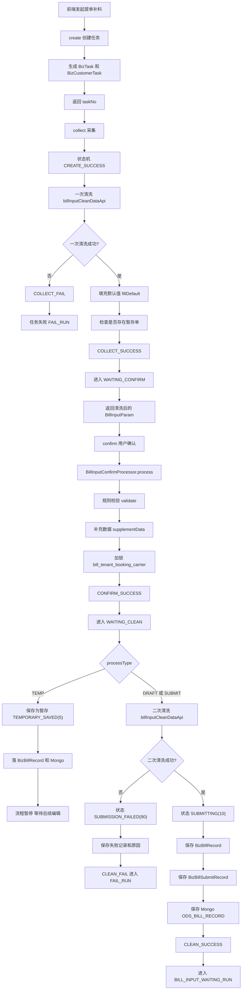
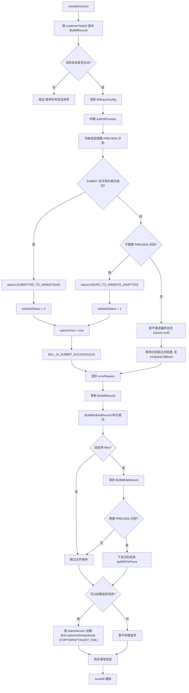
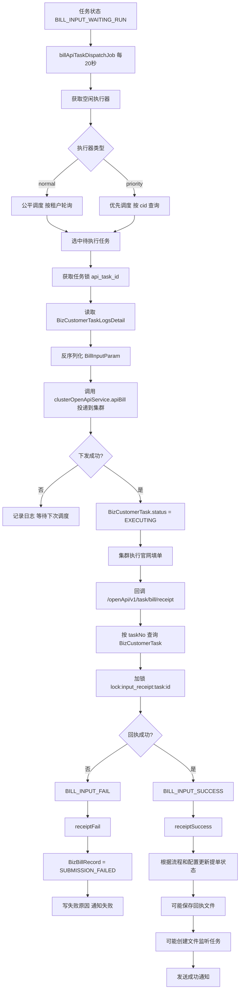
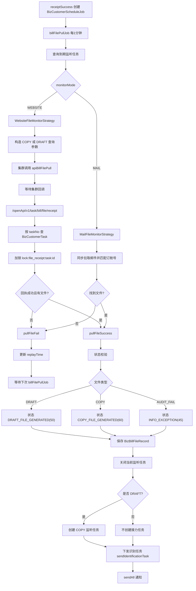
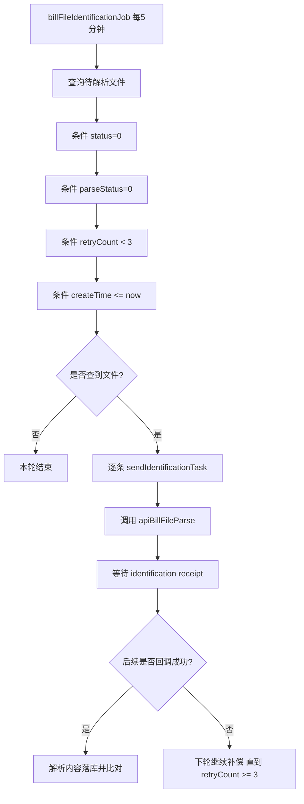
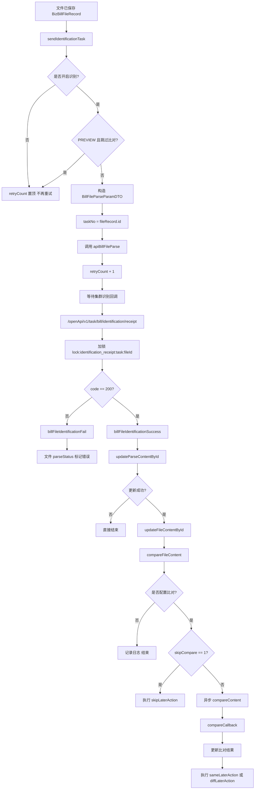
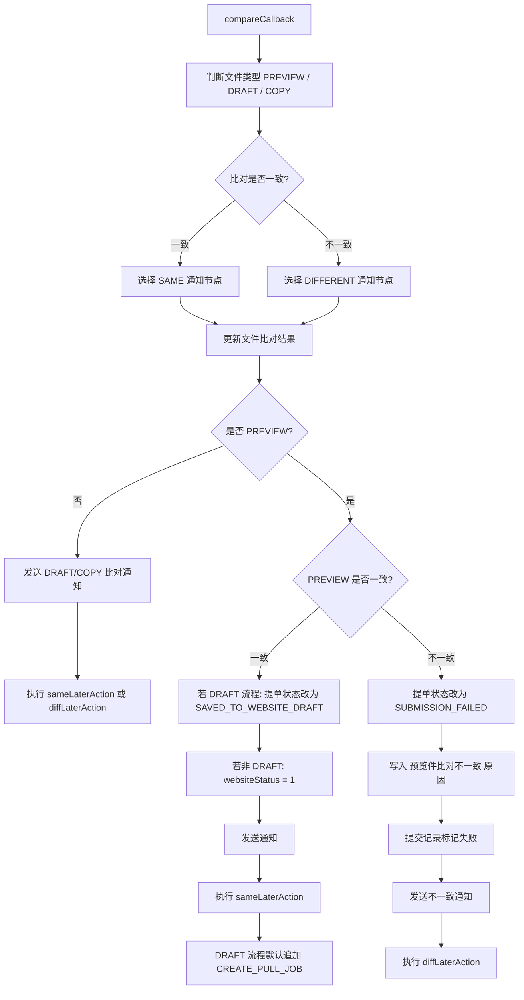
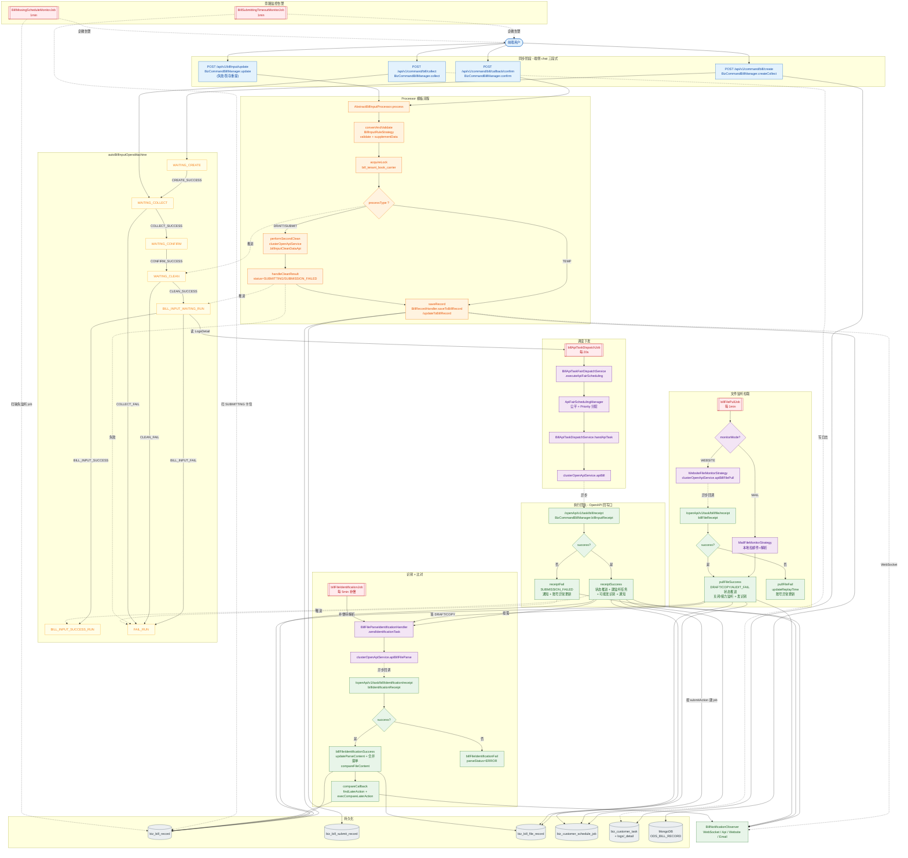

# 提单流程

下面把端侧（前端 chat / 控制台后台）发起的完整提单补料流程从输入到收口梳理一遍，最后给两张 mermaid 图：主流程 \+ 状态机。OpenAPI 直送（`/openApi/v1/internal/bill/submit`）这条入口不再展开，但端侧落到执行层之后用的是同一套异步链路（调度→集群→receipt），所以图里会标注共用部分。

---

## 端侧入口与定位

端侧接口在两个 Controller 上，都加了 `@ApiPermission(false)`（跳过 URL RBAC，但走 SSO 鉴权），属于 `/api/**` 命名空间：

端侧统一进 `BizCommandBillManager`，再分发到不同 Processor 与 Handler。

---

## 同步主流程（chat 三段式）

### 2\.1 create

- `BizCommandBillManager.createCollect`：建 `BizTask` \+ `BizCustomerTask`（command=BILL\_INPUT，状态 `WAITING/WAITING_RUN`），返回 `taskNo`。

- 此时还没有 `BizBillRecord`。

### 2\.2 collect（采集 \+ 一次清洗）`v1/command/bill/collect`

- `BizCommandBillManager.collect`：

    1. 按 `taskNo` 查 `BizCustomerTask`，状态机 `WAITING_CREATE-CREATE_SUCCESS-> WAITING_COLLECT`，并写 `BizCustomerTaskLogs/LogsDetail`。

    2. 组装 `formatFirstCleanData`（`billSource=WEB`、`sourceTo=YXD` 等），调 `clusterOpenApiService.billInputCleanDataApi`。

    3. 失败：状态机 `WAITING_COLLECT `*`+ C`*`OLLECT_FAIL -> FAIL_RUN`；某些 `statusCode (5022~5025)` 抛 `ServiceBizException`。

    4. 成功：

        - `businessTaskService.updateTaskResult` 记录业务任务结果。

        - `fillBillInputDefaultParam` 选 `BillInputRuleStrategy.fillDefault` 做默认值填充；同时按 `carrier+bookingNo+tenantId` 反查是否存在 `TEMPORARY_SAVED` 暂存记录，把 `billId/lastSubmitTime/lastSubmitUser` 带回前端。

        - 状态机 `WAITING_COLLECT + COLLECT_SUCCESS -> WAITING_CONFIRM`。

        - 返回 `CollectDataParam`（含清洗后 `BillInputParam`）。

> *这一步不会落 **`BizBillRecord`**，只在任务流水上推进。*
> 
> 

### 2\.3 confirm（用户确认） `v1/command/bill/callback/confirm`

进 `BillInputConfirmProcessor.process`（模板方法 `AbstractBillInputProcessor.process` \+ `lockProcess`）：

1. prepareCustomerTask：按 `taskNo` 查 `BizCustomerTask`，*校验状态 **`WAITING/EXECUTING`**，超时报"会话已超时"。*

2. buildDTO：构造 `BizCustomerTaskBillInputDTO`，带渠道、业务号、`BillInputParam`。

3. **convertAndValidate： 校验**

    - `BillInputRuleTools.getBillInputRuleStrategy(carrier, channel)` 选船司策略（`carrier+"_WEB"`，渠道不是官网会抛 501）。

    - **`validate(processEnum, info)`****：****`TEMP`**** 走 ****`validateForTemp(SmartValidator+TempGroup)`****，其它走子类 ****`validate`****。**

    - `supplementData(info)`：港口五字码/英文港名/船司差异化补码（如 EMC 的 `supplementData`）。

4. acquireLock：分布式锁 `bill_{tenant}_{bookingNo}_{carrier}`，5s 超时；占用中报"该单正在处理中"。

5. 状态机推进：`WAITING_CONFIRM -CONFIRM_SUCCESS-> WAITING_CLEAN`，写 LogsDetail。

6. 内部分支：

    - TEMP（暂存）：`info.status=TEMPORARY_SAVED(5)` → `saveRecord` → `BillRecordHandler.saveToBillRecord` → 落 `biz_bill_record` \+ `biz_bill_submit_record` \+ MongoDB（`ODS_BILL_RECORD`），WebSocket 推送，主流程结束。

    - DRAFT / SUBMIT：

        - performSecondClean：补账号信息（`BizBookingAccount`）、计算 `execProcess`（`calcProcessType`：考虑 `BillInputConfig.openIdentificationFlag`、`skipPreviewCompareFlag`、AI\_SERVICE 来源）。

        - 调 `clusterOpenApiService.billInputCleanDataApi` 二次清洗。

        - `handleCleanResult`：

            - 成功 → `info.status=SUBMITTING(10)`。

            - 失败 → `info.status=SUBMISSION_FAILED(90)`，写 `failReason`；如果 `secondCleanErrorThrow=true`（OpenAPI 走的是 true）会抛 501。

        - `saveRecord` → `BillRecordHandler.saveToBillRecord`（落库 \+ 通知 / 失败发 `BILL_SI_SUBMIT_FAILED`）。

        - 状态机：

            - 成功 → `WAITING_CLEAN -CLEAN_SUCCESS-> BILL_INPUT_WAITING_RUN`（此时把 `BillInputParam` 写进 `BizCustomerTaskLogsDetail`，调度 Job 会读它）。

            - 失败 → `WAITING_CLEAN -CLEAN_FAIL-> FAIL_RUN`。

7. releaseLock：finally 解锁。

### 2\.3\+ 以上流程图示:端侧同步主流程



### 2\.4 update（失败/暂存后重提）

`BillInputController.updateBillInput`，先用 `lock:bill_record_{billId}` 锁，再走 `BillInputUpdateProcessor.process`：

- `prepareCustomerTask`：校验当前 `BizBillRecord.status ∈ {TEMPORARY_SAVED, SUBMISSION_FAILED, (AI_SERVICE + SAVED_TO_WEBSITE_DRAFT)}`，建全新的 `BizTask + BizCustomerTask`。

- 与 confirm 共享 `AbstractBillInputProcessor` 的二次清洗、状态机、落库节奏。

- `saveRecord` 走 `updateToBillRecord`（关联新的 `customerTaskId`）。

- `postProcess`：把老 task 的监听调度任务（`BizCustomerScheduleJob`）清掉，避免双跑。

---

## 调度下发（同步链路收口后异步执行）

confirm 成功 → 状态 `BILL_INPUT_WAITING_RUN`，进入待下发池。

### `billApiTaskDispatchJob`（每 20s）

- `BillApiTaskDispatchJob` → `BillApiTaskFairDispatchService.executeApiFairScheduling`

- 取空闲执行器（`ApiExecutorManager.getIdleExecutors`），按 `normal/priority` 分组：

    - `normal` → `BillInputApiFairSchedulingManager.allocateApiTasksForCarrierChannel`（按租户公平分配，按 `carrier+channel+account` 维度查任务，新租户优先轮询；最多 `TASKS_PER_EXECUTOR=5`）。

    - `priority` → `allocateApiTasksForPriority`（按 cid 直查 \+ 加锁；上限 5）。

- 任务取锁 key：`CacheKeyEnum.LOCK_DISPATCH_TASK_KEY` \+ `api_task_{taskId}`，60s。

- 真正下发：`BillApiTaskDispatchService.handApiTask`：

    1. 拉 `BizCustomerTaskLogs(bizStatus=BILL_INPUT_WAITING_RUN)` 对应的 `LogsDetail`，反序列化为 `BillInputParam`。

    2. 调 `clusterOpenApiService.apiBill(billInputParam)` 投递到集群（RPA/官网填单端）。

    3. 成功 → `BizCustomerTask.status=EXECUTING`；失败仅打日志，等下一轮再尝试（任务锁过期后才能再次被拿到）。

---

## 执行回执（OpenAPI 回写端）

虽然是 OpenAPI 路径，但端侧链路也走这里——执行端只认这一组回执口。`/openApi/**/receipt` 在 `WebConfig` 中排除了 OpenAPI 鉴权，依赖网络约束。

### 4\.1 `/openApi/v1/task/bill/receipt`（提交结果回执）

入口 `CommandBillInputOpenApiProvider.billInputReceipt`：

- 按 `taskNo` 查 `BizCustomerTask`；分布式锁 `lock:input_receipt:task:{taskId}`。

- `BizCommandBillManager.billInputReceipt`：

    - `BillInputReceiptDTO.isSuccess()`：`statusCode==200` 或 `errorCode==0` 为成功。

    - 成功：状态机 `BILL_INPUT_SUCCESS_RUN`；调 `BillRecordHandler.receiptSuccess(taskId, files)`。

    - 失败：状态机 `FAIL_RUN`；调 `BillRecordHandler.receiptFail(taskId, msg, code)`。

    - 空回执 → 走失败分支但不带原因。

#### 4\.1\.1 `receiptSuccess` 关键判定（最复杂的一段）

##### receiptSuccess 流程展开



#### `4.1.2 receiptFail`

- `status=SUBMISSION_FAILED`、`errorReason` 写入。

- `billSubmitRecordService.updateStatusToFailed`。

- 通知 `BILL_SI_SUBMIT_FAILED`。

- 状态码 `3301/3302/3303/3305`（密码错误等）→ 把 `BizBookingAccount.status=2` 并写异常码/原因。

---

### 4\+\. 以上两步骤流程图示:任务调度与提单执行回执



## 文件监听与拉取

`receiptSuccess` 已经按 `submitAction` 建了 `BizCustomerScheduleJob`，下面进入"周期性拉文件"。

### 5\.1 `billFilePullJob`（每 1min）

- 默认处理类型 `COPY/DRAFT/AUDIT_FAIL`，扫 `nextScheduleTime <= now` 的调度任务。

- 按 `monitorMode` 分组：

    - WEBSITE 模式 → `WebsiteFileMonitorStrategy.execute` → `clusterOpenApiService.apiBillFilePull`，传 `taskNo/账号/订舱号/COPY|DRAFT`，异步等待集群回调。

    - MAIL 模式 → `MailFileMonitorStrategy.execute`：本进程拉邮件 → 落 `BizBillFileMailRecord` → 找匹配邮件 → 拼 `BillInputFileParam` → 直接 调 `billRecordHandler.pullFileSuccess`，不经过 file/receipt。

- 共用机制：

    - DRAFT 草稿未拉到的"软超时"→ `BillRecordHandler.filePullTimeout`，发 `BILL_DRAFT_NOT_GET` 通知。

    - 强制关闭超时 → `bizCustomerScheduleJobService.forceClose`。

    - 成功 → `updateScheduleTime(now+frequency)`。

### 5\.2 `/openApi/v1/task/bill/file/receipt`（仅 WEBSITE 模式回调）

入口 `CommandBillInputOpenApiProvider.billFileReceipt`：

- 锁 `lock:file_receipt:task:{taskId}`。

- 失败/空文件 → `billRecordHandler.pullFileFail`（更新 replayTime 等待下次扫）\+ 必要时账号异常更新。

- 成功且有文件 → `billRecordHandler.pullFileSuccess`：

    - 状态校验（必须在 SAVED\_TO\_WEBSITE\_DRAFT / SUBMITTED\_TO\_WEBSITE / DRAFT\_FILE\_GENERATED / INFO\_EXCEPTION 之一）。

    - 按文件类型推进：COPY→60, DRAFT→50, AUDIT\_FAIL→45。状态不可回退（不是 `INFO_EXCEPTION` 且新 code ≤ 旧 code 抛错）。

    - 保存文件记录 `saveBillFileRecords`，关闭当前类型的调度任务。

    - **草稿件落库后自动创建 COPY 监听任务（接力）。**

    - 立刻 `sendIdentificationTask` 发识别。

    - 通知（COPY 成功后若 API 通道回填成功 → 把 `BizBillRecord.fillStatus=10`）。

### 5\.2\+ 以上流程图示：文件监听与 file receipt



---

## 文件识别与比对

### 6\.1 识别下发的三个入口

- `receiptSuccess` 命中"需要预览识别" → `sendIdentificationTask(billId, type)`。

- `pullFileSuccess` 落 DRAFT/COPY → `sendIdentificationTask(billId, type)`。

- **`BillFileIdentificationJob`****（每 5min）**→ `pageWaitParseFileRecord`：`status=0 && parseStatus=0 && retryCount<3` → `sendIdentificationTask(fileRecord)`（补偿）。

**该步骤流程图示：识别补偿任务/提单补料文件内容识别任务**



`BillFileParseIdentificationHandler.sendTask` 中：

- `BillFileParseParamDTO.taskNo = String.valueOf(fileRecord.getId())`（注意：识别链路的 taskNo 是文件记录 id，不是 BizTask）。

- 异步 `clusterOpenApiService.apiBillFileParse(...)`，`updateRetryCountById` \+1。

- 跳过条件：预览件且 `skipPreviewCompareFlag=1` → 直接 `updateRetryCountToTopById`（不再发）。

### 6\.2 `/openApi/v1/task/bill/identification/receipt`

入口 `CommandBillInputOpenApiProvider.billIdentificationReceipt`：

- 锁 `lock:identification_receipt:task:{taskNo}`（key 名虽然带 task，但实际是 fileRecord\.id）。

- `code==200` 为成功。

- 成功 → `billFileIdentificationSuccess`：

    1. `updateParseContentById` 写识别 JSON，若并发已写过返回 false 直接跳出。

    2. `updateFileContentById` 把识别得到的 `billInfo` 合并到主提单 `BizBillRecord`。

    3. `compareFileContent`：

        - 查 `BizCompareConfig`（`BILL_{fileType}`）。

        - 强制监听单 → 走 `skipCompareForForceMonitor` \+ `execCompareLaterAction`。

        - 未配置比对或 `skipCompare=1` → 跳过比对，直接 `execCompareLaterAction(skipLaterAction)`。

        - 否则异步 `compareContent` → 比对结果回调 `compareCallback`。

- 失败 → `billFileIdentificationFail`：`updateParseStatusToErrorById`，无后续动作。

### 6\.2\+ 以上流程图示：文件识别与 identification receipt



### 6\.3 `compareCallback`（决定单据的最终业务结论）

> 主要做的事情：判断文件类型，根据比对结果选择通知节点一致or不一致，保存对比结果到BizBillFileRecord，然后执行后续动作
> 
> 

- `updateCompareStatusById` 写比对状态/失败字段。

- `findLaterActionByCompareResult` 决定通知 enum 与后续动作字符串：

    - PREVIEW 比对一致 \+ `submitProcess=DRAFT` → `status=SAVED_TO_WEBSITE_DRAFT(20)`，`submitTime=now`，通知 `BILL_SI_SUBMIT_SUCCESS`。

    - PREVIEW 比对一致 \+ 非 DRAFT → `websiteStatus=1`。

    - PREVIEW 比对不一致 → `status=SUBMISSION_FAILED(90)`，`errorReason="预览件比对不一致: ..."`；同时 `billSubmitRecordService.updateStatusToFailed`。

    - DRAFT/COPY 比对：用各自的 SAME/DIFFERENT 通知 enum。

- `sendAll(billRecord, finalNotifyNodeEnum)` 走多通道通知。

- `execCompareLaterAction`：

    - 预览件比对一致 \+ DRAFT 流程：默认追加 `CREATE_PULL_JOB`。

    - 再合并 `BizCompareConfig.sameLaterAction/diffLaterAction` 配的动作（`;` 分隔），从 `compareLaterActionMap` 找到对应 `CompareLaterAction.execute`。

#### 6\.3\+ compareCallback 执行流程



#### 6\.3\.1 后续操作 execCompareLaterAction

这里的后续操作就是**「比对或跳过比对之后，按租户\+船司\+渠道\+文件类型在 ****`biz_compare_config`**** 里配的一串命令」，落到代码里主要是建文件监听任务或改任务日志让集群再跑一步草稿转提交；**额外还有 PREVIEW\+草稿一致时强制补一轮 `CREATE_PULL_JOB`。

目前代码中只有两类操作：`DRAFT_TO_SUBMIT` 和 `CREATE_PULL_JOB`。

### 6\.4 通知通道

`BillRecordHandler.sendAll` 异步遍历所有 `BillNotificationObserver`：

- `WebSocketNotifier`：前端弹窗、列表刷新。

- `ApiNotifier`：回调对接方（带回填状态联动）。

- `WebsiteNotifier`：内部站内信。

- `EmailNotifier`：邮件。

---

## 健康度监控（旁路告警）

> 至此，提单任务中 xxljob 相关定时任务，该文档已经包含6/7，剩一个syncBillConfigDataJob。
> 
> 

---

## 落库面板（端到端"哪些表会动"）

> *审计字段 **`createTime/updateTime/createUser/updateUser`** 由 **`MybatisOperInterceptor`** 自动注入；多租户 **`cid`** 由 **`CustomTenantLineInnerInterceptor`** \+ **`CustomerHandler`** 自动拼接。*
> 
> 

---

## 图示

### 9\.1 端到端流程图（端侧主入口 \+ 异步链路）




### 9\.2 船司提单配置：

- 存在表 `biz_booking_carrier_config`（实体名对应 MyBatis 的 `BizBookingCarrierConfig`）的 `config` 字符串列里，是一段 JSON；其中反序列化成 `BillInputConfig`，里面的 `fileMonitorConfig` 就是你要的配置。（**BizBookingCarrierConfig 实体类**）

- 加载逻辑在 `BizBookingCarrierConfigServiceImpl.getBillInputConfig`：按 `cid`、`carrier`、`bookingType = BILL_INPUT` 查一条记录，再用 `JsonUtil.fromJSON(config.getConfig(), BillInputConfig.class)` 解析（并带约 5 分钟缓存）。

```JSON
// V2
{
  "type": "BILL_API",
  // 流程，DRAFT - 仅提交草稿，DRAFT_TO_SUBMIT - 找到草稿进行提交，SUBMIT - 直接提交 , v2.3.10弃用该字段
  "process": "SUBMIT",
  // 调度类型，0 - 实时，1 - 定时
  "scheduleType": "0",
  // 提交至官网后的动作，DRAFT - 草稿件，COPY - COPY件, AUDIT_FAIL - 审核失败邮件的监听
  "submitAction": "DRAFT",
  // 文件监控配置
  "fileMonitorConfig": {
    "DRAFT": {
      // 调度频率（分钟）
      "scheduleFrequency": 10,
      // 监控超时通知（分钟）
      "monitorTimeout": 180,
      // 超时关闭（分钟）
      "closeTimeout": 43200,
      // 监控方式 MAIL/WEBSITE
      "monitorType": "WEBSITE",
      // 监控邮箱地址
      "mailAddress": ""
    },
    "COPY": {
      // 调度频率（分钟）
      "scheduleFrequency": 30,
      // 监控超时通知（分钟）
      "monitorTimeout": 180,
      // 超时关闭（分钟）
      "closeTimeout": 43200,
      // 监控方式 MAIL/WEBSITE
      "monitorType": "WEBSITE",
      // 监控邮箱地址
      "mailAddress": ""
    },
    // 审核失败监听
    "AUDIT_FAIL": {
      // 调度频率（分钟）
      "scheduleFrequency": 5,
      // 监控超时通知（分钟）
      "monitorTimeout": 180,
      // 超时关闭（分钟）
      "closeTimeout": 43200,
      // 监控方式 MAIL/WEBSITE
      "monitorType": "MAIL",
      // 监控邮箱地址
      "mailAddress": ""
    }
  },
  // 模板配置
  "templateConfig": {
    "templateIds": [
      "23262"
    ],
    "sceneName": "seaway_bill_of_lading_LY_104548",
    "pendingComparisonRecordId": "4262316"
  },
  // 字段配置
  "fieldConfig": {
    // 是否允许提交， 通过该字段控制是否展示提交按钮    
    "allowSubmit": true
  }
}
```

**几个关键参数：**

1. `fieldConfig.allowSubmit`：是否允许提交

在 `AbstractBillInputProcessor.calcProcessType` 里，`processType=SUBMIT` 时先看 `allowSubmit`，不允许直接报错。

2. `fileMonitorConfig[PREVIEW].openIdentification`：是否开启 PREVIEW 识别

这个开关影响两个关键点：

- 是否把首次提交流程“降级”为先走草稿（`SUBMIT -> DRAFT`）

- 回执后是否继续等待 PREVIEW 比对再收口

3. `submitAction`：提交成功后要监听什么文件

- 例如 `DRAFT;COPY`，会创建对应的监听任务。

- 若先拿到 DRAFT，在 `pullFileSuccess` 里还会补建 COPY 监听任务（兜底链路）。

4. `fileMonitorConfig[*].monitorType`：监听方式（WEBSITE/MAIL）

- 决定走 `WebsiteFileMonitorStrategy` 还是 `MailFileMonitorStrategy`。

- 这会影响文件来源（官网轮询 vs 邮件匹配）以及匹配规则（邮件表达式、主题关键字等）。

5. `fileMonitorConfig[*]` 的时间参数

- `scheduleFrequency`：轮询频率

- `monitorTimeout`：超时告警/超时逻辑（特别是 DRAFT）

- `closeTimeout`：强制关闭任务时间


### 9\.3 提单主单状态（`BizBillRecord.status`）流转：


① `v1/command/bill/callback/confirm`，用户确认后

- 若 任务状态为暂存状态 `processType = "TEMP"`，则置 `TEMPORARY_SAVED(5)`，落库 billRecord \+ mongo，结束。

- 否则，DRAFT/DOPY，进行二次清洗，根据二次清洗结果：

    - 失败 → `info.status=SUBMISSION_FAILED(90)`

    - 成功 → `info.status=SUBMITTING(10)`

② `/openApi/v1/task/bill/receipt`，回执

- 失败 `receiptFail` \-\-\> `SUBMISSION_FAILED(90)`

- 成功 `receiptSuccess` 

    - 不需要 preview 比对

        - 提交流程 \(SubmitProcess = SUBMIT\) \-\>

            `SUBMITTED_TO_WEBSITE(40)`，`websiteStatus=2(已提交)`

        - DRAFT 草稿流程\(SubmitProcess = DRAFT\) \-\> 

            `SAVED_TO_WEBSITE_DRAFT(20)`, `websiteStatus=1(已保存草稿)` 结束

    - 需要 preview 比对

        - `status=null`暂不推进，等待compareCallback **结果**

            - PREVIEW 一致：

                - DRAFT：`SAVED_TO_WEBSITE_DRAFT(20)`

                - SUBMIT：先标记`websiteStatus=1(已保存草稿)`，再通过`DRAFT_TO_SUBMIT`驱动下一步提交，最终`SUBMITTED_TO_WEBSITE(40)`

            - PREVIEW 不一致：`SUBMISSION_FAILED(90)`

    - 根据 submitAction 生成 `COPY`件或者`DRAFT`的监听任务

③ 监听任务拉取到文档

- 收到 `COPY`\-\>`COPY_FILE_GENERATED(60)` 结束

- 收到 `DRAFT` \-\> `DRAFT_FILE_GENERATED(50)` ，接力开启 `COPY`监听

- 收到 `AUDIT_FALL` \-\> `INFO_EXCEPTION(45)`，AI\_SERVICE 中允许 `update`重建


