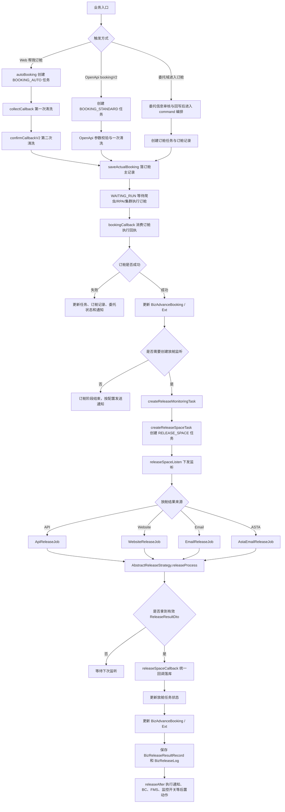
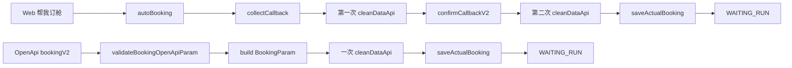
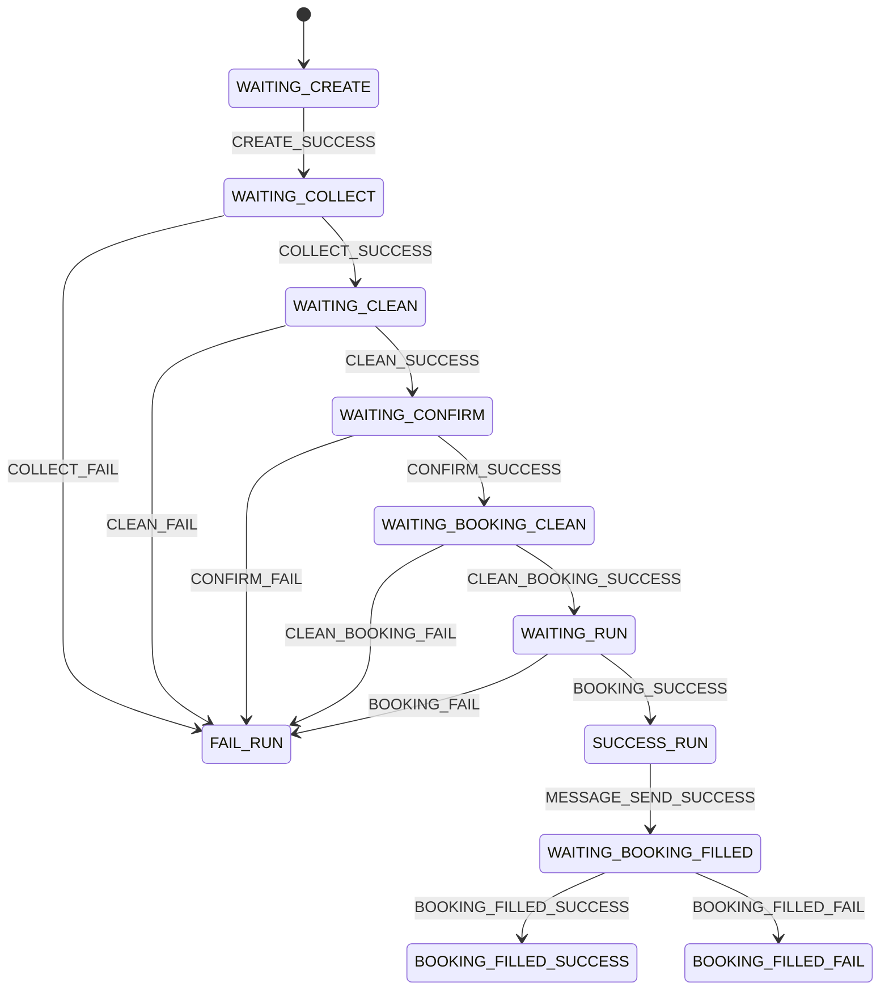

# 订舱与放舱新人上手指南

## 这篇文档解决什么问题

订舱和放舱在代码里不是一条简单的 controller 到 service 链路，而是由任务、状态机、清洗、回调、监控 Job、租户配置、船司渠道配置和脚本扩展共同组成的业务编排。

新人第一次接触时，最容易混淆三件事：

- 订舱成功不等于放舱成功。

- `pending` 不是失败，而是部分船司放舱前的审核阶段。

- API、网站、邮件、ASTA 看起来是四条链路，但最终都要收口到统一的放舱回调。

先记住一句主线：前半段创建并执行订舱任务，订舱回调成功后派生放舱监听任务，放舱监听拿到标准放舱结果后统一回调落库。

## 一张总图

## 先记住的核心概念

- `BizTask` 是平台任务主记录，表示一次任务级动作。

- `BizCustomerTask` 是客户维度的业务任务，订舱、放舱、回填等阶段都会围绕它推进状态。

- `BizCustomerTaskExt` 保存订舱和放舱链路需要继承的扩展上下文，例如订舱渠道、放舱渠道、账号、来源等。创建放舱任务时会复制原订舱任务的扩展信息。

- `BizAdvanceBooking` 是订舱主记录，保存当前订舱和放舱的主要状态，例如订舱号、订舱状态、放舱状态、船名航次、失败原因等。

- `BizAdvanceBookingExt` 是订舱扩展表，保存船司返回的更多业务结果，例如运费、免箱免堆、相关方信息、订舱成功结果、当前放舱结果等。

- `BizReleaseResultRecord` 是放舱结果历史快照表。它按每次有效放舱回调追加记录，用于页面展示放舱历史。它不替代 `BizAdvanceBooking` 和 `BizAdvanceBookingExt` 的当前状态。

- `BizReleaseLog` 偏向差异日志，主要记录放舱结果比对中的差异或异常原因。

- `ReleaseResultDto` 是放舱策略层拿到结果后的标准模型。API、网站、邮件和 ASTA 的差别主要在如何得到它，后半段会尽量统一处理。

## 订舱入口有哪些

当前常见入口有三类。

第一类是 Web 页面直接发起“帮我订舱”。这条链路会先调用 `autoBooking` 创建任务，前端再提交采集结果触发 `collectCallback`，平台完成第一次清洗。之后前端确认并调用 `confirmCallbackV2`，平台补账号、补渠道、补默认值，再执行订舱前第二次清洗。清洗成功后，平台调用 `saveActualBooking` 落订舱主记录，任务进入等待执行阶段。

第二类是 OpenApi `bookingV2`。这条链路没有 Web 页面上的采集和确认两步交互，而是直接校验 OpenApi 入参，构造标准订舱参数，创建 `BOOKING_STANDARD` 类型任务，执行一次清洗，然后保存订舱记录。

第三类是委托域进入订舱域。委托记录创建、补充、审核后，会通过 command/controller/manager/provider 组合进入订舱能力。若后续订舱成功或失败，还会回写委托状态，例如订舱成功、订舱告警、订舱异常。

## Web 直订和 OpenApi 的关键差异

Web 直订更像“前端分阶段收集和确认数据”，所以存在采集后清洗和订舱前清洗。OpenApi 更像“调用方一次性提交标准订舱参数”，所以前半段更短。

两条链路在后半段会逐渐收敛：订舱执行完成后，都要等待外部执行结果回调进入 `bookingCallback`。

## web方式为什么要做两次清洗？

Web 方式做两次清洗，本质是把“机器先提炼”和“用户确认后再落地校验”分开，避免直接拿采集原始数据去执行订舱。

### 第一次清洗（`collectCallback` 阶段）

目的：把采集回来的“脏数据/半结构数据”先变成可读、可确认的数据草稿。

- 触发点：前端采集回调后，`collectCallback` 调 `cleanDataApi`。

- 主要作用：

    - 把采集结果标准化成平台 `BookingParam`。

    - 做基础纠偏与补全（港口转换、`hsCode` 匹配、默认值管理等）。

    - 让任务从 `WAITING_COLLECT -> WAITING_CLEAN -> WAITING_CONFIRM`，给前端一个“可确认版本”。

- 结果定位：面向确认，不是最终执行版。

### 第二次清洗（`confirmCallbackV2` 阶段）

目的：基于用户最终确认后的参数，生成“可执行、可落库、可调度”的最终订舱数据。

- 触发点：用户确认提交后，`confirmCallbackV2`（`bookingByUnMh8`）再次调用 `cleanDataApi`。

- 主要作用：

    - 吃进用户在确认页改动后的字段（账号、渠道、补充信息等）。

    - 再次校验/规整，确保数据能进入执行链路（`WAITING_BOOKING_CLEAN -> WAITING_RUN`）。

    - 清洗成功后才 `saveActualBooking`，避免把不可执行数据写成正式订舱记录。

- 结果定位：面向执行与落库。

### 一句话总结

- 第一次清洗（采集后清洗）：把“采集数据”变成“可确认数据”。

- 第二次清洗（订舱前清洗）：把“确认数据”变成“可执行数据”。

这样设计能同时兼顾用户体验（先给可编辑结果）和执行安全（最终参数再严检一次）。

## 订舱状态机怎么理解

自动订舱状态机的主线可以先按下面理解：

这里的 `WAITING_RUN` 表示平台已经准备好订舱任务，等待爬虫、RPA 或集群执行。`SUCCESS_RUN` 表示订舱执行回执成功，不代表放舱成功。`WAITING_BOOKING_FILLED` 是订舱结果向外部系统或 FMS 回填的闭环阶段，也不等同于放舱。

## bookingCallback 做什么

`bookingCallback` 是订舱执行结果的统一入口。集群 / RPA / 爬虫在官网真正提交订舱后，把成功或失败结果回调到这里；desk 据此更新任务状态、订舱主记录，并决定是否进入放舱监听。

它的主流程是：

1. 将业务阶段强制识别为 `booking`。

2. 根据任务号找回 `BizTask` 和 `BizCustomerTask`。

3. 从历史任务日志和扩展表补齐港口、三方系统编码等上下文。

4. 保存当前业务任务结果。

5. 推动订舱状态机进入成功或失败。

6. 更新 `BizBusinessLog`、`BizAdvanceBooking`、`BizAdvanceBookingExt`。

7. 如果来源是委托链路，回写委托状态。

8. 事务提交后异步发送通知、站内信、API 推送、订舱成功邮件或报备邮件。

订舱成功后，它还会**判断是否创建放舱监听任务**。必须同时满足两个条件：

- 租户配置开启 `needCreateReleaseTask`。

- 船司存在放舱配置，也就是存在 `CarrierConfigTypeEnum.RELEASE` 能力。

如果这两个条件不满足，订舱成功也不会自然进入放舱监听。

### 总结：主要做以下三件事

### 任务定位与结果落库

- 用 `param.head.serialNumber`（任务号）找回 `BizTask` / `BizCustomerTask`

- 从历史日志、扩展表补齐港口等上下文（`fillParam`）

- 保存当前业务任务回执结果（`operateBusinessTask`）

### 推进订舱状态机

按任务类型（`BOOKING_AUTO` / `BOOKING_SINGLE` / `BOOKING_STANDARD`）把状态从 `WAITING_RUN` 推进到：

- 成功 → `SUCCESS_RUN`（`BOOKING_SUCCESS`）

- 失败 → `FAIL_RUN`（`BOOKING_FAIL`）

### 更新订舱业务数据（`processBookingRecordWhenBookingCallback`）

这是最关键的一段：

## 放舱任务是怎么来的

放舱任务不是订舱任务状态机里的普通下一步，而是订舱成功后派生的新任务。

创建链路可以先记成：

`bookingCallback -> processBookingRecordWhenBookingCallback -> createReleaseMonitoringTask -> createReleaseSpaceTask -> releaseSpaceListen`

`createReleaseSpaceTask` 会创建 `TaskCommandEnum.RELEASE_SPACE` 任务，并复制原订舱任务的关键上下文：

- 操作人信息。

- 订舱渠道和放舱渠道。

- 来源系统。

- 父任务命令。

- 订舱账号。

- 与原订舱任务的关联关系。

- 原任务扩展表信息。

如果是订舱成功后首次生成放舱任务，放舱结束时间会按船司和渠道的超时配置计算。否则在部分继续监听或多次放舱场景中，可能按默认时间继续往后监听。

## 放舱监听的四种来源

放舱监听有四类执行入口。

|类型|任务来源|触发方式|结果获取方式|新人注意点|
|---|---|---|---|---|
|API|订舱成功后创建，或只放舱 API 创建|定时扫 API 放舱监控表|调第三方 API|结果没变化时可能不回调平台|
|Website|订舱成功后创建|定时扫网站放舱监控表|网站状态、BC 下载、BC 解析|BC 文件是否变化会影响是否继续处理|
|Email|订舱成功后创建，或全量放舱补建|定时拉邮件中心|邮件正文、附件、Agent 解析|同一个入口也可能识别订舱回执邮件|
|ASTA|ASTA 邮件先落结构化数据后消费|定时扫 ASTA 数据表|ASTA Excel 行数据|这是两段式链路，不是单封邮件即时驱动|

这四类最终都进入同一个模板：先拿 `ReleaseResultDto`，再由 `AbstractReleaseStrategy.releaseProcess` 做标准化、港口处理、差异比对、回调参数构造，最后调用统一放舱回调。

## releaseSpaceCallback 为什么重要

`releaseSpaceCallback` 是放舱正式写库的统一入口。Job 或 Strategy 只是发现结果，真正更新订舱主记录和放舱历史的是这里。

它会先把三方结果归一成平台状态：

|三方或策略结果|平台放舱状态|
|---|---|
|`pending`|`ReleaseStatusEnum.PENDING`|
|取消|`ReleaseStatusEnum.CANCEL`|
|首次成功|`ReleaseStatusEnum.CONFIRM`|
|非首次成功|`ReleaseStatusEnum.UPDATE`|

随后它会：

1. 根据任务号找回放舱任务。

2. 保存当前业务任务结果。

3. 推动放舱状态机成功或失败。

4. 更新 `BizAdvanceBooking` 和 `BizAdvanceBookingExt`。

5. 追加保存 `BizReleaseResultRecord`。

6. 按差异情况保存 `BizReleaseLog`。

7. 对支持多次放舱的链路，尝试继续创建下一轮监听任务。

所以排查“为什么页面上的放舱状态是这个值”时，优先看 `releaseSpaceCallback` 及其内部的更新方法，而不是只看某一个 Job。

## pending 怎么理解

`pending` 是订舱和放舱之间最容易让新人误判的阶段。

对支持 `pending` 的船司或渠道来说，首次拿到 `pending` 通常表示船司系统已经接收订舱，并进入放舱前审核阶段。它不是失败，也不等于最终放舱成功。

首次进入 `pending` 后，系统可能会做几件事：

- 清空订舱阶段的错误原因。

- 补发一轮订舱成功邮件。

- 主动关闭“长时间未进入 pending / 未进系统”的监控。

- 根据船司渠道是否支持后审核，决定是否立刻创建放舱超时监控。

真正的最终放舱结果通常是 `confirm`、`update` 或 `cancel`。只有进入这些状态时，部分超时监控才会关闭。

## releaseAfter 做什么

`releaseAfter` 是放舱回调后的统一后置编排，不只是简单收尾。

它会根据当前结果和渠道能力处理：

- 绑定订舱主记录。

- 首次进入 `pending` 时补发订舱成功邮件。

- 创建或关闭放舱超时监控。

- 生成提箱单或 BC 文件。

- 将 BC 上传到 FMS。

- 发送放舱邮件和通知。

- 更新 `BizCustomerTaskExt`。

- 更新 API、网站、邮件或 ASTA 对应的监控记录。

因此，看到客户收到订舱成功邮件时，要先确认邮件来自普通订舱回调，还是来自首次 `pending` 的补发逻辑。

## 异常监控怎么分

订舱和放舱异常监控不是一个规则。当前主要有四类：

|监控类型|语义|创建节点|关闭或停止思路|
|---|---|---|---|
|`BOOKING_CALLBACK_MONITOR`|订舱提交成功后，长时间没收到船司订舱回执|订舱提交成功后|订舱单不再处于执行中时由 Job 停止|
|`BOOKING_NOT_PENDING_MONITOR`|收到订舱成功回执后，长时间没有进入船司系统或 pending|订舱回执成功后，且渠道支持 pending 并配置该监控|进入 `pending / confirm / update / cancel` 后停止|
|`BOOKING_PENDING_REVIEW_MONITOR`|MSC ASTA 首次 pending 后，长时间未审核完毕|首次拿到 ASTA pending 后，且配置该监控|ASTA 状态或审核完成文案命中后停止|
|`RELEASE_TIMEOUT_MONITOR`|长时间未放舱成功|根据是否支持 pending 和 pending review 决定|真正进入 `confirm / update / cancel` 后停止|

`RELEASE_TIMEOUT_MONITOR` 的创建时机要特别注意：

- 不支持 `pending` 的链路，订舱回执成功后即可创建。

- 支持 `pending` 但不支持 `pending review` 的链路，首次进入 `pending` 后创建。

- 支持 `pending review` 的链路，不是第一次 `pending` 就创建，而是等审核完成后再创建。

- 对 MSC ASTA 来说，审核完成可能依赖 ASTA remark 中的固定文案识别。

## 放舱结果历史怎么看

`BizReleaseResultRecord` 用于保存每次有效放舱回调的历史快照。它的定位是页面列表和详情展示，不参与核心状态判定。

它常见字段含义如下：

|字段|含义|
|---|---|
|`cid`|租户 ID|
|`advanceBookingId`|关联订舱主记录|
|`taskNo`|放舱任务号|
|`monitorId`|放舱监控记录 ID|
|`recordId`|BC 解析记录 ID|
|`shippingCompany`|船司|
|`releaseType`|放舱类型|
|`releaseChannel`|放舱渠道|
|`releaseStatus`|本次放舱状态|
|`firstReleaseFlag`|是否首次放舱|
|`bookingCallbackNo`|订舱回执号|
|`bookingNo`|订舱号|
|`mblNo`|提单号|
|`thirdBusinessNo`|三方业务单号|
|`releaseResultJson`|标准放舱结果 JSON|

保存时会清理账号和密码等敏感字段，避免密码落入结果 JSON。

## 放舱回填脚本是什么

“放舱回填”不要和 `releaseSpaceCallback` 混在一起理解。

`releaseSpaceCallback` 负责平台内部正式写库，更新订舱主记录、扩展表、放舱结果历史和日志。

放舱回填更偏向“是否需要把放舱结果继续回填给客户系统”。当前设计把“是否需要回填”的判断交给租户脚本扩展：

- 脚本 key 为 `RELEASE_SPACE_FILLED_{cid}`。

- 入参包含 `bookingParam`、`cid`、`action`。

- 当前 `action=NEED_CHECK` 时，脚本返回 `Boolean`，表示是否需要回填。

- 未来预留 `action=DO_FILL`，用于真正执行回填。

- 如果存在租户脚本，只执行租户脚本。

- 如果不存在租户脚本，回退到 Java 内置判断。

- 如果脚本执行异常，异常会向上抛出，不再静默回退。

这条链路主要发生在 `ReleaseSpaceFilledCreateAction`，只在自动订舱等特定场景下判断是否需要放舱回填。

## 新人排查路径

如果一票单“订舱成功了但没有放舱”，按这个顺序查：

1. 是否真的进入了 `bookingCallback`。

2. `bookingCallback` 是否成功更新了 `BizAdvanceBooking`。

3. 租户是否开启 `needCreateReleaseTask`。

4. 船司是否存在放舱配置。

5. 是否创建了 `RELEASE_SPACE` 任务。

6. 对应 API、Website、Email 或 ASTA 监控表是否有记录。

7. Job 是否拿到了有效 `ReleaseResultDto`。

8. 是否调用了 `releaseSpaceCallback`。

9. `releaseSpaceCallback` 是否更新了 `BizAdvanceBooking` 和 `BizReleaseResultRecord`。

如果一票单“一直 pending”，按这个顺序查：

1. 渠道是否支持 `supportPendingStage`。

2. 是否还处于审核阶段，而不是最终放舱失败。

3. 是否配置了 `BOOKING_PENDING_REVIEW_MONITOR`。

4. 对 ASTA 链路，ASTA 数据是否已经落入结构化表。

5. `AstaEmailReleaseJob` 是否已经消费该 ASTA 数据。

6. 审核完成文案是否命中。

7. 审核完成后是否创建了 `RELEASE_TIMEOUT_MONITOR`。

如果 Job 执行了但页面没有变化，先不要直接判断为故障。API 和 Website 链路可能因为结果未变化而不回调平台；Email 链路可能邮件被识别成订舱回执而不是放舱结果；ASTA 链路可能只完成了邮件落表，还没有完成 ASTA 数据消费。

## 常见误解

- 订舱成功不是放舱成功。`SUCCESS_RUN` 和 `bookingCallback` 成功只表示订舱执行回执已经被平台消费。

- 放舱不是订舱状态机里的普通下一步。放舱是订舱成功后派生出来的新任务链路。

- `pending` 不是失败。它表示部分船司或渠道已经进入放舱前审核阶段。

- 邮件链路不只处理放舱邮件。它也可能识别订舱回执邮件，尤其是部分 CMA、CNC 场景。

- `BizReleaseResultRecord` 不是状态判定表。当前状态仍以 `BizAdvanceBooking` 和 `BizAdvanceBookingExt` 为主。

- 放舱回填不是平台放舱写库。平台写库看 `releaseSpaceCallback`，客户侧回填判断看 `ReleaseSpaceFilledCreateAction` 和租户脚本。

## 主要代码定位

|场景|重点类或方法|
|---|---|
|Web 直订入口|`BizCommandBookingManager.autoBooking`、`collectCallback`、`confirmCallbackV2`|
|OpenApi 订舱入口|`CommandBookingOpenApiProvider.bookingV2`、`execApiBookingForV2`|
|订舱状态机|`StateMachineBuilderBookingConfig`|
|订舱执行回调|`CommandBookingOpenApiProvider.bookingCallback`|
|订舱成功后创建放舱监听|`processBookingRecordWhenBookingCallback`、`createReleaseMonitoringTask`、`createReleaseSpaceTask`|
|API 放舱监听|`ApiReleaseJob`、`ApiReleaseStrategyImpl`|
|网站放舱监听|`WebsiteReleaseJob`、`WebsiteReleaseStrategyImpl`|
|邮件放舱监听|`EmailReleaseJob`、`EmailReleaseStrategyImpl`|
|ASTA 放舱监听|`AstaEmailReleaseJob`、`AstaEmailReleaseStrategyImpl`|
|放舱统一模板|`AbstractReleaseStrategy.releaseProcess`、`releaseAfter`|
|放舱统一回调|`CommandBookingOpenApiProvider.releaseSpaceCallback`|
|放舱结果历史|`BizReleaseResultRecord`、`BizReleaseResultRecordServiceImpl`|
|放舱回填判断|`ReleaseSpaceFilledCreateAction`、`RELEASE_SPACE_FILLED_{cid}`|

