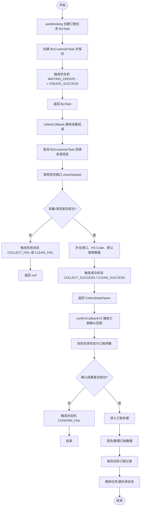
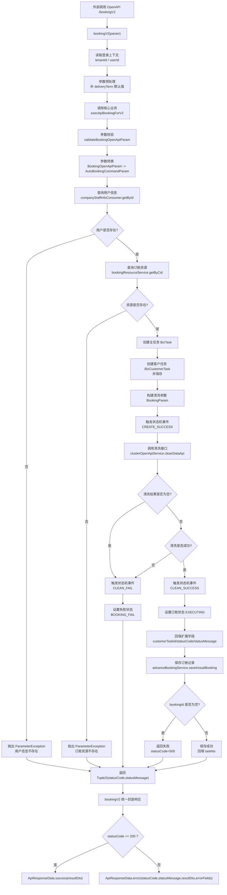

# 订舱流程梳理

## 前言：订舱放舱是在干什么？

### 订舱在做什么

订舱的业务目标是：把客户的运输需求转成船司侧可执行的订舱动作，并拿到订舱回执（成功/失败/告警、订舱号、可能的提单号等）。

在你们项目里，订舱阶段主要做三件事：

- 前置标准化：参数采集、清洗、补默认值、校验（Web 两次清洗，OpenApi 一次清洗）。

- 任务执行编排：创建 `BizTask` / `BizCustomerTask`，推进订舱状态机到 `WAITING_RUN` 等待爬虫/RPA/集群执行。

- 回执落库闭环：统一进入 `bookingCallback`，更新 `BizAdvanceBooking` / `BizAdvanceBookingExt`、任务状态、日志、通知，并决定是否派生放舱监听任务。

### 放舱在做什么

放舱的业务目标是：订舱成功后持续监听船司放舱结果，并把“可提柜/更新/取消/pending”结果标准化落库。

在你们项目里，放舱不是订舱状态机的一步，而是“订舱成功后派生的新任务链路”：

- 订舱成功后按配置创建 `RELEASE_SPACE` 监听任务（`createReleaseMonitoringTask -> createReleaseSpaceTask -> releaseSpaceListen`）。

- API/网站/邮件/ASTA 四类来源最终都构造成 `ReleaseResultDto`。

- 统一通过 `AbstractReleaseStrategy.releaseProcess` 调用 `releaseSpaceCallback` 正式写库。

- `releaseSpaceCallback` 里统一做状态映射、更新 `BizAdvanceBooking` / `BizAdvanceBookingExt`、写 `BizReleaseResultRecord` 历史快照、写 `BizReleaseLog`、后置通知和监控处理。

*订舱成功不等于放舱成功，放舱是后续独立闭环。*


下面是一份基于当前仓库实现的**订舱入口代码设计说明**，按你给出的三类入口组织，并标出关键类与状态机，便于你对照代码阅读。

---

## 1\. 核心概念与分层

|概念|说明|
|---|---|
|**BizTask**|任务头：任务号 `taskNo`、租户等。|
|**BizCustomerTask**|客户侧任务：关联 `BizTask`、`TaskCommandEnum`（订舱子类型）、`bizStatus`（业务状态机状态）、`originEntity`（用户 / OpenAPI 等）。|
|**BizAdvanceBooking**|实订舱主数据：`BizAdvanceBookingServiceImpl.saveActualBooking` 落库，`bookingType=2` 表示实订舱。|
|**状态机**|`bookingAutoOperaMachine`（帮我订舱 / 接单生成的 BOOKING\_AUTO 任务）、`bookingStandardOperaMachine`（OpenAPI V2 等 BOOKING\_STANDARD 任务）。配置见 `StateMachineBuilderBookingConfig`。|
|**清洗**|多处在 `ClusterOpenApiService.cleanDataApi(BookingParam)` 调爬虫/集群清洗，返回带 `result` 的 `BookingParam`。|

编排主类：**`BizCommandBookingManager`**（Web 帮我订舱）、**`CommandBookingOpenApiProvider`**（OpenAPI）、**`CommandAdvanceBookingOpenApiV2Provider`**（接单侧建任务）、**`EntrustedInfoManagerImpl`** \+ **`CarrierGroupProcessor`** \+ **`BookingProcessor`**** 策略**（委托去订舱）。

---

## 2\. 第一类：Web「帮我订舱」

> 先建任务，再采集清洗，再确认订舱；MH8 走 EDI 报文生成和端侧回调，非 MH8 走通用订舱确认；每一步都通过状态机驱动，并在失败时回写任务、订舱记录和委托单状态
> 
> 

### 2\.1 HTTP 入口

控制器：`BizCommandBookingController`（`/api/` 前缀）。

- **autoBooking：先创建任务，进入待采集状态 **

`POST .../v1/command/booking/autoBooking` → `commandManager.autoBooking`  

- **collectCallback：采集后清洗、补全数据，进入待确认/待订舱状态（第一次清洗链路）**

`POST .../v1/command/booking/callback/collect` → `collectCallback`  

- **confirmCallbackV2：确认订舱，按 MH8 和非 MH8 两条路径完成实际订舱落库与状态回写（第二次清洗 \+ 落库）**

`POST .../v1/command/booking/callback/confirm` → 若租户走 V2：`sysCommandManager.actualBookingVersionIs`**`v2`**`(tenantId)` 为真则 `confirmCallbackV2`，否则 `confirmCallback`  

```Java
@PostMapping("v1/command/booking/autoBooking")
public ResponseData<BizTask> autoBooking(@Valid @RequestBody AutoBookingInputChatRecordParam param) {
    BizTask bizTask = commandManager.autoBooking(param);
    return ResponseData.success(bizTask);
}
// ...
@PostMapping("v1/command/booking/callback/collect")
public ResponseData<TaskRecordResult> collectCallback(@Valid @RequestBody AutoBookingCollectCallbackChatRecordParam param) {
    CollectDataParam collectDataParam = commandManager.collectCallback(param);
    // ...
}
@Transactional(rollbackFor = Throwable.class)
@PostMapping("v1/command/booking/callback/confirm")
public ResponseData<BizTask> confirmCallback(@Valid @RequestBody AutoBookingConfirmCallbackChatRecordParam param) {
    Integer tenantId = LoginContext.getLoginUser().getTenantId();
    BizTask bizTask;
    if (sysCommandManager.actualBookingVersionIsv2(tenantId)) {
        bizTask = commandManager.confirmCallbackV2(param);
    }else{
        bizTask = commandManager.confirmCallback(param);
    }
    return ResponseData.success(bizTask);
}
```

### 2\.2 `autoBooking`：发起 BOOKING\_AUTO 订舱任务并进入「待采集」

核心流程是：

- 取当前登录租户 `tenantId`

- 确定流程类型为 `BOOKING_AUTO`

- 创建 `BizTask`

- 查询订舱资源 `bookingResource`

- 基于任务和资源构建 `BizCustomerTask`

- 保存客户任务 ，转成 `BizCustomerTaskBookingDto`

- 触发状态机事件
`WAITING_CREATE -> CREATE_SUCCESS`

```Java
public BizTask autoBooking(AutoBookingInputChatRecordParam param) {
    Integer tenantId = LoginContext.getLoginUser().getTenantId();
    TaskCommandEnum flowTypeEnum = TaskCommandEnum.BOOKING_AUTO;
    BizTask bizTask = taskService.createTask(tenantId, TaskTypeEnum.SUPPLY_CHAIN, flowTypeEnum.getRemark());
    BizBookingResource bookingResource = bookingResourceService.getByCid(tenantId);
    AssertException.PARAMETER.assertNotNull(bookingResource, "资源不存在");
    BizCustomerTask customerTask = buildCustomerTask(flowTypeEnum, bizTask, bookingResource);
    customerTaskService.save(customerTask);
    BizCustomerTaskBookingDto dto = BeanUtil.toBean(customerTask, BizCustomerTaskBookingDto.class);
    bookingAutoOperaMachine.fireEvent(TaskBizStatusEnum.WAITING_CREATE, TaskBizStatusEvent.CREATE_SUCCESS, dto);
    return bizTask;
}
```

状态机主干（帮你对照 `bizStatus`）：`WAITING_CREATE → WAITING_COLLECT → WAITING_CLEAN → WAITING_CONFIRM → WAITING_BOOKING_CLEAN → WAITING_RUN → …`  

### 2\.3 `collectCallback`：采集结果 \+ **第一次清洗**

这个方法可以看成**采集完成后的回调处理**。

> “处理一次自动采集回调，先更新任务状态，再调用清洗接口处理采集结果，成功后继续做港口转换、HSCode 匹配、默认值处理，最后返回可继续往下游流转的数据；如果任一关键步骤失败，就返回 `null`。”
> 
> 

- 写采集业务任务结果 `operateBusinessTask`。  

- 成功则：`COLLECT_SUCCESS` → `clusterOpenApiService.cleanDataApi`（第一次清洗）→ 

    - 成功则 `CLEAN_SUCCESS`，并做港口转换、`hsCodeMatch`、`defaultValuesManagement`（默认值等）,返回带 `BookingParam` 的 `CollectDataParam` 给前端展示；

    - 失败则 `CLEAN_FAIL` / `COLLECT_FAIL`。  

- 失败时返回 `null`，Controller 抛「采集清洗失败」。

```Java
public CollectDataParam collectCallback(AutoBookingCollectCallbackChatRecordParam param) {
    BizCustomerTask customerTask = customerTaskService.getByTaskNo(param.getTaskNo());
    // ...
    if (BookingUtil.isSuccess(param.getResult())) {
        bookingAutoOperaMachine.fireEvent(TaskBizStatusEnum.WAITING_COLLECT, TaskBizStatusEvent.COLLECT_SUCCESS, dto);
        BookingParam bookingParam = clusterOpenApiService.cleanDataApi(dto.getBookingParam());
        dto.setBookingParam(bookingParam);
        // ...
        if (BookingUtil.isSuccess(bookingParam)) {
            bookingAutoOperaMachine.fireEvent(TaskBizStatusEnum.WAITING_CLEAN, TaskBizStatusEvent.CLEAN_SUCCESS, dto);
            // 港口、hscode、默认值...
        } else {
            bookingAutoOperaMachine.fireEvent(TaskBizStatusEnum.WAITING_CLEAN, TaskBizStatusEvent.CLEAN_FAIL, dto);
        }
    } else {
        bookingAutoOperaMachine.fireEvent(TaskBizStatusEnum.WAITING_COLLECT, TaskBizStatusEvent.COLLECT_FAIL, dto);
    }
    // ...
}
```

### 2\.4 `confirmCallbackV2`：确认订舱，分 MH8 和非 MH8 两条路线：**确认 \+ 第二次清洗 \+ ****`saveActualBooking`**

- 根据场景，把订舱确认分成两种业务模式：

    - **MH8 端侧订舱：生成 MH8 EDI 报文并保存订舱**

    - **普通帮我订舱 / 非 MH8 订舱：直接清洗后保存订舱**

- 记录订舱单

- 回写委托单状态

- 失败时发送通知

### 2\.5 第二次清洗成功后：进入「等待执行」

`CLEAN_BOOKING_SUCCESS` 触发 **`BookingAutoBookingCleanAction`**：把任务推到 `WAITING_RUN`，创建**待运行**的 `BizBusinessTask`（按船司/渠道解析业务类型）、更新 `BizCustomerTaskExt`、记业务日志——即调度/RPA 执行前的准备。

```Java
public void execute(TaskBizStatusEnum from, TaskBizStatusEnum to, TaskBizStatusEvent event, BizCustomerTaskBookingDto task) {
    BookingParam bookingParam = task.getBookingParam();
    task.setBizStatus(to.v());
    BookingInfoParam info = bookingParam.getInfo();
    if (info != null && StrUtil.isNotBlank(info.getUserName())) {
        task.setBookingAccount(info.getUserName());
    }
    customerTaskService.updateById(task);
    // 创建待运行任务 BizBusinessTask
    // ...
    businessTaskService.save(bizBusinessTask);
    // 更新 CustomerTaskExt、日志...
}
```

`saveActualBooking` 本体：把 `AutoBookingCommandParam` 落到 `BizAdvanceBooking` \+ 扩展 \+ 箱货子表。

```Java
public Long saveActualBooking(AutoBookingCommandParam bookingParam) {
    BizAdvanceBooking booking = new BizAdvanceBooking();
    BeanUtils.copyProperties(bookingParam, booking);
    // ...
    booking.setBookingType(2);
    this.save(booking);
    // 扩展表、集装箱列表...
    return booking.getId();
}
```

### 2\.6 关键状态节点：

- `CREATE_SUCCESS`：任务创建成功 

- `COLLECT_SUCCESS / COLLECT_FAIL`：采集成功/失败 

- `CLEAN_SUCCESS / CLEAN_FAIL`：清洗成功/失败 

- `CONFIRM_SUCCESS / CONFIRM_FAIL`：确认成功/失败 

- `CLEAN_BOOKING_SUCCESS / CLEAN_BOOKING_FAIL`：订舱前清洗成功/失败

### 完整调用链



## 3\. 第二类：OpenAPI 订舱 V2（`bookingV2`）

### 3\.1 接口定义与实现类

- API：`ICommandBookingOpenApi` — `POST /openApi/v2/task/booking` → `bookingV2`。  

- 实现：`CommandBookingOpenApiProvider`（`@RestController`，走 OpenAPI 鉴权拦截器，Header 带租户/用户）。

### 3\.2 流程概要

**`bookingV2`**** **是一个 **OpenAPI 订舱接口** 的实现方法，核心职责是：

1. 接收订舱请求参数 

2. 对请求中的基础信息做一些前置默认值处理 

3. 从登录上下文里拿到租户和用户信息 

4. **调用真正的订舱业务逻辑，即** **`execApiBookingForV2`**

5. 统一把各种异常（业务异常、字段校验异常、系统异常）转换成 API 响应 

6. 最后根据 statusCode 返回成功或失败响应`ApiResponseData<BookingOpenApiResultDto>`。


**`execApiBookingForV2`****是真正执行 OpenAPI 订舱核心业务的地方，核心职责：**

1. **`ApiValidateHelper.validateBookingOpenApiParam`** 校验入参。  

2. 创建任务和客户任务

3. 触发状态机流转

4. 调用清洗接口

5. 根据清洗结果决定订舱是否继续

    - 如果清洗成功：继续执行

    - 如果清洗失败：记录失败状态并返回错误码

6. 落库保存订舱记录

    1. 如果保存失败：返回系统错误

    2. 保存成功：返回任务号和成功状态

> 标准订舱状态机（与 AUTO 不同）：`WAITING_CREATE → WAITING_CLEAN → WAITING_RUN`（清洗成功直接进待运行，无 Web 采集/确认）。
> 
> 

```Java
@Bean("bookingStandardOperaMachine")
public StateMachine bookingStandardOperaMachine() {
    // ...
    builder.externalTransitions()
            .fromAmong(TaskBizStatusEnum.WAITING_CREATE)
            .to(TaskBizStatusEnum.WAITING_CLEAN)
            .on(TaskBizStatusEvent.CREATE_SUCCESS)
            .perform(bookingStandardCreateAction);
    builder.externalTransitions()
            .fromAmong(TaskBizStatusEnum.WAITING_CLEAN)
            .to(TaskBizStatusEnum.WAITING_RUN)
            .on(TaskBizStatusEvent.CLEAN_SUCCESS)
            .when(notifyTask())
            .perform(bookingStandardCleanAction);
```

核心实现片段：

```Java
public Tuple2<Integer, String> execApiBookingForV2(Integer tenantId, Integer userId,
                                                    BookingOpenApiParam param, BookingOpenApiResultDto resultDto) {
    validateHelper.validateBookingOpenApiParam(param);
    AutoBookingCommandParam bookingCommandParam = convertAutoBookingCommandParam(param);
    // ...
    TaskCommandEnum taskCommandEnum = TaskCommandEnum.BOOKING_STANDARD;
    BizTask bizTask = taskService.createTask(tenantId, TaskTypeEnum.SUPPLY_CHAIN, taskCommandEnum.getRemark());
    // ... 保存 BizCustomerTask ...
    bookingStandardOperaMachine.fireEvent(TaskBizStatusEnum.WAITING_CREATE, TaskBizStatusEvent.CREATE_SUCCESS, dto);
    BookingParam respBookingParam = clusterOpenApiService.cleanDataApi(dto.getBookingParam());
    if (respBookingParam != null) {
        dto.setBookingParam(respBookingParam);
        if (BookingUtil.isSuccess(respBookingParam)) {
            bookingStandardOperaMachine.fireEvent(TaskBizStatusEnum.WAITING_CLEAN, TaskBizStatusEvent.CLEAN_SUCCESS, dto);
            bookingCommandParam.setStatus(AdvanceBookingStatusEnum.EXECUTING.v());
        } else {
            bookingStandardOperaMachine.fireEvent(TaskBizStatusEnum.WAITING_CLEAN, TaskBizStatusEvent.CLEAN_FAIL, dto);
            // ...
        }
    }
    // ...
    Long bookingId = advanceBookingService.saveActualBooking(bookingCommandParam);
    // ...
}
```

### 3\.3 OpenAPI 订舱完整调用链路图





---

## 4\. 第三类：委托域 → 订舱域

### 4\.1 入口：`goBooking`

- HTTP：`WorkOrderController` `POST .../goBooking` → **`EntrustedInfoManagerImpl.goBooking`**。  

- 步骤（代码注释与实现一致）：加载工单 → 校验委托状态 → **按船司分组** → 加载接单配置 → **FormData** → **`CarrierGroupProcessor.createBookingRecords`**（按需）→ **更新委托业务状态为订舱中** → **`EntrustedBookingProcessorFactory.getByStrategy(workConfigDetail.getBookingChannel()).goBooking(...)`**。

```TypeScript
public List<BatchOperationResultVO> goBooking(GoBookingBatchDTO dto) {
    // ...
    Map<Long, EntrustedOrderCreateDTO> bookingMap = carrierGroupProcessor.createBookingRecords(
            carrierGroupProcessor.needCreateBookingRecord(workConfigDetail, workOrder, true),
            carrierInfoList,
            formDataMap,
            workOrder,
            loginUser);
    carrierGroupProcessor.updateEntrustedInfoStatus(
            carrierInfoList,
            formDataMap,
            workOrder,
            EntrustedInfoBizStatusEnum.BOOKING,
            loginUser);
    boolean result = bookingProcessorFactory
            .getByStrategy(workConfigDetail.getBookingChannel())
            .goBooking(workOrder, new ArrayList<>(formDataMap.values()), loginUser, bookingMap);
```

### 4\.2 订舱记录：`createBookingRecords`

- 按委托格式从 **`EntrustedDataGeneratorFactory`** 选策略，Groovy/脚本把表单转成 **`AutoBookingCommandParam`**。  

- 需要时 **`advanceBookingService.saveActualBooking`** 先落 **实订舱主表**，并把 `bookingId`、`BookingCommandParam` 放进 **`EntrustedOrderCreateDTO`**。

```Java
if (needToCreateBookingRecord) {
    AutoBookingCommandParam bookingCommandParam = entrustedDataGeneratorFactory
            .getByStrategy(workOrder.getEntrustedFormat())
            .convertAutoBookingCommandParam(/* ... */);
    // ...
    Long bookingId = advanceBookingService.saveActualBooking(bookingCommandParam);
    createDTO.setBookingId(bookingId);
    createDTO.setBookingCommandParam(bookingCommandParam);
}
```

**与 Web 的差异**：委托链路里**常先在去订舱时落 ****`BizAdvanceBooking`**，再创建调度任务；Web 帮我订舱多在 **confirm V2 第二次清洗后** 才 `saveActualBooking`。

### 4\.3 策略：`BookingProcessor`（标准 / MH8 / Monitor 等）

- 工厂：`EntrustedBookingProcessorFactory`，按 **`workConfigDetail.getBookingChannel()`** 与各实现类的 **`getStrategyType()`** 匹配（如 **`StandardBookingProcessor`** → `EntrustBookingChannelEnum.STANDARD_BOOKING`）。  

**标准订舱（壹沓能力）**：`StandardBookingProcessor.goBooking` 校验船司订舱权限后，调用 **`CommandAdvanceBookingOpenApiV2Provider.createStandardTaskByReceiveOrder`**：任务类型仍是 **`TaskCommandEnum.BOOKING_AUTO`**，但用已有 `AutoBookingCommandParam` 拼好 `BookingParam`，并**连续触发** `CONFIRM_SUCCESS`、`CLEAN_BOOKING_SUCCESS`，等价于**跳过前端采集/确认**，直接把任务推到与 Web 确认后类似的「订舱前清洗完成 → 待运行」阶段。

```Java
Long taskId = bookingOpenApiV2Provider.createStandardTaskByReceiveOrder(
        cid, userName, userId, createDTO.getBookingCommandParam(), bookingNo, businessNo);

Long bookingId = createDTO.getBookingId();
if (bookingId != null) {
    BizAdvanceBooking advanceBooking = new BizAdvanceBooking();
    advanceBooking.setId(bookingId);
    advanceBooking.setCustomerTaskId(taskId);
    advanceBooking.setBusinessNumber(info.getBusinessNo());
    bookingService.updateById(advanceBooking);
}
```


```Java
public Long createStandardTaskByReceiveOrder(Integer tenantId, String userName, Integer userId,
                                                AutoBookingCommandParam autoBookingCommandParam, String bookingNo, String businessNo) {
    TaskCommandEnum taskCommandEnum = TaskCommandEnum.BOOKING_AUTO;
    // ... 创建 BizTask、BizCustomerTask（bizStatus 初始为 WAITING_CLEAN）...
    BookingParam bookingParam = buildBookingParamForAutoParams(bizTask, autoBookingCommandParam, bookingNo, businessNo);
    BizCustomerTaskBookingDto dto = BeanUtil.toBean(bizCustomerTask, BizCustomerTaskBookingDto.class);
    dto.setBookingParam(bookingParam);
    bookingAutoOperaMachine.fireEvent(TaskBizStatusEnum.WAITING_CONFIRM, TaskBizStatusEvent.CONFIRM_SUCCESS, dto);
    bookingAutoOperaMachine.fireEvent(TaskBizStatusEnum.WAITING_BOOKING_CLEAN, TaskBizStatusEvent.CLEAN_BOOKING_SUCCESS, dto);
    return bizCustomerTask.getId();
}
```

MH8 等其它通道走 **`Mh8BookingProcessor`** 等，内部可转到 **`CommandEntrustedProvider`** / `createRpaTaskByReceiveOrder` 等（邮件/RPA 导出），路径不同但仍是「委托配置 → Provider/Manager」。

### 4\.4 订舱结果回写委托（成功 / 预警 / 异常）

- **船公司订舱回调**：`EntrustedCallbackManager.updateEntrustedInfoByCarrierBooking`（仅处理 `source` 为接单相关，如 `RO` / `RO_GENERAL`）。  

    - 成功且无预警文案 → **`BOOK_SUCCESS`**；  

    - 成功但 `errorMsg` 含预警前缀 → **`BOOK_WARNING`**；  

    - 失败 → **`BOOKING_EXCEPTION`**，并更新 `carrierBookingStatus` 等。  

```Java
private void handleCarrierBookingSuccess(Long infoId, String errorMsg, String pic) {
    boolean hasWarning = StringUtils.isNotBlank(errorMsg) && errorMsg.contains(BOOKING_WARNING_MSG_PREFIX);
    EntrustedInfoBizStatusEnum targetStatus = hasWarning
            ? EntrustedInfoBizStatusEnum.BOOK_WARNING
            : EntrustedInfoBizStatusEnum.BOOK_SUCCESS;
    entrustedInfoService.updateBizStatus(infoId, targetStatus);
    // ...
}

private void handleCarrierBookingFailure(BizAdvanceBooking advanceBooking, EntrustedInfo entrustedInfo,
                                            String errorMsg, String pic) {
    entrustedInfoService.updateBizStatus(infoId, EntrustedInfoBizStatusEnum.BOOKING_EXCEPTION);
    // ...
}
```

- **Web 帮我订舱与接单结合**（如 `TYJD` / MH8 端侧）：在 **`BizCommandBookingManager.bookingByUnMh8`**** / ****`bookingByMh8`** 里，`saveActualBooking` 后会按清洗结果把委托打成 **`BOOKING`** 或 **`BOOKING_EXCEPTION`**，并写 `EntrustedInfoStatusUpdateContext`（`EntrustInfoStatusEnum`）。

---

## 5\. 三条链路对比

三种入口分别是：

1. Web 帮我订舱

2. OpenApi `bookingV2`

3. 委托域进入订舱域

### 关键区别

- 交互形态

    - Web：前端分阶段交互（采集回调 \+ 确认回调）

    - OpenApi：一次提交，无前端分步交互

    - 委托：从委托工单批量“去订舱”，走策略工厂分流（标准/MH8等）

- 清洗次数

    - Web：两次（`collectCallback` 后一次，`confirmCallbackV2` 后一次）

    - OpenApi：一次（`execApiBookingForV2`）

    - 委托：更多是“委托数据转换 \+ 任务编排”，标准链路会直接推进到确认后阶段（由 `CommandAdvanceBookingOpenApiV2Provider.createStandardTaskByReceiveOrder` 触发状态）

- 任务命令与状态机入口

    - Web 常见：`BOOKING_AUTO`

    - OpenApi：`BOOKING_STANDARD`

    - 委托：根据通道策略进入对应处理器，标准实现通常复用自动订舱能力推进任务

- 领域回写

    - 委托链路会额外回写 `EntrustedInfo` 状态（订舱成功/告警/异常），这是另两类入口没有的域内动作。

### 是否最后收束？

结论：会收束，但分两层收束。

- 第一层（订舱结果收束）：三类入口最终都要走订舱回执处理，即 `CommandBookingOpenApiProvider.bookingCallback` 这一统一消费点（更新订舱主记录、状态、通知等）。

- 第二层（放舱结果收束）：如果满足“需要创建放舱任务”的配置条件，后续放舱无论来源 API/网站/邮件/ASTA，最终都统一收束到 `releaseSpaceCallback` 写库。

|维度|Web 帮我订舱|OpenAPI `bookingV2`|委托 `goBooking`（标准）|
|---|---|---|---|
|任务命令|`BOOKING_AUTO`|`BOOKING_STANDARD`|调度任务侧 `BOOKING_AUTO`（`createStandardTaskByReceiveOrder`）|
|状态机|`bookingAutoOperaMachine`|`bookingStandardOperaMachine`|`bookingAutoOperaMachine`（从 CONFIRM/CLEAN\_BOOKING 捷径切入）|
|清洗次数|两次（collect 后一次，confirm V2 后一次）|一次|建任务时未调 `cleanDataApi`（数据来自接单转换参数）；实订记录常已提前保存|
|`saveActualBooking` 典型时机|confirm V2，第二次清洗后|`execApiBookingForV2` 内清洗后|`createBookingRecords` 中（再去建任务）|
|交互|采集 \+ 确认|无|无（批量去订舱）|

---

## `bookingCallback`: 订舱结果回调通知

> “处理客户订舱回调，更新任务状态、处理占舱或非占舱计划记录，并在事务提交后异步发送订舱成功通知和邮件。”
> 
> 

处理的是船司、爬⾍、RPA 或集群返回的订舱成 功/失败回执，主要流程如下：

- **标记业务阶段 \+ 记录日志**。 

- **获取任务信息**，并补充订舱参数信息。 

- **执行业务逻辑**：处理任务、更新状态。 

- **根据占舱计划类型处理记录**。 

- **失败处理**：更新账户状态。 

- **异步发送通知和邮件**（事务提交后执行）。 

- **返回成功响应**。

