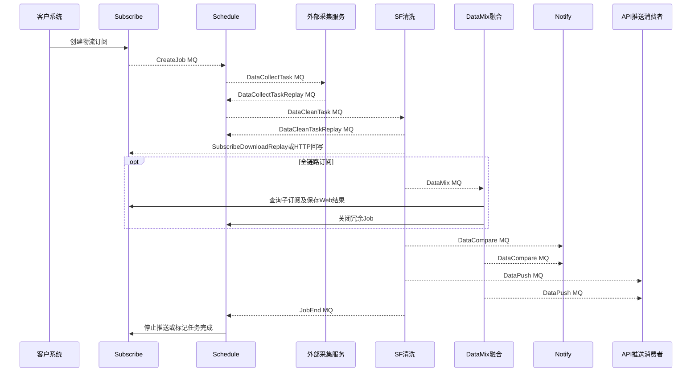

# 00-01 七服务职责边界与整体架构

## 1. 功能背景与解决的问题

物流可视不是单体应用。它需要同时解决外部订阅接入、周期调度、异构数据采集、统一清洗、船司与港区数据融合、状态变化通知，以及运营人员人工补偿等问题。如果把这些职责放入一个服务，单个船司故障、采集延迟或通知拥塞都会扩大影响范围。当前项目将链路拆成七个仓库，并以 RocketMQ 承担耗时阶段之间的异步交接，以 HTTP API 和共享数据模型完成查询、回写及人工操作。

本文的目标不是按技术栈罗列服务，而是回答新人最先遇到的三个问题：一次订阅经过哪些服务；每个服务对哪段状态负责；出现问题时应从哪里开始排查。

## 2. 七个服务的真实职责与关键技术细节

- `iscm-trace-subscribe` 是订阅事实入口。它接收船司、港区、码头和全链路订阅，保存订阅记录，并在 `TraceSubscribeApiService#sendCreateJobMessage` 中发送 `CreateJob`。
- `iscm-trace-schedule` 是执行编排中心。`CreateScheduleJobListener` 将订阅转换为 `schedule_job` 和 `schedule_task`，随后发送采集、清洗任务并消费阶段回执。
- `iscm-trace-sf` 是海运清洗中心。`BaseShipPortCleanListener` 根据业务类型和渠道路由到具体清洗器，`DataProcessing` 负责查询原始数据、清洗、落库及结果分发。
- `iscm-trace-sf-data-mix` 是全链路融合中心。它消费 `DataMix`，将船司、港区等子结果组合成面向客户的融合轨迹，并支持 v1、v2 和美的定制路径。
- `iscm-trace-notify-platform` 是数据变化比较和通知中心。它消费 `DataCompare`，按客户规则判断首次订阅、数据变化和预警，再通过责任链发送邮件、微信或统一通知。
- `iscm-trace-admin` 是运营查询和人工补偿后端，能够查询 Job、Task、Mongo 数据，并调用调度服务执行重订阅、重发消息、数据源或渠道切换。
- `iscm-trace-admin-web` 是运营前端。它负责 Token 携带、动态路由和操作页面，但前端菜单隐藏不是安全边界，真实鉴权由 admin 后端完成。

## 3. 核心代码位置

- `iscm-trace-subscribe/.../TraceSubscribeApiService.java`：`sendCreateJobMessage`、`getScheduleJob` 和全链路 Job 拆分。
- `iscm-trace-schedule/.../CreateScheduleJobListener.java`：Job、Task 创建与重开判定。
- `iscm-trace-schedule/.../ScheduleTaskServiceImpl.java`：采集和清洗 MQ 投递。
- `iscm-trace-sf/.../DataProcessing.java`：清洗模板与多路结果消息。
- `iscm-trace-sf-data-mix/.../FusionHandler.java`：融合、Mongo 保存、计费和推送。
- `iscm-trace-notify-platform/.../AbstractDataCompare.java`：变化判断、规则查询和通知。
- `iscm-trace-admin/.../ScheduleJobAdminServiceImpl.java`：运营补偿入口。

## 4. 完整调用流程

## 5. 核心实现原理与设计原因

这套架构的关键不是“用了 MQ”，而是把一个长事务拆成多个可重试的状态阶段。订阅成功只表示业务请求被记录；Job 表示一段持续调度周期；Task 表示某一次采集与清洗尝试；Mongo `dataId` 指向该次原始或清洗详情。各阶段通过回执推进，避免 HTTP 请求一直等待外部船司。

Topic 表示业务事件，Tag 表示船司、港区、融合等子类型，consumer group 决定同类消费者之间是负载均衡还是分别消费。HTTP 更适合查询和明确的状态回写，MQ 更适合采集、清洗、融合、通知等耗时且允许重试的动作。MySQL 保存可检索的状态和索引字段，Mongo 保存结构更灵活、体量更大的轨迹详情。

## 6. 异常、并发与边界场景

- 同一订阅可能因接口重试重复到达，subscribe 和 schedule 均需要判重或复用，不能仅依赖 MQ 不重复。
- 采集成功不代表清洗成功。排查时必须区分 `data_collect` 与 `data_clean` 两个 Task 步骤及各自回执。
- `sf` 在推送下游消息前回填 `dataId`，用于降低消费者先收到消息却查不到详情的竞态。
- 融合处理按融合订阅 ID 加 Redisson 锁，避免船司和港区数据同时到达时覆盖同一融合结果。
- `notify-platform` 不是通用 DataPush 消费者。当前仓库只能确认 DataPush 的生产端，实际 API 投递消费者当前代码无法确认。
- `DataCollectTask` 的实际采集消费者也不在七个仓库内，具体爬虫或第三方采集实现当前代码无法确认。

## 7. 当前问题与优化方向

服务之间同时存在 MQ、HTTP 和共享表模型，边界并非完全解耦。建议后续补充统一契约仓库或事件 Schema 版本，避免各仓库复制 DTO 后发生字段漂移；为 Topic、Tag、生产者和消费者建立机器可校验清单；把线上 Nacos 配置、部署实例和告警面板纳入运行手册；对跨服务状态增加统一的链路查询接口，减少人工跨库拼接。

## 8. 关键结论与证据边界

新人排查时应按“订阅记录 → Job → Task → 原始 dataId → 清洗 dataId → 融合/比较/推送消息”推进，而不是只按服务日志搜索单号。本文属于当前检出代码的静态分析，能确认逻辑职责和消息方向，不能确认线上实例数量、真实 Topic 后缀、部署网络和外部消费者实现。

继续阅读：[核心数据模型与消息契约字典](./00-02-核心数据模型与消息契约字典.md)。
