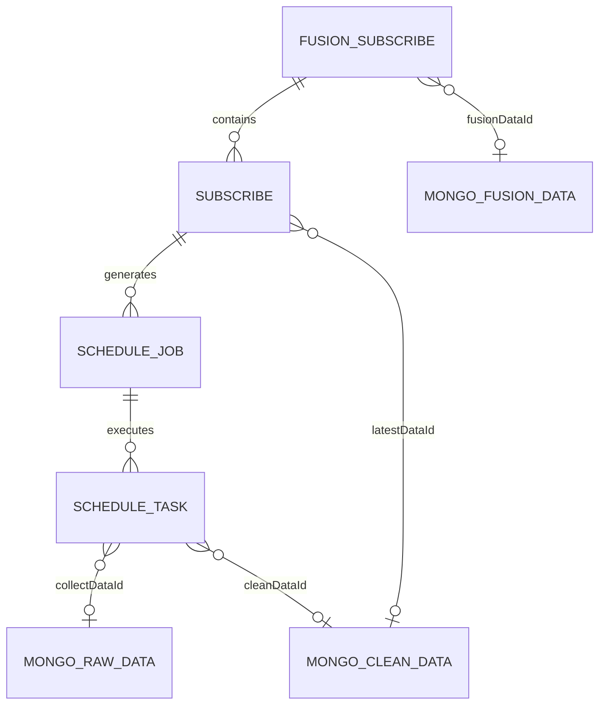
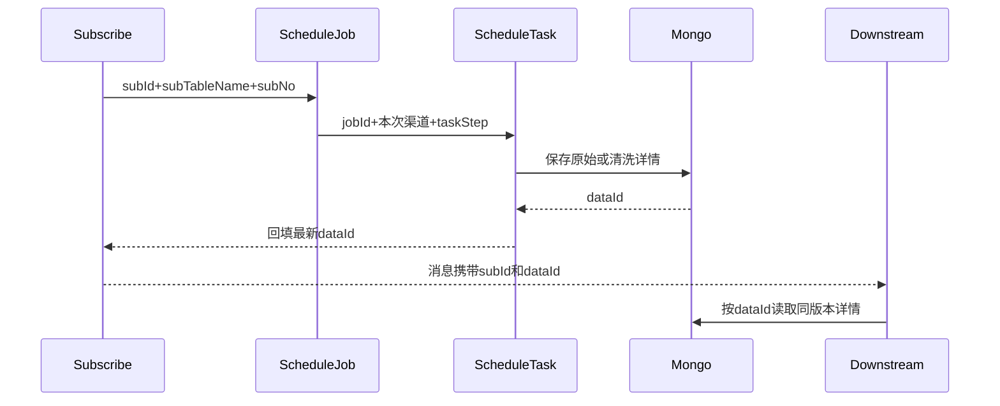

# 00-02 核心数据模型与消息契约字典

## 1. 功能背景与解决的问题

物流可视链路中最容易混淆的是“订阅、Job、Task、数据记录”四种对象。它们都可能携带单号、客户和船司，但生命周期完全不同。如果把 `subId` 当作一次执行 ID，或者把 `jobStatus` 当作单次采集结果，就会错误重推、重复计费或提前结束订阅。本文建立对象和消息之间的对应关系，作为后续文档的共同词典。

## 2. 核心代码位置与核心对象

### 2.1 Subscribe：客户业务事实

`TraceShipSubscribe`、`TracePortSubscribe` 等订阅实体由 subscribe 服务维护。`subId` 是具体订阅表主键，`subTableName` 决定应查询哪类订阅；`subNo` 是箱号、提单号、订舱号等业务编号；`customerId` 区分客户；`dataId` 指向最新可用数据。一个全链路订阅还会关联多个船司或港区子订阅。

### 2.2 ScheduleJob：持续调度计划

`iscm-trace-schedule/.../entity/ScheduleJob.java` 显示 Job 保存 `subTableName`、`subId`、`subType`、`subNo`、`carrierCd`、`customerId`、`crontabId`、`currentChannel`、`currentCode`、`nextScheduleTime` 和 `jobStatus`。它描述“这条订阅在一段时间内如何持续执行”，不是一次采集结果。`repeatFlag`、`isForceEnd`、`forceEndDay` 决定复用和结束行为。

### 2.3 ScheduleTask：单次执行尝试

`ScheduleTask.java` 通过 `jobId` 归属于 Job，并以 `taskStep` 区分 `data_collect` 与 `data_clean`。`taskStatus`、`retryCount`、`collectErrorMsg`、`cleanErrorMsg`、`receiveTime`、`collectEndTime`、`cleanEndTime` 描述一次执行。Task 还携带 `dataId`、`fusionTableId`、`source` 等临时上下文，供清洗和融合使用。

### 2.4 DataId：详情数据定位符

轨迹详情体量大、结构随业务变化，通常保存于 Mongo；MySQL 的订阅或 Task 只保存其 ID。`DataProcessing` 在完成清洗后更新订阅 `dataId`，再发布比较、融合和推送消息。因而 `dataId` 是消息消费者读取同一版本详情的关键契约，不应把它理解为 Job 或 Task 主键。

## 3. 对象关系

## 4. 核心消息契约与关键技术细节

- `CreateJob`：subscribe → schedule。消息主体是 `ScheduleJob` 列表或等价 DTO，交付订阅身份、调度类型、客户、数据源、重试和结束策略。
- `DataCollectTask`：schedule → 外部采集服务。主体是本次 `ScheduleTask` 上下文；Tag 区分业务类型或渠道。
- `DataCollectTaskReplay`：采集服务 → schedule。回写采集状态、错误、Mongo 原始数据 ID 等。
- `DataCleanTask`：schedule → sf。要求基于采集结果执行清洗；首轮清洗和普通清洗可使用不同 Tag 或消费组。
- `DataCleanTaskReplay`：sf → schedule。回写清洗成功、失败及结束时间，用于推进 Task。
- `SubscribeDownloadReplay`：sf → subscribe。回填订阅的下载结果和数据 ID。
- `DataMix`：sf → sf-data-mix。`NORMAL_TAG`、`FORCE_TAG`、`MIDEA_TAG` 分别进入普通、强制和定制融合消费者。
- `DataCompare`：sf 或 sf-data-mix → notify-platform。Tag 包含 SHIP、PORT、FUSION，notify 使用独立消费组，防止某类拥塞影响其他类型。
- `DataPush`：sf 或 sf-data-mix → 外部推送消费者。当前代码确认生产端，通用消费端当前代码无法确认。
- `JobEnd`：sf → schedule。schedule 结束 Job，并调用 subscribe 记录停止推送或完成状态。

## 5. 完整调用流程：契约如何贯穿各服务

## 6. 为什么采用当前模型

订阅与执行分离后，客户只需持有稳定的订阅标识，调度系统可以在不改变订阅的情况下反复创建 Task、切换渠道和重试。Job 与 Task 分离使“整段业务是否还需继续”和“本次调用是否成功”不会混为一谈。MySQL 保存状态，Mongo 保存详情，则兼顾后台筛选能力与异构轨迹结构。

## 7. 异常、并发与边界场景

- `subId` 只有和 `subTableName` 一起使用才足以定位订阅，不同订阅表可能出现相同数值主键。
- 同一 Job 可有多个 Task，排查时不能只看 `lastScheduleTaskId`；历史失败可能已被后续成功覆盖。
- 消息重复消费时，应使用业务键和状态判断幂等，不能假设 RocketMQ 只投递一次。
- `dataId` 回填失败但消息已发出，会造成下游查不到数据；项目通过先回填后发消息降低该风险，但这不是数据库与 MQ 的原子事务。
- 复制到多个仓库的实体或 DTO 可能发生字段版本漂移，应以生产方与消费方共同依赖的契约版本为准。

## 8. 当前问题与优化方向

建议为所有消息建立明确的 Schema、版本号、必填字段和兼容策略；对 `subTableName + subId`、`jobId`、`taskId`、`dataId` 定义统一日志字段；建立消息生产者—消费者清单并在 CI 中检查 Topic/Tag；减少跨服务复制实体，优先使用稳定 DTO。线上 Topic 的环境后缀和完整载荷约束由依赖包及 Nacos 共同决定，当前代码无法完整确认。

继续阅读：[环境配置、服务启动与最小联调路径](./00-03-环境配置服务启动与最小联调路径.md)。
