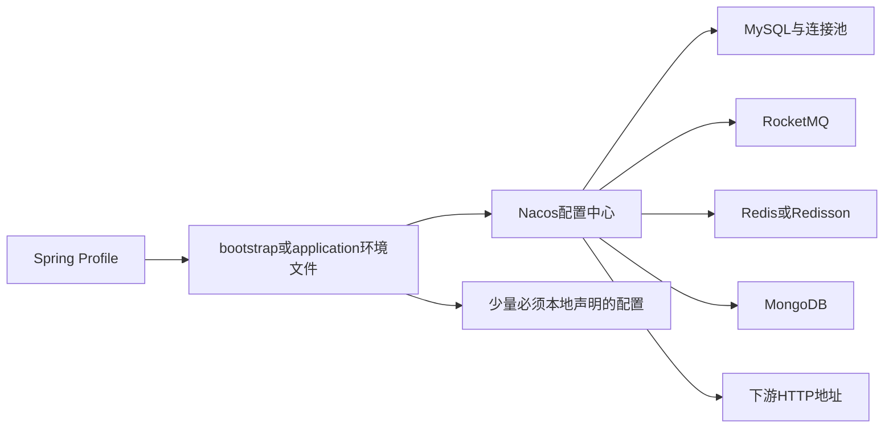

# 00-03 环境配置、服务启动与最小联调路径

## 1. 功能背景与解决的问题

七个服务不能只靠执行启动类就完成联调。它们依赖 Nacos 中的环境配置、RocketMQ、Redis、MySQL、Mongo 以及若干外部 API。新人常见误区是看到进程启动成功就认为系统可用，或者访问根路径得到 404 就判断服务异常。本文给出基于当前配置文件可确认的启动入口和最小验证链路，并明确哪些参数必须从运行环境获取。

## 2. 核心代码位置、启动入口与基础路径

- subscribe：`TraceSubscribeServiceApplication`，基础配置为端口 `8089`、context-path `/trace-subscribe`、应用名 `trace-subscribe`。
- schedule：`TraceScheduleServiceApplication`，端口 `8088`、context-path `/trace-schedule`、应用名 `trace-schedule`。
- sf：`STraceServiceApplication`，端口 `8088`、context-path `/trace-sf`、应用名 `trace-sf`。
- sf-data-mix：`DataMixApplication`，应用名 `iscm-trace-sf-data-mix`；端口和下游地址可能由环境配置补充。
- notify-platform：`NotifyApplication`，端口 `31010`、context-path `/`、应用名 `iscm-trace-notify-platform`。
- admin：后端启动类位于 `trace-admin-app`，端口 `8088`、context-path `/trace-admin`、应用名 `trace-admin`。
- admin-web：Vite + Vue 3 前端，通过 `vite.config.ts` 的 `/api` 代理访问 admin。当前文件存在用户工作区改动，联调前应检查代理目标，不能按文档假定。

端口重复并不矛盾，因为服务通常运行在不同容器或主机；若在同一开发机同时启动，必须通过命令行或本地 profile 覆盖端口。根路径 404 也不等价于启动失败，应访问带 context-path 的健康检查、Swagger 或实际 API。

## 3. 配置加载链路

subscribe、schedule、sf 和 admin 使用不同 profile 文件指向开发、预发或生产 Nacos；sf-data-mix 和 notify 的环境文件注释还表明部分配置写入 Nacos 后无法读取，因此留在 bootstrap 中。启动前必须确认 profile、Nacos namespace/group、数据源和 MQ 环境属于同一套环境，否则最危险的情况不是启动失败，而是开发实例连接到错误环境并消费消息。

## 4. 完整调用流程：最小联调路径

建议先验证“订阅 → 创建 Job”，不要一开始就要求真实船司全链路成功：

1. 启动 subscribe 和 schedule，确认两者注册到预期环境。
2. 选择测试客户和不会影响生产计费的测试单号。当前代码无法确认现成测试账号和数据，应由环境负责人提供。
3. 调用 `TraceShipSubscribeController` 的订阅接口，记录返回的 `subId`、`subNo` 和 traceId。
4. 在 subscribe 日志确认 `TraceSubscribeApiService#sendCreateJobMessage` 发送 `CreateJob`。
5. 在 schedule 日志确认 `CreateScheduleJobListener#onMessage` 消费，并在 `schedule_job`、`schedule_task` 中查询对应记录。
6. 若只验证编排，到此即可停止；若继续验证清洗，需要确认外部采集消费者在线，并依次观察 `DataCollectTaskReplay`、`DataCleanTask` 和 `DataCleanTaskReplay`。
7. 全链路订阅再增加 sf-data-mix；通知验证再增加 notify-platform。不要在前置阶段失败时盲目启动所有服务。

## 5. 关键技术细节与检查点

启动日志至少应确认：实际 profile、应用名、端口、context-path、Nacos 拉取结果、RocketMQ producer/consumer 是否注册、Redis/Redisson 是否连接、MySQL Mapper 是否初始化。Mongo 可采用延迟连接，进程启动成功仍可能在第一次查询时失败，因此要执行一次只读查询验证。

admin-web 联调需要同时检查浏览器请求 URL、Vite 代理和后端 context-path。前端 `src/utils/http.ts` 会附加 `Authorization`；admin 的 `LoginInterceptor` 会从 Redis 缓存读取或调用中台用户信息接口。只有页面能打开而接口返回 401/403，通常属于 Token、缓存或中台鉴权问题，不是前端路由问题。

## 6. 为什么采用配置中心和分环境文件

各服务共享 MQ、Redis、数据源和下游地址，使用 Nacos 可以集中切换环境及动态调整部分参数；本地 profile 只承担“去哪个配置中心取哪套配置”的引导职责。代价是运行行为不完全存在于 Git：源码审查只能确认配置键和默认值，不能确认线上最终值。因此知识库中的配置结论必须区分“仓库默认值”和“运行时配置”。

## 7. 异常、边界与安全风险

- profile 错误可能导致跨环境消费或写库，启动前必须先打印和人工核对环境标识。
- 多服务本地运行会发生端口冲突，应逐个覆盖端口而不是改提交到仓库的公共配置。
- 某些 bootstrap 环境文件包含明文敏感连接信息。本文不记录具体值；建议立即迁移至密钥管理、使用环境变量引用并轮换已暴露凭证。
- Maven 构建通过不代表依赖设施可用；反之，依赖下载失败也不能证明源码编译失败。
- 当前仓库缺少统一的一键本地编排和可验证测试数据集，外部采集服务、DataPush 消费者及生产部署拓扑当前代码无法确认。

## 8. 优化方向与新人检查清单

建议提供脱敏的 `.env.example`、Docker Compose 或开发环境启动脚本；增加统一健康检查，分别报告 Nacos、MQ、Redis、MySQL、Mongo 状态；为测试环境准备不计费的固定订阅样本；把最小联调脚本放入知识库并在 CI 定期执行。新人首次操作时，应保留订阅 ID、Job ID、Task ID、dataId 和 traceId，这五类标识足以贯穿大多数排障。

下一阶段从 [订阅入口、判重、复用与生命周期](../01-核心业务链路/01-01-订阅入口判重复用与生命周期.md) 开始。
