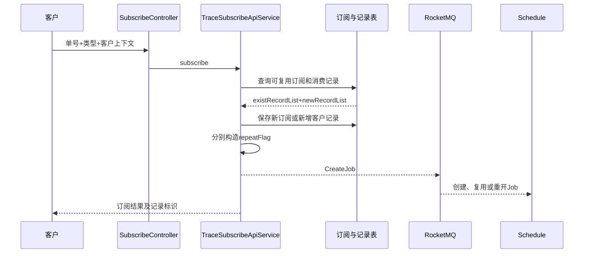

# 01-01 订阅入口、判重、复用与生命周期

## 1. 功能背景与解决的问题

客户可能对同一箱号、提单号反复调用订阅接口，也可能由 API、Web、全链路融合等不同来源订阅。系统既不能每次都创建完全相同的采集任务，也不能简单返回“已存在”而忽略新客户、新通知规则或已结束任务的重开需求。subscribe 服务因此把“业务订阅记录”和“调度 Job 创建”拆成两个阶段：先识别可复用与需新增记录，再把两类记录分别转换为带 `repeatFlag` 的调度请求。

## 2. 服务边界与核心代码

船司入口位于 `TraceShipSubscribeController`，港区入口位于 `TracePortSubscribeController`。通用编排集中在 `trace-subscribe-app/.../service/sub/TraceSubscribeApiService.java`：

- `subscribe(...)`：订阅模板入口，处理参数、角色配置、历史记录和结果组装。
- `getExistRecordIdMap(...)`：从已存在记录建立业务唯一标识到 ID 的映射。
- `sendCreateJobMessage(...)`：分别处理已存在与新建记录，然后发送 `CreateJob`。
- `fillScheduleJobListBySubscribeRecordList(...)`：结合客户角色、业务类型、来源和全链路配置构造 Job。
- `getScheduleJob(...)`：填充订阅表、主键、客户、船司、调度类型、重试、渠道和结束策略。

具体船司、港区 Service 负责各自唯一键、表结构和数据查询；通用模板不应被理解为所有业务完全共用同一判重条件。

## 3. 完整调用流程

## 4. 核心实现原理

`ResultSubscribeRecordDTO` 同时保留 `existRecordList` 和 `newRecordList`。`sendCreateJobMessage` 对前者传入 `isNewRecord=false`，对后者传入 `true`，避免在 Controller 中重复业务判断。构造 Job 时，代码还读取 `BaseRoleConfig`、`CustomerRole`、API 路径、是否高优先级和订阅来源。说明调度策略不仅由单号决定，还受客户资源和入口场景影响。

复用并不等于什么都不做。即使订阅记录已存在，也可能需要向 schedule 发送 Job，使调度中心判断现有 Job 是否可复用、是否已结束、Web 重订阅是否需要清空结束时间。真正的执行幂等边界因此横跨 subscribe 和 schedule 两层。

## 5. 为什么采用当前方案

判重放在订阅层可以减少重复业务记录和重复计费；把 Job 最终决策留给 schedule，则让订阅服务不必掌握任务是否暂停、结束、异常或正在调度。两层判定分别面向“客户业务事实”和“执行状态”，比单纯使用数据库唯一索引更符合持续追踪场景。

## 6. 关键技术细节

- 判重键必须包含业务类型、单号、船司或港区、客户及有效状态中的必要部分，不能只按 `subNo`。
- `subTableName + subId` 是跨服务定位订阅的组合键。
- `subSource` 和 API path 会影响角色、渠道或调度行为，回放历史请求时不能丢失。
- 全链路订阅可能创建多个子订阅，外层融合记录和内层船司/港区记录不是同一生命周期。
- 发送 MQ 和保存数据库并非同一事务，出现“记录已保存、CreateJob 未发出”时需要补偿入口。

## 7. 异常、并发与边界场景

并发提交相同请求时，先查后插仍可能竞态；是否存在数据库唯一约束及所有业务的完整唯一键，当前代码无法统一确认。MQ 重试会导致同一 CreateJob 再次消费，因此 schedule 必须再次查询现有 Job。已完成订阅再次到达时，不应直接修改旧 Task，而应由 Job 重开逻辑决定是否创建新 Task。客户 A 的可复用数据不必然允许客户 B 共用通知、计费和权限记录，复用范围必须区分底层数据与客户消费关系。

## 8. 当前问题与优化方向

建议明确记录每类订阅的业务幂等键，使用唯一索引或原子 upsert 承担最终防线；引入 outbox 保证订阅落库与 CreateJob 事件最终一致；把“新建、数据复用、Job 复用、Job 重开”记录为结构化决策码，便于后台解释为什么没有创建新任务；为不同入口建立契约测试，防止新增字段只在某个 Controller 生效。

## 9. 关键结论与证据边界

订阅成功不是采集成功，也不保证新建 Job。排查重复或漏调度时，需要同时检查订阅记录分类、CreateJob 发送日志和 schedule 的现有 Job 判定。具体线上唯一索引、计费事务和外部鉴权由当前代码无法完整确认。

下一篇：[全链路订阅拆分为船司与港区 Job](./01-02-全链路订阅拆分为船司与港区Job.md)。
