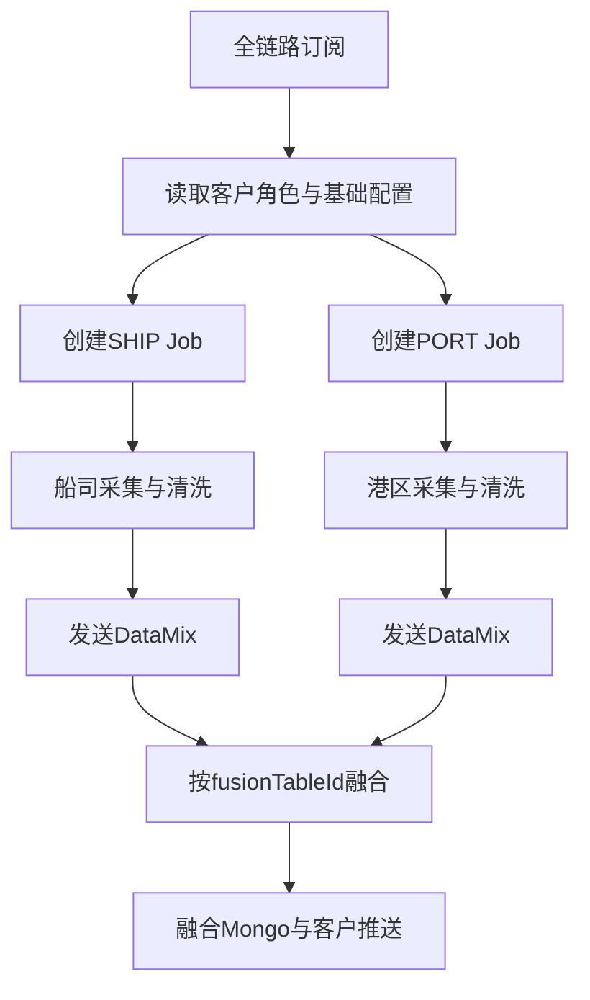

# 01-02 全链路订阅拆分为船司与港区 Job

## 1. 功能背景与解决的问题

客户看到的是一条完整海运轨迹，但数据实际上来自不同系统：船司提供运输节点，港区或码头提供进港、装卸、放行等事件。两类数据刷新频率、查询参数、渠道和结束条件都不同。全链路服务不能把它们当成一次采集，因此 subscribe 在建立融合订阅后，将其拆成 SHIP、PORT 等独立 Job，再由 sf-data-mix 汇总结果。

## 2. 核心代码位置

`TraceSubscribeApiService#fillScheduleJobListBySubscribeRecordList` 遍历订阅类型，读取客户角色和基础角色配置；在全链路场景下额外读取 `fullLinkPortBaseRoleConfigMap`。`getScheduleJob` 负责构造普通 Job，而后续分支分别构造船司与港区 Job，写入 `subTableName`、`subId`、`carrierCd`、`startCode`、`scheduleType`、`customerId`、`retryCount`、`currentChannel`、`repeatFlag`、`isForceEnd` 等字段。`FusionDataSubscribeApiServiceV2` 也会发送 CreateJob，并在满足条件时主动触发 DataMix。

## 3. 完整调用流程：拆分和聚合

一次全链路订阅可能对应一个外层融合订阅、多个子订阅、多个 Job，以及每个 Job 下不断产生的 Task。融合消息携带 `fusionTableId` 或等价关联信息，使 DataMix 能够反查船司与港区最新数据。

## 4. 核心实现原理

拆分发生在调度之前，而不是清洗之后。这样 schedule 可以为船司和港区分别选择 `crontabId`、渠道、超时、重试次数和结束策略。任一来源有新数据时，sf 通过 `TriggerFusionCleanHandler` 发送 DataMix；sf-data-mix 再读取融合订阅及扩展配置，查询当前可用的各子数据，并对同一个融合 ID 串行处理。

融合不是简单拼接。`FusionHandler` 根据版本走不同组合实现，保存当前结果和上一版本，只有变化时才发送 DataPush；它还会根据融合进度关闭多余港区 Job，避免货物阶段已经结束后继续无意义采集。

## 5. 为什么采用当前方案

独立 Job 能实现故障隔离：港区接口故障不会阻塞船司轨迹更新；某一渠道限流也不会迫使另一来源使用相同周期。融合层则保持客户数据模型统一，客户不需要理解底层来源差异。该方案代价是最终一致性：某次融合可能使用新船司数据和旧港区数据，因此必须保留数据版本、来源和更新时间。

## 6. 关键技术细节

- `repeatFlag` 需要对子 Job 分别判断，外层融合订阅复用不代表所有子 Job 都处于运行状态。
- 船司和港区 `carrierCd`、`startCode` 含义不同，不能在后台切换时统一覆盖。
- 全链路港区角色配置通过独立 Map 读取，说明港区资源授权与船司授权并非完全相同。
- DataMix 的 NORMAL、FORCE、MIDEA 使用不同 Tag 或消费组，避免强制补偿、客户定制和实时融合相互阻塞。
- 融合处理使用 `fusionTableId` 分布式锁；只按 `subNo` 加锁会把不同客户或不同融合版本错误串行化。

## 7. 异常、并发与边界场景

船司和港区消息几乎同时到达时，若无锁可能同时读取旧融合结果并覆盖；当前 BaseDataFusionListener 的 Redisson 锁降低该风险。某个子 Job 长期无数据时，融合应允许使用已有来源还是等待全部来源，取决于 v1/v2 组合规则，不能由通用文档臆测。子 Job 被关闭后重新订阅，需要同时恢复调度和融合关联。融合记录存在但子订阅缺失时，应记录可诊断错误，不能生成看似完整的空结果。

## 8. 当前问题与优化方向

建议为融合结果增加明确的来源水位，例如 shipDataId、portDataId、各自采集时间和融合版本；将子 Job 拆分决策保存为可查询快照；为“只船司、只港区、双来源、来源延迟、来源回退”建立契约测试；对关闭子 Job 的条件增加审计事件，避免运营人员只看到 Job 被结束却不知道是融合逻辑主动关闭。

## 9. 证据边界

当前代码可确认拆分字段、DataMix 触发和融合锁，但无法确认线上每个客户实际启用哪些子类型、全部角色配置内容及所有 v1/v2 业务规则。仓库中的融合设计文档是重要背景，不等价于所有分支均已部署。

下一篇：[Schedule Job 与 Task 状态机](./01-03-Schedule-Job与Task状态机.md)。
