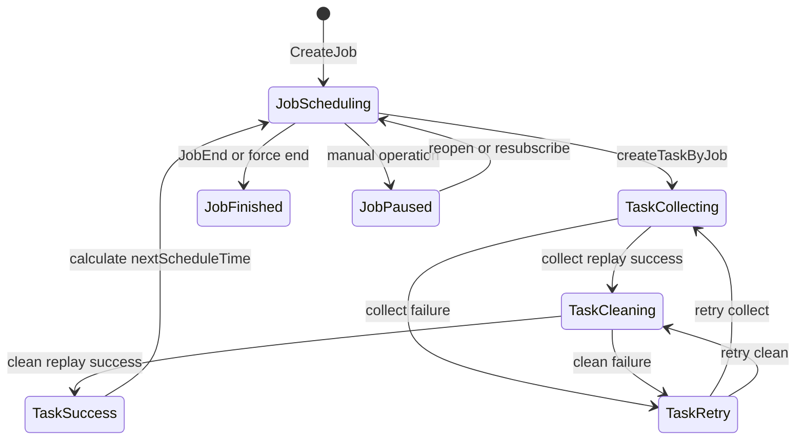

# 01-03 Schedule Job 与 Task 状态机

## 1. 功能背景与解决的问题

物流追踪不是一次请求，而是从订阅开始到货物完成期间的周期任务。Job 回答“还要不要继续查、下次何时查、使用什么渠道”，Task 回答“这一次采集和清洗进行到哪一步”。如果只保留一张任务表，单次失败会被误认为整条订阅结束，也无法准确统计重试和阶段耗时。

## 2. 核心代码位置与状态字段

`schedule/entity/ScheduleJob.java` 映射 `schedule_job`，关键字段包括 `crontabId`、`lastScheduleTaskId`、`lastScheduleTaskStatus`、`nextScheduleTime`、`jobStatus`、`isForceEnd`、`forceEndDay`、`newestStatus`、`firstCleanTime`、`lastDataChangeTime`、`repeatFlag`。

`ScheduleTask.java` 保存 `jobId`、`taskStep`、`taskStatus`、`lastSendTime`、`receiveTime`、`collectEndTime`、`cleanEndTime`、`retryCount`、采集/清洗错误和 `dataId`。注释给出的 Task 状态为执行中、成功、失败、系统异常、单号不存在；JobStatusEnum 还定义调度中、执行成功、执行失败、暂停和爬取异常。由于业务代码存在多个状态枚举，解释状态时必须同时看字段所在实体和更新方法。

## 3. 完整调用流程：Job 创建与 Task 推进

`CreateScheduleJobListener#onMessage` 消费 CreateJob，查询 `subTableName + customerId + subId` 对应的现有 Job，并区分新增、重复、可复用和 Web 重开。保存 Job 后，`createTaskByJob` 创建 Task；如果允许实时触发，则 `sendDataCollectTaskMq` 立即发送采集消息。周期执行时，调度逻辑根据 `nextScheduleTime` 再创建后续 Task。

## 4. 核心实现原理

Job 是状态聚合根：保存当前渠道、数据源、最近 Task、最新物流状态和下次调度时间。Task 是不可混用的执行实例：每次发送、接收、采集完成、清洗完成都有独立时间。阶段回执更新 Task 后，再把摘要回写 Job。这样既能快速查询 Job 当前状态，也能保留每次尝试用于排障。

`taskStep` 是重试路由的关键。`ScheduleTaskServiceImpl#retrySendTaskMq` 根据它决定重新发送采集还是清洗，避免采集已经成功却重复请求外部渠道。`lastScheduleTaskStatus` 只代表最后一次 Task 摘要，不能替代 Task 历史。

## 5. 为什么采用当前方案

周期追踪需要支持“单次失败继续重试、整条任务仍在运行”；同时运营后台需要暂停、重开、改渠道。Job/Task 两级模型将长期策略和短期执行分离，能够按 Job 控制生命周期，按 Task 记录细粒度错误和耗时。它也使 MQ 回执天然对应一次 Task，而非模糊更新整条订阅。

## 6. 关键技术细节

- 新建 Task 时应复制当时的渠道和数据源，后续 Job 配置变化不能改写历史执行事实。
- `nextScheduleTime` 依赖 crontab 及业务状态；修改 crontab 后必须重新计算，而非只更新外键。
- `isForceEnd` 与 `forceEndDay` 是兜底结束策略，业务完成状态仍可能提前触发 JobEnd。
- Web 重订阅分支会重置与结束相关的时间，说明“已结束 Job 的复用”不是普通重复消息。
- 逻辑删除和版本字段提示可能存在并发更新控制，但是否所有更新都使用乐观锁，当前代码无法统一确认。

## 7. 异常、并发与边界场景

重复 CreateJob 可能在并发窗口创建多个 Job；重复调度可能同时创建多个 Task；延迟回执可能更新已被重试替代的旧 Task。处理回执时应以 taskId 为主，并验证 Job 归属和当前阶段，不能只按 subId 更新最新记录。JobEnd 与最后一次清洗回执可能乱序，代码中存在延迟结束和状态判断以降低竞态，但数据库更新与 MQ 仍非原子事务。

## 8. 当前问题与优化方向

建议形成正式状态迁移表并集中封装更新方法，禁止业务类直接写魔法数字；为 Job、Task 增加可审计的 `state_reason` 和事件时间；对创建 Task 使用唯一业务键或数据库锁；区分事件发生时间与消费时间，防止旧回执覆盖新状态；后台同时展示 Job 聚合状态和最近若干 Task，避免只看一个状态码误判。

## 9. 关键结论与证据边界

排查必须先确定问题属于 Job 生命周期还是某次 Task 阶段。当前代码能确认核心字段、创建与重试路径，但完整 crontab 计算、所有专项任务状态和线上并发隔离级别需在对应实现及运行配置中继续核实。

下一篇：[采集任务、采集回执与清洗任务生成](./01-04-采集任务采集回执与清洗任务生成.md)。
