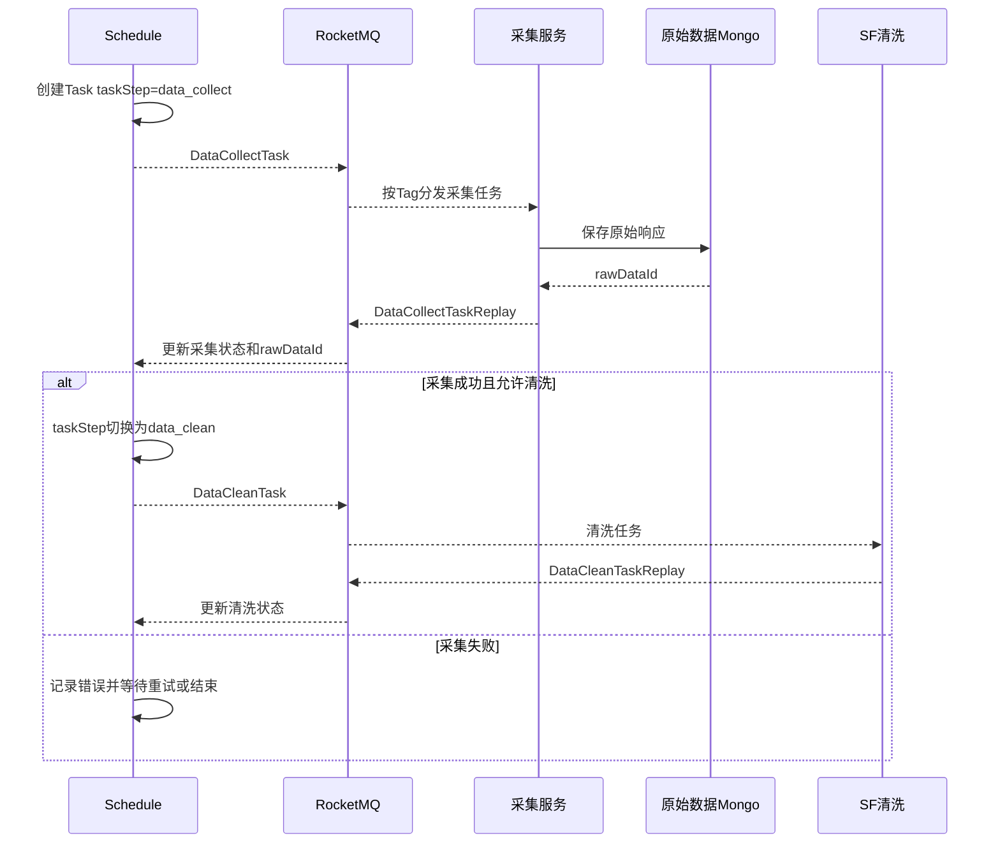

# 01-04 采集任务、采集回执与清洗任务生成

## 1. 功能背景与解决的问题

船司、港区和第三方数据源的响应时间不可控，调度服务不能通过一次同步 HTTP 调用等待采集与清洗全部结束。当前实现把一次 Task 再拆为 `data_collect` 和 `data_clean` 两个阶段：schedule 先投递采集任务，收到采集回执并获得原始 Mongo `dataId` 后，再投递清洗任务。这样可以分别重试采集和清洗，并准确记录故障发生在哪一层。

## 2. 核心代码位置

- `ScheduleTaskServiceImpl#sendDataCollectTaskMq`：根据 Task 业务类型、渠道和优先级生成采集 Topic/Tag。
- `DataCollectTaskReplayListener#onMessage`：消费通用采集回执，更新采集阶段状态并触发清洗。
- `ScheduleTaskServiceImpl#sendDataCleanTaskMq`：构造清洗 Topic/Tag，区分首轮、普通和专项业务。
- `DataCleanTaskReplayListener#onMessage`：消费清洗回执，写入清洗完成状态、错误和时间。
- `ScheduleTaskServiceImpl#retrySendTaskMq`：依据 `taskStep` 判断重发采集还是清洗。

NAT、快递、码头等业务存在专项 Replay Listener，说明通用监听器不是所有类型的唯一入口。编写或排查时应先根据 Topic/Tag 找到真实消费者。

## 3. 完整调用流程

## 4. 核心实现原理

采集消息携带 Task 快照，下游完成后以 taskId 回执。schedule 根据回执更新 `receiveTime`、`collectEndTime`、`taskStatus`、`collectErrorMsg` 和原始 `dataId`。成功分支调用 `sendDataCleanTaskMq`，保持同一个 Task 的关联关系，但将执行阶段推进到清洗。清洗完成后，sf 回传清洗结果，schedule 再更新 `cleanEndTime`、`cleanErrorMsg` 和最终状态。

Topic 负责区分事件大类，Tag 结合 `subTableName`、渠道、是否首次清洗等信息完成更细路由。部分 ONE_DATA 首次任务使用独立 Tag 或消费组，以防首次结果被普通积压拖延。专项业务的独立回执监听器则允许其直接更新订阅或推送，不强迫所有类型经过完全相同模板。

## 5. 为什么采用当前方案

采集故障与清洗故障的处理策略不同。采集失败可能要换渠道、退避或等待外部恢复；清洗失败通常说明数据格式、映射或代码异常，重复调用外部接口没有意义。两个阶段分别记录和重试，能够减少外部请求并提高可诊断性。通过 MQ 解耦后，采集服务和清洗服务可独立扩容，schedule 只维护状态推进。

## 6. 关键技术细节

- 回执必须携带原 Task 身份和业务类型；仅按单号回写可能命中其他客户或后续 Task。
- 原始 `dataId` 是清洗读取 Mongo 的定位符，采集成功但未保存 dataId 不应进入清洗。
- `lastSendTime`、`receiveTime` 和结束时间可区分 MQ 等待、消费者处理和外部调用耗时。
- `retryCount` 是单次 Task 还是 Job 累计值，应以具体更新代码为准，不能在运营操作中任意重置。
- 清洗 Topic 的首轮标记会影响消费组和业务通知，人工重发时必须保留原始语义。

## 7. 异常、并发与边界场景

回执可能重复、延迟或乱序。重复成功回执若再次发送清洗，会产生重复清洗和通知；旧失败回执若覆盖后续成功，会造成假失败。消费者应检查当前 taskStep、状态和事件时间。采集服务保存 Mongo 成功但回执失败时，应重发回执而不是重新采集；schedule 更新成功但清洗 MQ 发送失败时，需要补偿重发。某些专项 Listener 不经过通用流程，统一改造前必须列出所有 Topic/Tag。

## 8. 当前问题与优化方向

建议为 Task 阶段增加显式状态机和事件版本；建立回执幂等表或使用 taskId+阶段+attempt 唯一键；将数据库更新与下一阶段 MQ 发送改为 outbox；统一普通与专项回执的可观测字段；后台展示每个阶段的发送、接收、完成时间和消息 ID。外部采集消费者不在本次七个仓库中，其重试、限流和 Mongo 保存细节当前代码无法确认。

## 9. 关键结论

看到 Task 失败时，先判断失败发生在采集还是清洗；看到清洗没有执行时，先验证采集回执是否成功写入 rawDataId，再检查 DataCleanTask 是否发送，而不是直接重跑整条订阅。

下一篇：[SF 清洗模板、多渠道路由与结果落库](./01-05-SF清洗模板多渠道路由与结果落库.md)。
