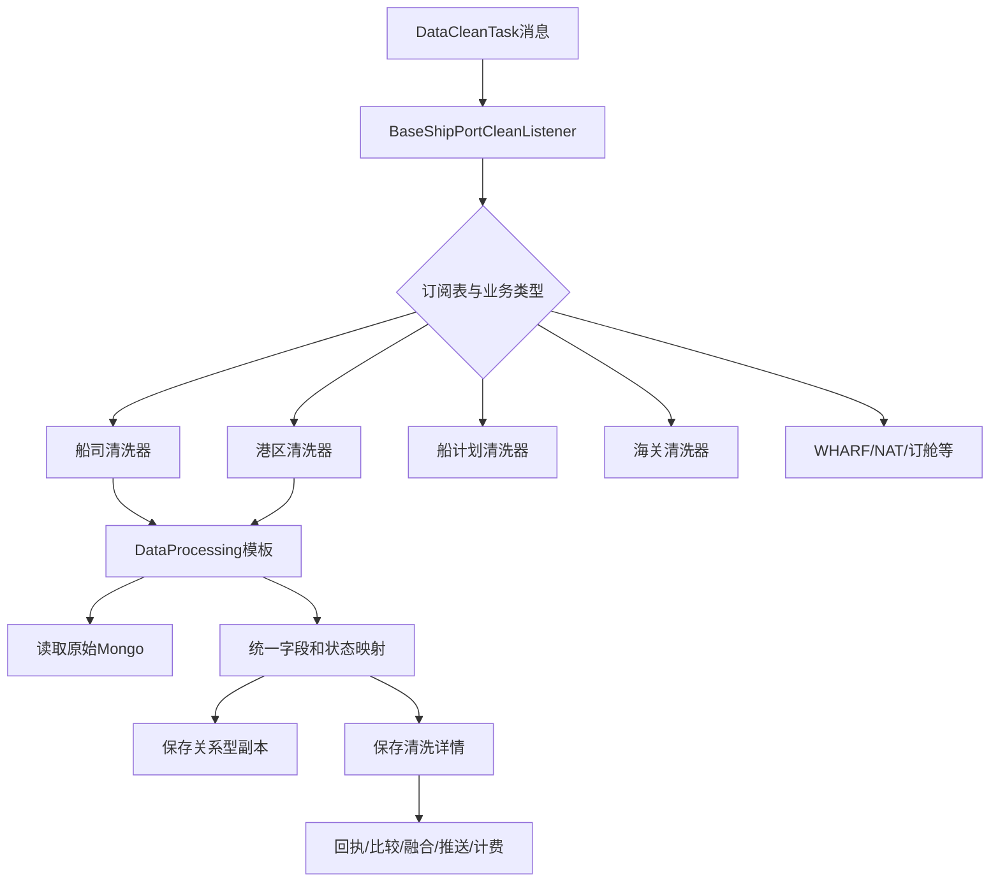

# 01-05 SF 清洗模板、多渠道路由与结果落库

## 1. 功能背景与解决的问题

船司、港区、码头、海关、订舱状态等原始数据结构差异极大，同一业务还可能来自 ONE_DATA、API、代理或专项渠道。SF 服务需要先选择正确的清洗实现，再把不同来源转换为统一轨迹模型，同时保留原始数据和可回放的清洗结果。当前代码通过“监听器路由 + 清洗模板 + 具体处理器”三层实现。

## 2. 核心代码位置

- `BaseShipPortCleanListener`：读取消息中的 Job、订阅表、渠道和来源，路由到船司、港区、码头、WHARF、CUSTOMS、BOOKING_STATUS、NAT 等处理器。
- `ShipPortCleanListener`：普通 DataCleanTask 消费入口。
- `ShipPortFirstCleanListener`：首次清洗独立消费入口。
- `PortCleanListener`：按 subId 加锁，并选择港区或港区+船计划联合清洗。
- `DataProcessing#processData`：通用海运清洗模板。
- `HandlerDataServiceImpl_SHIP`、`HandlerDataServiceImpl_PORT` 等：具体字段转换、状态映射和数据整理。
- `saveShipPortDataToMongo`：由子类实现 Mongo 保存策略。

## 3. 完整调用流程

## 4. 核心实现原理

监听器只负责识别消息和选择处理器，复杂清洗集中在 `DataProcessing#processData`。模板先校验任务并获取 Mongo 查询参数，再由抽象方法完成具体清洗；随后比较旧数据与新数据，保存关系型副本和 Mongo 详情，取得新 `dataId`，最后统一执行结果分发。模板方法让船司与港区共享回执、落库和推送顺序，同时允许各自实现字段清洗。

路由不只看 `subTableName`。代码还判断 `channel`、`jobType`、是否首轮、是否 OneData、是否 HB API 等。原因是相同“港区”业务可能由不同供应方返回不同 JSON，必须进入匹配的解析器。`PortCleanListener` 的 subId 锁保证同一订阅的联合清洗不会并发覆盖。

## 5. 为什么采用当前方案

模板方法适合“步骤基本稳定、清洗细节大量变化”的场景。统一步骤可以保证所有新船司都执行回执、dataId 回填和消息分发；具体处理器避免一个巨型 `if-else` 包含全部字段规则。首轮清洗独立消费能够优先向客户提供首次结果，避免被周期更新积压。

## 6. 关键技术细节

- 原始 Mongo 查询必须与采集渠道和集合命名一致，切换渠道后不能用旧集合规则读取。
- 关系型副本用于筛选、对账或兼容查询，Mongo 保存完整层级数据；两者不是同一事务。
- 状态映射通常依赖船司配置和事件描述，映射顺序会影响最终状态，不能用无序 Map 随意重构。
- 新旧数据比较影响是否触发融合、通知和推送；清洗字段排序、空值归一化会直接影响“是否变化”。
- 清洗成功回执在 `sendSuccessCleanReplay` 统一发送，调用方不能仅凭 Mongo 有数据推断 Task 已成功。

## 7. 异常、并发与边界场景

原始 Mongo 记录缺失、JSON 字段变化、映射配置为空、相同节点重复、时间格式异常都可能导致清洗失败。若 MySQL 副本保存成功而 Mongo 失败，或 Mongo 成功而 MQ 回执失败，会产生部分成功。相同订阅并发清洗需要锁，但锁超时、进程崩溃后的幂等仍依赖数据比较和业务键。特殊业务处理器可能绕过 `DataProcessing`，因此新增全局逻辑时需搜索全部 DataCleanTask 消费者。

## 8. 当前问题与优化方向

建议建立统一清洗结果对象，明确每一步成功标志；为 MySQL、Mongo 和 MQ 使用可恢复的状态记录；对每个船司维护脱敏原始样本与期望结果，自动验证状态映射；将渠道路由规则配置化但保留类型校验；为模板各阶段记录耗时和数据量。不能为了统一而强行合并专项清洗，否则会隐藏业务差异。

## 9. 关键结论与证据边界

排查清洗问题应先确认“消息走到了哪个 Listener、选择了哪个处理器、读取了哪个 Mongo 集合”，再看字段规则。当前代码可确认路由与模板骨架；各船司所有映射配置和线上数据样本当前无法完整确认。

下一篇：[dataId 回填与消息顺序一致性](./01-06-dataId回填与消息顺序一致性.md)。
