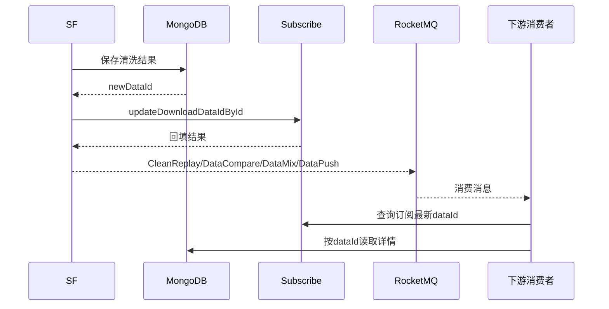

# 01-06 dataId 回填与消息顺序一致性

## 1. 功能背景与解决的问题

清洗后的完整轨迹保存在 Mongo，下游消息通常只携带 `subId`、业务类型和 `dataId`。如果 SF 先发送 DataCompare、DataMix 或 DataPush，再更新订阅表的最新 dataId，消费方可能立即回查订阅却仍得到旧值。`DataProcessing` 明确采用“先保存数据、再回填订阅 dataId、最后发送下游消息”的顺序，以降低这种跨存储竞态。

## 2. 核心代码位置

`DataProcessing#processData` 在清洗和保存后获得新 Mongo ID；`updateDataIdBySubId` 调用 subscribe 的 `subCommonApi.updateDownloadDataIdById` 回填；随后才进入结果分发。`sendReplayForSubscribe` 发送订阅下载回执，`sendSuccessCleanReplay` 通知 schedule 清洗成功，`sendCargoBabyDataCompareMq`、`sendDataPush` 和 `SendMqMessageImpl` 中的 DataMix 方法负责不同下游。

代码注释直接说明回填提前的目的，是处理 MQ 消费顺序导致下游查询不到最新数据的问题。这是当前方案最明确的设计证据。

## 3. 完整调用流程与消息顺序

## 4. 核心实现原理

dataId 同时承担“详情定位符”和“数据版本水位”的作用。先保存 Mongo 才能获得有效 ID；先回填订阅能让通过订阅查询的消费者看到同一版本；最后发消息则把“新版本可见”作为事件发布前置条件。对首次清洗尤其重要，因为订阅原先可能完全没有 dataId。

结果分发不是单一消息：schedule 需要 CleanReplay 推进 Task，subscribe 需要下载回执，notify 需要 DataCompare，融合服务需要 DataMix，API 推送需要 DataPush。顺序设计保证这些消费者至少有机会读取新数据，但它没有提供跨 MySQL、Mongo、HTTP 和 RocketMQ 的真正原子事务。

## 5. 为什么采用当前方案

跨 Mongo、关系库和 MQ 使用分布式事务成本高，且外部 HTTP 回写也难以纳入统一事务。当前方案通过严格操作顺序获得较低成本的最终一致性，并把重复消息交给幂等和数据比较处理。对于“读最新结果”比“精确一次发布”更重要的物流轨迹场景，这是现实折中。

## 6. 关键技术细节

- 消息消费者最好使用消息内的 dataId，而不是无条件查询订阅最新值；否则较旧消息可能读到更新版本。
- Mongo 保存对象应包含业务 ID、采集时间和版本，不能只依赖自增或雪花 ID 判断新旧。
- 回填接口失败时，代码应阻止或延迟部分下游消息；各分支是否完全一致需要逐个核对。
- DataCompare 需要旧、新版本；旧数据的保存策略决定变化判断是否可靠。
- 同一订阅并发清洗时，即使每个流程内部顺序正确，后完成的旧任务仍可能覆盖新 dataId，必须结合锁或事件时间。

## 7. 异常、并发与边界场景

Mongo 成功而 subscribe 回填失败会产生孤立数据；回填成功而 MQ 发送失败会形成“数据已更新但下游未感知”；MQ 发送成功但生产者未收到确认会导致重发。多个下游消息中途失败还会出现部分消费者已处理、部分未处理。当前代码中的顺序只能降低“先消费后可见”，不能解决所有部分失败。

人工 rePush 时必须明确推送哪个 dataId，不能默认拿最新值重放历史事件。删除或归档 Mongo 前应先检查订阅、Task、融合记录是否仍引用。数据比较若以对象序列化结果判断变化，还要处理字段顺序和无意义时间戳。

## 8. 当前问题与优化方向

建议引入本地 outbox：在关系库事务中同时更新订阅水位和待发布事件，再由可靠任务发送 MQ；为 Mongo 写入增加业务版本和幂等键；消费者按 `subId + dataId + eventType` 去重；后台显示 Mongo 保存、dataId 回填、各消息发送的独立状态。更完整的方案可采用事件水位而不是“订阅最新 dataId”作为所有消费依据。

## 9. 关键结论与证据边界

“先回填、后发消息”是当前代码已确认的关键一致性策略，但不能被描述为强一致或事务消息。RocketMQ 实际重试策略、生产者确认参数和线上 Mongo 写关注级别由运行配置决定，当前代码无法完全确认。

下一篇：[全链路融合 v1、v2 与美的定制模式](./01-07-全链路融合v1v2与美的定制模式.md)。
