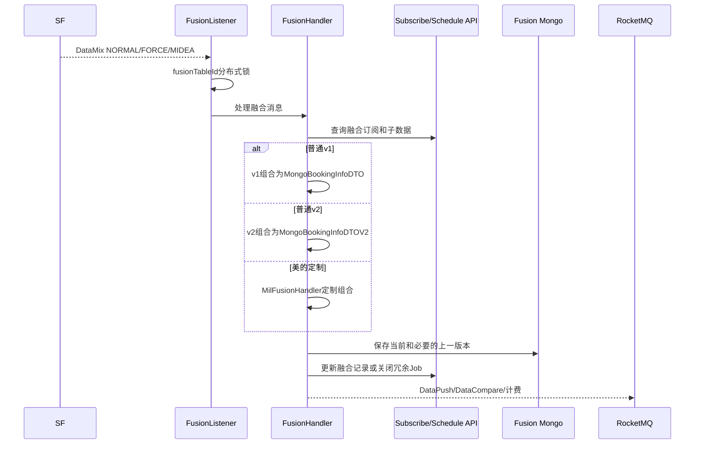

# 01-07 全链路融合 v1、v2 与美的定制模式

## 1. 功能背景与解决的问题

船司轨迹、港区事件和码头计划各自正确，并不等于客户能直接使用。不同来源可能描述同一节点、时间有冲突、箱号集合不一致，还可能只到达一部分数据。sf-data-mix 的职责是基于融合订阅配置选取最新子数据，生成统一轨迹，并保留新旧版本供变化判断。项目同时存在 v1、v2 和美的定制模式，说明数据模型和客户规则曾演进，不能用单一处理器覆盖所有合同。

## 2. 核心代码位置

- `NormalDataFusionListener`：消费 `DataMix.NORMAL_TAG`。
- `ForceDataFusionListener`：消费 `DataMix.FORCE_TAG`，使用独立 group。
- `MideaDataFusionListener`：消费 `DataMix.MIDEA_TAG`，交给 `MilFusionHandler`。
- `BaseDataFusionListener#onMessage`：解析消息、设置链路上下文，并按融合表 ID 获取 Redisson 锁。
- `FusionHandler`：查询融合订阅与扩展，选择 v1/v2 组合、保存 Mongo、关闭冗余 Job、发送推送、计费和预警。
- `FusionToWebServiceImpl`：将融合结果转换为 Web 记录、回填 dataId、发送 FUSION DataCompare 和 WebSocket 更新。

## 3. 完整调用流程

## 4. 核心实现原理

`FusionHandler` 先获取融合订阅及扩展配置，再根据数据版本调用不同组合实现。v1 和 v2 分别落到不同 DTO，但共享“比较旧结果、保存 Mongo、更新融合记录、关闭多余 Job、变化后推送、发送计费”的主干。`saveToMongo` 会保存当前结果，并在必要时保存 previous 数据，使变化比较不依赖外部缓存。

普通、强制和美的消息使用不同 Listener 与消费组。普通融合由新数据变化触发；强制融合用于上游未变化但需要周期重新计算或补偿的场景；美的走独立 Handler，避免定制字段和节流规则污染通用路径。锁键使用融合表 ID，使来自船司和港区的并发事件按同一聚合根串行。

## 5. 为什么采用当前方案

版本并存允许老客户稳定使用既有数据结构，新需求可在 v2 中演进；定制客户隔离能够控制回归范围。把变化判断放在融合结果保存附近，可以只在对客户可见的数据发生变化时推送，减少重复通知。以子数据触发而不是固定轮询，可降低融合计算量；强制融合则补足“无变化也需重算”的业务场景。

## 6. 关键技术细节

- `fusionTableId` 是锁和聚合查询主键，不应退化为只用单号。
- 处理器会关闭部分港区调度 Job，结束逻辑与融合进度耦合，修改组合规则时必须回归 Job 生命周期。
- `FusionToWebServiceImpl#toWeb` 保存消费记录后发送 FUSION DataCompare，并调用订阅侧 WebSocket 入口。
- v1/v2 分别维护首次变化记录，用于首次订阅或变化通知。
- 计费消息应使用成功且有数据的条件，不能因强制融合重复计算就重复收费。

## 7. 异常、并发与边界场景

子数据缺失时，组合器可能生成部分结果、跳过或失败，具体取决于版本规则；当前代码无法用单一结论概括。锁租期过短可能在长融合时失效，过长又会阻塞新数据。Mongo 保存成功但融合记录更新失败，会导致下一次仍从旧水位开始。旧 DataMix 延迟到达时，必须避免用旧子 dataId 覆盖新融合。美的消息误入普通 Tag 会绕过定制逻辑，因此 Topic/Tag 是合同边界。

## 8. 当前问题与优化方向

建议将 v1/v2/客户定制选择保存为订阅快照；融合结果记录每个来源 dataId 和事件时间；为组合算法建立黄金样本；锁使用看门狗或可观测续期，并记录等待时间；将关闭 Job、更新记录、发送事件拆成可补偿步骤。长期可通过版本化策略注册表减少 Handler 条件分支，但不应在缺少回归样本时强行合并版本。

## 9. 证据边界

当前代码可确认三类 Listener、锁、v1/v2 分支和 MilFusionHandler 隔离；具体客户启用版本、全部组合优先级和线上计费规则受配置影响，当前无法完整确认。

下一篇：[DataCompare、状态变化判断与用户通知](./01-08-DataCompare状态变化判断与用户通知.md)。
