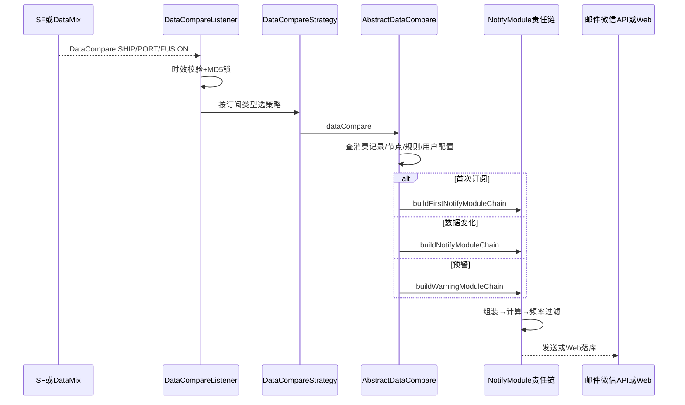

# 01-08 DataCompare、状态变化判断与用户通知

## 1. 功能背景与解决的问题

物流数据会被周期采集，即使轨迹没有变化也可能产生新的清洗记录。若每次都通知客户，会形成消息轰炸；若只比较整段 JSON，又可能因为无关字段变化误报。notify-platform 消费 DataCompare，查询消费记录、节点规则和用户通知配置，判断首次订阅、有效变化和预警，再通过责任链完成组装、频率过滤与发送。

## 2. 核心代码位置

- `ShipDataCompareListener`、`PortDataCompareListener`、`FusionDataCompareListener`：同 Topic 不同 Tag 和 group。
- `DataCompareListener#onMessage`：丢弃超过一小时的消息，设置 traceId，基于 Topic、船司、单号、dataId、subId 生成 MD5 锁键，并申请 Redisson 锁。
- `DataCompareStrategy`：Spring 注入不同比较策略，按订阅类型获取实现。
- `AbstractDataCompare#dataCompare`：查询消费记录、节点、规则和用户配置，组织普通与预警通知。
- `PushService#sendNotify`、`sendNotifyForWarning`：选择首次、普通或预警责任链。
- `ShipPushService#buildNotifyModuleChain`：组装数据、解析计算、频率过滤和发送模块。
- `NotifyModule#build/run`：责任链基础设施。

## 3. 完整调用流程

## 4. 核心实现原理

Listener 层先做消息级保护。超过一小时的消息被忽略，降低历史积压造成过期通知；锁键包含多个业务字段，使同一数据版本不会并发执行两次比较。策略层把 SHIP、PORT、FUSION 的节点模型隔离，抽象基类复用消费记录和通知编排。

责任链将“准备数据、计算命中规则、频率判断、实际发送”拆开。任何一步判断无需继续，都可以终止后续发送。首次订阅使用独立链，因为客户可能要求第一次返回完整状态；预警链则侧重 Web 落库或告警，不应和普通变化完全同频。

## 5. 为什么采用当前方案

不同业务的数据比较规则差异大，但通知渠道和频控机制相似，策略模式与责任链组合能同时保留差异和复用。把比较与通用 API DataPush 分开，可以让“客户系统数据推送”和“用户消息通知”采用不同规则。按 SHIP、PORT、FUSION 拆 group，还能避免某一类型积压阻塞全部通知。

## 6. 关键技术细节

- 一小时过期判断依赖消息时间与服务时钟，主机时钟偏差会误丢消息。
- MD5 锁用于短时间并发控制，不等价于永久幂等记录；锁过期后重复消息仍可能发送。
- `AbstractDataCompare` 会按客户查询通知规则，无规则时不应自动套用任意通用事件。
- 频率过滤必须基于客户、订阅、节点和渠道的适当组合，过粗会漏通知，过细会失去限频作用。
- PushService 还会发送 BI 清洗消息，修改责任链时要避免影响统计链路。

## 7. 异常、并发与边界场景

重复消息、锁获取失败、规则配置为空、用户联系方式缺失、Mongo 数据已归档、发送渠道超时都可能造成通知缺失。多个节点同时变化时，责任链应明确合并还是逐条通知。首次订阅与周期更新乱序时，旧消息可能被过期过滤，也可能把首次标记处理错误。通知发送成功但消费记录保存失败会再次发送；反之，先记成功后渠道失败则会漏发，需检查具体模块顺序。

## 8. 当前问题与优化方向

建议使用持久化幂等键记录 `eventType + subId + dataId + channel`；为规则计算输出结构化“命中/未命中原因”；将渠道发送结果、重试次数和最终状态独立保存；对时效过滤提供死信审计而非直接无痕丢弃；为责任链建立组合测试，验证首次、普通、预警和频控。实际邮件、微信和统一 API 的外部交付结果需由对应服务和运行环境确认。

## 9. 关键结论

DataCompare 的“有新 Mongo 记录”不等于“应通知”。排查应依次查看消息时效、锁、策略选择、消费记录、规则命中、频率过滤和渠道结果。notify-platform 不是通用 DataPush 消费者，这一边界不能混写。

下一篇：[JobEnd、停止推送、任务重开与再订阅](./01-09-JobEnd停止推送任务重开与再订阅.md)。
