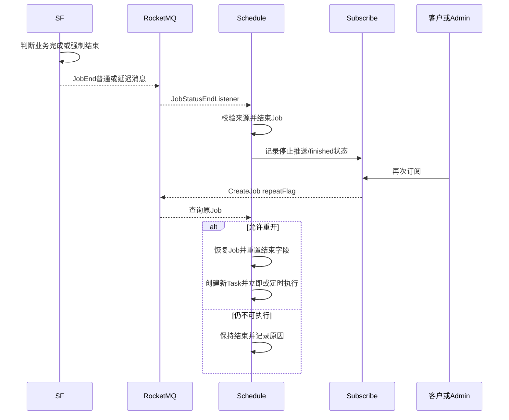

# 01-09 JobEnd、停止推送、任务重开与再订阅

## 1. 功能背景与解决的问题

物流追踪不能永久轮询。货物到达终态、超过最大调度天数、专项业务完成或计费退款时，需要结束 Job，并通知订阅中心停止后续推送。但客户可能随后重新订阅，Web 也可能要求恢复已结束任务。因此“结束”不是删除，而是一个可审计、可重开的生命周期状态。

## 2. 核心代码位置

- `SendMqMessageImpl#pushEndStatusMessage` 及相关重载：SF 根据船司、港区、NAR 等类型发送普通或延迟 JobEnd。
- `JobEndAndOrderComplete`：结合清洗结果、业务终态和订单状态判断结束条件。
- `JobStatusEndListener#onMessage`：schedule 消费 JobEnd，处理退款来源、更新 Job，并调用 subscribe API。
- `CreateScheduleJobListener`：重复 CreateJob 到达时识别已存在、已结束和 Web 重订阅，必要时重置结束相关时间并创建新 Task。
- subscribe 仓库的 `ship_reSubscribe_job_reopen_design.md`：提供重开设计背景，但实际结论仍以代码为准。

## 3. 完整调用流程

## 4. 核心实现原理

SF 最接近清洗后的业务状态，因此负责产生 JobEnd；schedule 是 Job 状态所有者，因此负责真正关闭；subscribe 是客户关系所有者，因此负责停止推送或标记完成。三者分工避免 SF 直接修改调度表，也避免 schedule 自行解释所有船司终态。

`SendMqMessageImpl` 对部分类型使用延迟 Topic，代码注释和分支用于缓解最后一批数据、推送与结束消息的竞态。schedule 收到消息后根据来源处理，船计划还需修改 `finished`。再订阅不是复用旧 Task，而是由 CreateScheduleJobListener 恢复 Job 状态并创建新执行实例。

## 5. 为什么采用当前方案

结束事件异步化可以让清洗成功先落库和推送，不阻塞清洗线程等待多个服务更新。由 schedule 集中控制 Job，保证暂停、结束、重开使用同一状态模型。保留旧 Job 和 Task 历史，则便于对账和解释重复订阅。

## 6. 关键技术细节

- JobEnd 应携带 jobId、subId、subTableName、来源和结束原因，避免只按单号关闭错误 Job。
- 普通与延迟 Topic 的选择是业务顺序控制，不能在重构时随意合并。
- `isForceEnd`、`forceEndDay` 是调度兜底；业务终态是清洗判断，两者可能竞争。
- 退款来源在 Listener 中有单独分支，说明结束还与计费状态关联。
- Web 重订阅会重置特定时间字段，防止旧终态继续影响新周期。

## 7. 异常、并发与边界场景

JobEnd 可能重复到达，应允许幂等关闭；延迟 JobEnd 到达前发生再订阅时，旧消息可能误关新周期，因此需要事件版本或重开时间校验。subscribe 状态更新失败会出现 Job 已结束但仍显示推送中。最后一次 DataPush 与 JobEnd 乱序可能漏掉终态，单靠固定延迟不能彻底保证。管理员手工重开时还要检查外层融合和子 Job 是否一致恢复。

## 8. 当前问题与优化方向

建议为 Job 增加生命周期版本，并让 JobEnd 携带版本；保存结构化结束原因、触发状态和来源 dataId；使用 outbox 保障关闭 Job 与通知 subscribe 的最终一致；重开创建新生命周期标识，旧延迟消息不得作用于新周期；后台提供“为何结束、何时重开、哪些子 Job 同步变化”的审计视图。

## 9. 关键结论与证据边界

JobEnd 不是删除消息，也不等同于客户取消订阅。它是 SF 判断、schedule 落状态、subscribe 停止客户侧行为的跨服务流程。各船司完整终态集合、线上延迟级别和退款系统最终状态当前代码无法统一确认。

后续可靠性主题从 [RocketMQ Topic、Tag 与消费组隔离](../02-可靠性与平台能力/02-01-RocketMQ-Topic-Tag与消费组隔离.md) 开始。
