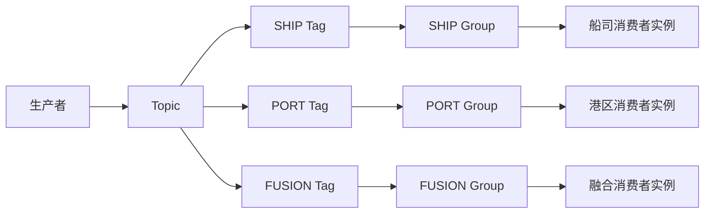

# 02-01 RocketMQ Topic、Tag 与消费组隔离

## 1. 功能背景与解决的问题

物流链路包含创建 Job、采集、清洗、融合、比较、推送和结束等耗时阶段。当前项目用 RocketMQ 解耦这些阶段，但真正决定隔离效果的是 Topic、Tag 和 consumer group 的组合，而不是“用了 MQ”这一事实。Topic 表示事件大类，Tag 表示业务分支，group 决定同一消息由哪些消费者独立获得。

## 2. 核心代码位置与契约

Topic 常量来自公共依赖中的 `QueueConstant`，各仓库以生产和监听注解体现实际关系：

- subscribe 的 `TraceSubscribeApiService#sendCreateJobMessage` 生产 `CreateJob.TOPIC`；schedule 的 `CreateScheduleJobListener` 使用 `CreateJob.GROUP_ID` 消费。
- schedule 的 `sendDataCollectTaskMq`、`sendDataCleanTaskMq` 生产采集和清洗任务；回执由 `DataCollectTaskReplayListener`、`DataCleanTaskReplayListener` 消费。
- SF 的 `SendMqMessageImpl` 生产 `DataMix`、`DataCompare`、`DataPush`、`JobEnd` 和 `SubscribeDownloadReplay`。
- DataMix 的 Normal、Force、Midea Listener 共用 DataMix Topic，但使用不同 Tag 和 group。
- notify 的 Ship、Port、Fusion Listener 共用 DataCompare Topic，`GroupConstant` 为三类构造独立 group。

## 3. 完整调用流程与消息隔离结构

同一 group 内多个实例通常负载均衡消费；不同 group 会分别得到消息。仅换 Tag 不换 group，和换 group 不换 Tag，语义并不相同。

## 4. 为什么采用当前方案

SHIP、PORT、FUSION 的数据量和处理耗时不同，拆 group 可以防止港区积压阻塞船司通知；NORMAL、FORCE、MIDEA 拆分可以让补偿流量和客户定制流量不抢占实时融合线程。Topic 仍保持业务聚合，便于统一监控和环境隔离，避免为每个船司创建大量 Topic。

## 5. 关键技术细节

- 生产端常用 `QueueConstant.generateTopic(topic, tag)`，环境后缀可能由公共组件或配置注入，不能用源码常量猜线上完整名称。
- Listener 的 `selectorExpression` 是实际订阅范围；排查“消息发了但没消费”时，应同时比对 Topic、Tag、group 和环境。
- 首轮清洗、普通清洗可能使用不同 Tag 或 group，用于优先级隔离。
- 延迟 JobEnd 使用独立 Topic 或延迟等级，承担业务顺序控制。
- 消息 DTO 在多个仓库复制，字段新增必须兼容旧消费者。

## 6. 异常、并发与边界场景

错误复用 consumer group 会让本应分别处理的两个服务互相抢消息；Tag 拼写不一致会导致消息长期无人消费；新增 Tag 未部署消费者会形成静默积压。MQ 至少一次投递意味着消费者必须幂等。消费者成功执行业务但确认失败会重复，确认成功但业务异步动作未落地则可能丢后续步骤。

## 7. 当前问题与优化方向

建议生成“Topic—Tag—生产者—消费者—DTO—失败补偿”清单并在 CI 校验；为每条消息增加 schemaVersion、eventId、occurredAt、traceId；对无消费者 Tag、消费延迟和死信建立告警；避免直接复制实体作为消息。当前代码无法确认线上 Topic 后缀、重试次数、死信策略和 Broker 参数。

## 8. 关键结论

排查 MQ 必须以完整四元组“环境、Topic、Tag、group”为单位。只看到发送成功日志不足以证明业务完成，还需检查目标 group 的消费和回执。

## 9. 项目排查清单

以 DataMix 为例，先从 SF `SendMqMessageImpl` 确认生成的是 NORMAL 还是 FORCE Tag，再检查 DataMix 对应 Listener 的 `selectorExpression` 和 group，最后以 `fusionTableId` 查询融合记录。若只有 NORMAL 积压，不应通过扩容 FORCE group 处理；若 SHIP 通知正常但 FUSION 通知积压，应检查 notify 的 FUSION 独立 group，而不是重发清洗任务。

下一篇：[分布式锁、幂等键与相同订阅串行化](./02-02-分布式锁幂等键与相同订阅串行化.md)。
