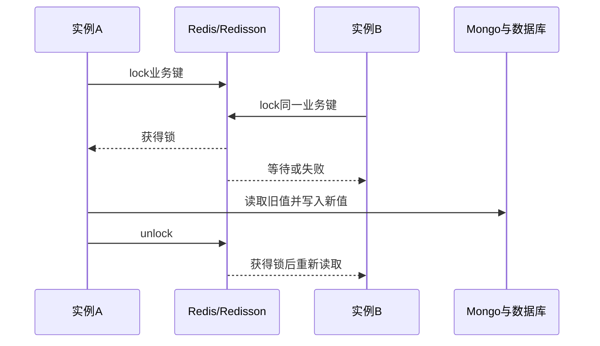

# 02-02 分布式锁、幂等键与相同订阅串行化

## 1. 功能背景与解决的问题

RocketMQ 可能重复投递，同一订阅的船司与港区数据可能同时到达，服务本身也有多个实例。如果两个线程同时读取旧数据、生成结果并回填 dataId，后完成的旧任务可能覆盖新结果。项目在融合、港区清洗和通知比较等热点路径使用 Redisson 锁，但不同场景的锁键和租期并不相同。

## 2. 核心代码位置

- `BaseDataFusionListener`：用 DataMix Topic 和 `fusionTableId` 生成 MD5 锁键，串行同一融合订阅。
- `PortCleanListener`：按港区订阅 subId 加锁，保护港区与船计划联合清洗。
- `DataCompareListener`：以 Topic、carrierCd、subNo、dataId、subId 生成 MD5 锁键，锁定同一比较事件约 15 秒。
- 各服务的 `component/redis/lock/RedissonLock`：封装锁获取和释放。
- `FusionDedupService`：不是互斥锁，而是对强制融合事件做跨实例去重。

## 3. 完整调用流程与并发控制

## 4. 核心实现原理与设计原因

锁键必须匹配聚合根。融合使用 `fusionTableId`，因为船司与港区事件最终修改同一融合记录；通知比较键包含 dataId，允许同一订阅的不同版本分别执行；港区清洗使用 subId，避免同一订阅并发更新。MD5 只用于缩短和规范 Redis Key，不提供业务安全性。

锁解决“同时执行”，幂等解决“先后重复”。如果第一个消费者完成并释放锁，重复消息仍会再次获得锁，所以还需要状态检查、数据变化比较或持久化幂等键。两者不能互相替代。

## 5. 关键技术细节

- `tryLock` 等待时间、租期和是否启用看门狗决定长任务安全性。
- `unlock` 应只由持锁线程执行，并放在 finally 中；异常路径遗漏会造成阻塞。
- 锁键应包含租户或客户边界，除非业务明确允许跨客户共用底层数据。
- 锁内要重新读取数据，不能在锁外读取旧快照后只把写操作放进锁。
- 锁粒度过粗会导致热点单号拖慢全部客户，过细则无法保护同一聚合记录。

## 6. 异常、并发与边界场景

进程在持锁期间崩溃时依赖租期释放；处理超过租期会出现双持有。Redis 故障时，是直接失败还是无锁降级必须明确，写路径通常不应静默降级。旧消息在新消息之后获得锁，仍可能覆盖最新状态，需要事件时间或版本校验。锁等待超时不能直接确认消息已被其他实例成功处理，应进入重试或审计。

## 7. 当前问题与优化方向

建议建立锁注册表，记录业务键、等待时间、租期和保护资源；为关键写入增加数据库版本或 compare-and-set；持久化事件幂等记录；监控锁等待、持有时长和失败率；对长融合使用看门狗并限制锁内外部调用。当前代码能确认锁的使用点，但线上 Redisson 模式、Redis 高可用和全部租期配置无法确认。

## 8. 关键结论

分布式锁是并发串行化手段，不是精确一次保证。排查重复结果时要分别检查锁键是否相同、锁内是否重新读取、消息是否有幂等状态、旧事件是否能覆盖新版本。

下一篇：[MQ 回执、失败重试、补偿与人工重放](./02-03-MQ回执失败重试补偿与人工重放.md)。
