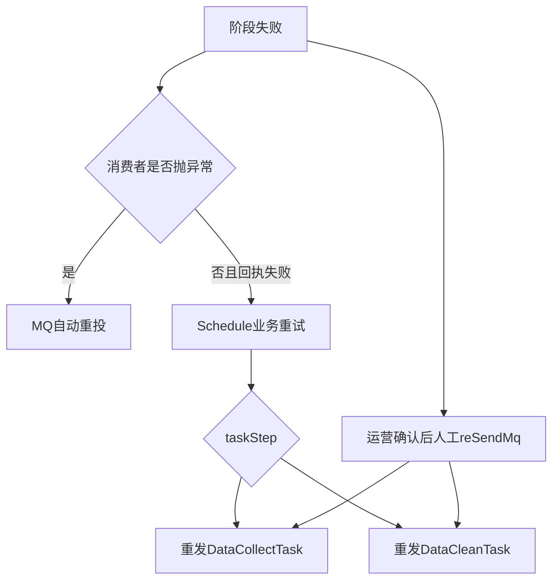

# 02-03 MQ 回执、失败重试、补偿与人工重放

## 1. 功能背景与解决的问题

异步链路把一次订阅拆成多个阶段，但也失去了同步调用天然的返回值。项目通过 `DataCollectTaskReplay`、`DataCleanTaskReplay`、`SubscribeDownloadReplay` 和 `JobEnd` 表达阶段结果；失败后既有 MQ 自动重试，也有 schedule 的业务重试和 admin 人工重放。三类机制作用层次不同，使用不当会造成重复采集、重复通知或状态倒退。

## 2. 核心代码位置

- schedule 的 `DataCollectTaskReplayListener`、`DataCleanTaskReplayListener`：接收阶段回执并更新 Task。
- `ScheduleTaskServiceImpl#retrySendTaskMq`：根据 `taskStep` 重新发送采集或清洗。
- `DataCollectTaskReplayListener` 下的 NAT 等专项实现：处理特殊业务回执。
- SF 的 `DataProcessing#sendSuccessCleanReplay` 和 `SendMqMessageImpl#sendReplayMq`：发送清洗回执。
- admin 的 `TraceAdminController#reSendMq`、`ScheduleJobAdminServiceImpl`：人工触发 schedule 重发。

## 3. 完整调用流程与补偿层次

MQ 重投针对“同一消息未成功消费”；业务重试针对“消息已消费但外部采集或清洗结果失败”；人工重放针对自动机制已经停止、状态需要修复或运营明确要求重跑。

## 4. 核心实现原理与设计原因

回执把阶段结果写回状态表，使重试不依赖消费者本地内存。`taskStep` 决定重试起点：采集失败重发采集；已有 rawDataId 的清洗失败只重发清洗，避免重复调用外部渠道。人工入口复用 schedule 的重发能力，而不是 admin 自己组装全部消息，以减少契约分叉。

## 5. 关键技术细节

- 重试前必须读取 Task 最新状态，确认未被后续成功回执修复。
- 重发消息应保留 taskId、业务类型、渠道、原 dataId、首次标记和 traceId。
- 每次尝试应记录 attempt 或消息 ID，否则无法区分同一 Task 的多次执行。
- 错误应区分可重试、不可重试和需换渠道，例如参数非法不应无限重发。
- 人工重放前应确认是否会再次计费、通知或关闭 Job。

## 6. 异常、并发与边界场景

自动重试和人工重放可能同时发生；旧回执可能在新尝试后到达；采集成功但回执丢失时重采会增加第三方成本；清洗成功但 CleanReplay 丢失时再次清洗可能重复发送 DataCompare。MQ 消费成功并不表示下游 HTTP、Mongo 和所有 fan-out 消息都成功，部分失败需要更细粒度状态。

## 7. 当前问题与优化方向

建议对每次尝试建立 `attemptId`，所有回执和下游事件携带该值；用错误分类决定指数退避、换渠道或停止；为部分成功建立 saga/outbox 状态；admin 操作增加预检查、影响预览和审计；把死信、业务失败和人工重放统一展示。线上 Broker 自动重试次数、死信 Topic 和告警规则当前代码无法确认。

## 8. 关键结论

重试不是简单“再发一次”。必须先定位失败阶段、确认最新状态、选择正确起点并评估副作用。人工重放是最后补偿，不应代替缺失的自动一致性机制。

下一篇：[强制融合的 Redis ZSET 去重与漏桶削峰](./02-04-强制融合的Redis-ZSET去重与漏桶削峰.md)。
