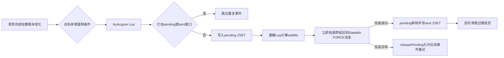

# 02-04 强制融合的 Redis ZSET 去重与漏桶削峰

## 1. 功能背景与解决的问题

普通融合只在清洗结果发生变化时触发，但部分客户或业务要求即使上游未变化，也要周期性重新计算融合结果。若每次清洗都立即发送强制融合，大量重复事件会冲击 DataMix。SF 因此增加 `FusionDedupService` 和 `FusionLeakyBucket`：先对融合 ID 做窗口去重，再由漏桶计算本次 FORCE 消息应延迟多久发送。这里的 ZSET 保存去重状态，不承担后台任务队列职责。

## 2. 核心代码位置与文档

- `TriggerFusionCleanHandler`：变化时发送 NORMAL；未变化时根据白名单、Redis 去重和漏桶决定 FORCE。
- `FusionDedupServiceImpl#tryAcquire/confirmSent/releasePending`：通过 Lua 和 ZSET 维护“处理中、已发送”状态。
- `FusionLeakyBucketImpl#tryEnter`：调用漏桶 Lua 脚本，为当前事件计算 `waitMs`。
- `TriggerFusionCleanHandler`：取得 `waitMs` 后调用 `sendMixDataMqByApiForForce(..., waitMs)` 投递延迟消息，并根据投递结果确认或释放去重状态。
- `FusionDedupCleanJob`：清理过期去重数据。
- `FusionDedupMetricsController`：暴露去重和漏桶指标。
- `iscm-trace-sf/doc/force_fusion.md`：描述 pending/sent ZSET 和漏桶设计；实现结论仍以当前代码为准。

## 3. 完整流程

## 4. 核心实现原理

ZSET 成员以融合业务键表示，score 记录进入状态的时间，供去重窗口判断和过期清理使用。`tryAcquire` 的 Lua 脚本在 Redis 内原子检查 sent、pending 并写入 pending，避免多个实例同时为同一业务键取得发送资格。随后 `FusionLeakyBucketImpl#tryEnter` 通过另一段 Lua 脚本预占漏桶时间槽并返回 `waitMs`。调用线程不会轮询 pending，也不会等待到时间槽后再取任务，而是马上把 `waitMs` 交给 MQ 延迟投递接口。

FORCE 消息成功交给 MQ 后，`confirmSent` 将成员从 pending 移除并写入 sent；投递抛出异常时，`releasePending` 删除 pending，使后续同键事件仍可重新取得资格。`FusionDedupCleanJob` 最终按 score 范围删除超出去重窗口的 pending、sent 成员。

## 5. 为什么采用当前方案

普通 Set 不便按时间范围批量清理，单纯依赖本地缓存又无法在多个 SF 实例之间共享去重结果；ZSET 同时提供唯一成员、时间 score 和范围删除。Lua 把检查与写 pending 合并为单次 Redis 原子操作。漏桶不需要额外常驻消费者，而是把突发流量转换成不同的 MQ 延迟时间，可复用既有 FORCE 消息链路保护 DataMix、Mongo 和下游 API。pending/sent 双状态分别覆盖“本次发送正在处理”和“近期已经发送”。

## 6. 关键技术细节

- `tryAcquire` 原子化的是 Redis 内部的资格判断，不包含外部 MQ 投递；Redis 与 MQ 之间仍不存在分布式事务。
- 成员键必须稳定代表一次融合业务对象，不能只用可能跨订阅重复的箱号；当前键的完整业务维度应结合 `FusionDedupKey` 构造代码核对。
- 漏桶速率决定 `waitMs` 的增长速度，pending/sent TTL 决定异常占用与重复抑制窗口，两者不是同一个参数。
- FORCE 使用独立 Tag/group，不能与 NORMAL 共用积压队列。
- 指标应区分 pending 数、sent 数、漏桶计算出的延迟、投递成功、投递失败和重复抑制数；pending 数不能直接等同于“等待消费的队列长度”。

## 7. 异常、并发与边界场景

多个实例同时处理同一键时由 `tryAcquire` Lua 串行判定资格。MQ 已接受消息但 `confirmSent` 失败时，pending 可能一直保留到过期；反之，如果进程在写 pending 后、投递 MQ 前崩溃，当前代码没有后台任务从 pending 重新取出并补发，只能等待 pending 过期且同键新事件再次触发。因此 pending 是保护状态，不是可靠任务日志。Redis 故障时具体采用放行还是拒绝，需要结合异常处理分支和线上配置确认；当前文档不能仅凭接口名断言。漏桶速率长期低于生产速率时，后续消息的延迟会持续增大，可能超过业务时效或 MQ 支持的延迟范围。

## 8. 当前问题与优化方向

当前资格判断和 pending 写入已经由 Lua 原子完成，后续优化重点应放在跨 Redis/MQ 的可靠性：可引入可恢复的本地消息表或真正的待发送队列，记录 attempt 与最后错误；对“pending 超时但未发现对应 MQ 投递”的情况进行补偿；限制最大 `waitMs`，超过阈值时降级或告警；为 Redis DB、TTL、清理任务和 MQ 最大延迟建立启动校验。当前代码能确认去重、延迟计算和成功/失败状态迁移，但线上参数、Redis 集群故障行为和实际峰值容量未做运行测量，不能声称已达到具体吞吐指标。

## 9. 关键结论

该设计解决的是“未变化事件仍需融合时的重复和峰值”，不是普通 MQ 消费幂等，也不是一套持久化待发送队列。排查强制融合延迟时，应联合查看 pending/sent 状态、漏桶返回延迟、MQ 延迟投递结果和 FORCE group 积压。

下一篇：[Redis、Caffeine 缓存与配置一致性](./02-05-Redis-Caffeine缓存与配置一致性.md)。
