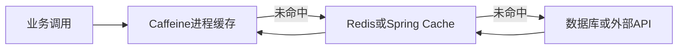

# 02-05 Redis、Caffeine 缓存与配置一致性

## 1. 功能背景与解决的问题

清洗和通知会高频查询船司状态配置、港口标准码、客户规则、用户联系方式和表达式解析结果。每条轨迹都访问数据库或外部 API 会放大延迟。项目同时使用 Redis/Spring Cache 和进程内 Caffeine：Redis 适合多实例共享业务配置，Caffeine 适合解析结果或外部查询的低延迟短期缓存。

## 2. 核心代码位置

- SF `CarrierStatusConfigServiceImpl#queryCarrierStatusInfoConfigByCarrierCd`：`@Cacheable` 缓存船司状态配置。
- SF `RuleChannelMappingStatusServiceImpl`：按渠道和结束类型缓存状态映射。
- subscribe `CustomerConfigDictServiceImpl`：按客户或租户和 configKey 缓存配置。
- SF `VesselPositionTool`、`FiveCodeTool`：Caffeine 缓存船舶位置和港口码映射。
- notify `MicroSvcSfApiProvider`、`CargoBabyApiProvider`：缓存标准港口、用户和联系方式。
- notify/schedule 的 JsonPath、SpEL parser：缓存编译后的表达式。
- schedule `BaseRoleConfigExtendServiceImpl`：缓存角色扩展配置，值使用 `Optional` 表达查无结果。

## 3. 完整调用流程与缓存分层

实际代码并非所有场景都严格两级串联；图表示两类缓存的职责。部分模块只使用 Caffeine，部分只使用 Redis。

## 4. 核心实现原理与设计原因

状态映射和客户配置需要实例间一致，使用 Redis 可让所有实例读取同一缓存并降低数据库压力。JsonPath、SpEL 编译对象和短期外部查询结果无需跨实例共享，Caffeine 避免序列化和网络开销。缓存空结果可防止不存在的港口码或配置反复穿透，但会延迟新配置生效。

## 5. 关键技术细节

- Cache Key 必须包含影响结果的全部参数，例如 carrierCd、channel、endType、customerId、configKey。
- 本地缓存要设置最大容量和过期时间，避免船名、表达式等高基数字段无限增长。
- `Optional.empty` 或 null 缓存需要较短 TTL，并提供主动失效。
- Spring Cache 的默认 TTL 在 bootstrap 中可见，但各缓存是否覆盖 TTL 由运行配置决定。
- 修改状态配置后只清 Redis 不会自动清每个实例的 Caffeine，需广播或版本化。

## 6. 异常、并发与边界场景

缓存击穿会在配置过期时放大数据库流量；旧值会让状态映射持续错误；Key 缺字段会跨客户污染；序列化类变化会导致 Redis 旧值反序列化失败。Caffeine 每实例独立，同一时间可能返回不同版本。Redis 故障时是否回源、失败还是使用旧值，应按配置重要性区分。

## 7. 当前问题与优化方向

建议建立缓存目录，记录 owner、Key、TTL、容量、空值策略和失效入口；配置更新发布版本事件，实例按版本清理本地缓存；监控命中率、加载异常和条目数；对状态映射提供手工刷新和版本查询。不能把缓存命中率高直接表述为业务性能提升，除非有同负载测量。

## 8. 关键结论与证据边界

Redis 解决跨实例共享和分布式协调，Caffeine 解决单实例热点延迟。两者并存的主要风险是失效不同步。线上 TTL、最大容量和命中率受 Nacos 配置及运行数据影响，当前源码无法完整确认。

下一篇：[API 限流、订阅计费与状态边界](./02-06-API限流订阅计费与状态边界.md)。
