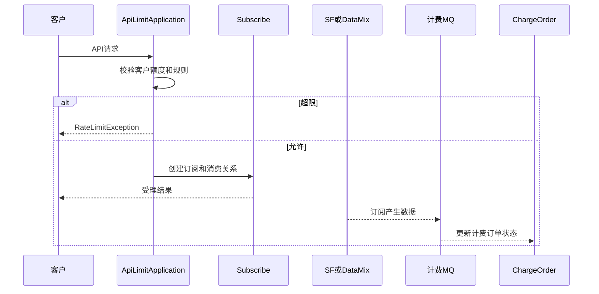

# 02-06 API 限流、订阅计费与状态边界

## 1. 功能背景与解决的问题

物流 API 调用会消耗外部数据资源，客户套餐、按次或按量计费又要求系统知道请求是否被允许、是否真正产生数据、是否应退款。subscribe 中的限流和计费不是 Controller 上的简单注解，而是由 `ApiLimitApplication`、不同业务的 ChargeProgress、计费订单和异步更新消息共同完成。

## 2. 核心代码位置

- `AbstractApiLimitApplication`、`ApiLimitApplication`、`ApiLimitService`、`ApiLimitHandler`：通用额度校验和批量记录骨架。
- `WharfApiLimitApplication`、`FusionDataApiLimitApplication`、`MideaFusionDataApiLimitApplication`、`StationApiLimitApplication`、`NatApiLimitApplication`：专项入口。
- `AbstractApiChargeProgress` 及 Ship、Port、Fusion、Customs、Wharf 等实现：定义业务计费推进。
- `TraceChargerService`：计费、结束和数据消息处理的核心服务。
- `ChargeOrderListener`：消费计费订单消息。
- sf 与 sf-data-mix 发送 `SUB_ID_UPDATE_HAS_DATA` 等计费消息，表示订阅已产生可计费数据。

## 3. 调用流程

## 4. 核心实现原理与设计原因

限流发生在资源消耗之前，计费最终确认则可能发生在清洗或融合产生数据之后。两者分离避免“请求被受理就一定收费”的错误假设。不同业务 ChargeProgress 复用抽象流程，但能够选择按次、按量、按时间或不计费策略。异步消息将清洗主链与计费订单更新解耦，减少数据处理受财务系统延迟影响。

## 5. 关键技术细节

- 限流键需要包含客户、租户、API 类型和计费周期，不能只按 IP。
- 批量 API 应按实际项目数消耗还是按请求次数消耗，由 `ApiLimitAndBatchSaveDTO` 等业务规则决定。
- “有数据”消息必须幂等，否则清洗重试会重复扣费。
- 订阅复用时要区分底层数据复用和新客户消费记录，不能因无新 Job 就跳过客户侧计费关系。
- JobEnd 中存在退款来源分支，说明结束、退款和调度状态可能联动。

## 6. 异常、并发与边界场景

并发请求可能同时通过额度检查，若扣减不是原子操作会超用；计费消息丢失会有数据无订单；重复消息会重复更新；清洗有部分数据是否计费需要专项规则。限流服务不可用时不应默认全部放行。退款成功但 Job 未结束，或 Job 结束但订单未退款，都需要对账。

## 7. 当前问题与优化方向

建议用 Redis Lua 或数据库条件更新原子扣减；为计费事件设置业务幂等号；保存“预占、已用、有数据、退款”状态迁移和原因；建立订阅、dataId、计费订单对账任务；后台人工补偿前显示计费影响。线上套餐规则、价格和最终财务结算不在当前仓库完整范围，当前代码无法确认。

## 8. 关键结论

限流回答“能否受理”，计费回答“最终消耗了什么”，JobEnd 回答“是否继续调度”。三个状态有关联但不能互相替代。

下一篇：[MySQL、Mongo 双存储与历史数据查询](./02-07-MySQL-Mongo双存储与历史数据查询.md)。
