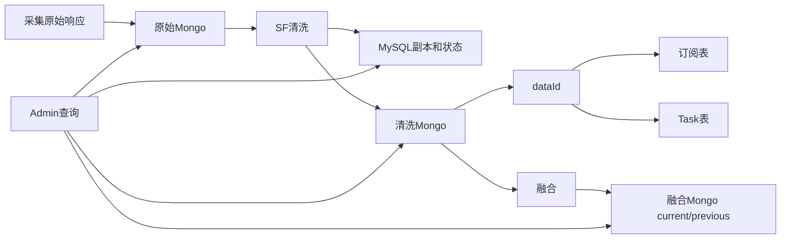

# 02-07 MySQL、Mongo 双存储与历史数据查询

## 1. 功能背景与解决的问题

订阅、Job、Task 和计费订单需要事务更新与多条件筛选，适合 MySQL；船司原始响应、清洗轨迹和融合结果结构层级深、字段随来源变化，适合 Mongo。项目采用“关系库保存状态和索引，Mongo 保存详情，dataId 建立引用”的双存储模式。

## 2. 核心代码位置

- subscribe 的订阅实体和 Mapper：维护客户订阅、消费关系及最新 dataId。
- schedule 的 `ScheduleJob`、`ScheduleTask`：维护长期计划和单次执行状态。
- SF `DataProcessing`：保存关系型副本，并由 `saveShipPortDataToMongo` 保存清洗详情。
- DataMix `FusionHandler#saveToMongo`：写当前融合集合和 previous 集合。
- admin `LogQueryServiceImpl`：按业务类型选择 SF/AF Mongo，并处理月度集合命名。
- admin、schedule、notify 中的 `AfMongoTemplate` 等：区分海运和空运 Mongo 访问。

## 3. 完整调用流程与数据流

## 4. 核心实现原理与设计原因

MySQL 负责确定性状态：任务是否结束、下次调度时间、当前渠道、客户归属。Mongo 负责完整文档：箱列表、节点列表、航段、来源原文。dataId 避免在关系表复制大 JSON，并让 MQ 消息只携带轻量定位信息。current/previous 融合集合支持变化比较和追溯上一版本。

## 5. 关键技术细节

- dataId 引用必须和业务类型、集合规则匹配；仅有 ID 不一定能推导 Mongo collection。
- AF、SF、CUSTOMS、EXPRESS 可能使用不同库和按月集合，后台查询需根据类型和时间路由。
- 关系型副本不是 Mongo 的完整替代，字段不一致时要明确哪个是权威来源。
- Mongo 文档应保留采集时间、清洗时间、source、channel、subId/taskId，支持反向定位。
- previous 数据的保留策略影响 DataCompare 和审计，不能只按存储成本随意删除。

## 6. 异常、并发与边界场景

双写不存在天然事务：一边成功一边失败会产生孤立文档或悬空 dataId；并发任务可能覆盖订阅最新 ID；按月集合跨月查询可能漏数据；Mongo 文档结构演进可能使旧 DTO 反序列化失败。后台直接按 ID 查询时还要防止跨客户越权。

## 7. 当前问题与优化方向

建议建立写入状态和修复任务，定期检查悬空引用；每份文档增加 schemaVersion；集中封装 collection 路由并测试月末边界；为历史数据定义分层保留和归档规则；为 admin 查询增加租户条件和脱敏。线上分片、副本集、索引和写关注级别由运行配置决定，当前代码无法完整确认。

## 8. 关键结论

MySQL 是流程状态索引，Mongo 是详情数据面，dataId 是二者契约。排查“页面无数据”必须分别确认关系记录、dataId、正确 Mongo 库/集合和文档内容。

## 9. 项目排查清单

先在订阅表确认最新 dataId，再到 Task 核对该 ID 来自采集还是清洗；随后按 subTableName、currentChannel、carrierCd 和 collectEndTime 选择集合。SHIP/PORT/CUSTOMS 使用海运 Mongo，AIR/EXPRESS 使用 AF Mongo。若订阅最新 ID 查不到，应继续查历史 Task，判断是新 ID 回填错误、集合路由错误，还是文档已归档，不能直接把 dataId 改回旧值。

下一篇：[SLS 全链路日志、traceId 与监控告警](./02-08-SLS全链路日志traceId与监控告警.md)。
