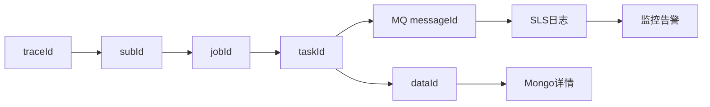

# 02-08 SLS 全链路日志、traceId 与监控告警

## 1. 功能背景与解决的问题

一次订阅跨多个服务和多条 MQ，仅按单号搜索会混入不同客户、不同周期和不同 Task。项目在 Listener 中恢复或生成 traceId，schedule 提供 `SlsTaskService` 查询任务日志，admin 提供采集日志和监控告警查询。可观测性的核心是把 traceId 与 subId、jobId、taskId、dataId、messageId 同时记录。

## 2. 核心代码位置

- `BaseDataFusionListener`、`DataCompareListener`：从消息建立 MDC/trace 上下文。
- schedule `SlsTaskServiceImpl`：按任务信息查询 SLS。
- admin `LogQueryController`、`LogQueryServiceImpl`：采集日志分页和 Mongo 数据查询。
- admin `MonitorAlertLogController`、`MonitorAlertLogServiceImpl`：告警事件、上报和静默状态。
- admin `MonitorAlertBackoffProperties`：告警退避配置。
- `doc/monitor_alert_event_design.md`：告警事件设计背景。

## 3. 完整调用流程与排障链路

## 4. 核心实现原理与设计原因

HTTP 请求中的 traceId 需要在转成 MQ 时写入消息，消费者再放入 MDC，才能跨线程和进程延续。业务 ID 则提供稳定关联：即使 trace 丢失，也可从 Task 找到消息和 dataId。SLS 适合检索大量分布式日志，admin 将常用查询封装为业务接口，降低运营人员直接接触日志平台的门槛。

## 5. 关键技术细节

- 日志应记录结构化字段，避免只在长 JSON 文本中搜索。
- MQ 重试应保留原 traceId，同时增加 attempt 和当前 messageId。
- 对完整原始响应、Token、联系方式和连接串必须脱敏。
- 告警去重键应基于服务、错误类型和业务对象，不能把所有异常合并。
- SLS 查询失败不应改变业务状态；监控系统是旁路能力。

## 6. 异常、并发与边界场景

traceId 在某个生产者未透传会导致链路断裂；异步线程未复制 MDC 会串日志；同一 Task 重试产生多个 messageId，若后台只显示一个会漏掉失败尝试。日志平台延迟不代表业务未执行。告警上报失败、静默 Key 冲突或主机时钟偏差会影响通知频率。

## 7. 当前问题与优化方向

建议定义统一日志字段规范并封装 MQ Header 透传；admin 提供基于任一业务 ID 的链路聚合查询；对每个阶段记录耗时、状态和错误分类；建立日志脱敏测试；告警链接直接跳到对应 Job/Task。当前代码无法确认线上 SLS 索引、保留期、采样率和告警接收人。

## 8. 关键结论

可靠排障应同时使用 traceId 和业务 ID。traceId 解释一次调用，Job/Task/dataId 解释长期业务状态，两者缺一不可。

## 9. 项目排查清单

订阅问题先从 subscribe 请求 traceId 找 CreateJob messageId，再用 subId 查询 schedule_job，以 jobId 获取全部 Task。对目标 Task 分别搜索 DataCollectTask、CollectReplay、DataCleanTask、CleanReplay；清洗成功后再以 dataId 搜索 SF 的 DataCompare、DataMix、DataPush 和 JobEnd。若中间 traceId 断裂，使用 taskId、subId 和 messageId 交叉恢复，并记录具体在哪个生产者丢失 Header。

告警排查还要区分“业务异常日志已产生”“MONITOR_ALERT 已记录”“外部平台已发通知”三个阶段。SLS 有日志但微信未收到，应先看 fingerprint 是否命中静默，而不是重跑业务任务。

日志检索完成后，应把断链服务、缺失字段和首个异常时间回填到问题记录，作为后续修复透传的验收条件。

下一篇：[Nacos 环境配置与敏感配置治理](./02-09-Nacos环境配置与敏感配置治理.md)。
