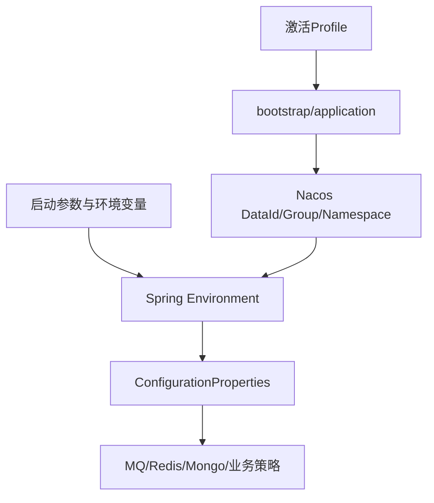

# 02-09 Nacos 环境配置与敏感配置治理

## 1. 功能背景与解决的问题

七个服务的数据库、MQ、Redis、Mongo 和下游地址随开发、预发、生产环境变化。仓库中的 bootstrap/application 文件负责选择 Nacos 环境并提供少量默认值，最终行为由本地文件、profile、配置中心和启动参数叠加决定。配置错误可能导致跨环境消费，比单纯启动失败更危险。

## 2. 核心代码与配置位置

- subscribe、schedule、admin：`trace-*-app/src/main/resources/bootstrap.yml` 和 `bootstrap-{env}.yml`。
- SF：`iscm-trace-sf-app/src/main/resources/bootstrap.yml` 与 `application-{env}.yml`。
- DataMix、Notify：根模块或 notify-service 下的 `bootstrap.yml`、`bootstrap-{env}.yml`。
- `@ConfigurationProperties` 类：例如 `FusionDedupProperties`、`MonitorAlertBackoffProperties`、RedissonProperties，负责把配置转换为类型对象。

## 3. 完整调用流程与配置优先链路

## 4. 核心实现原理与设计原因

本地文件保存应用名、context-path 和配置中心入口，Nacos 集中保存易变的基础设施地址与业务参数。类型化 Properties 比散落的 `@Value` 更容易校验。部分 DataMix/Notify 环境文件注明某些配置放入 Nacos 无法读取，说明 bootstrap 阶段与普通配置加载阶段存在差异，这些键不能未经验证直接迁移。

## 5. 关键技术细节

- 应用名、profile、Nacos namespace/group/dataId 必须组成同一环境。
- 动态刷新只对特定 Bean 和读取方式生效，不能假设所有配置修改都无需重启。
- Topic、数据库和 Redis 必须同时切换，避免开发实例消费生产消息后写开发库。
- 配置应有类型、范围和必填校验，例如漏桶速率不能为负，锁租期不能小于正常处理时长。
- 敏感值不应写入 Git、日志或知识库。

## 6. 已发现风险

当前多个环境文件存在明文敏感连接信息。本文不复制具体值。即使仓库是内部仓库，凭据仍可能进入历史、构建日志和本地索引。应视为已暴露并轮换，而不是仅删除当前文件。另一个风险是各仓库使用 bootstrap/application 命名不完全一致，升级 Spring Cloud 时加载顺序可能变化。

## 7. 异常、边界与优化方向

建议使用密钥管理服务或部署环境变量注入，Nacos 只保存密钥引用；建立脱敏配置样例；CI 执行 secret scan 和必填配置校验；应用启动时打印非敏感配置摘要及环境指纹，检测数据库、MQ、Redis 环境是否一致；配置变更记录版本、操作者和回滚点。当前代码无法确认线上 Nacos ACL、配置加密、发布审批和实际最终值。

## 8. 关键结论

Git 中的 bootstrap 只能证明默认加载方式，不能证明线上配置。任何运行结论都应同时记录 profile、配置版本和环境指纹。

## 9. 上线前核对清单

逐个服务记录 `spring.application.name`、激活 profile、Nacos 地址、namespace/group/dataId、RocketMQ nameserver 环境、Redis DB、MySQL schema 和 Mongo database。然后比较 subscribe 生产 CreateJob 与 schedule 消费所处环境，schedule 生产 DataCleanTask 与 SF 消费环境，以及 SF 生产 DataMix 与 DataMix 消费环境。任一对不一致都应阻止启动。配置摘要只输出主机别名、库名和版本，禁止输出密码、Token、完整连接串或签名密钥。

下一篇：[船司状态映射缓存与热点路径性能优化](./02-10-船司状态映射缓存与热点路径性能优化.md)。
