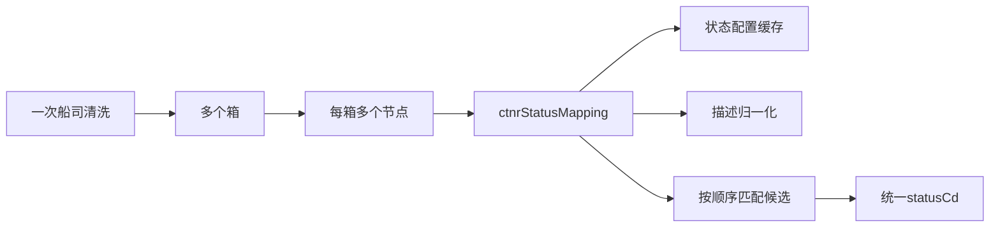

# 02-10 船司状态映射缓存与热点路径性能优化

## 1. 功能背景与解决的问题

清洗每个箱的每个节点都可能执行状态映射。规则通常根据船司原状态、描述、地点和预计/实际标识匹配统一状态。该路径调用次数远高于订阅接口，正则编译、重复空白归一化和反复查询配置会被放大为 CPU 热点。SF 通过 Redis 缓存状态配置，并在 `HeaderMappingImpl#ctnrStatusMapping` 中减少重复计算。

## 2. 核心代码位置

- `CarrierStatusConfigServiceImpl`：按 carrierCd 使用 `@Cacheable` 缓存配置。
- `RuleChannelMappingStatusServiceImpl`：按渠道和结束类型缓存映射规则。
- `HeaderMappingImpl#ctnrStatusMapping`：遍历候选规则，将原始节点映射为统一状态。
- `HandlerDataServiceImpl_SHIP#mappingStatus`：船司清洗调用映射的上层入口。
- 各 `HandlerDataServiceImpl_{CARRIER}`：船司专项补充和纠正规则。

## 3. 热点调用关系

## 4. 核心实现原理与设计原因

当前类存在两个主要重载。两参数 `ctnrStatusMapping(rules, result)` 仍按“规则 × 船名航次 × 箱 × 节点”嵌套遍历，并在内层使用多次 `replaceAll`；它只对 ONE、SML、KKC、DJS 提前转入 `commonStatusMapping`。四参数 `ctnrStatusMapping(rules, result, isEquals, ignoreCase)` 则先展开 `<vessel/voyage>`、归一化规则描述并汇总为 `mappingSet`，再遍历箱节点，减少规则文本在最内层反复转换。优化实际发生在四参数重载，不能反写成两参数方法已经完成优化。

同时，四参数实现使用 `HashSet`/`Collectors.toSet()` 保存候选，并在不含占位符的分支直接修改传入规则对象的 `statusDesc`。这虽然减少重复计算，却引入了顺序和共享对象副作用风险；当前代码也没有使用预编译空白 `Pattern`，因此只能描述为“把部分归一化移出内层循环”，不能声称已经消除了正则编译成本。

## 5. 关键技术细节

- 两个重载都使用 `String.replaceAll`；四参数重载只是降低调用次数，并未预编译 Pattern。
- `statusDesc=null`、规则配置为空、多个候选同时命中是关键回归边界。
- 缓存 Key 必须包含 carrierCd 及影响规则的渠道/结束类型。
- 专项船司处理可能在通用映射前后补充节点，优化通用方法不能推断专项分支都受益。
- 四参数重载的 `mappingSet` 无稳定遍历顺序，而且 `resetStatusCd` 命中后只从方法返回、不会终止外层候选循环；多个规则命中时最终状态可能受 Set 遍历顺序影响。
- 四参数重载会原地改写部分 `RuleChannelMappingStatus`，如果缓存返回对象被多个线程共享，需验证是否存在并发可见性或二次调用语义变化。
- 性能结论需要同一数据量、JVM、预热和 profiler 对比。

## 6. 异常、并发与边界场景

缓存旧配置会持续产生错误状态；四参数方法把规则放入无序 Set 后，多个候选同时命中可能得到不稳定的最终状态；归一化方式变化可能让原本不匹配的描述命中。两个重载对空规则或空结果都直接返回，不能写成“当前实现会抛错”。`baseInfo.getCarrierCd()` 前没有显式判空，若 `linerTracking` 缺失可能产生空指针。高并发首次加载还可能击穿缓存。单个样本清洗正确不能证明全部状态映射有效。

## 7. 当前问题与优化方向

建议把规则加载后预编译为有序、不可变候选对象，使用预编译 Pattern 或等价字符扫描完成归一化，配置版本变化时整体替换；禁止修改缓存返回的规则实体；明确“首个命中”或“最后命中”的业务语义并用 List 保序；建立覆盖冲突、null、重复调用和特殊船司的黄金样本；使用 JMH 或固定回放量测量，监控映射未命中率和每万节点 CPU。当前代码只能证明四参数重载减少了部分循环内归一化，生产回放和可比 profiler 复测未完成，因此不能声称取得具体百分比收益。

## 8. 关键结论与证据边界

状态映射优化必须同时守住“规则顺序、空值语义、专项船司边界和实际测量”四条线。只减少代码行数或看到缓存注解，不足以证明性能和正确性提升。

后续运营主题从 [Admin 登录鉴权、动态菜单与真实安全边界](../03-运营后台与问题排查/03-01-Admin登录鉴权动态菜单与真实安全边界.md) 开始。
