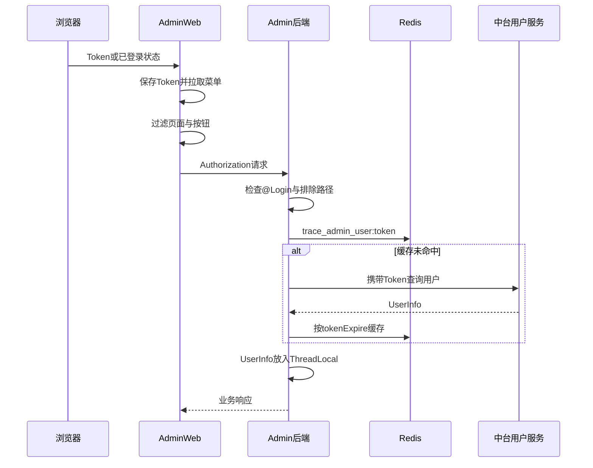

# 03-01 Admin 登录鉴权、动态菜单与真实安全边界

## 1. 功能背景与解决的问题

运营后台可以重订阅、重推、查询 Mongo 原始数据和修改调度配置，权限风险高。当前鉴权由前端 Token 管理、动态菜单和后端 `LoginInterceptor` 共同组成，但只有后端校验能够构成真实安全边界。隐藏菜单或按钮只能改善体验，不能阻止直接调用接口。

## 2. 核心代码位置

- admin-web `src/pinia/module/user.ts`：Token 写入 Pinia 与 localStorage，退出时清理。
- `src/utils/http.ts`：请求拦截器将 Token 放入 `Authorization`，响应异常触发退出逻辑。
- `src/router/Interceptor/index.ts`：处理 URL Token、登录状态和动态路由加载。
- `src/pinia/module/piniaRouter.ts`：按中台菜单 `permissionCode` 过滤路由和按钮。
- admin `component/interceptor/LoginInterceptor#preHandle`：读取 `Authorization`，查询 Redis 用户缓存；未命中时调用中台用户信息接口，并将 UserInfo 放入 ThreadLocal。
- `component/config/WebConfig`：注册全局拦截器及排除路径。
- `@Login(false)`：方法级免登录标记。

## 3. 完整流程

## 4. 核心实现原理与设计原因

Token 的真实性由中台用户服务确认，admin 只做缓存，避免每个请求都跨服务查询。ThreadLocal 让 Service 获取当前用户和审计信息。动态菜单来自中台权限，前端据此注册路由和按钮，减少无权限功能暴露。

## 5. 关键技术细节与真实边界

`WebConfig` 排除了 `/redisOps/**`、`/mongoQuery/**`、`/api/shipSub/**` 等路径；代码中还有多个 `@Login(false)` Controller，包括监控、规则、重推或同步相关入口。它们是否由网关、内网或签名提供额外保护，当前代码无法确认。若没有外层保护，这些接口可能绕过后端登录校验。

前端 Token 存 localStorage，受到 XSS 风险；URL query Token 需要尽快从地址栏清除，避免进入日志和 Referer。Redis 缓存失效后会回源中台，Token 吊销能否立即生效取决于 TTL 和中台响应。

## 6. 异常、并发与边界场景

缓存中用户权限变化不会立即反映；ThreadLocal 未在请求结束清理可能串用户；中台不可用且缓存过期会导致所有请求失败；前端菜单已隐藏但后端接口未鉴权会被直接调用。`localStorage.clear()` 还可能删除同域其他应用数据。

## 7. 当前问题与优化方向

建议对所有 Controller 生成鉴权清单，逐个解释免登录原因；高风险操作增加后端权限码和审计，不仅校验是否登录；缩小拦截器排除路径；Token 改用更安全的同站 Cookie 或强化 CSP/XSS 防护；缓存记录权限版本并支持主动失效；ThreadLocal 在 afterCompletion 清理。正式安全结论还需检查网关和部署网络。

## 8. 关键结论

页面能否看到按钮不是授权证据。后端拦截器、方法注解、网关策略和业务权限校验共同决定安全边界，其中后两项在当前代码范围内不能完全确认。

下一篇：[订阅、Job、Task 与 Mongo 数据查询](./03-02-订阅JobTask与Mongo数据查询.md)。
