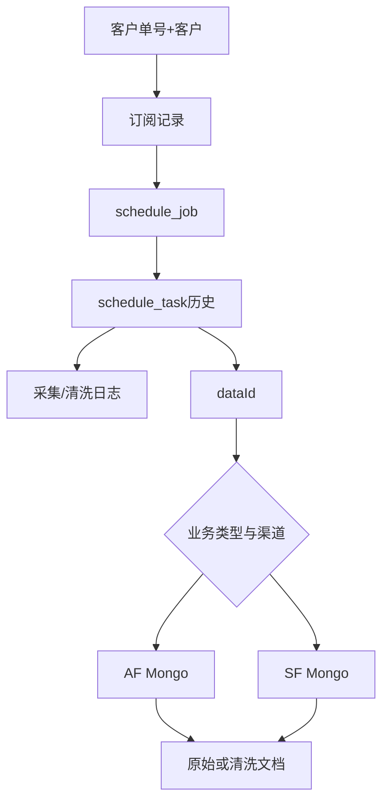

# 03-02 订阅、Job、Task 与 Mongo 数据查询

## 1. 功能背景与解决的问题

运营人员需要从客户单号追到订阅、Job、Task、采集日志和 Mongo 详情。任何单一页面都不足以证明链路成功：订阅存在可能没有 Job，Job 运行可能最近 Task 失败，Task 成功可能引用错误 Mongo 集合。admin 通过业务列表、`LogQueryController` 和多 MongoTemplate 提供跨层查询。

## 2. 核心代码位置

- `ScheduleJobAdminController`：Job 相关操作入口。
- 各 Ship/Port/Fusion/Express/Customs 订阅 Controller 和 Service：按类型查询订阅记录。
- `LogQueryController#/api/log/collect-log/page`：采集日志分页。
- `LogQueryController#/api/log/mongo-data`：按 dataId 查询原始 Mongo。
- `LogQueryServiceImpl#buildCollectionName`：根据 AIR、SHIP、PORT、EXPRESS、CUSTOMS 构造集合名。
- `LogQueryServiceImpl#queryRawMongoData`：AIR/EXPRESS 使用 `AfMongoTemplate`，其他使用海运 MongoTemplate，并兼容字符串或 Long ID。

## 3. 完整调用流程与查询顺序

## 4. 核心实现原理与设计原因

后台先使用 MySQL 的结构化字段分页过滤，再按具体 dataId 查询 Mongo，避免对大文档集合做模糊扫描。collection 不是固定值：EXPRESS 使用 `ODS_EXPRESS_TRACK_17_API_` 加 carrierCd；CUSTOMS 使用前缀、carrierCd 和采集结束年月；AIR/EXPRESS 切到 AF Mongo。类型路由错误会表现为“dataId 存在但查询无数据”。

## 5. 关键技术细节

- 查询订阅必须同时带客户和 subTableName，避免同单号跨客户混淆。
- Job 要查看当前状态、渠道、数据源、nextScheduleTime 和 lastTask 摘要。
- Task 要查看完整历史，区分 collect/clean、attempt、错误和 dataId。
- CUSTOMS 月集合依赖 `collectEndTime`，跨月排查要检查事件实际月份。
- Mongo dataId 有字符串和 Long 兼容分支，类型转换失败不应被解释为无数据。

## 6. 异常、权限与边界场景

数据归档、集合改名、跨月、渠道切换都会造成默认集合查询失败。后台直接返回原始文档可能包含敏感信息，应按租户鉴权和脱敏。查询接口支持的类型在代码中限定为 AIR/SHIP/PORT/EXPRESS/CUSTOMS，新业务未接入会抛参数异常，而不是自动可查。

## 7. 当前问题与优化方向

建议提供统一链路查询页，一次展示订阅、Job、Task、消息和 dataId；collection 路由集中到共享组件并显示最终库/集合；查询记录审计并限制导出；跨月自动尝试相邻集合但限制范围；对悬空 dataId 给出明确错误。线上 Mongo 索引和数据保留期当前无法确认。

## 8. 关键结论

正确排障顺序是“业务记录→执行状态→阶段日志→正确 Mongo 路由”，不是拿单号在所有集合盲搜。

## 9. 页面查询示例

以 CUSTOMS 为例：先在海关订阅列表取得 subId，再查同 subTableName 的 Job；展开最近 Task，记录 currentChannel、carrierCd、collectEndTime 和 dataId；后台 `/api/log/mongo-data` 会用 carrierCd 与 `yyyyMM` 构造集合。若查不到，再检查 dataId 是否属于前一条 Task 或跨月任务。EXPRESS 流程相同，但集合不带月份且必须走 AF Mongo，这两种路由不能互相回退。

查询结果用于诊断，不应在页面直接编辑 Mongo 文档。需要修复时应通过明确补偿命令重新生成数据，并保留旧文档作为审计证据。

导出前还应核对租户范围和字段脱敏，避免运营查询能力演变为跨客户数据下载入口。

下一篇：[reSub 重订阅完整调用链与风险控制](./03-03-reSub重订阅完整调用链与风险控制.md)。
