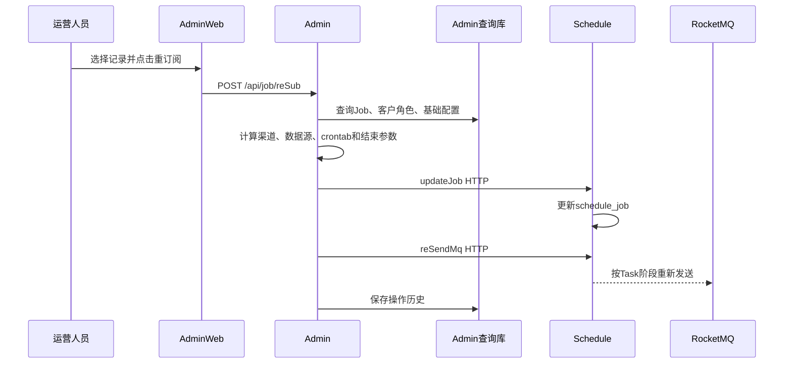

# 03-03 reSub 重订阅完整调用链与风险控制

## 1. 功能背景与解决的问题

Job 因外部故障、错误渠道、结束状态或历史配置可能停止执行。运营人员需要在不重新创建客户业务订阅的情况下恢复调度。admin 的 `reSub` 会查询目标 Job、客户角色和基础配置，重新确定调度参数，调用 schedule 更新 Job，并重发对应任务。该操作会产生真实外部采集、计费和通知副作用，不能当作普通“刷新”。

## 2. 核心代码位置

- `ScheduleJobAdminController#/api/job/reSub`：带 `@Login` 的入口。
- `ScheduleJobAdminServiceImpl#reSub`：解析表名、记录和业务参数。
- `updateScheduleJobAndSendMqAndSaveHistoryRecord`：批量更新、发送和保存操作历史。
- `updateScheduleJob`：通过 `schedule.updateJobUrl` 调用 schedule 的 `updateJob`。
- `sendMq`：把同一 URL 的 `updateJob` 替换为 `reSendMq`，调用 schedule 重发。
- schedule `TraceAdminController#updateJob`、`#reSendMq`：实际执行端。

## 3. 完整流程

## 4. 核心实现原理与设计原因

admin 负责“运营决策和参数准备”，schedule 负责“状态落库和消息发送”。这样 admin 不直接写 schedule 表，schedule 可以保留业务校验。重订阅复用原 Job 关系，避免创建重复订阅；重新读取角色和配置，则能让恢复任务使用当前资源策略。

## 5. 关键技术细节

- 必须先确认目标 Job、subId、subTableName 和 customerId 唯一对应。
- 更新 Job 成功后再重发；若 HTTP 200 携带业务失败码，也不能视为成功。
- URL 字符串替换生成 reSendMq 可工作，但配置路径变化时脆弱。
- 重发应依据当前 taskStep 和 dataId 选择采集或清洗。
- 操作历史要记录旧值、新值、操作者、原因、响应和消息 ID。

## 6. 异常、并发与边界场景

updateJob 成功、reSendMq 失败会形成配置已变但未执行；重发成功、历史保存失败会失去审计。自动调度与 reSub 同时发生可能创建重复 Task。HTTP 上游可能返回 HTML 403，若按 JSON 解析会出现误导性异常；应先保留状态码和原始响应。融合订阅需要考虑外层和子 Job 是否一起恢复。

## 7. 当前问题与优化方向

建议把更新与重发设计为 schedule 内部一个带 operationId 的幂等命令；admin 先展示影响预览和计费/通知风险；执行后轮询 operationId 验证 Job、Task 和消息；禁止仅靠 URL replace 推导接口；增加并发锁和重复点击防护；提供一键回滚到旧渠道/配置，但不删除已产生 Task。

## 8. 关键结论与证据边界

reSub 是跨服务有副作用操作，成功标准不是 admin 返回成功，而是 schedule Job 更新、目标 Task 创建/重发并能收到后续回执。外部采集最终结果仍需继续验证。

## 9. 操作前后检查清单

执行前保存 Job 的 currentChannel、currentCode、crontabId、jobStatus、lastTaskId 和 nextScheduleTime，确认没有自动 Task 正在执行，并判断是否涉及融合子 Job。执行后先核对 schedule 的 updateJob 业务响应，再确认 reSendMq 返回和新 messageId；随后检查新 Task 的配置快照、采集回执和清洗回执。若任一步失败，使用同一 operationId 补偿，不能再次无条件点击 reSub。

下一篇：[reSendMq、rePush 与人工任务补偿](./03-04-reSendMq-rePush与人工任务补偿.md)。
