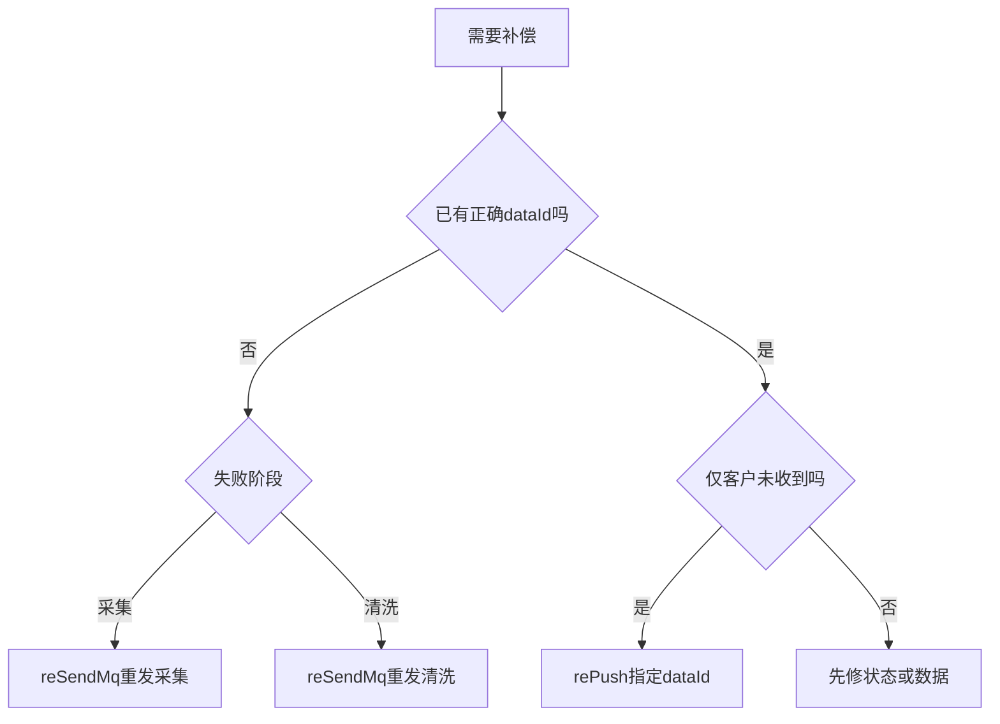

# 03-04 reSendMq、rePush 与人工任务补偿

## 1. 功能背景与解决的问题

`reSendMq` 和 `rePush` 名称相似，但补偿层次不同：reSendMq 让 schedule 重发采集或清洗任务，可能重新产生数据；rePush 使用已有 dataId 重新构造 DataPush，只补客户推送。选错操作会增加第三方调用、重复清洗、重复计费或推送错误版本。

## 2. 核心代码位置

- admin `ScheduleJobAdminServiceImpl#postScheduleSendMq`：调用 schedule `/reSendMq`。
- schedule `TraceAdminController#reSendMq`：根据 Task 重发对应 MQ。
- admin `RePushController`：重推入口，当前存在 `@Login(false)`，真实外层保护需核实。
- `RePushServiceImpl#sendDataPushMessageAndSaveHistoryRecord`：按 SHIP、PORT、WHARF、EXPRESS、CUSTOMS、AIR、TERMINAL、FUSION、STATION 构造消息。
- `RePushServiceImpl`：发送 `QueueConstant.DataPush.NORMAL_TOPIC`，Tag 为 subTableName，记录 messageId 和历史。
- AIR 和 TERMINAL 分支会先从 Mongo 读取详情再构造消息。

## 3. 完整调用流程与操作选择

## 4. 核心实现原理与设计原因

reSendMq 复用 schedule 的阶段判断，避免 admin 自己决定 Topic/Tag。rePush 根据订阅类型使用工厂式静态方法构造统一 DataPushMessageDTO，并异步发送，适合已有正确结果但下游推送失败。保存历史和 messageId 使运营操作可追踪。

## 5. 关键技术细节

- rePush 必须明确 dataId，不能无条件取订阅最新值重放历史事件。
- Tag 必须与实际 DataPush 消费者订阅一致；当前仓库未包含通用消费者。
- AIR、EXPRESS 使用 AF Mongo，海运类型使用 SF Mongo，构造前要确认集合。
- GlobalThreadPool 异步执行意味着接口受理成功不等于每条推送成功。
- 重推应保留客户、回调地址、签名配置和业务类型，但不得暴露敏感信息到日志。

## 6. 异常、并发与边界场景

重复点击会产生多个 DataPush；dataId 已归档会构造失败；部分列表异步成功、部分失败时需要逐条结果。reSendMq 与自动重试并发会重复 Task。DataPush 发送成功只证明进入 Broker，最终 HTTP 是否送达当前代码无法确认。免登录 rePush 入口若无网关保护属于高风险。

## 7. 当前问题与优化方向

建议统一补偿中心，先诊断阶段再开放对应按钮；每次操作生成 operationId，逐条展示 accepted、sent、consumed、delivered；增加幂等窗口和二次确认；高风险接口强制后端权限码；重推支持 dry-run 展示数据版本和目标客户；不要用异步线程池隐藏最终失败。

## 8. 关键结论

无正确数据用 reSendMq，有正确数据但推送失败用 rePush。两者都需要验证下游结果，而不是把“请求已受理”当成完成。

## 9. 补偿判断示例

若 Task 停在 `data_collect` 且没有 rawDataId，应重发采集；若已有 rawDataId、cleanErrorMsg 非空，应只重发清洗；若清洗 Mongo 和订阅 dataId 都正确，但客户回调缺失，才使用 rePush。融合数据重推应选择融合 dataId，不能拿船司子订阅 dataId 构造 FUSION 消息。每次操作前还要查询最近自动重试时间，避免人工操作与正在执行的重试重叠。

重推后至少保留 DataPush messageId、目标 subTableName、dataId 和操作人。由于最终消费者缺失于当前代码范围，必须到外部投递系统继续确认 HTTP 状态和业务响应。

下一篇：[数据源、渠道切换与 Crontab 重新计算](./03-05-数据源渠道切换与Crontab重新计算.md)。
