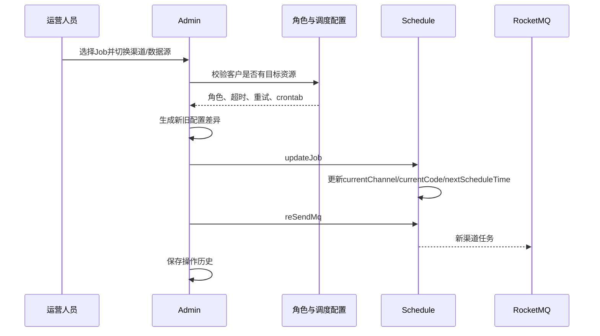

# 03-05 数据源、渠道切换与 Crontab 重新计算

## 1. 功能背景与解决的问题

同一船司或港区可能有 ONE_DATA、第三方 API、代理等多个采集渠道。某渠道故障或客户资源策略变化时，运营后台允许修改 `currentCode` 或 `currentChannel`。但渠道变化不仅是一个字符串：它会影响采集 Topic/Tag、Mongo 集合、超时、重试、角色授权和调度周期，因此需要同步重新计算 Job 并创建新的执行尝试。

## 2. 核心代码位置

- `ScheduleJobAdminController#/api/job/updateDataSource`、`updateChannel`：带登录校验的操作入口。
- `ScheduleJobAdminServiceImpl#updateDataSource`、`#updateChannel`：查询目标 Job 并准备新配置。
- `#updateScheduleJobAndSendMqAndSaveHistoryRecord`：批量应用更新、通知 schedule、重发并保存历史。
- `BaseRoleConfig`、`CustomerRole`、调度规则相关 Service：提供客户资源和渠道可用性。
- schedule 的 Job 更新与 Task 发送逻辑：使用更新后的渠道、数据源和 crontab。

## 3. 完整流程

## 4. 核心实现原理与设计原因

admin 不直接改 schedule 表，而是把变更后的 Job 发送给 schedule。调度中心仍是执行状态所有者，并负责根据 Task 阶段发送正确消息。切换时重新读取角色配置，是为了避免运营选择客户无权或已停用的资源。保存历史使问题发生后可追查旧渠道。

## 5. 关键技术细节

- `currentChannel` 表示采集通道，`currentCode` 更接近当前数据源编码，两者不能混用。
- 新 Task 应保存切换后的快照，旧 Task 保留原值，便于区分回执来源。
- crontab 外键变化后必须重新计算 `nextScheduleTime`，不能沿用旧周期。
- 渠道决定原始 Mongo collection，旧回执到达时应按 Task 快照读取，而非 Job 最新渠道。
- 切换可能改变计费和限流资源，需要预先展示影响。

## 6. 异常、并发与边界场景

自动调度正在创建 Task 时切换，会产生新旧渠道并行；旧渠道回执晚到可能覆盖最新 dataId；更新成功但重发失败会让 Job 指向新渠道却没有新任务。全链路订阅可能需要只切某个子 Job，错误地批量切换会影响融合。目标渠道无对应清洗路由时，采集成功也会在 SF 失败。

## 7. 当前问题与优化方向

建议把切换建模为带版本的命令，schedule 原子更新并创建新 Task；旧版本回执只更新自身 Task，不更新最新水位；后台提供兼容性校验，确认采集消费者、清洗路由和 Mongo 集合均存在；记录切换原因、影响范围和回滚入口；对批量操作限速。线上实际资源授权和 crontab 配置当前无法从源码确认。

## 8. 关键结论

渠道切换是一项执行策略迁移，不是字段编辑。验收应确认 Job 配置、nextScheduleTime、新 Task 快照、正确 Topic/Tag、正确 Mongo 集合和回执。

## 9. 切换验证清单

切换前确认客户角色包含目标渠道，并列出该渠道对应的采集消费者、SF 清洗分支和 Mongo collection。切换后比较 Job 新旧 crontab，验证 nextScheduleTime 是否按新规则重新计算；立即触发的 Task 必须携带新 channel/code，而旧 Task 和旧回执仍保留原快照。若新渠道采集成功但 SF 找不到处理器，应回滚 Job 配置，不得反复重发造成数据堆积。

下一篇：[常见异常的端到端定位方法](./03-06-常见异常的端到端定位方法.md)。
