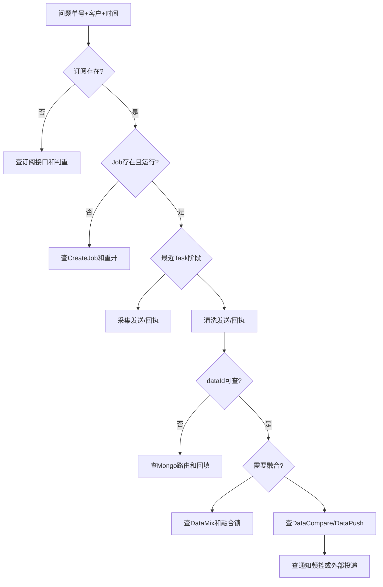

# 03-06 常见异常的端到端定位方法

## 1. 功能背景与解决的问题

物流可视故障常表现为“没数据”“没更新”“没推送”，但根因可能发生在订阅判重、Job 未创建、采集积压、清洗失败、dataId 回填、融合锁、通知频控或外部推送。有效排障必须按状态和证据逐段缩小范围，不能直接重订阅覆盖现场。

## 2. 核心代码位置与统一定位主线

开始前记录 customerId、subTableName、subId、jobId、taskId、dataId、traceId 和时间范围。缺少客户和时间的单号检索容易命中历史记录。

## 3. 完整调用流程：典型故障路径

### 3.1 订阅成功但没有 Job

检查 subscribe 是否把记录分类为 exist/new，`sendCreateJobMessage` 是否发送，CreateJob Topic/Tag 和 schedule group 是否一致，再看 `CreateScheduleJobListener` 是否因已有 Job、结束状态或配置缺失跳过。

### 3.2 Job 正常但没有新数据

检查 `nextScheduleTime`、最近 Task、taskStep 和渠道。无采集回执时查 DataCollectTask 消费者及外部源；采集成功无清洗时确认 rawDataId 和 DataCleanTask；清洗失败时定位 SF Listener、处理器和 Mongo collection。

### 3.3 有清洗数据但页面或客户未更新

检查订阅 dataId 是否回填、DataCompare/DataMix/DataPush 是否发送。页面通知还需检查规则和频控；融合需检查 fusionTableId 锁和来源水位；API 推送的实际消费者不在本次仓库范围。

### 3.4 HTTP 解析异常

`Unexpected character '<'` 常意味着上游返回 HTML 错误页，例如 403，而代码按 JSON 解析。应先记录 HTTP status、content-type 和脱敏 body，再判断鉴权、网关或业务错误，不能只修 JSON 解析器。

## 4. 为什么采用分段排查与关键技术细节

每段都有持久化证据：订阅、Job、Task、Mongo、消息和通知记录。先找最后一个已成功阶段，可以避免重跑已经正确的外部采集，也能保留故障现场。跨服务日志只是辅助，状态表和 dataId 更适合验证最终落地。

## 5. 异常与边界场景

MQ 重试会产生多条相似日志；Job 摘要可能已被后续 Task 覆盖；跨月 CUSTOMS 集合可能查错；旧回执可能晚到；HTTP 200 也可能携带业务失败码。排查必须区分“请求受理、消息发送、消息消费、状态更新、最终外部交付”五种成功。

## 6. 当前问题与优化方向

建议在 admin 建立链路诊断 API，按任一 ID 聚合阶段状态；为错误分类提供机器可读 code；所有外部 HTTP 保留 status/content-type/脱敏 body；MQ 显示生产和消费 messageId；形成只读诊断与有副作用补偿的权限隔离。不要在原因未明时直接 reSub/rePush。

## 7. 关键结论

最短排障路径是找到“最后一个有证据的成功阶段”和“第一个缺证据的阶段”。任何补偿操作都应在定位后执行，并再次沿后续阶段验证。

下一篇：[监控告警、静默窗口与重复告警抑制](./03-07-监控告警静默窗口与重复告警抑制.md)。
