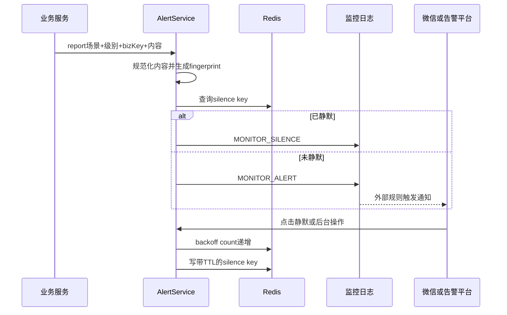

# 03-07 监控告警、静默窗口与重复告警抑制

## 1. 功能背景与解决的问题

采集渠道故障可能每分钟影响大量 Task。如果每个失败都推送微信，会淹没真正需要处理的异常。admin 的监控告警模块以 sceneCode、level、bizKey 和业务内容生成 fingerprint，先判断是否处于静默，再记录 `MONITOR_ALERT` 或 `MONITOR_SILENCE`；重复静默会按配置增加持续时间。

## 2. 核心代码位置

- `MonitorAlertLogController`：`/report`、`/silence`、`/silence/cancel`、`/silence/status`、`/silence/list`、`/silence/wechat`。
- `MonitorAlertLogServiceImpl#report`：生成 fingerprint、查询静默并构建告警消息。
- `#silence`：使用 Redis `incrBy` 增加 backoff count，计算静默分钟并保存静默 Key。
- `#findEffectiveSilence`：先查具体 level，再查 ALL level。
- `#buildFingerprint`：对业务内容排序后生成稳定指纹。
- `MonitorAlertBackoffProperties`：退避时长列表、计数 TTL，默认计数 TTL 为 24 小时。

## 3. 完整流程

## 4. 核心实现原理与设计原因

fingerprint 将同一类异常聚合，Redis TTL 实现跨实例共享静默。退避次数单独保存，连续点击静默时从配置时长列表取更长窗口；超过列表后使用最后一档。日志仍记录被静默事件，避免“没有通知”等于“没有发生”。微信静默链接可使用 HMAC 签名，防止任意构造请求。

## 5. 关键技术细节

- 业务内容使用有序 Map 生成 fingerprint，避免 JSON Key 顺序导致同一异常产生不同指纹。
- Key 包含 scene、level、fingerprint；ALL level 提供场景级静默。
- 静默索引集合用于列表查询，TTL Key 过期后需要处理索引残留。
- 告警内容要清洗换行、敏感字段和超长文本。
- 签名 secret 为空时的行为和 `/silence/wechat` 鉴权边界需要安全审查。

## 6. 异常、并发与边界场景

Redis 不可用会导致重复告警或静默失败；fingerprint 太粗会压掉不同故障，太细则无法聚合。多个操作者并发静默会快速增加 backoff。静默只抑制通知，不应改变业务重试和状态。主机时钟偏差会影响 TTL 展示。`@Login(false)` 或拦截排除下的告警接口是否由内网、签名保护，当前代码无法完全确认。

## 7. 当前问题与优化方向

建议为 report 接口增加服务身份鉴权；签名配置设为必填并限制链接有效期；清理过期静默索引；展示原始次数、最近事件和静默操作者；区分自动抑制和人工静默；对 Redis 故障采用有限本地去重并明确降级告警。外部日志平台如何把 MONITOR_ALERT 转成微信通知当前代码无法确认。

## 8. 关键结论

静默是通知策略，不是问题解决。它必须保留事件记录、到期恢复通知，并能解释 fingerprint 和退避时长的来源。

## 9. 运维核对清单

收到重复告警时先比较 sceneCode、level、bizKey 和排序后的 bizContent，确认 fingerprint 是否应相同；再查 `monitor:alert:backoff:` 计数和 silence key 的剩余 TTL。若不同异常被同一指纹压制，应增加能区分故障对象的业务字段；若同一异常产生多个指纹，应统一空值、大小写和动态时间字段。取消静默后应发送一条测试 report，确认从 MONITOR_SILENCE 恢复为 MONITOR_ALERT。

专项业务从 [WHARF 码头订阅、调度、清洗、融合与退订](../04-专项业务链路/04-01-WHARF码头订阅调度清洗融合与退订.md) 开始。
