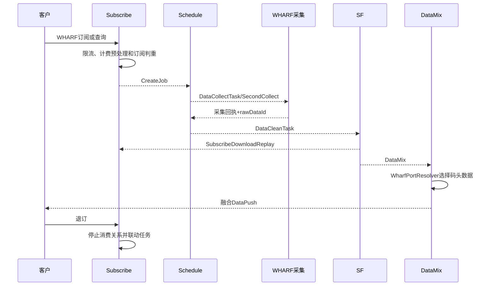

# 04-01 WHARF 码头订阅、调度、清洗、融合与退订

## 1. 功能背景与解决的问题

WHARF 面向东南亚等码头数据，和普通 PORT 的数据源、查询参数及收费方式不同，但结果仍需要进入物流可视订阅、调度、清洗、融合和客户推送主链。仓库内已有查询、收费重构和退订设计文档；当前实现还包含 v1 融合特性开关，说明该链路处于持续演进状态。

## 2. 核心代码与文档

- subscribe `modular/wharf`：WHARF 订阅、查询、限流和退订入口。
- `WharfApiLimitApplication`、`WharfDataApiChargeProgress`：额度和计费推进。
- schedule `TraceWharfSubscribeServiceImpl`、`SfWharfTaskListener`：码头订阅查询和二次采集任务。
- SF `WharfDataProcessingImpl`：清洗回执、DataPush 和 JobEnd。
- DataMix `V1WharfSubscribeHandler`、`WharfPortResolver`、`WharfCombinationV1`：v1 融合的码头订阅选择与组合。
- 设计资料：`wharf_query_api.md`、`wharf_query_charge_refactor_design.md`、`wharf_unsubscribe_design.md`、`v1_wharf_fusion_design.md`。

## 3. 完整流程

## 4. 核心实现原理与设计原因

WHARF 作为独立 subTableName 接入通用 Job/Task，但通过专用清洗器和 Tag 保留数据差异。融合层不直接假设所有港口都有 WHARF 数据，而由 `WharfPortResolver` 和 feature switch 决定是否纳入 v1 结果。独立限流与 ChargeProgress 使资源消耗可按码头接口计算。

## 5. 关键技术细节

- 订阅查询和一次性 API 查询的计费时点可能不同，不能只看 Controller 返回。
- 码头选择需要港口码映射，错误映射会将一个港口的数据并入另一个航段。
- `SfWharfTaskListener` 体现二次采集路径，不能只排查通用 DataCollectTask。
- feature switch 决定 v1 是否启用 WHARF，文档中的方案不代表所有环境均开启。
- 退订应区分客户消费关系和底层可被其他客户复用的 Job。

## 6. 异常、并发与边界场景

码头数据晚于船司数据时，融合可能先输出不含 WHARF 的版本；退订与在途采集并发时，旧回执不应重新激活客户推送；港口码无法解析时应保留可诊断原因。计费成功但无数据、退订成功但 Job 仍被其他客户复用，都不能简单视为系统错误。

## 7. 当前问题与优化方向

建议把 feature switch、码头选择结果和来源 dataId 写入融合审计；退订返回底层 Job 是否继续的解释；为港口码映射建立测试；统一查询与订阅计费事件。现有设计文档需逐项和当前分支验证，线上开关值与外部 WHARF 采集器当前代码无法确认。

## 8. 关键结论

WHARF 是复用通用调度骨架的专项数据源，不是 PORT 的简单别名。排查必须同时看专项 Topic、港口解析、融合开关和退订复用关系。

## 9. 排查与验收清单

从 WHARF 订阅记录取得 subId 和港口码，确认 CreateJob 中 subTableName 没有误写为普通 PORT；在 schedule 同时检查通用采集 Task 和 `SfWharfTaskListener` 负责的 SecondCollect。清洗后核对 WharfDataProcessingImpl 的回执、DataPush 和 JobEnd，再到融合服务查看 `WharfPortResolver` 选中了哪个码头数据、v1 feature switch 是否开启。退订验收还要确认客户消费关系停止，而共享底层 Job 是否因其他客户仍被保留。

下一篇：[CUSTOMS 海关链路与月表、Mongo 路由](./04-02-CUSTOMS海关链路与月表Mongo路由.md)。
