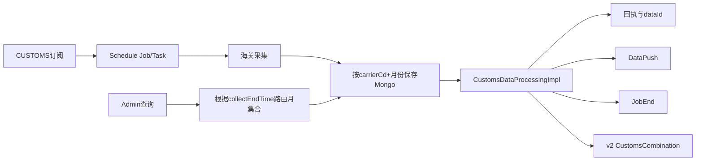

# 04-02 CUSTOMS 海关链路与月表、Mongo 路由

## 1. 功能背景与解决的问题

海关状态是全链路进出口流程的重要补充。CUSTOMS 数据按来源和月份存入动态 Mongo 集合，既需要独立订阅和调度，也可进入 v2 融合。按月集合降低单集合规模，但给跨月查询、重推和 dataId 定位带来额外路由要求。

## 2. 核心代码位置

- subscribe `CustomsDataApiChargeProgress`：海关 API 计费推进。
- schedule `TraceCustomsSubscribeImpl`：海关订阅查询和调度侧模型。
- SF `CustomsDataProcessingImpl`：读取海关原始数据，发送清洗回执、SubscribeDownloadReplay、DataPush 和 JobEnd。
- DataMix `CustomsToFusionConversion`、v2 `CustomsCombination` 及进出口实现：将海关数据并入融合模型。
- admin `TraceCustomsSubscribeServiceImpl`：后台列表。
- admin `LogQueryServiceImpl`：CUSTOMS collection 为 `ODS_SEA_AE_CUSTOMS_TRACE_` + carrierCd + `yyyyMM`。

## 3. 完整流程

## 4. 核心实现原理与设计原因

CUSTOMS 使用专项处理器而非通用船司模板，原因是海关数据状态、集合命名和结束条件不同。admin 从 `collectEndTime` 提取年月构造集合名，AIR/EXPRESS 走 AF Mongo，而 CUSTOMS 走海运 MongoTemplate。融合层通过转换器把专项字段映射到统一进口或出口轨迹。

## 5. 关键技术细节

- collection 路由依赖 carrierCd 和采集结束月份，使用订阅创建月份可能查错。
- 跨月 Task 的 dataId 只能结合 Task 的时间和来源定位。
- DataPush Tag 使用 subTableName，消费者必须订阅 CUSTOMS。
- JobEnd 条件应以海关业务完成为准，不能套用船司到港状态。
- v2 进口和出口组合规则不同，新增字段要回归两个方向。

## 6. 异常、并发与边界场景

月末任务可能在次月完成，采集时间、保存时间和 collectEndTime 不一致会导致路由错误；dataId 字符串/Long 类型差异也会造成假缺失。旧月集合归档后 rePush 无法读取。海关状态晚到时，融合可能已有不含海关的版本，应由新 DataMix 触发更新。

## 7. 当前问题与优化方向

建议把 Mongo database/collection 随 dataId 一起保存，避免反推；后台跨月自动查询有限候选；归档前检查活跃引用；为 CUSTOMS 进出口建立样本；对动态集合创建索引和保留期做自动治理。线上采集来源、索引和归档策略当前无法确认。

## 8. 关键结论

CUSTOMS 排查的关键不是只有 dataId，而是“carrierCd、collectEndTime、Mongo 实例和 collection”。月表路由是功能契约的一部分。

## 9. 跨月排查示例

假设 Task 在 8 月 31 日发送、9 月 1 日采集完成，应优先使用实际 `collectEndTime` 构造 9 月集合，而不是订阅创建时间。若后台无结果，依次检查 Task 保存的 carrierCd、年月格式、海运 MongoTemplate、字符串/Long dataId 查询分支；只在有证据表明采集时间记录异常时，再有限查询相邻月份。找到文档后还需确认其 subId 或业务单号与目标 Task 一致，避免同 dataId 类型误命中其他集合。

融合问题则继续检查进出口对应的 `ImportCustomsCombination` 或 `ExportCustomsCombination`，不能只证明原始海关文档存在。

修复集合路由后应复测后台查询、CUSTOMS DataPush 和 v2 融合，确认三条读取路径使用同一份海关版本。

下一篇：[EXPRESS 快递订阅与 AF 数据查询链路](./04-03-EXPRESS快递订阅与AF数据查询链路.md)。
