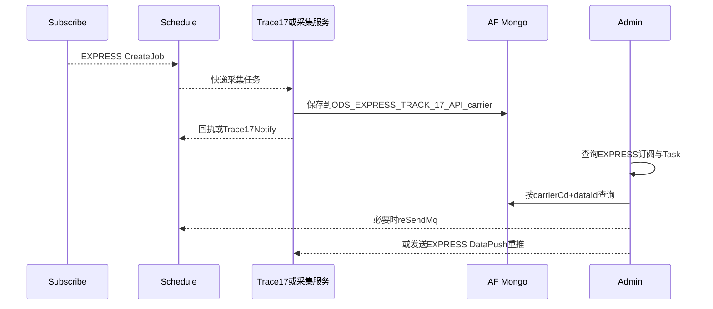

# 04-03 EXPRESS 快递订阅与 AF 数据查询链路

## 1. 功能背景与解决的问题

EXPRESS 使用 Trace17 等快递数据源，虽然共享 subscribe、schedule 和 admin 框架，但原始数据位于 AF Mongo，消息和通知也有专项 Listener。若按海运 SHIP 逻辑查询，会出现列表有 dataId、Mongo 却查不到的假故障。

## 2. 核心代码位置

- schedule `TraceExpressSubscribeServiceImpl`：快递订阅调度侧数据访问。
- `ExpressTrackNotifyListener`：消费 `QueueConstant.Trace17Notify.TOPIC`，处理快递通知。
- admin `TraceExpressSubscribeServiceImpl`：EXPRESS 列表、筛选和导出。
- admin `LogQueryServiceImpl`：集合前缀 `ODS_EXPRESS_TRACK_17_API_` 加 carrierCd，并选择 `AfMongoTemplate`。
- admin `RePushServiceImpl`：用 `createExpressDataPushMessage` 构造快递重推消息。
- admin 中已有 EXPRESS 查询和 LogQuery 测试，验证专项路由。

## 3. 完整流程

## 4. 核心实现原理与设计原因

EXPRESS 将通用调度模型复用于快递单号，但保留专项 Topic、实体和 Mongo 路由。集合按 carrierCd 分开，便于不同快递服务商字段和索引独立维护。admin 将 AIR 与 EXPRESS 统一路由到 AF Mongo，说明“AF”在这里是数据域/基础设施边界，不仅代表空运业务。

## 5. 关键技术细节

- collection 名由固定前缀和 carrierCd 构成，不按月份。
- 快递通知 Topic `Trace17Notify` 不等于通用 DataCompare，排查时要找真实 Listener。
- rePush 构造 EXPRESS 专项消息，不能套 SHIP DTO。
- Admin 前端 tab/filter 状态需要保留订阅类型，否则从其他业务切回会查询错误接口。
- dataId 查询应使用 AF MongoTemplate，并兼容 ID 类型。

## 6. 异常、并发与边界场景

carrierCd 大小写或映射变化会查错集合；Trace17 回调重复会产生重复状态；快递公司切换后旧 Task 仍应使用原集合。外部回调可能先于 Job 创建或晚于结束，需要按业务键和事件时间处理。通用 DataPush 最终消费者仍不在本次仓库范围。

## 7. 当前问题与优化方向

建议把 collection 保存为 Task 元数据；为回调建立事件幂等键；统一 EXPRESS 消息、回执和状态字典；后台显示 AF/SF 数据源路由；为 carrierCd 映射增加测试。Trace17 外部 API 合同和线上回调鉴权当前无法确认。

## 8. 关键结论

EXPRESS 的调度骨架与其他业务相似，但 Topic、Mongo 实例、collection 和推送 DTO 均是专项边界，不能按 SHIP 经验直接推断。

## 9. 端到端排查清单

先从 EXPRESS 订阅列表确认客户、快递单号和 carrierCd，再在 schedule 查询 `TraceExpressSubscribe` 对应 Job/Task。若任务依赖 Trace17 回调，检查 `ExpressTrackNotifyListener` 的 Topic、group 和回调消息时间，而不是查 DataCleanTask 通用监听器。取得 dataId 后，用 `AfMongoTemplate` 查询 `ODS_EXPRESS_TRACK_17_API_` 加 carrierCd 的集合；若误用海运 Mongo，即使 ID 正确也会返回空。

需要重推时，确认 `RePushServiceImpl` 进入 `createExpressDataPushMessage` 分支，消息 Tag 保持 EXPRESS，记录返回的 messageId。若客户仍未收到，问题已超出当前仓库可确认边界，应转到 DataPush 消费者检查回调地址、签名、HTTP 状态和重试记录，而不是继续重复 rePush。

EXPRESS 上线验收至少准备三类样本：正常流转且多节点更新、外部回调重复、carrierCd 切换或映射异常。逐个比对订阅状态、Task 回执、AF Mongo 文档和重推消息体，确保快递专项字段没有在通用 DTO 转换中丢失。对于已结束快递单，迟到回调只能补充历史，不应无条件恢复 Job 或再次触发客户通知。

下一篇：[TERMINAL 船计划与港区联合清洗](./04-04-TERMINAL船计划与港区联合清洗.md)。
