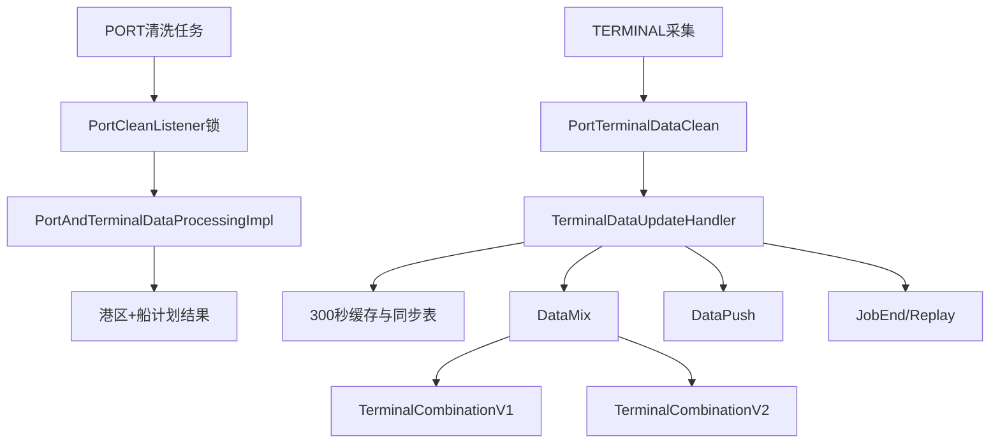

# 04-04 TERMINAL 船计划与港区联合清洗

## 1. 功能背景与解决的问题

港区事件通常只有箱状态，船计划提供船名、航次、靠离泊和截关等时间。二者组合后才能解释港区节点所处航次。项目既支持独立 TERMINAL 订阅，也支持 PORT 清洗时联合船计划，并把结果同步到融合和通知链路。

## 2. 核心代码位置

- SF `CreateTerminalCollectJob`：发送 `DataCollectTask` 的 TERMINAL Tag。
- `PortCleanListener`：按 subId 加锁后选择普通港区或 `PortAndTerminalDataProcessingImpl`。
- `PortTerminalDataClean`：船计划标准化清洗。
- `TerminalDataUpdateHandler`：查询 Mongo/缓存、执行 terminal data fusion、同步详情，并发送 DataPush、DataMix、JobEnd、SubscribeDownloadReplay。
- DataMix `TerminalCombinationV1`、`TerminalCombinationV2` 及进出口实现：将计划并入融合。
- schedule `TerminalTipNotifyServiceImpl`：船计划提示和 DataCompare。

## 3. 完整流程

## 4. 核心实现原理与设计原因

`TerminalDataUpdateHandler` 以港口、船名、航次、进出口等订阅参数查询计划，必要时通过 `terminalDataFusion` 合并多个渠道。结果既写 Redis 短缓存，也通过 `portTerminalInfoSyncApi` 保存同步详情，降低相同港口计划重复计算。PORT 联合清洗使用订阅锁，防止计划更新与港区清洗同时覆盖。

## 5. 关键技术细节

- `port_terminal` 是独立清洗 Tag，不能当作普通 PORT。
- 船名、航次匹配需标准化；空格、大小写和航次前缀都会影响关联。
- 缓存 Key 必须包含 port、vessel、voyage、import/export 和 channel 等必要维度。
- 300 秒缓存提高复用，但计划快速变更时可能短暂返回旧值。
- JobEnd 后 schedule 还需将船计划 `finished=1`，不是只结束 Job。

## 6. 异常、并发与边界场景

一船多航次、航次缺失、多个码头计划冲突、跨时区时间都可能误配。计划晚到时港区先输出，后续 DataMix 需补充；缓存旧值和同步表失败会让不同实例结果不一致。旧 TERMINAL JobEnd 不应结束新重开周期。

## 7. 当前问题与优化方向

建议为匹配结果记录候选和置信原因；统一时间及时区；缓存加版本并在计划变更主动失效；建立港区+船计划黄金样本；后台展示独立 TERMINAL 与联合清洗来源。各港口实际匹配配置和外部船计划签名规则当前无法完整确认。

## 8. 关键结论

TERMINAL 不只是额外字段，它会参与 PORT 清洗、融合、提示和结束状态。排查需同时看独立计划任务与联合清洗分支。

## 9. 联合清洗验收清单

记录 PORT Task 与 TERMINAL Task 各自的 subId、channel、vessel、voyage、portCode 和 dataId，确认 `PortCleanListener` 选择了 `PortAndTerminalDataProcessingImpl`。检查 `TerminalDataUpdateHandler` 的 300 秒缓存 Key 是否包含本次订阅维度，以及同步 API 保存的 details 是否对应同一船名航次。最后对比融合前后计划节点，并确认 JobEnd 后 schedule 将 terminal `finished` 正确更新。

若港区结果正确而计划缺失，应先定位船名航次标准化和候选匹配，不要把计划节点手工写入港区 Mongo；后续真实计划到达时，手工数据可能与自动融合冲突。

联合清洗修复后还要验证 PORT 单独模式未受影响，避免所有港区任务都被错误要求存在 TERMINAL 数据。

下一篇：[单船司清洗规则、状态映射与回归验证](./04-05-单船司清洗规则状态映射与回归验证.md)。
