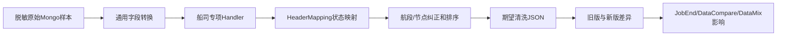

# 04-05 单船司清洗规则、状态映射与回归验证

## 1. 功能背景与解决的问题

每家船司对节点、航段、预计/实际、地点和箱状态的表达不同。SF 既有 `HandlerDataServiceImpl_SHIP` 通用处理，也有 `HandlerDataServiceImpl_MSC`、`_MSK`、`_CMA`、`_HMM` 等专项实现。一个看似局部的状态映射改动可能改变 JobEnd、DataCompare 和融合结果，因此必须从原始样本到最终消息做完整回归。

## 2. 核心代码位置与文档

- `BaseShipPortCleanListener`：根据 carrierCd 和业务类型选择处理器。
- `HandlerDataServiceImpl_SHIP`：通用船司清洗、航段和状态映射入口。
- `HandlerDataServiceImpl_{CARRIER}`：船司专项补充、纠正和排序。
- `HeaderMappingImpl#ctnrStatusMapping`：配置驱动的统一状态匹配。
- `CarrierStatusConfigServiceImpl`、`RuleChannelMappingStatusServiceImpl`：状态配置缓存。
- `docs/YYYY-MM-DD-<carrier>-clean-change.md` 和变更模板：记录专项需求和验证样本。

## 3. 完整调用流程：清洗与验证链路

## 4. 核心实现原理与设计原因

通用 Handler 处理共有模型，专项 Handler 只处理船司差异，避免所有船司规则堆在同一类。状态映射读取 carrier 配置并按候选顺序匹配原状态和描述。纠正模块还可能根据航段、港口和相邻节点补充状态，所以“映射方法返回值正确”不等于最终 JSON 正确。

## 5. 关键技术细节

- 规则顺序具有业务语义，多个候选命中时通常取优先项。
- null、空字符串、不同空白、大小写和时区都需样本覆盖。
- 节点去重键要包含状态、地点、时间和预计/实际等适当字段。
- 专项补充节点不能破坏全局时间排序和航段归属。
- 最终状态会影响 `JobEndAndOrderComplete`，改映射需检查任务是否提前或延后结束。

## 6. 推荐回归步骤

1. 固定真实脱敏原始 Mongo 文档和对应 Task 参数。
2. 保存改动前完整清洗输出，不只截取目标字段。
3. 定义目标节点、非目标节点、箱列表、航段、最新状态和完成标志的期望。
4. 运行目标 Handler 测试，再运行通用清洗和消息影响测试。
5. 对比 Mongo 输出、关系型副本、DataCompare 输入和 JobEnd 条件。
6. 若声称性能优化，使用相同样本数量、JVM、预热和 profiler 复测。

## 7. 异常、边界与常见误区

单个样本中出现目标 statusCd 不能证明新规则生效，它可能由后续纠正生成；没有 statusCd 也可能因为前置地点或时间条件未满足。只测试目标船司会漏掉通用 HeaderMapping 对其他船司的回归。测试编译通过不代表运行时 Redis 配置与样本一致。

## 8. 当前问题与优化方向

建议每个船司维护黄金样本库和版本化期望；变更模板强制记录原始字段、命中规则、上下游影响和回滚；把规则候选编译为可解释对象，输出命中 reason；CI 运行通用与专项回归。当前源码存在较多专项类，全部线上覆盖率和样本质量无法确认。

## 9. 关键结论

单船司变更的验收单位是“完整清洗结果及下游状态”，不是一个方法或一个状态码。正确性与性能结论都必须有可复现样本。

下一篇：[美的定制融合与普通融合的隔离边界](./04-06-美的定制融合与普通融合的隔离边界.md)。
