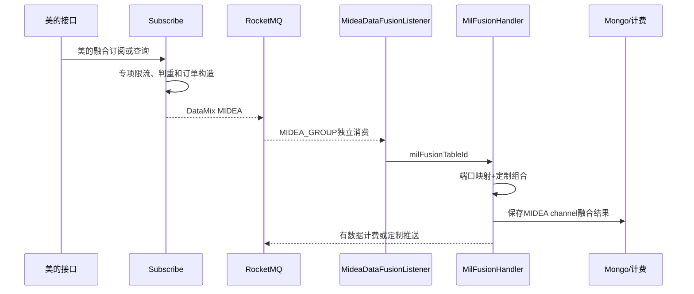

# 04-06 美的定制融合与普通融合的隔离边界

## 1. 功能背景与解决的问题

美的定制融合包含独立订阅表、港口码映射、五字码渠道、融合输出和计费条件。若把这些规则直接加入普通 FusionHandler，会增加所有客户的回归风险。项目从订阅限流、MQ Tag/group 到 Handler 均建立独立路径，同时复用部分 v2 数据模型和公共组合能力。

## 2. 核心代码位置

- subscribe `MideaFusionDataApiLimitApplication`：查询 `TraceMideaFusionDataSubscribe`，按客户、单号、提单号、进出口和船司判重并构建计费项目。
- schedule `TraceMideaFusionDataSubscribeServiceImpl`：调度侧订阅访问。
- DataMix `MideaDataFusionListener`：消费 `DataMix.MIDEA_TAG`，使用 `MIDEA_GROUP_ID`。
- `MilFusionHandler#fusion`：查询定制订阅、组合数据、保存 Mongo、判断变化并发送计费。
- `MilWharfSubscribeHandler`、进出口 `ExportWharfCombination` 等：美的码头专项组合。
- `OnedataMideaPortMappingEnum`：美的港口码到 OneData 码映射。

## 3. 完整流程

## 4. 核心实现原理与设计原因

Listener 从消息读取 `milFusionTableId`，构造 MilQueryDTO 后调用 MilFusionHandler。Handler 将 `FiveCodeChannelEnum` 设置为 MIDEA，必要时通过 `OnedataMideaPortMappingEnum` 统一港口码，保存 v2 形态的融合数据，并按数据刷新结果返回 ID。计费消息在成功产生数据后发送。

独立 Tag/group 提供运行隔离；独立订阅实体提供数据合同隔离；独立 Handler 提供规则隔离。复用 v2 DTO 则避免客户定制完全复制整个融合基础设施。

## 5. 关键技术细节

- 普通 `fusionTableId` 与 `milFusionTableId` 不能混用。
- 港口码映射可能一对多，代码取候选时的优先规则需要样本验证。
- MIDEA channel 标识必须写入结果，避免下游按普通来源解释。
- 定制计费应依据定制订阅和数据结果，不能复用普通订阅 ID 幂等键。
- 进出口组合类不同，测试必须覆盖两个方向和 WHARF 有无数据。

## 6. 异常、并发与边界场景

MIDEA 消息误用 NORMAL Tag 会进入普通 Handler；港口映射缺失会导致无法组合码头；定制订阅更新和在途融合并发可能使用不同配置；MQ 重试可能重复计费。独立 group 避免流量互相阻塞，但 Redis、Mongo 和外部 API 仍可能共享资源。

## 7. 当前问题与优化方向

建议把定制合同版本写入消息和 Mongo；港口映射从枚举迁移到可版本化配置时保留校验与回滚；计费使用 eventId 幂等；建立“普通 v2 结果 + 美的差异”对照测试，防止无意分叉。线上客户规则、推送合同和所有映射值当前无法确认。

## 8. 关键结论

美的链路不是普通融合上的几个 if，而是从入口、消息、处理器到计费的隔离通道。任何共用重构都必须证明不会改变普通和定制两套合同。

## 9. 隔离验证清单

检查 subscribe 使用 `TraceMideaFusionDataSubscribe` 而非普通融合表，消息必须携带 milFusionTableId 并使用 MIDEA Tag；DataMix 应由 `MideaDataFusionListener` 和 MIDEA group 消费，随后进入 MilFusionHandler。Mongo 结果的 channelType 应为 MIDEA，港口码经过专项映射，计费事件使用定制订阅身份。任一环节退化为普通 fusionTableId、NORMAL Tag 或普通计费键，都可能造成合同串线。

下一篇：[API 下载、通知和客户推送的权限与频率控制](./04-07-API下载通知和客户推送的权限与频率控制.md)。
