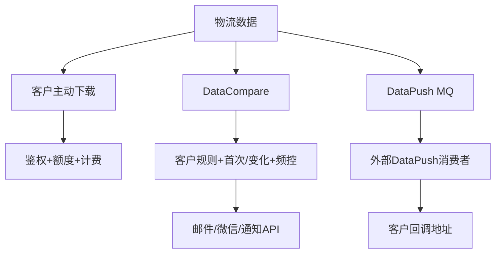

# 04-07 API 下载、通知和客户推送的权限与频率控制

## 1. 功能背景与解决的问题

物流数据对外有三类交付：客户主动调用下载/查询 API、状态变化后的邮件微信等通知、系统主动 DataPush 到客户接口。三者触发条件、权限和频率不同。把它们统称为“推送”会导致排查错误：API 查询受额度和身份限制，notify 受规则与频控控制，DataPush 则由独立消费者完成 HTTP 投递。

## 2. 核心代码位置

- subscribe `ApiLimitApplication` 及各专项实现：控制查询/下载额度并衔接计费。
- subscribe `DataMessagePushServiceImpl`：按 SHIP、PORT、TERMINAL、FULL_LINK、NAR 等构造 DataPush 消息。
- SF `SendMqMessageImpl` 和 DataMix `FusionHandler#sendDataModifyPushMQ`：数据变化后生产 DataPush。
- notify `AbstractDataCompare`：决定是否产生通知。
- notify `PushService`、`ShipPushService`、`FrequencyStrategy`：责任链和发送频率。
- notify `SendApiNotify`、`NotifyInterceptCache`、`OpsNotifyInterceptController`：统一 API 通知及拦截配置。

## 3. 完整调用流程与三类交付边界

## 4. 核心实现原理与设计原因

主动下载在请求时校验资源，适合同步返回；状态通知需要先比较新旧数据并查客户规则，因此由 notify 异步处理；DataPush 只在数据可用后发布轻量消息，由专门消费者执行网络投递。职责分离使客户主动流量、内部变化计算和外部回调故障不会共用同一线程池。

## 5. 关键技术细节

- API 权限至少包含客户身份、API 类型和数据归属，不能只验证 Token 有效。
- 通知频率应按客户、订阅、事件和渠道组合；首次通知使用独立责任链。
- `NotifyInterceptCache` 可拦截特定通知，运维修改后需确认缓存失效。
- DataPush 消息应携带 subId、dataId、客户及回调合同版本；签名应在真正消费者侧生成。
- rePush 必须绕过还是继续遵守频控，应由明确业务字段决定，不能隐式推断。

## 6. 异常、并发与边界场景

重复 DataCompare 可能触发重复通知；频控缓存故障可能放大消息；客户回调超时可能引发多次投递；回调成功响应的业务语义不一定等同 HTTP 200。客户权限撤销后，已在队列中的消息是否继续投递需要合同定义。日志不能记录 Token、签名密钥和完整敏感 payload。

## 7. 当前问题与优化方向

建议建立统一 Delivery 记录，区分 download、notify、dataPush，保存 eventId、目标、尝试和最终结果；权限在消息消费时再次校验；频控和幂等使用持久化键；回调采用签名、时间戳和重放保护；提供客户级熔断与暂停。当前七仓库中没有找到通用 DataPush 消费者，因此实际 HTTP 重试、签名和成功判定当前代码无法确认。

## 8. 关键结论

下载、通知和 DataPush 是三条不同链。排查必须先确认属于哪类交付，再检查对应的权限、规则、频控和最终消费者，不能只搜索“push”。

## 9. 交付故障判断清单

主动查询失败时检查 API 身份、客户资源、限流结果和计费受理；邮件或微信未发送时检查 DataCompare 时效、规则命中、首次标识、FrequencyStrategy 和 NotifyInterceptCache；客户回调未收到时检查 DataPush 生产 messageId 和外部消费者。三条链可以同时使用同一 dataId，但拥有不同成功标准，不能用“页面已能查询”证明通知或回调已经完成。

对重复交付也应分层处理：下载重复是客户请求行为，通知重复使用事件和频控键去重，DataPush 重复需要投递 eventId 与客户侧幂等。统一按 subId 去重会错误压制不同版本数据。
