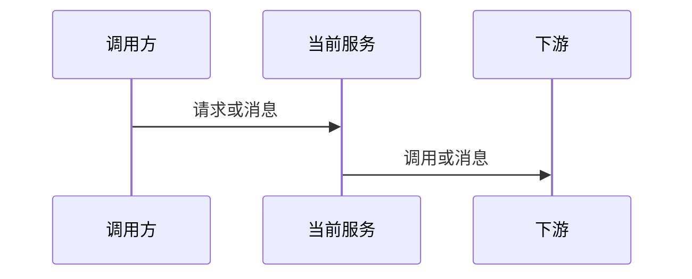

# NN. 文档主题

## 1. 功能背景与解决的问题

## 2. 服务边界与适用范围

## 3. 核心代码位置

## 4. 完整调用流程

```mermaid
sequenceDiagram
    participant A as 调用方
    participant B as 当前服务
    participant C as 下游
    A->>B: 请求或消息
    B->>C: 调用或消息
```

## 5. 核心实现原理

## 6. 为什么采用当前方案

## 7. 关键技术细节

## 8. 异常、并发与边界场景

## 9. 当前问题与优化方向

## 10. 关键结论

## 11. 证据边界

