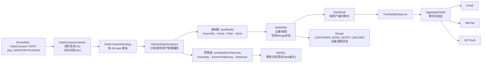
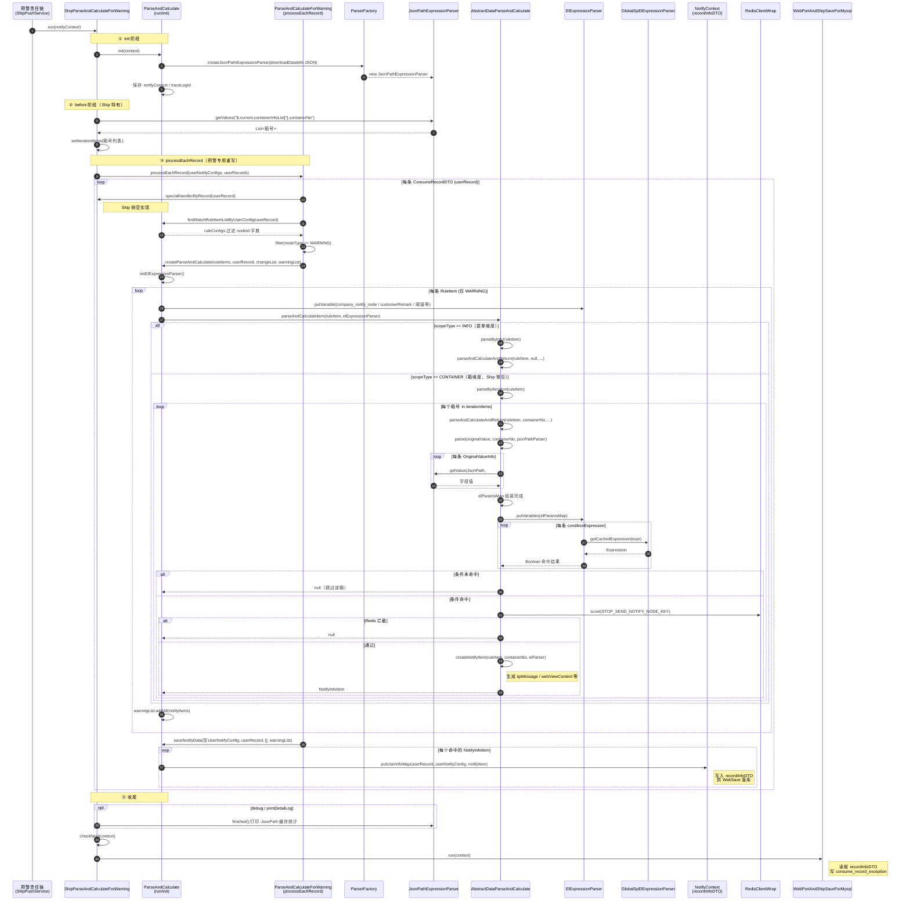
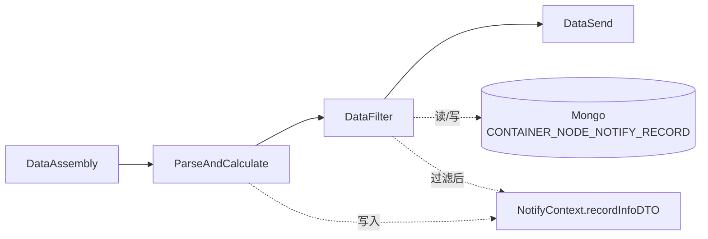
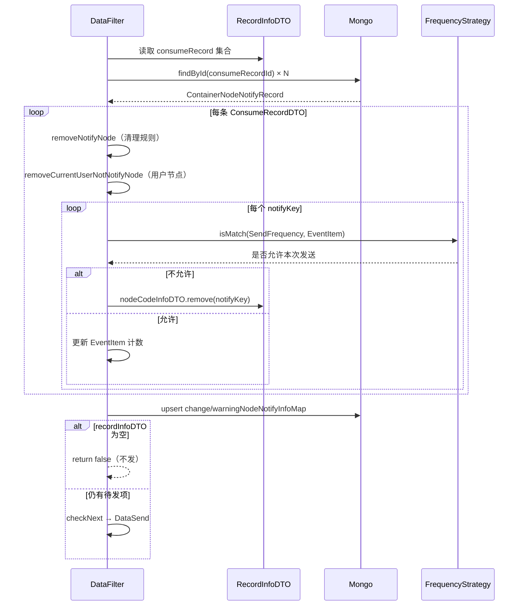
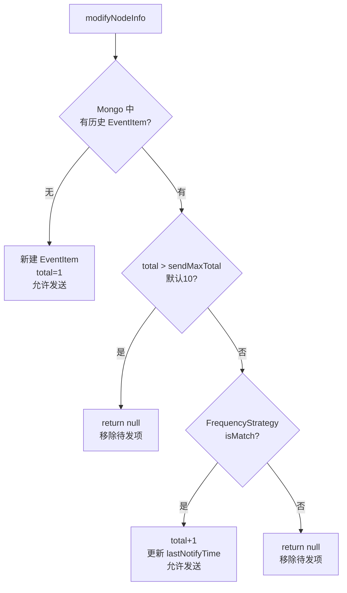
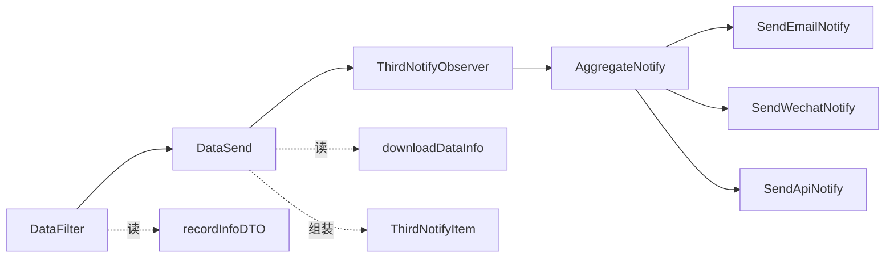
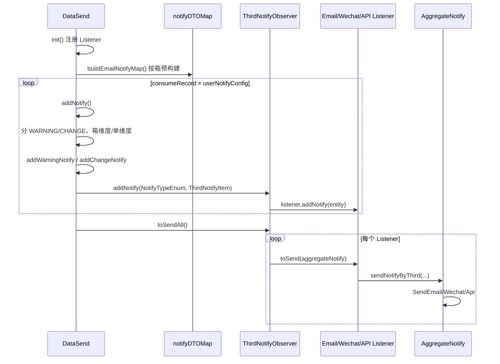
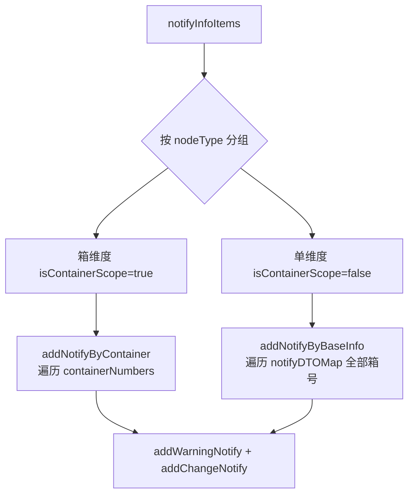

# Iscm\-trace\-notify\-platform

[架构说明](https://hcnuu3eqvd8k.feishu.cn/wiki/MhGhwuZAEiXN0akz4dccuQyVn4e)

[jsonpath 技术方案](https://hcnuu3eqvd8k.feishu.cn/wiki/JOIWwfQKRiVQ55kY898cZX8hnkd)

## iscm\-trace\-notify\-platform 项目文档：核心流程与维护指南

本文档是一份“**项目级**”说明，目标是让你在不通读全仓库的情况下，快速理解并能维护该服务：它做什么、怎么跑、核心链路怎么走、为什么会“没发/重复发/预警不展示”，以及如何扩展。

文档会结合 **核心代码片段** 与 **图示（Mermaid）** 来讲解主流程。

---

## 1\. 项目简介（你先建立正确心智模型）

`iscm-trace-notify-platform` 是 ISCM 追踪链路中的 **通知与预警中台**：

- 上游清洗任务产生一条“数据对比/清洗完成”的事件（RocketMQ `DataCompare.TOPIC`）

- 本服务消费事件，按业务线（SHIP/PORT/FUSION）路由

- 读取订阅、规则、用户通知配置与节点字典

- 从 Mongo download 数据中解析规则（JsonPath \+ EL）

- 进行 **去重与频控**（Mongo 状态是关键）

- 最终通过 **邮件 / 微信公众号 / API 推送** 等通道发送

- 同时将 **预警/异常结果落库到 MySQL** 供 Web 展示

- 并联动 BI 报表清洗 MQ（`sendBiCleanMessage`）

---

## 2\. 模块与入口

### 2\.1 Maven 模块

- **`notify-api`**：上游/调用方协议（Feign API、DTO、VO）

- **`notify-service`**：核心业务（Spring Boot、MQ、推送链、落库）

### 2\.2 启动入口与端口

- 启动类：`notify-service/src/main/java/.../NotifyApplication.java`

- 服务名：`iscm-trace-notify-platform`

- 端口：`31010`（`notify-service/src/main/resources/bootstrap.yml`）

---

## 3\. 核心端到端流程（最重要）

### 3\.1 一张图看懂全链路



### 3\.2 MQ 入口：超时丢弃 \+ 分布式锁 \+ 路由

核心入口模板类：`notify-service/.../queue/listener/DataCompareListener.java`

关键行为：

- **超时丢弃**：消息产生时间与消费时间差超过 1 小时直接忽略

- **分布式锁**：以订阅维度构造 lockKey 并加锁 15 秒，避免并发重复消费

- **路由**：按 `dto.type` 找到对应 `DataCompare` 实现并执行

关键代码片段（原样摘取核心逻辑）：

```TypeScript
*// 超过 1 小时丢弃*
if (currentTimeMillis - bornTimestamp > ONE_HOUR_MILLIS) {
    return;
}

*// 订阅维度锁（topic + carrierCd + subNo + dataId + subId）*
String lockKey = Md5Util.defaultToMd5(
    QueueConstant.DataCompare.TOPIC,
    dto.getCarrierCd(),
    dto.getSubNo(),
    dto.getDataId(),
    null == dto.getSubId() ? "" : String.valueOf(dto.getSubId())
);
redissonLock.lock(lockKey, 15);

*// 路由到对应 compare 实现*
String type = StringUtils.upperCase(dto.getType());
DataCompare cleanDataCompare = dataCompareStrategy.findDataCompareByType(type);
if (null == cleanDataCompare) {
    return;
}
cleanDataCompare.dataCompare(dto);
```

### 3\.3 核心编排：AbstractDataCompare 为什么是“决策中枢”

`notify-service/.../strategy/data_compare/AbstractDataCompare.java`

它做两件**非常关键**的事：

1. **预警落库链先执行**：用于 Web 展示（异常/预警记录）

2. **普通通知链可能被短路**：例如等待窗口未到（`queryCount<=0`）、用户未开启、通知配置为空等

关键流程代码片段（节选）：

```Java
// consume_record 表，根据 sub_id + table_name + 有效状态 查出 订阅记录
List<ConsumeRecordDTO> consumeRecordList = this.queryConsumeRecordList(dto);
if (CollectionUtils.isEmpty(consumeRecordList)) {
    return;
}

// 1. cargo_baby_wait_time_config 表 根据type = ship/port 找出 waitTime
// 2. consume_record 表, 根据 sub_id + ship + waitTime < TIMESTAMPDIFF(SECOND, create_time, now()), 计数
Integer queryCount = this.queryCount(dto);

// 1. 三表联查具体规则配置
// tip_notify_node_dict.node_id = tip_notify_rule_config.node_id 
// && tip_notify_customer_rule_config.rule_id = tip_notify_rule_config.id + tip_notify_customer_rule_config.compant_id = 参数
// 2. 填充到 consumeRecordList 
Set<ConsumeRecordDTO> userRecordSet = this.fillerRuleConfigs(consumeRecordList, dto);
if (userRecordSet.isEmpty()) {
    pushService.sendBiCleanMessage(dto);
    return;
}

*// 预警落库处理（先做）*
**pushService.sendNotifyForWarning**(dto, NotifyParamDTO.builder()
    .userRecords(userRecordSet)
    .subTypeNodeInfoMap(subTypeNodeInfoMap)
    .previousDownloadSuffix(dto.getPreviousDownloadSuffix())
    .previousDownloadId(dto.getPreviousDownloadId())
    .build());

*// 等待窗口未到：普通通知链短路（不发邮件/微信/API）*
if (queryCount <= 0) {
    return;
}

*// 用户配置齐全后，走普通通知链*
pushService.sendNotify(dto, notifyParamBuilder.build());
```

**排障结论**：看到“预警展示有记录”并不等价于“用户一定收到通知”，普通通知链可能被短路。

## 4\. 推送引擎：NotifyModule 责任链（最核心实现形态）

### 4\.1 责任链骨架

`notify-service/.../push/step/NotifyModule.java`

```Java
public static NotifyModule build(NotifyModule first, NotifyModule... modules) {
    NotifyModule head = first;
    for (NotifyModule nextModule : modules) {
        head.next = nextModule;
        head = nextModule;
    }
    return first;
}
```

### 4\.2 三条业务线如何组装链路

以 PORT 业务线为例（`push/port/PortPushService.java`）：

```Java
return NotifyModule.build(
    new PortDataAssembly(...),
    new PortParseAndCalculate(...),
    new PortDataFilter(...),
    new PortDataSend(...)
);
```

SHIP / FUSION 结构一致，只是具体 Assembly/Parse/Filter/Send 实现不同。

---

## 5\. 预警链 vs 通知链

### 5\.1 两条链路的目标与输出

- **通知链（发给用户）**：最终输出三方消息（Email/Wechat/API），强调“**准时、去重、频控、按用户关注节点发送**”。

- **预警链（给 Web 展示）**：最终输出 MySQL 预警/异常记录，强调“**可追溯、可回看、可对账**”。

从编排层视角（`AbstractDataCompare`）：

- 预警链一般 **先执行**（用于展示与对账）

- 通知链可能因为等待窗口/开关/配置缺失而被 **短路**

### 5\.2 链路输入协议：DataCompareDTO（上游事件定义）

链路入口消息体：`notify-api/.../dto/DataCompareDTO.java`。其中这些字段会直接改变链路分支：

- **`type`**：业务线路由关键字段（SHIP/PORT/FUSION）

- **`dataId`**：清洗后 download 数据 id（Mongo 关联）

- **`subId`**：订阅表 id（Port/Ship 常用）

- **`isFirstSub`**：首次订阅（决定是否走首次订阅链/模板）

- **`portTerminal`**：港区船计划调度触发（影响预警展示分支与规则过滤）

- **`appointNodeIds`**：指定节点集合（只评估/只展示这些节点；常用于“局部评估/局部展示”）

- **`previousDownloadSuffix / previousDownloadId`**：上一次 download 信息（用于“变更/对比”判断）

### 5\.3 共享上下文设计：NotifyContext / SubscribeInfo / NotifyParamDTO

两条链路都通过 `PushService` 构建 `NotifyContext` 并传递给 `NotifyModule` 责任链，各阶段只“读/写上下文”，避免模块之间强耦合。

- **`SubscribeInfo`**：订阅维度基础信息（subId、subNo、carrierCd、subTableName、customerId、appointNodeIds、portTerminal…）

- **`NotifyParamDTO`**：本次通知计算所需输入（用户配置、订阅记录集合、节点字典、用户关注节点集合、previous download 信息…）

- **`NotifyContext.recordInfoDTO`**：Parse 阶段的核心产物：把“命中节点”按 consumeRecord → userNotifyConfig → notifyItems 组织起来，供 Filter/Send 使用

### 5\.4 责任链模块设计（模块职责与顺序）

#### 5\.4\.1 通知链（Notify）

典型步骤：

1. **Assembly**：补齐 download 数据（可能包含 previous）

2. **ParseAndCalculate**：JsonPath \+ EL 计算命中，并写入 `recordInfoDTO`

3. **DataFilter**：去重/频控（依赖 Mongo 状态），并写回状态

4. **DataSend**：按用户/箱号聚合，发送到 Email/Wechat/API

业务线组装（以 PORT 为例，`PortPushService`）：

```Java
return NotifyModule.build(
    new PortDataAssembly(...),
    new PortParseAndCalculate(...),
    new PortDataFilter(...),
    new PortDataSend(...)
);
```

#### 5\.4\.2 预警链（Warning/WebSave）

预警链的定位是：**“把本次命中的预警/异常结果落库，供 Web 展示与对账”**。它与通知链最大的不同在于：

- **不做去重/频控（不走 ****`DataFilter`****）**：预警展示更像“当前视角的异常快照”

- **天然幂等方式是“先删后写”**：每次执行后，MySQL 里保留的是“这次计算出的预警集合”

典型步骤（责任链顺序）：

1. **Assembly**：组装 current/previous download 数据，填充到 `NotifyContext.downloadDataInfo`

2. **ParseAndCalculateForWarning**：按箱（或按基础信息维度）遍历并计算预警命中，把结果写入 `NotifyContext.recordInfoDTO`

3. **WebSaveForMysql**：删除旧预警记录 → 写入本次命中的预警记录（MySQL）

下面按模块逐个展开。

##### 5\.4\.2\.1 Assembly：为“预警展示”准备数据（current \+ previous）

**目标**：把“当前数据 \+ 上一次数据（用于对比）\+ 订阅信息”组装进 `DownloadDataInfo`，并写入 `NotifyContext`，供后续 Parse 使用。

**共同输出**：

- `context.setDownloadDataInfo(downloadDataInfo)`，其中：

    - `downloadDataInfo.current`：当前 download 数据

    - `downloadDataInfo.previous`：上一份 download 数据（或按业务规则替代）

    - `downloadDataInfo.subscribeInfo`：订阅信息（`SubscribeInfo`）

**三条业务线的实现差异**：

- **PORT：****`PortDataAssembly`**

    - current：从 `ODS_PORT_DOWNLOAD_DATA` 查

    - previous：

        - 若 `isPortTerminal=true`（港区船计划）：**previous 直接复用最新 current**（`downloadDataInfo.setPrevious(this.queryNewData())`），用于“船计划触发时”的对比逻辑

        - 否则：优先走“流水库后缀”读取（`previousDownloadSuffix + previousDownloadId`），读不到才回退默认 previous 集合

    - 关键点：`previousDownloadSuffix/previousDownloadId` 由 `NotifyParamDTO` 透传而来（源自 MQ 的 `DataCompareDTO`）

- **SHIP：****`ShipDataAssembly`**

    - current：`ODS_SHIP_DOWNLOAD_DATA`

    - previous：`ODS_SHIP_PREVIOUS_DOWNLOAD_DATA`

    - 若 Mongo 查不到，会返回 `ShipBookingInfoMongoDTO.createEmptyData()`，保证后续 Parse 不 NPE

- **FUSION：****`FusionDataAssembly`**

    - current：`OSD_OCEAN_FUSION_DOWNLOAD_DATA`

    - previous：`ODS_OCEAN_FUSION_PREVIOUS_DOWNLOAD_DATA`

    - 额外动作：

        - 若 current 非空：会把进出口标识写回 `SubscribeInfo.importAndExportFlag`（用于后续规则/字段业务逻辑）

        - 只保留部分动态轨迹来源（`source=0/3`）以降低解析成本

        - 组装 `containerNumberList` 为港区箱号 ∪ 船司箱号的并集，统一后续“按箱迭代”的集合

##### 5\.4\.2\.2 ParseAndCalculateForWarning：生成“预警展示所需的命中结果”

**目标**：对每个“迭代单元”（通常是箱号，或基础信息维度的伪箱号）计算预警命中，并把命中的预警项写入 `NotifyContext.recordInfoDTO`，供 WebSave 落库。

**共同特征**：

- 都继承 `ParseAndCalculateForWarning`（位于 `push/step/parse/ParseAndCalculateForWarning`）

- 通过 `before()` 设置迭代集合（`setIterationItems(...)`），然后逐个迭代产出 `NotifyInfoItem`

- 最终 `NotifyInfoItem` 里关键字段会被 WebSave 使用：

    - `nodeType`：必须是 `WARNING` 才会落库

    - `nodeId`：异常/预警节点 id

    - `containerNo`：箱号（或“基础信息维度”占位）

    - `webViewContent[detailDescription]`：落库 remark 的来源（Web 展示文本）

**三条业务线的实现差异（核心在 before 与特殊处理）**：

- **SHIP：****`ShipParseAndCalculateForWarning`**

    - `before()`：从 `$.current.containerInfoList[*].containerNo` 取箱号列表作为迭代集合

- **FUSION：****`FusionParseAndCalculateForWarning`**

    - `before()`：从 `$.current.containerNumberList[*]` 取箱号并集作为迭代集合

    - 额外动作：把订阅维度 `carrierCd` 写入 JSON（`jsonPathExpressionParser.setValue("$.current.carrierCd", carrierCd)`），确保后续规则取值与“当前订阅码”一致（避免融合数据自身 carrierCd 影响判断）

- **PORT：****`PortParseAndCalculateForWarning`****（最特殊）**

    - `before()`：从港区容器 jsonPath（常量 `PORT_CONTAINER_NUMBER_JSON_PATH`）取箱号列表

    - **港区船计划特殊分支**：

        - 若取不到箱号且 `isPortTerminal=true`，会设置一个固定占位 `BY-INFO-SCOPE` 作为迭代项，用于触发“进场异常提醒”等基于基础信息维度的预警展示

    - `specialHandlerByRecord(...)`：

        - 会按 consumeRecord 维度刷新/回填船计划信息（通过 `CargoBabyTerminalDetailService` \+ `MongoTemplate`），确保展示侧能拿到正确的船计划上下文

##### 该部分规则判断的详细计算链路 `run()` 的编排



\(0\) 提前准备一些需要的数据 \.\.\. 

\(1\) `this.before();`

- values = jsonPathExpressionParser\.getValues\("$\.current\.containerInfoList\[\*\]\.containerNo", String\.class\);

- 把箱号放 “上下文”：setIterationItems\(values\)

\(2\) **处理每条记录** `this.processEachRecord(userNotifyConfigs, userRecords);` 🌟

- 特殊逻辑处理 specialHandlerByRecord\(userRecord\);

- 规则解析并计算：createParseAndCalculate\(ruleItems, userRecord, changeList, warningList\); 内部遍历 ruleItems，针对每条规则做以下操作：

    - elExpressionParser 里填充数据：备注，创建时间，阈值map（通过thresholdToMap\(ruleItem\)处理），供后续使用

        ```JSON
        {
          "thresholdValue": [
            {
              "name": "otherHour",
              "value": 12,
              "description": "小时",
              "errorMessage": "最多可输入3位整数",
              "componentType": "input",
              "regexExpression": "^[1-9]\\d{0,2}$"
            },
            {
              "name": "ysHour",
              "value": 3,
              "description": "小时",
              "errorMessage": "最多可输入3位整数",
              "componentType": "input",
              "regexExpression": "^[1-9]\\d{0,2}$"
            }
          ]
        }
        ```

    - **解析并计算单条规则**：parseAndCalculateItem\(ruleItem, elExpressionParser\) ，返回一个 NotifyInfoItem list

        - 根据 ruleItem\.ruleContent\.scopeType 确定哪个维度做解析

            ```JSON
            {
              "scopeType": "container",
              "originalValue": [
                {
                  "name": "carrierCd",
                  "valueType": "java.lang.String",
                  "expression": "$.current.carrierCd"
                },
                {
                  "name": "subNo",
                  "valueType": "java.lang.String",
                  "expression": "$.current.subNo"
                },
                {
                  "name": "currentVslName",
                  "valueType": "java.lang.String",
                  "expression": "$.current.vslNameEn"
                },
                {
                  "name": "currentVoy",
                  "valueType": "java.lang.String",
                  "expression": "$.current.voy"
                },
                {
                  "name": "appearanceTime",
                  "valueType": "java.lang.String",
                  "expression": "$.current.containerInfoList[?(@.containerNo == '##')].appearanceTime"
                },
                {
                  "name": "approachTime",
                  "valueType": "java.lang.String",
                  "expression": "$.current.containerInfoList[?(@.containerNo == '##')].approachTime"
                },
                {
                  "name": "loadShipTime",
                  "valueType": "java.lang.String",
                  "expression": "$.current.containerInfoList[?(@.containerNo == '##')].loadShipTime"
                },
                {
                  "name": "importAndExportFlag",
                  "valueType": "java.lang.String",
                  "expression": "$.subscribeInfo.importAndExportFlag"
                },
                {
                  "name": "currentCustomsClearanceFlag",
                  "valueType": "java.lang.String",
                  "expression": "$.current.containerInfoList[?(@.containerNo == '##')].customsClearanceFlag"
                },
                {
                  "name": "currentTerminalClearanceFlag",
                  "valueType": "java.lang.String",
                  "expression": "$.current.containerInfoList[?(@.containerNo == '##')].terminalClearanceFlag"
                },
                {
                  "name": "configurationLoadFlag",
                  "valueType": "java.lang.String",
                  "expression": "$.current.containerInfoList[?(@.containerNo == '##')].configurationLoadFlag"
                },
                {
                  "name": "startPortAndEndPort",
                  "valueType": "java.lang.String",
                  "expression": "$.current.startPortAndEndPort"
                },
                {
                  "name": "etd",
                  "valueType": "java.lang.String",
                  "expression": "$.current.terminalInfo.etd"
                },
                {
                  "name": "ata",
                  "valueType": "java.lang.String",
                  "expression": "$.current.terminalInfo.ata"
                },
                {
                  "name": "statusDesc",
                  "valueType": "java.lang.String",
                  "expression": "$.current.containerInfoList[?(@.containerNo == '##')].statusDesc"
                }
              ],
              "conditionExpressions": [
                "eq(#importAndExportFlag, 'E')",
                "eq(#carrierCd, 'CNSHA')",
                "!stringContainsAny(#statusDesc, '出口退关重箱')",
                "eq(#currentCustomsClearanceFlag, 'Y')",
                "eq(#currentTerminalClearanceFlag, 'Y')",
                "eq(#configurationLoadFlag, 'N') || isEmpty(#configurationLoadFlag)",
                "timeHourAndMinuteNotZero(#etd)",
                "dateTimeMinusToHours(#etd, #now_date_time) < #hour",
                "noneBlank(#ata, #approachTime)",
                "allBlank(#appearanceTime, #loadShipTime)"
              ]
            }
            ```

            - 分支1：INFO = 基本信息维度 \-\-\> this\.parseByInfo\(ruleItem, elExpressionParser\);

                - parseAndCalculateAndReturn\(ruleItem, **null**, elExpressionParser\); 内部具体操作同下

                    - needNotify = parseAndCalculate\(\.\.\.\)

                    - createNotifyItem\(\.\.\.\)

            - 分支2：CONTAINER *= *箱子/航班信息维度 \-\-\> this\.parseByIteration\(ruleItem, elExpressionParser\);

                - **针对每个箱子 containerNo** 判断这条规则 notifyInfoItem = parseAndCalculateAndReturn\(ruleItem, **containerNo**, elExpressionParser\);

                    - 解析是否需要通知：needNotify = parseAndCalculate\(ruleItem, containerNo, jsonPathExpressionParser, elExpressionParser\) 

                        - 拿到原始值map：elParamsMap =**this\.parse**\(ruleContent\.getOriginalValue\(\), containerNo, jsonPathExpressionParser\);

                        - 是否需要通知：needNotify = **this\.calculate**\(elParamsMap, ruleContent\.getConditionExpressions\(\), elExpressionParser\);

                            - 处理 conditionExpressions 中的每个条件，全部匹配则需要通知

                            ```JavaScript
                            return conditionExpressions
                                    .stream()
                                    .allMatch(conditionExpression -> {
                                        Boolean value = elExpressionParser.getValue(conditionExpression, Boolean.class);
                                        if (*log*.isDebugEnabled() || this.notifyContext.getPrintDetailLog()) {
                                            *log*.info("log ==> {}, 当前表达式: {}, 是否满足条件: {}", this.notifyContext.getTraceLogId(), conditionExpression, BooleanUtils.*toStringYesNo*(value));
                                        }
                                        return value;
                                    });
                            ```

                        - Redis 中是否拦截这条，`key =  "notify_platform:stop_send_notify_node"`，**非核心暂不关注**

                    - 创建通知项：createNotifyItem\(ruleItem, containerNo, elExpressionParser\);

                        - 内部主要是填充一些信息，业务key，附加信息，web页面信息，微信信息，清楚节点，发送类型 \.\.\.

    - 加入到 【预警队列 warningList】 or 【变动队列 changeList】

- 构建通知数据 saveNotifyData\(\.\.\.\)

    - firstSub 单独分支处理，否则执行下述

    - 遍历 changeList 逐个处理每个 notifyItem  **空的？**

    - 遍历 warningList 逐个处理每个 notifyItem

##### 5\.4\.2\.3 WebSaveForMysql：落库策略（先删后写，形成“本次异常快照”）

WebSave 的职责很“硬核”：**把 ****`recordInfoDTO`**** 里的 WARNING 类型项持久化到 MySQL**，并且保证 Web 端看到的是“本次计算的结果”，因此采用“先删再写”的快照式策略。

**\(1\) 删除旧记录：保证快照语义**

- SHIP/PORT：`WebPortAndShipSaveForMysql`

    - 按 `c_id in consumeRecordIds` 删除

    - 若本次指定了 `appointNodeIds`：只删除指定 nodeId 的异常记录（注意这里会先截断 `|` 后缀）

    ```Java
    consumeRecordExceptionService.remove(Wrappers.<ConsumeRecordException>*lambdaQuery*()
            .in(ConsumeRecordException::getCId, consumeRecordIds)
            // 如果指定了异常,本次只删除指定异常的记录
            .in(CollectionUtils.*isNotEmpty*(appointNodeIds), ConsumeRecordException::getNodeId, appointNodeIds)
    );
    ```

- FUSION：`WebFusionSaveForMysql`

    - 直接按 `c_id in consumeRecordIds` 删除融合扩展异常记录

**\(2\) 写入新记录：只落 WARNING**

两者写入逻辑一致（字段名不同）：

- 遍历 `recordInfoDTO.consumeRecords`

- 遍历每个 `NotifyInfoItem`

- 仅当 `nodeType == WARNING` 且 `webViewContent.detailDescription` 非空才落库

**\(3\) 表结构差异**

- SHIP/PORT：写 `consume_record_exception`

    - `c_id`：consumeRecordId

    - `node_id`：nodeId

    - `container_no`：containerNo

    - `remark`：`webViewContent.detailDescription`

    - `client_id`：客户公司

- FUSION：写 `cargo_baby_mix_record_ext`

    - `c_id / node_id / container_no / remark / client_id` 同语义

**幂等性说明**：

- 预警链不是通过“Mongo 去重状态”保证幂等，而是通过 MySQL 的“先删后写”保证：同一批 consumeRecordId 重跑会覆盖为最新快照。

### 5\.5 关键分支：什么时候预警链会被跳过？

`PushService.sendNotifyForWarning` 中有一个高频短路分支（船计划调度不触发预警展示判断）：

```Java
boolean isPortTerminal = BooleanUtils.isTrue(dataCompareDTO.getPortTerminal());
if (isPortTerminal && CollectionUtils.isEmpty(dataCompareDTO.getAppointNodeIds())) {
    this.sendBiCleanMessage(subscribeInfo);
    return;
}
```

**含义**：

- 当 `portTerminal=true` 且未指定 `appointNodeIds` 时，该事件被认为是“船计划调度触发”，只需要联动清洗/提醒，不做预警展示落库判断。

### 5\.6 通知链的“最终决策点”：去重与频控（DataFilter \+ Mongo 状态）

`DataFilter` 是决定“**最终是否真的发**”的关键步骤，负责 **用户节点过滤、历史状态清理、频控去重、Mongo 状态写回**。

#### 5\.6\.1 在责任链中的位置



|项目|说明|
|---|---|
|**上游输入**|`NotifyContext.recordInfoDTO`（Parse 写入的命中结果）|
|**下游依赖**|过滤后 `recordInfoDTO` 非空才 `checkNext()` 进入 `DataSend`|
|**业务线实现**|`ShipDataFilter` / `PortDataFilter` / `FusionDataFilter`，仅 `subTableType()` 不同|
|**不在预警链**|预警链 `ParseForWarning → WebSave`，无去重频控|

#### 5\.6\.2 核心依赖与 Mongo 状态模型

DataFilter 构造依赖：

- `MongoTemplate`：读写去重状态

- `FrequencyStrategy`：按 `SendFrequency.type` 路由频控策略

- `UserInfoQuery`：解析用户关注的节点集合

Mongo 集合：`CONTAINER_NODE_NOTIFY_RECORD`（常量 `SystemConstant.MongoNameSpace.CONTAINER_NODE_NOTIFY_RECORD`）

文档结构 `ContainerNodeNotifyRecord`：

|字段|含义|
|---|---|
|`_id`|**consume\_record\.id**（客户订阅记录 ID，非 subId）|
|`subTableName`|业务线标识：`SHIP` / `PORT` / `FULL_LINK`|
|`changeNodeNotifyInfoMap`|CHANGE 类节点的历史发送状态|
|`warningNodeNotifyInfoMap`|WARNING 类节点的历史发送状态|
|`updateTime`|最近更新时间|

Map 的 **key** 格式（`removePrefix` 后的值）：

```Plain Text
箱号_节点ID|子节点ID[@业务Key]
```

示例：`MEDU20312222_3002|1`、`BY-INFO-SCOPE_1000|2@bk^SHA`

Map 的 **value** 为 `EventItem`：

|字段|含义|
|---|---|
|`total`|累计发送次数|
|`lastNotifyTime`|最近一次发送时间戳|
|`firstNotifyTime`|首次发送时间戳|
|`dayTotal`|当天发送次数（`TIME` 策略使用）|

#### 5\.6\.3 `run()` 主流程

```Java
@Override
public boolean run(NotifyContext context) {
    this.notifyContext = context;
    RecordInfoDTO recordInfoDTO = context.getRecordInfoDTO();
    *// 1. 按 consumeRecordId 批量加载 Mongo 状态*
    Map<Long, ContainerNodeNotifyRecord> stateMap =
        this.findContainerNodeNotifyRecordById(consumeIdSet);

    *// 2. 过滤（会原地修改 recordInfoDTO 和 stateMap）*
    this.filterNotifyNode(recordInfoDTO, stateMap);

    *// 3. upsert 写回 Mongo*
    this.saveNotifyNode(stateMap);

    *// 4. 全部被滤掉则短路，不进入 DataSend*
    if (recordInfoDTO.isEmpty()) {
        return false;
    }
    return super.checkNext(context);
}
```




#### 5\.6\.4 `filterNotifyNode()` 三步过滤（核心）

对每条 `ConsumeRecordDTO`，按固定顺序执行三步：

##### 第一步：`removeNotifyNode()` — 解除规则绑定的历史锁

**目的**：当某条规则的 `removeRuleInfo.cleanNodeIds` 配置了“关联清除节点”，且**本次命中集合里已不再包含该异常**，则清除 Mongo 中对应 key 的历史记录，使关联节点下次可以重新触发通知。

典型场景（代码注释）：ETB 变更后，码放异常从“异常→正常”时，需要清掉旧状态，以便下次再异常时能重新提醒。

逻辑摘要：

1. 收集本次所有 `NotifyInfoItem` 的 `nodeId|nodeChildId` → `needNotifyIds`

2. 收集所有 `cleanNodeIdList` → `needCleanNotifyIds`

3. 对每个 `needCleanNotifyId`：若本次**仍命中**则跳过；若本次**未命中**则从 `warningNodeNotifyInfoMap` 和 `changeNodeNotifyInfoMap` 中移除包含该 ID 的 key

##### 第二步：`removeCurrentUserNotNotifyNode()` — 按用户关注节点裁剪

**目的**：同一 consumeRecord 可能命中多个节点，但每个 `UserNotifyConfigDTO` 只应收到**自己勾选的节点**。

```Java
Set<String> notifyCodeSet = userInfoQuery.getNotifyCodeSet(
    userCodeSetMap, consumeRecord.getId(), consumeRecord.getUserId(), userNotifyConfig);
nodeCodeInfoDTO.remove(notifyCodeSet, userNotifyConfig);
```

`getNotifyCodeSet` 的 key 规则：

- 普通用户：`MD5(userId + recordId)`，找不到则回退 `MD5(userId + null)` 全局配置

- 管理员且 `followAll`：可看该记录

- 通讯录转发：`MD5(email + recordId)`

`NodeCodeInfoDTO.remove(notifyCodeSet, dto)` 会**删除不在 notifyCodeSet 中的节点**，保留用户关注的节点。

##### 第三步：`filterNotifyNodeByType()` — 频控与去重

遍历 `nodeCodeInfoDTO.getNotifyNodes()` 的每个 `notifyKey`：

1. 解析 `nodeId`、判断 `WARNING` / `CHANGE`

2. 从 `sendFrequencyMap` 取该节点的 `SendFrequency`（key = `nodeId|nodeChildId`）

3. 调用 `modifyNodeInfo(removePrefix, map, sendFrequency)` 决定是否保留

`modifyNodeInfo` 决策树：



- 返回 `null` → 从 `nodeCodeInfoDTO` 移除该 `notifyKey`（本次不发）

- 返回非 `null` → 写回对应 `warningNodeNotifyInfoMap` 或 `changeNodeNotifyInfoMap`

#### 5\.6\.5 频控策略（`FrequencyStrategy`）

规则上的 `RuleItem.ruleSendFrequency` 决定策略；若未配置则走 `defaultSendFrequency(nodeType)`：

|nodeType|默认 type|默认 total|
|---|---|---|
|WARNING|COUNT|1（默认只发一次）|
|CHANGE|COUNT|3|

各策略实现（`strategy/send_frequency/`）：

|type|类|判断逻辑|
|---|---|---|
|**EVERY**|`EveryTriggerFrequency`|永远 `true`（仅受 `sendMaxTotal` 上限约束）|
|**COUNT**|`CountTriggerFrequency`|`eventItem.total < frequency.total`|
|**INTERVAL**|`IntervalTriggerFrequency`|距上次发送的小时数落在 `rangeConfigs` 的 `[minHour, maxHour)` 区间|
|**TIME**|`TimeTriggerFrequency`|Cron 表达式命中 **且** 当天次数 `< frequency.total`；超过 24h 重置 `dayTotal`|

> **注意**：首次发送时 Mongo 无记录，`modifyNodeInfo` 直接返回 `total=1` 的 `EventItem`，**不经过** `isMatch` 判断，因此第一次一定放行（除非后续被用户节点过滤掉）。
> 
> 

#### 5\.6\.6 `saveNotifyNode()` — 状态持久化

对每个被处理过的 `consumeRecordId` 执行 Mongo `upsert`：

```Java
update.set("changeNodeNotifyInfoMap", record.getChangeNodeNotifyInfoMap());
update.set("warningNodeNotifyInfoMap", record.getWarningNodeNotifyInfoMap());
update.set("subTableName", this.subTableType());
update.set("updateTime", LocalDateTime.now());
mongoTemplate.upsert(Query.query(Criteria.where("_id").is(consumeRecordId)), update, ...);
```

**写回时机**：无论本次最终是否发送（某节点被滤掉也会更新 map），只要走过 `filterNotifyNodeByType` 且允许发送的节点会提前更新计数。

#### 5\.6\.7 与 Parse 阶段的键值对齐

Parse 写入 `NodeCodeInfoDTO` 时，Multimap key 由 `NotifyInfoItem.uniqueAndBusinessKey()` 生成：

```Plain Text
NODE_TYPE_CONTAINERNO_NODEID|nodeChildId[@businessKey]
```

DataFilter 过滤时使用 `getNotifyNodes()` 遍历，再用 `removePrefix(notifyKey)` 去掉 `WARNING_` / `CHANGE_` 前缀后与 Mongo map 对齐。

**排障时务必核对**：

- 箱号是否一致（`BY-INFO-SCOPE` 等占位符）

- `nodeChildId` 是否稳定

- `businessKey`（中转港、时间等）是否导致同一节点产生不同 key

#### 5\.6\.8 三条业务线的子类差异

|类|`subTableType()`|其他差异|
|---|---|---|
|`ShipDataFilter`|`SHIP`|无，逻辑全在父类|
|`PortDataFilter`|`PORT`|无|
|`FusionDataFilter`|`FULL_LINK`|无|

业务线之间 **过滤算法完全相同**，仅 Mongo 文档上的 `subTableName` 标记不同。

### 5\.7 通知发送设计：DataSend（聚合） \+ Observer（通道） \+ AggregateNotify（落地发送）

#### 5\.7\.1 在责任链中的位置



|项目|说明|
|---|---|
|**上游输入**|`NotifyContext.recordInfoDTO`（Filter 后非空）、`downloadDataInfo.current`（箱动态/提单信息）|
|**下游输出**|调用三方发送服务；`run()` 始终 `return true`（发送失败在通道层处理）|
|**不在预警链**|预警链止于 `WebSaveForMysql`，无用户推送|
|**业务线实现**|`ShipDataSend` / `PortDataSend` / `FusionDataSend`|

#### 5\.7\.2 核心类职责

|类|职责|
|---|---|
|**DataSend\\\<T\\\>**|三重循环聚合 \+ 按箱/按单组装 \+ 注册 Listener|
|**ThirdNotifyObserver**|观察者容器：`addNotify` 分发到各 Listener，`toSendAll` 触发发送|
|**AbstractThirdNotifyListener**|按通道 key（邮箱/openId/账号）聚合 `ThirdNotifyItem`|
|**EmailAccountListener**|以 `emailAddress` 为 key 聚合|
|**WechatOfficialAccountListener**|以 `wxOpenId` 为 key，按 `NotifyInfoItem` 拆条聚合|
|**ApiPushAccountListener**|以 `businessAccount` 为 key（仅 Fusion 注册）|
|**AggregateNotify**|根据 Listener 类型路由到 `SendEmailNotify` / `SendWechatNotify` / `SendApiNotify`|
|**ThirdNotifyItem**|发送载荷基类：箱号、节点文案、微信模板 Map、跳转链接等|

#### 5\.7\.3 `run()` 主流程

```Java
@Override
public boolean run(NotifyContext context) {
    this.init(context);  *// 注册 Listener + buildEmailNotifyMap*

    RecordInfoDTO eventNotifyRecord = context.getRecordInfoDTO();
    for (ConsumeRecordDTO consumeRecord : eventNotifyRecord.getConsumeRecords()) {
        NodeCodeInfoDTO record = eventNotifyRecord.findConsumeRecord(consumeRecord);
        for (UserNotifyConfigDTO userNotifyConfig : record.getUserNotifyConfigs()) {
            Set<NotifyInfoItem> items = record.findNotifyInfoItemsByUserNotifyConfig(userNotifyConfig);
            Set<String> containerNumbers = record.getContainerNumbersByUserNotifyConfig(userNotifyConfig);
            this.addNotify(consumeRecord, userNotifyConfig, items, containerNumbers);
        }
    }
    thirdNotifyObserver.toSendAll();
    return true;
}
```





#### 5\.7\.4 `init()`：预构建与 Listener 注册

##### 5\.7\.4\.1 `buildEmailNotifyMap()` — 按箱预填充业务数据

在遍历命中项之前，先从 `downloadDataInfo.current` 构建 `Map<箱号, T>`：

|业务线|数据源|特殊处理|
|---|---|---|
|**Ship**|`containerInfoList`|每箱复制 `ShipDataNotifyDTO`，填充航段/箱动态时间|
|**Port**|`containerInfoList`|无箱时用 `BY-INFO-SCOPE` 占位；`copy()` 时合并船计划 `CargoBabyTerminalDetail`|
|**Fusion**|JsonPath `containerNumberList`|合并港区\+船司箱动态；无箱时同样用占位 key|

后续 `addWarningNotify` / `addChangeNotify` 通过 `notifyDTOMap.get(containerNumber)` 取模板，再 `copy()` 深拷贝，避免多用户/多节点互相污染。

##### 5\.7\.4\.2 `registerThirdNotifyObserverListener()` — 通道与通知类型

|场景|Ship|Port|Fusion|
|---|---|---|---|
|**首次订阅 ****`firstSub=true`**|不注册任何 Listener（邮件 ADD 已下线）|仅微信 `ADD`<br>|不注册|
|**正常通知**|Email\+Wechat × MODIFY\+WARNING|同左|同左 \+ **ApiPush MODIFY**|
|**`skipNotify()`**** 命中**|不注册 Listener，整条链静默|同左|同左|

正常情况注册 4 个 Listener（Fusion 为 5 个）：

```Java
EmailAccountListener(MODIFY) + EmailAccountListener(WARNING)
WechatOfficialAccountListener(MODIFY) + WechatOfficialAccountListener(WARNING)
*// Fusion 额外：ApiPushAccountListener(MODIFY)*
```

`NotifyTypeEnum` 取值：`WARNING(warn)`、`MODIFY(update)`、`ADD(add)`。

#### 5\.7\.5 `addNotify()`：双重维度组装 

`addNotify` 先把 `notifyInfoItems` 按 `nodeType` 分为 WARNING / CHANGE，再分别走两条路径：



**箱维度**（`sendType = DETAIL_INFO`）：

- 遍历该用户在本 record 下涉及的 `containerNumbers`

- 跳过 `BY-INFO-SCOPE` 占位符

- 每箱分别挂 WARNING / CHANGE 节点

**单维度**（提单/基础信息范围）：

- 命中项 `containerNo` 常为 `BY-INFO-SCOPE`

- 对 `notifyDTOMap` 中**每一个真实箱号**都套同一条基础信息级规则（一条规则触发 → 每箱各发一条）

去重合并：`consumeRecordNodeMaptoContainerNumberAndEventCodeMap` 以 `MD5(箱号, nodeId, businessKey)` 为 key，冲突时保留 `sendPriority` 更高者。

#### 5\.7\.6 `addWarningNotify` vs `addChangeNotify`

两者结构相似，差异如下：

|维度|addWarningNotify|addChangeNotify|
|---|---|---|
|**NotifyTypeEnum**|`WARNING`|`firstSub ? ADD : MODIFY`|
|**箱号匹配**|严格等于 `containerNumber`|等于箱号 **或** `BY-INFO-SCOPE`|
|**节点拦截**|`notIntercept(nodeId, nodeChildId)`|同左|
|**模板 Map**|`templateWarnInfoMap`（key=`buildMessageItemKey()`）|`templateChangeInfoMap`（key=`nodeId`）|
|**文案**|`codeMessage`=节点名；`codeDetailMessage`=web 详情|`codeMessage`=节点名；`resetFlag` 填邮件布尔字段|
|**用户节点**|不再二次过滤|`resetFlag(...)` 区分「未关注」与「未命中」|

公共填充字段：

```Plain Text
emailNotify.setSubId(consumeRecordDTO.getId());           *// consume_record.id*
emailNotify.setEmailAddress(userConfig.getTagEmailAddress());
emailNotify.setWxOpenId(userConfig.getWechatOpenId());
emailNotify.setBusinessAccount(userConfig.getBusinessAccount());
emailNotify.setCustomerRemark(consumeRecordDTO.getCustomerRemark());
emailNotify.setCustomerId(subscribeInfo.getCustomerId());
emailNotify.setOrgSubscribeId(subscribeInfo.getSubId());
emailNotify.setTemplateUrl(getTemplateUrl(...));          *// H5 详情页（有 openId 时）*
```

`thirdNotifyObserver.addNotify(notifyType, emailNotify)` 会把同一实体分发给**所有已注册且类型匹配**的 Listener。

#### 5\.7\.7 Observer 聚合与发送

##### 5\.7\.7\.1 聚合 key 规则

|Listener|Map Key|合并规则|
|---|---|---|
|**Email**|`emailAddress`|同 `subId + containerNumber` 合并；反射合并 Boolean flag|
|**Wechat**|`wxOpenId`|按 `NotifyInfoItem` 拆条；同 scope\+箱号则 merge 进 `templateWarn/ChangeInfoMap`|
|**API**|`businessAccount`|同 Email，合并 flag \+ changeCodes|

邮箱为空 / openId 为空 / 账号为空 → 该通道静默跳过（用户可在其他通道收到）。

##### 5\.7\.7\.2 `toSendAll()` → `AggregateNotify`

每个 Listener 调用 toSend\(aggregateNotify\)：

1. 根据 subTableNameEnum \+ nodeTypeEnum 拼模板名，如 SHIP\_CARGO\_UPDATE\_TIP

2. 映射为 EmailTypeEnum（邮件模板枚举，微信/API 共用此类型体系）

3. AggregateNotify\.sendNotifyByThird\(\.\.\.\) 按 Listener 类分发：

```Java
EmailAccountListener    → sendEmailNotify.sendEmailByThird(...)
WechatOfficialAccountListener → sendWechatNotify.sendMessageByThird(...)
ApiPushAccountListener  → sendApiNotify.sendPushMessage(...)
```

#### 5\.7\.8 三业务线子类差异（除 `buildEmailNotifyMap` 外）

|能力|Ship|Port|Fusion|
|---|---|---|---|
|**H5 链接**|`h5ShipUrl(subId, openId, userId)`|`h5PortUrl(...)`|融合专属 URL 逻辑|
|**首次订阅**|无 Listener|微信 ADD|无 Listener|
|**API 推送**|无|无|`ApiPushAccountListener`|
|**resetFlag**|15\+ 节点布尔字段（etdPol、approach…）|港区节点 flag<br>|融合节点 flag \+ 动态填充|
|**copy 增强**|JSON 深拷贝|合并船计划 ETB/ATB 等|JSON 深拷贝 \+ 扩展字段|

`ShipDataSend.resetFlag` 示例：根据命中 `nodeId` 设置 `etdPolFlag`、`approachFlag` 等，并结合 `followCodes` 区分「用户未关注」显示为 `-`。

#### 5\.7\.9 拦截与跳过机制

DataSend 层还有两道「不发」保护（与 DataFilter 独立）：

|机制|触发条件|效果|
|---|---|---|
|**skipNotify\(\)**|`NotifyConfigProperties.needSkipNotify(业务线code)`|不注册任何 Listener，整单不发|
|**notIntercept\(\)**|`NotifyInterceptCache` 命中 `nodeId` 或 `nodeId|childId`|单节点从 WARNING/CHANGE 组装中剔除|
|**notifyDTOMap 无箱**|`get(containerNumber)==null`|该箱跳过，常见于箱号与 download 不一致|
|**通道字段为空**|无邮箱且无 openId（且无 API 账号）|对应 Listener 的 `addNotify` 直接 return|

#### 5\.7\.10 与 Filter 阶段的衔接

|阶段|数据结构|DataSend 如何使用|
|---|---|---|
|Parse 写入|`NodeCodeInfoDTO` Multimap|`findNotifyInfoItemsByUserNotifyConfig` 取出 Set|
|Filter 裁剪|移除频控/未关注节点|Send 只处理剩余项|
|Filter 写 Mongo|`EventItem.total++`|Send **不再**判断频控，假定 Filter 已决策|

因此排障时要先确认 Filter 后 `recordInfoDTO` 是否仍有该用户的 `NotifyInfoItem`，再查 DataSend 组装与通道配置。

### 5\.8 通知链为何会“短路”（设计上的主动保护）

从 `AbstractDataCompare` 到链路内部，存在多层主动短路点，常见包括：

- **等待窗口未到**：`queryCount <= 0`（普通通知链短路，但预警链可能已执行）

- **用户未开启提醒**：订阅记录开关未打开

- **规则为空**：该客户没有任何规则（会触发 `sendBiCleanMessage`，但不会通知）

- **用户通知配置为空**：没有邮箱/微信/API 账号等（直接返回）

- **用户节点配置为空**：用户未勾选节点（直接返回）

- **DataFilter 过滤后为空**：去重/频控后 `recordInfoDTO` 为空

---

## 6\. 常见问题（最短路径定位）

### 6\.1 “消息到了但没触发处理”

- 检查是否 **超过 1 小时** 被入口层丢弃

- 检查 `dto.type` 是否能路由到实现（是否大小写/枚举一致）

- 检查是否被锁住/异常提前退出（关注 traceId、lockKey）

### 6\.2 “预警展示有，但没发通知”

常见原因：

- `queryCount<=0`（等待窗口未到）导致普通通知链短路

- 用户未开启提醒（订阅记录开关）

- 用户通知配置为空 / 用户节点配置为空

### 6\.3 “重复发/频控失效”

优先检查：

- Mongo `CONTAINER_NODE_NOTIFY_RECORD` 是否写入失败/键不稳定

- 频控策略是否配置为 `EVERY` 或阈值异常

- 并发重复消费是否绕过锁（锁 key 组成字段缺失会导致）

---

## 7\. 代码导读（建议阅读顺序）

1. MQ 入口：`queue/listener/*DataCompareListener` → `DataCompareListener`

2. 路由：`strategy/data_compare/DataCompareStrategy`

3. 编排：`strategy/data_compare/AbstractDataCompare`

4. 推送入口：`push/PushService`

5. 链路骨架：`push/step/NotifyModule`

6. 三业务线：`push/ship|port|fusion/*PushService`

7. 去重频控：`push/step/filter/DataFilter`

8. 发送：`push/step/send/DataSend` \+ `common/third_notify/*`

9. 预警落库：`push/step/save/*SaveForMysql`

