# Iscm\-trace\-sf\-data\-mix 数据融合全流程

# FusionHandler 融合全链路说明

> 以 `boolean fusion = fusionHandler.fusion(fusionMessageDTO);` 为核心入口，结合源码梳理通用融合（v1 / v2）的完整调用链。  
> 
> 本文不涉及美的定制链路（`MilFusionHandler`）及 WHARF 专项设计。
> 
> 

---

## 1\. 入口上下文

### 1\.1 谁调用了 fusion

生产环境主路径为 RocketMQ 消费：

```Plain Text
NormalDataFusionListener / ForceDataFusionListener
  → BaseDataFusionListener#oneDataFusion
    → redissonLock.autoLock(fusionTableId)
      → fusionHandler.fusion(fusionMessageDTO)   ← 本文入口
```

对应代码：`[BaseDataFusionListener.java](../src/main/java/org/onedata/iscm/rocketmq/listener/BaseDataFusionListener.java)`

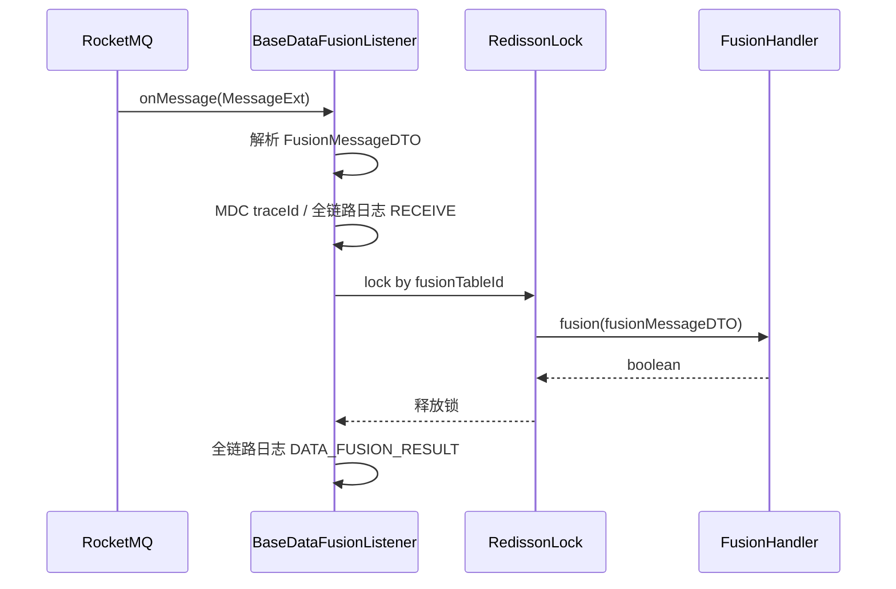

联调 / 补偿还可通过 HTTP：`POST /api/mix/sendMixMessage` → 同样调用 `FusionHandler#fusion`。

### 1\.2 入参 FusionMessageDTO

`[FusionMessageDTO](../src/main/java/org/onedata/iscm/modular/fusion/dto/FusionMessageDTO.java)` 承载本次触发融合所需的定位信息：

|字段|用途|
|---|---|
|`fusionTableId`|融合订阅主表 ID（加锁键、查订阅）|
|`subTableName`|触发源子表名，如 `ship` / `port` / `terminal`，映射为 `FusionDataTypeEnum`|
|`subId`|扩展源订阅 subId|
|`dataId`|本次更新对应的 Mongo 原始数据 ID|
|`customerId`|客户 ID|
|`carrierCd`|数据源代码（港区场景会用于 yxbPortCd 等）|
|`jobId` / `taskId`|全链路日志关联|
|`firstSub`|是否该源首次拿到数据（影响 Mongo 快照策略）|
|`skipPush`|已有 fusionDataId 时是否跳过 API 推送|

---

## 2\. FusionHandler\#fusion 总览

核心方法：`[FusionHandler.java](../src/main/java/org/onedata/iscm/modular/fusion/handler/FusionHandler.java)` 第 97–171 行。

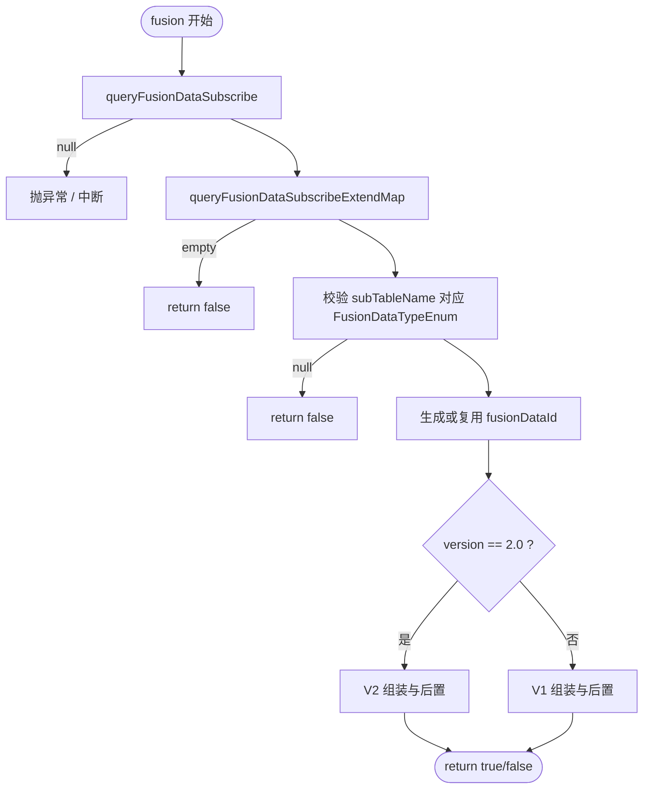

### 2\.1 阶段划分

|阶段|方法|说明|
|---|---|---|
|**准备**|`queryFusionDataSubscribe`|Feign 回写 dataId 并拉取主表 \+ 扩展源列表|
|**准备**|`queryFusionDataSubscribeExtendMap`|扩展源按 type 建 Map，同 type 冲突时择优|
|**准备**|校验 \+ `fusionDataId`|雪花 ID 或复用已有 `data.fusionDataId`|
|**组装（核心）**|`CombinationStrategy` / `CombinationStrategyV2`|多源回查 \+ 映射 \+ 最终融合；详见 **第 4 章**|
|**持久化**|`saveToMongo`|写融合结果 \+ 上一版快照 \+ 变更标记|
|**首次**|`saveOrUpdateByFirstRecordByV1/V2`|箱动态 / 航段首次值|
|**元数据**|`updateFusionRecord`|首次融合时回写主表 `dataId`|
|**调度**|`closePortScheduleJob`|港区场景关闭冗余 Job|
|**下游**|`sendDataModifyPushMQ`|有变更时 API 推送 MQ|
|**下游**|`sendChargeOrderMsg`|计费「有数据」通知|
|**v1 独有**|`warningPush`|预警|
|**v1 独有**|`fusionToWebService.convertFusionWeb`|Web 消费侧融合视图|

---

## 3\. 准备阶段详解

### 3\.1 查询融合订阅 queryFusionDataSubscribe

```Java
*// FusionHandler#queryFusionDataSubscribe*
FusionDataExtendDTO param = ... *// 来自 FusionMessageDTO*
TraceFusionDataSubscribeAndExtendVO vo =
    traceFusionDataSubscribeApi.modifyDataIdAndQueryByDTO(param);
```

**作用**：

1. 调用排期服务 `TraceFusionDataSubscribeApi`，在扩展源上**更新本次 dataId** 并**一次性查出**融合主表 \+ 全部扩展源（`extendList`）。

2. 拷贝为内部 DTO `TraceFusionDataSubscribeAndExtendDTO`，并记录 `currentTaskSubTableName`（本次 MQ 触发的子表名）。

若返回 `null`，`Objects.requireNonNull` 直接失败，融合不进行。

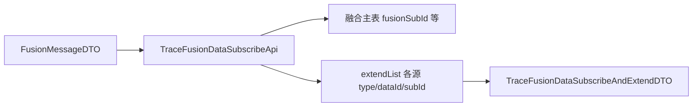

### 3\.2 扩展源 Map queryFusionDataSubscribeExtendMap

将 `data.getExtendList()` 转为 `Map<Integer, TraceFusionDataSubscribeExtendVO>`，**key 为 ****`FusionDataTypeEnum`**** 的 code（type）**。

同 type 多条扩展记录时的合并规则（简化）：

- 两条都有 `dataId` 或都没有：取 `updateTime` 较新者

- 仅一条有 `dataId`：取有 dataId 者

后续各组合器通过 `fusionDataSubscribeMap.get(SHIP/PORT/TERMINAL...)` 取对应扩展行。

### 3\.3 校验与 fusionDataId

```Java
FusionDataTypeEnum dataTypeEnum = FusionDataTypeEnum.findDataTypeEnumByName(fusionMessageDTO.getSubTableName());
```

- `subTableName` 无法映射 → `return false`（不是可融合类型）

- `fusionDataSubscribeMap` 为空 → `return false`

`fusionDataId`：

- 主表尚无 `fusionDataId` → `IdUtil.getSnowflakeNextId()`，`needUpdateFusionDataId = true`

- 已有 → 解析 Long，`needUpdateFusionDataId = false`

该 ID 同时作为 Mongo 融合结果文档 `_id`。

### 3\.4 版本分流

```Java
private boolean isVersion2(TraceFusionDataSubscribeAndExtendVO data) {
    return Constants.FusionVersion.VERSION_2.equals(data.getVersion()); *// "2.0"*
}
```

|条件|策略类|结果 DTO|
|---|---|---|
|`version == "2.0"`|`CombinationStrategyV2`|`MongoBookingInfoDTOV2`|
|其他|`CombinationStrategy`|`MongoBookingInfoDTO`|

## 4\. 数据组装阶段（Combination）— 核心

> 第 3 阶段只做「查订阅、定版本、定 fusionDataId」；第 5 阶段及之后是「落库、比对变更、发 MQ」。  
> 
> **真正决定对外箱动态、航段、完成态、多源优先级的逻辑，全部集中在 Strategy 编排 \+ 各源 Combination \+ EndFusion。**
> 
> 

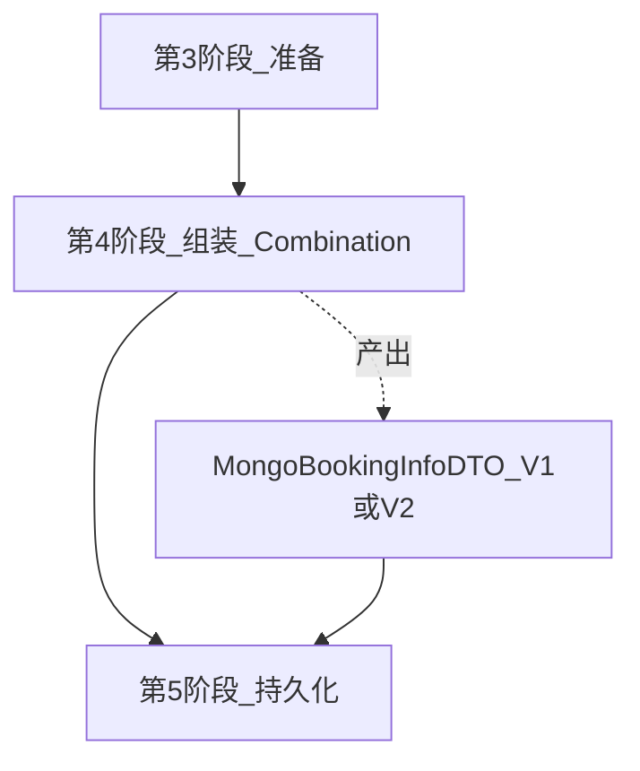

### 4\.0 角色分工：Strategy 与 Combination

|角色|类|职责|
|---|---|---|
|**策略**|`CombinationStrategy` / `CombinationStrategyV2`|决定跑哪些源、顺序、实例化哪个组合器、调用 EndFusion、填充 statusKey/routeKey|
|**来源组合器**|`*Ship/Port/Terminal*Combination`|单源：`queryOriginalData` \+ `filler`，向**同一个** `bookingInfo` 累加字段|
|**最终融合器**<br>|`EndFusionCombinationV1/V2`<br>|不回查 ODS；读 `fusionDataTypeOriginalDataMap` \+ 当前 `bookingInfo`，生成 `source=0` 并补 AIS/TRACE|

两类组合器都实现 `[Combination](../src/main/java/org/onedata/iscm/modular/fusion/handler/comb/Combination.java)` 接口，但 EndFusion **不继承** `AbstractCombination`。

**贯穿全流程的两个共享对象：**

1. **`bookingInfo`**（`MongoBookingInfoDTO` 或 V2）— 被各源 `execute(bookingInfo)` **原地累加**；SHIP/PORT/TERMINAL 往同一对象上 append 箱动态（带各自 `source`）。

2. **`fusionDataTypeOriginalDataMap`** — 每个源执行完后放入 `[FusionDataTypeOriginalData](../src/main/java/org/onedata/iscm/modular/fusion/dto/FusionDataTypeOriginalData.java)`（原始 JSON \+ `JavaType`），供 EndFusion 按源反序列化做优先级判断，而不必再查 Mongo。


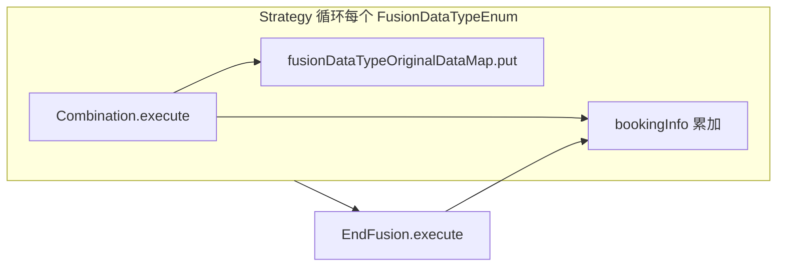

---

### 4\.0\.1 combination 完整继承层次

> 普通来源组合器大多继承 `AbstractCombination`，复用 `execute -> beforeHandler -> queryOriginalData -> filler -> afterHandler` 模板流程。最终融合器例外：`EndFusionCombinationV1` 和 `EndFusionCombinationV2` 直接实现 `Combination`，因为它们不回查单一原始来源，而是基于前面来源的快照生成最终 `source=0`。
> 
> 

```Java
Combination (接口)
├── **AbstractCombination<OD, DATA>**
│   ├── **AbstractShipCombination<DATA>**
│   │   ├── ShipCombinationV1
│   │   │   ├── ExportShipCombination
│   │   │   └── ImportShipCombination
│   │   └── ShipCombinationV2
│   │       ├── ExportShipCombinationV2
│   │       │   └── ExportMilShipCombination
│   │       │       └── ExportMilShipCombinationByTCLC
│   │       └── ImportShipCombinationV2
│   ├── **AbstractPortCombination<DATA>**
│   │   ├── PortCombinationV1 → ExportPortCombination / ImportPortCombination
│   │   └── PortCombinationV2 → ExportPortCombinationV2 / ExportMilPortCombination
│   │                         / ImportPortCombinationV2 / PortCombinationV2ByContainer
│   ├── **AbstractTerminalCombination<DATA>**
│   │   ├── TerminalCombinationV1 → ExportTerminalCombination / ImportTerminalCombination
│   │   ├── TerminalCombinationV2 → ExportTerminalCombinationV2 / ExportMilTerminalCombination
│   │   │                         / ImportTerminalCombinationV2 / TerminalCombinationV2ByContainer
│   │   └── UserTerminalCombination
│   ├── CustomsCombination → ExportCustomsCombination / ImportCustomsCombination
│   ├── StationCombination → ExportStationCombination
│   ├── UsNatCombination → ExportUsNatCombination
│   └── ExportWharfCombination
├── **EndFusionCombinationV1** → ExportEndFusionCombination / ImportEndFusionCombination
└── **EndFusionCombinationV2** → ExportEndFusionCombinationV2 / ImportEndFusionCombinationV2
                            / ExportEndFusionCombinationV2ByContainer / ImportEndFusionCombinationV2ByContainer
                            / ExportMilEndFusionCombination / ExportMilEndFusionCombinationByTCLC
```

### 4\.1 组合器通用模板 AbstractCombination

`[AbstractCombination#execute](../src/main/java/org/onedata/iscm/modular/fusion/handler/comb/AbstractCombination.java)` 是所有来源组合器的统一生命周期：

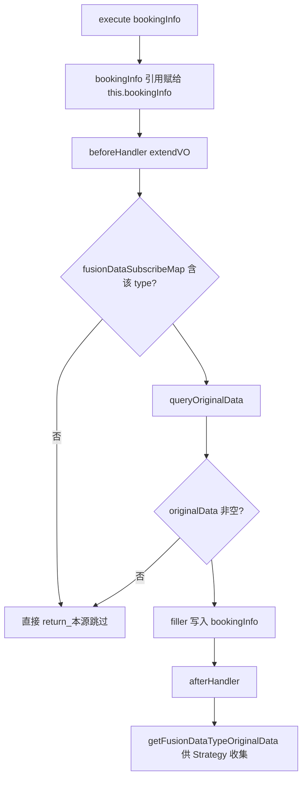

**beforeHandler / afterHandler**：子类扩展点。例如出口港区 `[ExportPortCombination#beforeHandler](../src/main/java/org/onedata/iscm/modular/fusion/handler/comb/v1/impl/e/ExportPortCombination.java)` 可能在用户未指定支持港区时，根据船司航段**反查并发起港区子订阅**（`callSubPortApi`）。

**queryOriginalData**：用扩展源 `TraceFusionDataSubscribeExtendVO.dataId` 读 ODS Mongo，再经 `*ConversionV2` / `*ToFusionConversion` 转为融合层 DTO。

|来源|抽象类|典型 ODS 集合|回查结果类型（示例）|
|---|---|---|---|
|SHIP|`AbstractShipCombination`|`ODS_SHIP_DOWNLOAD_DATA`|`MongoShipBookingInfoDTO`|
|PORT|`AbstractPortCombination`|`ODS_PORT_DOWNLOAD_DATA`|`PortBookingInfoDTO`|
|TERMINAL|`AbstractTerminalCombination`|码头下载集合|码头计划 DTO|

船司回查片段（含 source 兼容）：

```Java
*// AbstractShipCombination#queryOriginalData*
SeaBookingInfoDTO dto = mongoTemplate.findById(Long.valueOf(dataId), SeaBookingInfoDTO.class, ODS_SHIP_DOWNLOAD_DATA);
*// 箱上 containerStatusBySourceList 优先保留 source=3 的船司动态*
ShipBookingInfoDTO shipBookingInfoDTO = shipConversionV2.to(dto);
```

**filler**：把 `originalData` 映射进 `bookingInfo`。V1 常见写法是 `BeanUtil.copyProperties` \+ 追加 `containerStatusInfoList`（每条设置 `source=1/2/3` 等）。

**isCompleted**：是否「该源数据采集结束」。Strategy 用它写 `bookingInfo.isCompleted`（V1 只看船司；V2 见 `calculateCompleteFlag`）。

**getFusionDataTypeOriginalData**：将 `originalData` 序列化为 JSON 存入 Map，EndFusion 通过 `getData()` 还原。

> 注意：`AbstractCombination` **不是 Spring Bean**（注释写明），依赖通过 `SpringUtil.getBean` 按需获取 `MongoTemplate`、`MicroSvcSfClient` 等。
> 
> 

### 4\.2 V1 组装链路（CombinationStrategy）

入口：`[CombinationStrategy#createBookingInfoDTO](../src/main/java/org/onedata/iscm/modular/fusion/strategy/CombinationStrategy.java)`

#### 4\.2\.1 编排代码在做什么

```Java
MongoBookingInfoDTO bookingInfo = new MongoBookingInfoDTO();
***// ① 按固定顺序执行三源组合器，并收集原始快照 Map***
Map<FusionDataTypeEnum, FusionDataTypeOriginalData> map =
    createBookingInfoDTO(bookingInfo, data, fusionDataSubscribeMap,
        FusionDataTypeEnum.SHIP, FusionDataTypeEnum.PORT, FusionDataTypeEnum.TERMINAL);
***// ② 进出口分支选择 EndFusion 实现类***
EndFusionCombinationV1 end = PortTradeTypeEnum.I.equals(...) ? new ImportEndFusionCombination(...) : new ExportEndFusionCombination(...);
end.execute(bookingInfo);
*// ③ 为首次记录准备 key*
fillStatusKey(bookingInfo);
fillRouteKey(bookingInfo);
```

内层循环（`createBookingInfoDTO` 私有重载）对每个 `FusionDataTypeEnum`：

```Java
combination.setFusionDataTypeOriginalDataMap(fusionDataTypeOriginalDataMap); *// 传递已累计的快照*
combination.execute(bookingInfo);
if (SHIP.equals(fusionDataTypeEnum)) {
    isCompleted = combination.isCompleted();  *// 仅船司参与完成态*
}
fusionDataTypeOriginalDataMap.put(fusionDataTypeEnum, combination.getFusionDataTypeOriginalData());
bookingInfo.setIsCompleted(isCompleted ? "Y" : "N");
```

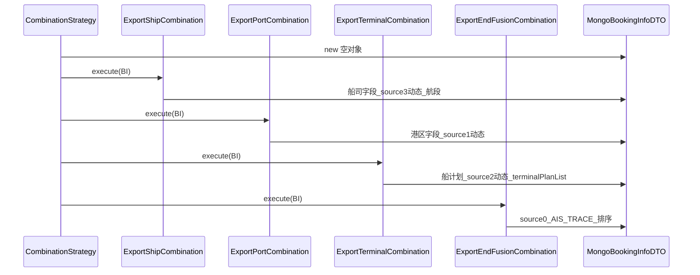

#### 4\.2\.2 三源组合器各自写什么（V1）

三源在 `CombinationStrategy#createBookingInfoDTO` 中**固定顺序**执行：`SHIP → PORT → TERMINAL`，共用同一 `MongoBookingInfoDTO` 与递增的 `fusionDataTypeOriginalDataMap`（后执行的源可读前面源已写入的快照）。类注释也写明融合优先级：**船司 → 港区 → 船计划**。

三者都走 `AbstractCombination#execute` 同一模板，但各阶段职责不同：

```Plain Text
beforeHandler(扩展源 VO)  →  queryOriginalData  →  filler  →  afterHandler
         │                         │                  │              │
    多为订阅副作用              回查 ODS / 船计划      写入 bookingInfo   多为下游订阅
```

|维度|SHIP|PORT|TERMINAL|
|---|---|---|---|
|扩展源 type|`FusionDataTypeEnum.SHIP`|`PORT`|`TERMINAL`|
|原始数据 Mongo 集合|`ODS_SHIP_DOWNLOAD_DATA`|`ODS_PORT_DOWNLOAD_DATA`|经 `TerminalDataFusion` 按港区箱船名航次查船计划|
|是否强依赖前序源|否（第一个执行）|弱依赖：箱补偿/过滤读 `fusionDataTypeOriginalDataMap` 中船司快照|**强依赖港区**：`queryOriginalData` 从港区箱提取船名航次；`filler` 读船司\+港区快照做过滤|
|写入 `containerInfoList`|V1 **不写**（MapStruct 忽略箱列表）|**覆盖/设置**（`portToFusionConversion.toList`）|不改箱列表，只按已有箱号扩动态|
|写入 `containerStatusInfoList`|追加 **source=3**<br>|追加 **source=1**<br>|按箱展开追加 **source=2**|
|其它 booking 字段|订舱主信息、`routingInfoList`、`portInfoList`、出口时间字段等|出口在「船司起运港=港区代码」时补码头/船名等|`terminalPlanList`；出口可写 `etdPol`/`atdPol`|
|`isCompleted` 对 Strategy 的影响|**唯一有效**：写 `bookingInfo.isCompleted`|`PortCombinationV1` 固定 `true`（Strategy 不读）|`AbstractTerminalCombination` 固定 `true`|
|典型副作用|无|`beforeHandler` / `afterHandler` 可能调排期 API **订阅港区、船计划**|一般不订阅；订阅在港区 `afterHandler` 完成|

箱动态来源编号（`StatusSourceEnum`）：港区 **1**、船计划 **2**、船司 **3**；**source=0（运小宝）** 仅在后续 `EndFusionCombinationV1` 生成。三源跑完后，列表里通常是同一业务节点、不同 `source` 的多条并存。

---

##### 共性：execute 何时直接返回

扩展源 `fusionDataSubscribeMap` 中**没有该 type** 或 `dataId` 为空 → `queryOriginalData` 为 null → **不执行 filler**（`bookingInfo` 保持上一源结果）。

`getFusionDataTypeOriginalData()` 在各源 `filler` 成功后由 Strategy 放入 Map，供 TERMINAL 过滤与 EndFusion 反序列化使用。

---

##### SHIP — `ShipCombinationV1` / `ExportShipCombination` / `ImportShipCombination`

**定位**：V1 的「地基」——订舱主数据、船司轨迹、航段/港维度清洗；**完成态只看船司**。

**1\. queryOriginalData（****`AbstractShipCombination`****）**

- 按扩展源 `dataId` 查 `ODS_SHIP_DOWNLOAD_DATA` → `SeaBookingInfoDTO`。

- 箱上 `containerStatusBySourceList`：**优先只保留 ****`source=3`**** 的船司动态**写入 `cntrStatusList`，再经 `ShipConversionV2` 转为 `ShipBookingInfoDTO` / `MongoShipBookingInfoDTO`。

- 附带 `originalEtd` / `originalEta` / `isCancel` 供融合结果使用。

**2\. filler（****`ShipCombinationV1#filler`****）**

- `shipToFusionConversion.to(originalData)`：`BeanUtil.copyProperties` 到 `bookingInfo`，写入提单/订舱/船司/港口五字码、`routingInfoList` 等主字段。

- **刻意不映射**：`containerInfoList`、`containerStatusInfoList`（在 `ShipToFusionConversion` 中 ignore）。

- `ShipToFusionConversionDecorator` 单独遍历船司箱，把每条箱动态转为 `ContainerStatusInfoDTO` 并设 **`source=3`**，过滤 **`GOD`** 节点，写入 `containerStatusInfoList`（带箱号）。

- 再写：`originalEta` / `originalEtd` / `isCancel`。

- **`fillerPortInfoList`**：按箱号聚合 `routingInfoList`（无航段时用 pol/dtp 造简易航段），交 `RoutingStrategy` 生成 **`portInfoList`**，供港区地点匹配与后续逻辑使用。

**3\. 出口特化（****`ExportShipCombination`****）**

在 `super.filler()` 之后额外：

- 订舱级：`etdPol`、`etaPld`、`ataPld`。

- **`fillerBaseInfoForContainerInfoStatus`**：从船司箱动态中，地点与 **pol** 匹配且节点为 LOAD/DPOL/LOFV/FVD 的，取最早时间填 **`terminalPol`**；地点匹配 APOD/DIPOD 的取最晚时间填 **`terminal`**** / ****`vslNameEnL`**** / ****`voyL`**。

**4\. 进口（****`ImportShipCombination`****）**

- 无额外 `filler`，仅继承 `ShipCombinationV1` 行为。

**5\. isCompleted**

- `originalData.getIsCompleted() == "Y"` → true；Strategy **仅在 SHIP 执行后**更新 `bookingInfo.isCompleted`。

**6\. 与后两源的差异要点**

- **唯一**在 V1 三源中向 `bookingInfo` 写入 **`routingInfoList`**、**`portInfoList`** 和船司 **`containerStatusInfoList`**。

- **不维护** `containerInfoList`（箱清单由港区组合器写入）。

- 不调用排期订阅 API；`beforeHandler` / `afterHandler` 为空。

---

##### PORT — `PortCombinationV1` / `ExportPortCombination` / `ImportPortCombination`

**定位**：箱货清单 \+ 把港区箱货字段**翻译成标准箱动态（source=1）**；并承担「没订港区时帮订」「查完帮订船计划」的编排。

**1\. beforeHandler — 订阅副作用（无数据也执行）**

|分支|条件|行为|
|---|---|---|
|出口 `ExportPortCombination`|主表 `portCd` 已是支持的 `PortTerminalCdEnum`|直接 return|
|出口|否则|用 `bookingInfo` 的 pol/中转港或 `routingInfoList` 推标准港区码 → **`callSubPortApi`** 创建港区订阅|
|进口 `ImportPortCombination`|非盐田/蛇口支持的港区码|多数情况 return，走船司目的港逻辑|
|进口|盐田/蛇口|`portCdToStandardCd(dtpCd, portCd)` → **`callSubPortApi`**|

进口盐田/蛇口订阅时，`buildPortSubscribeDTO` 会通过 **`getShipContainerNumbers()`**（来自当前 `bookingInfo.containerStatusInfoList` 的箱号）写入扩展字段。

**2\. queryOriginalData（****`AbstractPortCombination`****，进口 ****`ImportPortCombination`**** 略改）**

三步链式处理：

1. **`queryPortOriginalData`**：`ODS_PORT_DOWNLOAD_DATA` → `PortBookingInfoDTO`。

2. **`containerSupplementHandler`**：依赖 Map 中**船司快照**做箱号补偿（出口：船司已有 ECPU/GIPOL/LOAD/DPOL 等实际节点但港区为空时触发箱号查港区；进口：APOD/DIPOD/GOPOD 等；盐田/蛇口跳过补偿）。含「港区长期 99 转箱号查」等配置逻辑。

3. **`filterPortContainerInfo`**：上海/宁波等港的特殊箱过滤（出口退关重箱、进出口标志、乍浦码头等）。

**3\. filler（****`PortCombinationV1#filler`****）**

- 无原始数据 → 直接 return。

- **`fillerBaseInfo()`**：子类实现；出口在 **船司 ****`polCd`**** == 港区 ****`carrierCd`** 时用港区补中转港、起运码头、头程船名航次（`StringUtils.defaultIfBlank`，不覆盖船司已有值）；进口写目的港码头、`vslNameEnL`/`voyL`。

- **`containerInfoList`**：`portToFusionConversion.toList` → **覆盖** `bookingInfo.containerInfoList`（V1 箱清单以港区为准）。

- **`fillerContainerStatusInfoList`**：子类把港区箱货时间映射为标准节点，统一 **`source=1`**、`isEst=N`（海放/码放等按标志可 skip 空时间）。

**出口箱动态映射示例**（均需通过上海码头校验 \+ `DataFilterTools.portStatusDescHasExportFull`）：

|节点|来源字段|
|---|---|
|CDPOL|海放时间 / 海放标志|
|TDPOL|码放时间 / 码放标志|
|DPOL / GIPOL / LOAD|仅当 **船司起运港五字码 = 港区 carrierCd**|

**进口箱动态映射示例**：

|节点|来源字段|
|---|---|
|APOD|ataPol|
|DIPOD|卸船时间，空则进场|
|CDPOD / TDPOD|海放 / 码放|
|GOPOD|出场（需 `hasAppearanceMode`）|

**4\. afterHandler（****`AbstractPortCombination`****）**

- 港区有箱且能解析船名航次 → **`batchSaveTerminalSubscribeRecordByFusionData`**，并在 `fusionDataSubscribeMap` 放入 TERMINAL 扩展占位（供下次或同轮船计划查询）。

**5\. isCompleted**

- `PortCombinationV1` **固定 ****`return true`**；抽象类里虽有「港区 isCompleted」实现，但 V1 子类覆盖后 Strategy **从不据此改完成态**。

**6\. 与 SHIP / TERMINAL 的差异要点**

- **唯一**维护 V1 **`containerInfoList`**（船司只写动态不写箱表）。

- 箱动态是**手工 ****`buildContainerStatusInfoDTO`**，不是港区 ODS 里现成的 status 列表。

- **`getShipContainerNumbers()`** 读的是 SHIP 已写入的 `containerStatusInfoList` 箱号，用于订阅/补偿。

- 强依赖 **`fusionDataTypeOriginalDataMap.get(SHIP)`** 做 `portCdIsNeq`、箱补偿、过滤。

---

##### TERMINAL — `TerminalCombinationV1` / `ExportTerminalCombination` / `ImportTerminalCombination`

**定位**：在已有箱清单与港区箱货基础上，回查**船计划**，写 **`terminalPlanList`**，并把计划时间落成 **source=2** 箱动态；大量逻辑是「该不该给这个箱加这条计划动态」。

**1\. queryOriginalData（****`AbstractTerminalCombination`****）**

- **出口默认**：从 `fusionDataTypeOriginalDataMap` 的 **港区** `PortBookingInfoDTO.containerInfoList` 提取船名/航次/码头（出口还要求 `portStatusDescHasExportFull`），去重合并为 `TerminalSubscribeParamInfoDTO` 列表 → `TerminalDataFusion` 查 Mongo。

- **进口 ****`ImportTerminalCombination`**：走 **`queryOriginalDataForExtendInfo`**，从 TERMINAL 扩展源 `otherInfo`（港区 `afterHandler` 写入的 vslName/voy）\+ 港区码头查船计划。

- 无港区箱或无法组查询参数 → 返回空列表，后续 filler 只处理空计划。

**2\. filler（****`TerminalCombinationV1#filler`****）**

- `terminalToFusionConversion.toList(originalData)` → **`terminalPlanList`**（船计划明细快照）。

- **`createContainerStatusInfoList`**（子类）：先把计划转成「模板动态」列表（**尚未带箱号**）。

- **`fillerContainerStatusInfoList`**（基类私有）：

    - 遍历 **`bookingInfo.containerInfoList`**** 的每个箱号** × 模板动态；

    - 每条复制为 `ContainerStatusInfoDTO` 并设箱号；

    - 经 **`needAddTerminalStatusToContainerStatusList`** 过滤后才 append 到 `containerStatusInfoList`。

**出口 ****`ExportTerminalCombination`**** 模板动态**（仅当 **船司 polCd == 港区 carrierCd**，否则 `createContainerStatusInfoList` 返回空）：

|节点|计划字段|isEst|
|---|---|---|
|DPOL|atd|实际|
|ETD|etd|预计|

**进口 ****`ImportTerminalCombination`**** 模板动态**（地点取港区卸货港/目的港）：

|节点|计划字段|
|---|---|
|ETA / APOD\(预计\)|eta|
|APOD\(实际\)|ata|
|BPOD\(预计/实际\)|etb / atb|

**3\. 过滤链（****`needAddTerminalStatusToContainerStatusList`****，出口比进口多一层）**

典型判断顺序（出口）：

1. **`needAddTerminalByMatchTerminal`**：青岛等需计划与箱码头匹配（`matchContainerTerminal`）。

2. **佳农逻辑（****`AbstractTerminalCombination#needAddTerminalStatus...`****）**：对 **实际** 的 APOD/BPOD/DPOL，若订阅含船司且该箱船司侧无 LOFV/LOAD（或扩展船司名单下无 LOFV/FVD/LOAD/DPOL），**不补**船计划时间。

3. **`needAddTerminalDepartureStatus`**（出口）：计划船名航次须与**港区箱**一致（上海航次用互相包含）；实际 DPOL/DEIP 在上海港还要求上海码头 \+ 装船出场；非上海港要求港区有装船或出场时间等。

进口子类**去掉**码头匹配、开航补偿等出口专用步骤，仅保留佳农船司节点判断。

**4\. 出口基本信息 ****`fillerBaseInfo`****（****`ExportTerminalCombination`****）**

在 `super.filler()` 后，当船司/港区起运港一致时：

- **`etdPol`**：匹配码头的计划 **etd 最早** 值。

- **`atdPol`**：优先港区箱 **atd** 最小值；否则在满足 `terminalTimeNeedFillBaseInfoAtd`（上海/宁波：列表中须已有实际 **LOAD** 才用计划 atd）时取计划 atd。

**5\. isCompleted**

- 恒为 **true**，不参与业务完成态。

**6\. 与 SHIP / PORT 的差异要点**

- **不回写** `containerInfoList`，只对已有箱做动态展开（一计划模板 × N 箱）。

- 原始数据类型是 **`List<MongoShipScheduleInfoDTO>`**，不是单票 SeaBooking ODS 文档。

- **不能独立跑通**：无港区（或无进口 extend otherInfo）则 `queryOriginalData` 为空。

- 动态 **`source=2`**，节点集合与港区手工映射的节点**部分重叠**（如 DPOL、APOD），供 EndFusion 按优先级择一。

---

##### 三源执行结束时的 `bookingInfo` 形态

```Plain Text
bookingInfo
├── 主字段（船司为主，港区/出口船计划补 etd/atd 等）
├── containerInfoList          ← 主要来自 PORT
├── routingInfoList / portInfoList  ← 仅 SHIP
├── terminalPlanList           ← TERMINAL
├── containerStatusInfoList    ← SHIP(3) + PORT(1) + TERMINAL(2) 追加，尚无 source=0
└── isCompleted                ← 仅反映船司 isCompleted
```

下一步由 **4\.2\.3 ****`EndFusionCombinationV1`** 做箱合并、AIS/TRACE 补点、按节点生成 **source=0** 及排序。

#### 4\.2\.3 EndFusionCombinationV1 — 最终融合五步法

类：`[EndFusionCombinationV1](../src/main/java/org/onedata/iscm/modular/fusion/handler/comb/v1/EndFusionCombinationV1.java)`  

出口特化：`[ExportEndFusionCombination](../src/main/java/org/onedata/iscm/modular/fusion/handler/comb/v1/impl/e/ExportEndFusionCombination.java)`（重写 `needPriority`、`buildPriorityContainerStatusInfoList`）

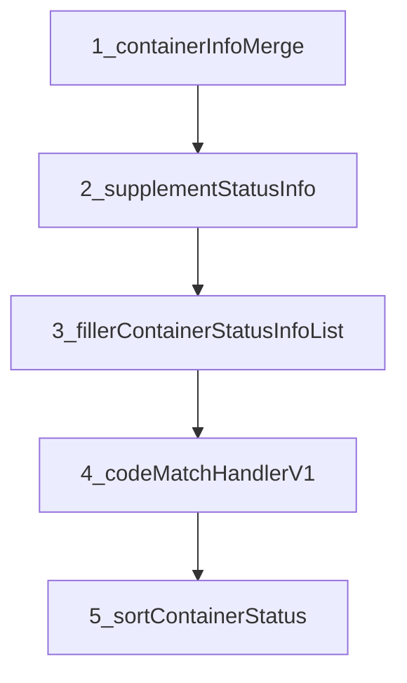


|步骤|方法|作用|
|---|---|---|
|1|`containerInfoMerge`|以船司箱为基准：港区已有箱则补 `lastFreeDate`、箱型箱尺；仅船司有的箱整箱追加|
|2|`supplementStatusInfo`|按箱遍历，用三源实际动态驱动 **AIS（source=4）**、**TRACE（source=5）** 补点；结果 append 到同列表|
|3|`fillerContainerStatusInfoList`|遍历每个 `ContainerStatusEnum` × 实际/预计，按优先级从多源选出一条，**复制为 source=0** 追加（不删除原 source 记录）|
|4|`codeMatchHandlerV1`|地点五字码等硬匹配修正|
|5|`sortContainerStatus`|按 source → 箱号 → 时间 → 节点 index 排序|

**步骤 1 — 箱信息合并 ****`containerInfoMerge`****（逻辑摘要）**

1. 从 `fusionDataTypeOriginalDataMap.get(SHIP)` 取船司箱列表；无船司箱则直接返回。

2. 若 `bookingInfo.containerInfoList` 已有（主要来自港区）：逐箱用船司补 `lastFreeDate`；港区无 size/type 时用船司补。

3. 船司有、港区/当前列表没有的箱：新建 `ContainerInfoDTO` 加入列表。

**步骤 2 — 补全动态 ****`supplementStatusInfo`**

对每个箱号：

- 将已有动态按 `source` 分成 port / terminal / ship 三个 Map（key = `md5(statusCd + isEst)`）。

- 对 AIS 需要的节点集合，若 `needPriority(statusEnum)` 为 true，则走 `buildPriorityContainerStatusInfoList`（默认：**港区 → 船计划 → 船司**）；否则只取船司实际值。

- 将选出的实际动态交给 `supplementStatusInfoAisAndOther`：先 `AisSupplementHandler`，再 `CommonSupplementHandler`（TRACE）。

- 补全结果 **追加** 到 `containerStatusInfoList`（新记录的 source 为 4/5）。

**步骤 3 — 生成 source=0 ****`fillerContainerStatusInfoList`**

对每个箱号、每个 `ContainerStatusEnum`、实际/预计两类：

1. 将当前列表按 `source` 转为 `ContainerStatusInfoBySourceDTO`。

2. 若 `needPriority(statusEnum)`：

    - **出口** `[ExportEndFusionCombination](../src/main/java/org/onedata/iscm/modular/fusion/handler/comb/v1/impl/e/ExportEndFusionCombination.java)` 对 GIPOL/CDPOL/TDPOL/LOAD/DPOL/ETD/APOD 及中转节点等返回 true。

    - 调用 `findContainerStatusInfoListByPriority`，内部规则包括：

        - **GIPOL / CDPOL / TDPOL**：港区 → 船司（跳过船计划）

        - **APOD**：单独 `findApodStatusInfoListByPriority`（预计/ETA 复杂规则）

        - **中转类节点**：`transferContainerStatusInfoListByPriority`

        - **默认**：港区 → 船计划 → 船司 → AIS → TRACE（按 Map 列表顺序取第一个非空）

3. 若 `needPriority` 为 false：**只取船司** 对应 key 的动态。

4. `FusionStatusTool.removeStatus`：按船司/港区/上海码头/AIS\-DPOL 等条件剔除不应展示的节点。

5. `buildContainerStatusInfoList`：将选中记录 **reConvert 并设 ****`source=0`****（YXB）** 追加到列表（与 source=1/2/3 并存）。

6. `fillStatusPlaceCode`：调用 `microSvcSfClient.getStandardPortCode` 填地点五字码。

**出口 buildPriority 与默认实现的差异（CDPOL/TDPOL 只取港区）：**

```Java
*// ExportEndFusionCombination#buildPriorityContainerStatusInfoList*
if (CDPOL || TDPOL) return portMap.get(key);
if (GIPOL) return portMap.get(key) ?? shipMap.get(key);
*// 其他: super → 港区 → 船计划 → 船司*
```

**source 含义（组装结束后列表中可能同时存在）：**

|source|枚举|含义|
|---|---|---|
|0|YXB|EndFusion 输出的**对外主结果**|
|1|PORT|港区原始动态|
|2|TERMINAL|船计划原始动态|
|3|SHIP|船司原始动态|
|4|AIS|AIS 补全|
|5|TRACE|物流可视补偿|

#### 4\.2\.4 Strategy 收尾：statusKey / routeKey

`[CombinationStrategy#fillStatusKey](../src/main/java/org/onedata/iscm/modular/fusion/strategy/CombinationStrategy.java)` 为每条动态生成 `statusKey`（箱号 \+ source \+ 动态内容），供第 6 阶段「首次记录」使用。  

`fillRouteKey` 为 ETA/ETD 航段生成 `etaRoutingKey` / `etdRoutingKey`。

---

### 4\.3 V2 组装链路（CombinationStrategyV2）

入口：`[CombinationStrategyV2#createBookingInfoDTOV2](../src/main/java/org/onedata/iscm/modular/fusion/strategy/CombinationStrategyV2.java)`

#### 4\.3\.1 与 V1 的本质差异

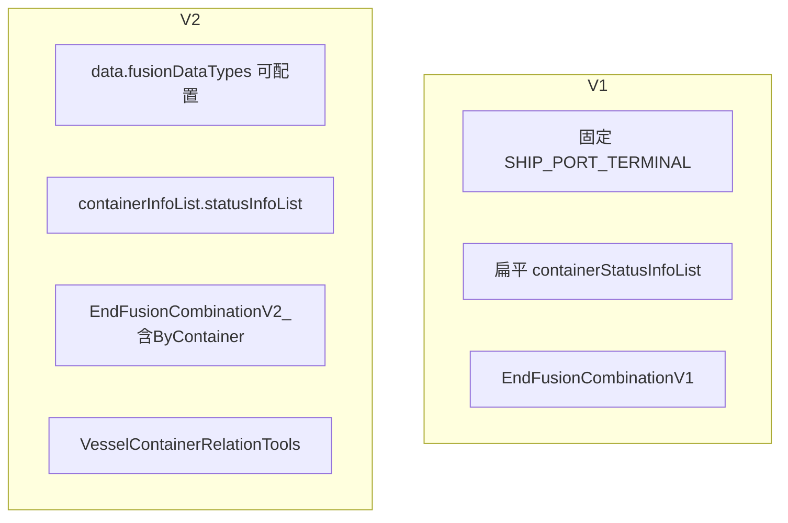

|维度|V1|V2|
|---|---|---|
|参与源|写死三源|`data.getFusionDataTypes()`，可含 CUSTOMS、STATION、US\_NAT、USER\_TERMINAL 等|
|箱动态结构|全局扁平列表|按箱嵌套在 `FusionContainerInfoDTO.statusInfoList`|
|全空|仍返回对象（可能仅空列表）|各源皆空 → `return null` → Handler 清空 dataId 并 `false`|
|完成态|仅船司 `isCompleted`|`calculateCompleteFlag`：有船司则以船司为准；无船司则除 STATION 外全部源都完成才算 Y|
|箱号订阅|无|`PortCombinationV2ByContainer`、`TerminalCombinationV2ByContainer`、`EndFusion*ByContainer`|
|Handler 后置|—|`VesselContainerRelationTools.parseContainerStatusByV2` 解析箱船关系|

#### 4\.3\.2 V2 组合器工厂（出口示例）

`[createCombinationByExport](../src/main/java/org/onedata/iscm/modular/fusion/strategy/CombinationStrategyV2.java)` 按类型实例化：

|FusionDataTypeEnum|普通订阅|箱号订阅 isContainerSub|
|---|---|---|
|SHIP|ExportShipCombinationV2|同左|
|PORT|ExportPortCombinationV2|PortCombinationV2ByContainer|
|TERMINAL|ExportTerminalCombinationV2|TerminalCombinationV2ByContainer|
|USER\_TERMINAL|UserTerminalCombination|同左|
|CUSTOMS|ExportCustomsCombination|null（跳过）|
|STATION|ExportStationCombination|null|
|US\_NAT|ExportUsNatCombination|null|

循环体与 V1 类似：`execute` → 记录 `completedMap` → 收集 `FusionDataTypeOriginalData`；额外维护 `allEmpty` 标志。

#### 4\.3\.3 EndFusion V2 与空结果

- `createEndFusionCombination` 根据进出口 \+ 是否箱号订阅选择 `ExportEndFusionCombinationV2` / `Import*` / `*ByContainer`。

- EndFusion 逻辑与 V1 同族（多源优先级 \+ source=0），但读写 **嵌套箱结构**。

- 若 `createBookingInfoDTO` 返回 `null`，`FusionHandler` 不进入 saveToMongo，并调用 `updateDataIdToNullByFusionSubId`。

```Java
if (null == bookingInfoDTO) {
    traceFusionDataSubscribeApi.updateDataIdToNullByFusionSubId(data.getFusionSubId());
    return false;
}
```

---

### 4\.4 调试第 4 阶段的建议断点

|顺序|位置|观察内容|
|---|---|---|
|1|`CombinationStrategy.createBookingInfoDTO` 循环内|每个源 `originalData` 是否为空|
|2|各源 `filler` 结束|`containerStatusInfoList` 按 source 的数量|
|3|`EndFusionCombinationV1#fillerContainerStatusInfoList`|某箱某 `ContainerStatusEnum` 选中哪条源|
|4|`buildContainerStatusInfoList`|新增的 source=0 条数|
|5|`ExportEndFusionCombination.needPriority`|出口节点是否走多源优先级|

### 4\.5 核心类索引（第 4 阶段）

|职责|路径|
|---|---|
|V1 策略|`modular/fusion/strategy/CombinationStrategy.java`|
|V2 策略|`modular/fusion/strategy/CombinationStrategyV2.java`|
|组合器模板|`modular/fusion/handler/comb/AbstractCombination.java`|
|船/港/码头抽象回查|`handler/comb/sub_table_name/Abstract*Combination.java`|
|V1 最终融合|`handler/comb/v1/EndFusionCombinationV1.java`|
|出口最终融合特化|`handler/comb/v1/impl/e/ExportEndFusionCombination.java`|
|原始快照 DTO|`modular/fusion/dto/FusionDataTypeOriginalData.java`|
|箱动态来源枚举|`common/enums/StatusSourceEnum.java`|

---

## 5\. 持久化阶段 saveToMongo

V1 / V2 各有一个 `saveToMongo` 重载，逻辑对称，以下以 V1 为例。

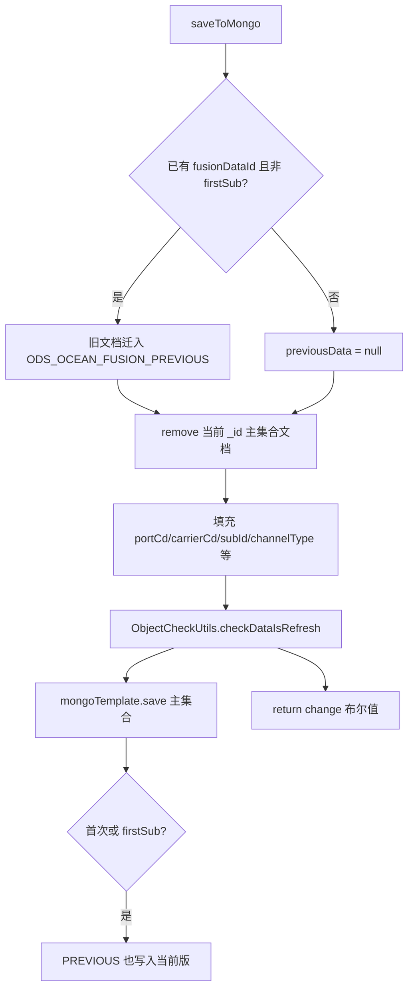

**要点**：

1. **上一版快照**：非首次且非 `firstSub` 时，先把旧 `ODS_OCEAN_FUSION_DOWNLOAD_DATA` 文档复制到 `ODS_OCEAN_FUSION_PREVIOUS_DOWNLOAD_DATA`，并继承 `queryStopCode` / `queryStopMessage`（V2 还继承 `originEtdPol` / `originEtaPod`）。

2. **先删后存**：对同一 `_id` 先 `remove` 再 `save`，保证整文档替换。

3. **变更检测**：`ObjectCheckUtils.checkDataIsRefresh(previousData, bookingInfoDTO)` 对忽略 `@JsonFieldIgnore` 等字段后的 JSON 做 MD5 比较，返回值驱动是否 API 推送。

4. **返回值 ****`change`**：仅当 `change == true` 时调用 `sendDataModifyPushMQ`（且受 `skipPush` 约束）。

---

## 6\. 首次记录 saveOrUpdateByFirstRecord

`[saveOrUpdateByFirstRecordByV1](../src/main/java/org/onedata/iscm/modular/fusion/handler/FusionHandler.java)` / V2 对称：

1. 从 `ChangeAndFirstTemplate` 按 `fusionDataId` 加载已有首次 Map

2. 按箱号遍历动态 / 航段，调用 `FirstRecordUtil.findAndPutFirstRecordsForFusionStatus/Routing`

3. 有新增首次字段则写入 `MONGO_ODS_FUSION_FIRST_CHANGE_DATA`

依赖组合阶段末尾的 `fillStatusKey` / `fillRouteKey`（在 `CombinationStrategy` 内对 statusKey、routingKey 赋值）。

---

## 7\. 元数据与调度副作用

### 7\.1 updateFusionRecord

仅当 `needUpdateFusionDataId == true`（主表首次产生融合 ID）：

```Java
traceFusionDataSubscribeApi.modifyDataIdById(fusionSubId, fusionDataId);
```

将雪花 `fusionDataId` 写回融合订阅主表，后续融合复用同一 Mongo `_id`。

### 7\.2 closePortScheduleJob

**仅当本次触发源为港区 ****`FusionDataTypeEnum.PORT`**：

1. `modifyYxbPortCdById` — 用消息里的 `carrierCd` 回填主表 `yxbPortCd`

2. 深圳港等多港区并行订阅场景：对**同融合单下其他港区扩展源**调用 `removeFusionExtendRecordAndCloseJob`，关闭冗余调度 Job

---

## 8\. 下游消息与 V1 独有逻辑

### 8\.1 API 数据推送 sendDataModifyPushMQ

条件：

- `change == true`（saveToMongo 检出内容变化）

- 且非（已有 `fusionDataId` 且 `skipPush == true`）

发送 `DataPushMessageDTO` 到 `QueueConstant.DataPush` 主题，携带 `subId`、`dataId`（fusionDataId）、`fusionDataUpdateType`（本次源类型 code）、`customerId`、`taskId` 等，由推送服务通知 API 客户。

### 8\.2 计费 sendChargeOrderMsg

组装 `TraceChargeOrderDTO`（`subTableName=FULL_LINK`、`subId`、`customerId`、箱号列表），发往计费 MQ `SUB_ID_UPDATE_HAS_DATA`。

- V1：从 `containerInfoList` \+ `containerStatusInfoList` 收集箱号

- V2：从 `containerInfoList` 收集，并可附加海关 `blNo`

### 8\.3 预警 warningPush（仅 V1）

```Java
microSvcScheduleClient.warningPush(data.getFusionSubId());
```

### 8\.4 Web 融合视图 convertFusionWeb（仅 V1）

`[FusionToWebServiceImpl#convertFusionWeb](../src/main/java/org/onedata/iscm/modular/mix/service/impl/FusionToWebServiceImpl.java)`：

1. 按 `subId` 查询 Web 侧 `ConsumeRecord` 是否存在

2. 存在则 `toWeb`：将 V1 融合结果转换为 Web 展示结构并落库 / 更新消费记录

---

## 9\. V1 与 V2 后置步骤对照

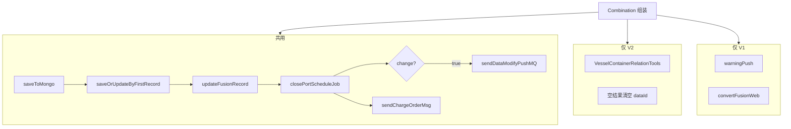

|步骤|V1|V2|
|---|---|---|
|`saveToMongo`|✓|✓|
|`saveOrUpdateByFirstRecord`|✓|✓|
|`updateFusionRecord`|✓|✓|
|`closePortScheduleJob`|✓|✓|
|`sendDataModifyPushMQ`（有变更）|✓|✓|
|`sendChargeOrderMsg`|✓|✓|
|`warningPush`|✓|—|
|`convertFusionWeb`|✓|—|
|`VesselContainerRelationTools`|—|✓|
|全源空 → `updateDataIdToNull` \+ `false`|—|✓|

---

## 10\. 返回值与失败语义

|场景|返回值|
|---|---|
|扩展源 Map 为空|`false`|
|`subTableName` 不可识别|`false`|
|V2 组装结果为 `null`（全源无数据）|`false`（并清空主表 dataId）|
|查询订阅为 null|抛异常（`requireNonNull`）|
|正常完成 V1 或 V2|`true`|

MQ 层在锁内拿到 `boolean` 后打成功全链路日志；业务上 `false` 不抛异常，仅表示本轮未产出有效融合结果。

---

## 11\. 关键类与文件索引

|职责|类 / 文件|
|---|---|
|融合总编排|`[FusionHandler.java](../src/main/java/org/onedata/iscm/modular/fusion/handler/FusionHandler.java)`|
|MQ 入口|`[BaseDataFusionListener.java](../src/main/java/org/onedata/iscm/rocketmq/listener/BaseDataFusionListener.java)`|
|V1 策略|`[CombinationStrategy.java](../src/main/java/org/onedata/iscm/modular/fusion/strategy/CombinationStrategy.java)`|
|V2 策略|`[CombinationStrategyV2.java](../src/main/java/org/onedata/iscm/modular/fusion/strategy/CombinationStrategyV2.java)`|
|组合器模板|`[AbstractCombination.java](../src/main/java/org/onedata/iscm/modular/fusion/handler/comb/AbstractCombination.java)`|
|V1 最终融合|`[EndFusionCombinationV1.java](../src/main/java/org/onedata/iscm/modular/fusion/handler/comb/v1/EndFusionCombinationV1.java)`|
|V1 结果 DTO|`[MongoBookingInfoDTO.java](../src/main/java/org/onedata/iscm/modular/fusion/dto/MongoBookingInfoDTO.java)`|
|变更检测|`[ObjectCheckUtils.java](../src/main/java/org/onedata/iscm/modular/fusion/util/ObjectCheckUtils.java)`|
|首次记录|`[FirstRecordUtil](../src/main/java/org/onedata/iscm/modular/mongo/FirstRecordUtil.java)`、`[ChangeAndFirstTemplate](../src/main/java/org/onedata/iscm/modular/mongo/ChangeAndFirstTemplate.java)`|
|箱动态来源枚举|`[StatusSourceEnum.java](../src/main/java/org/onedata/iscm/common/enums/StatusSourceEnum.java)`|

---

## 12\. 阅读建议（沿 fusion 单步调试）

1. 在 `FusionHandler#fusion` 第一行打断点，确认 `FusionMessageDTO` 与 `queryFusionDataSubscribe` 返回的 `extendList`。

2. 根据 `data.getVersion()` 进入 `CombinationStrategy` 或 `CombinationStrategyV2`，在 `AbstractCombination#queryOriginalData` 看 ODS 原始数据是否命中。

3. 在 `EndFusionCombinationV1/V2#execute` 看 `source=0` 动态如何生成。

4. 在 `saveToMongo` 看 `checkDataIsRefresh` 与 PREVIOUS 快照。

5. 在 `sendDataModifyPushMQ` / `sendChargeOrderMsg` 确认下游 MQ 是否按预期发出。

---

> *文档版本：与仓库 **`FusionHandler#fusion`** 实现同步，如有方法签名变更请以源码为准。*
> 
> 


