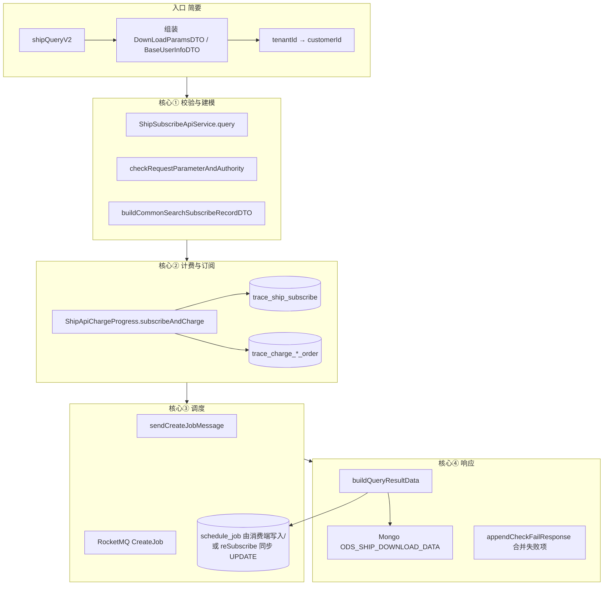
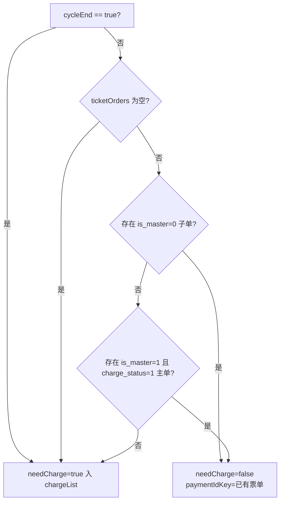
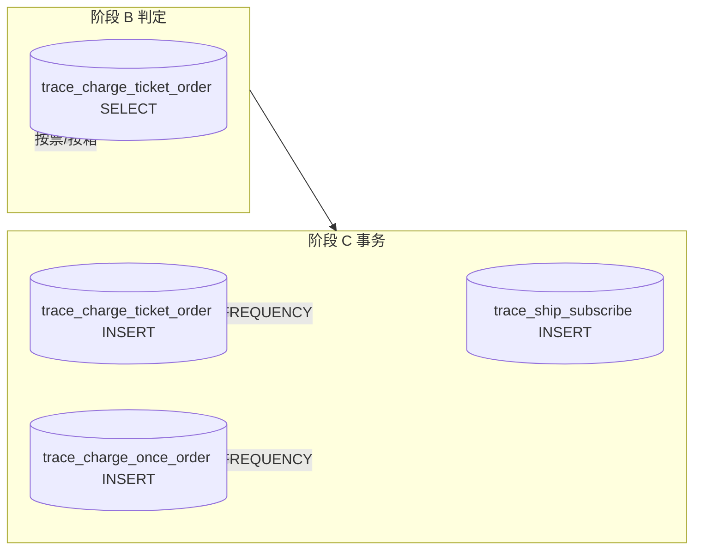
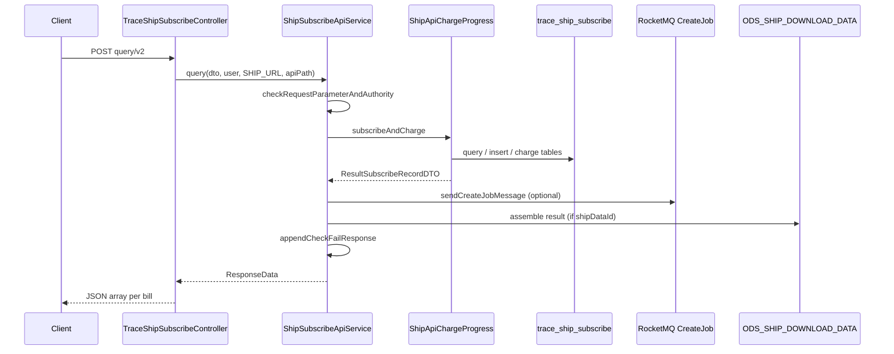
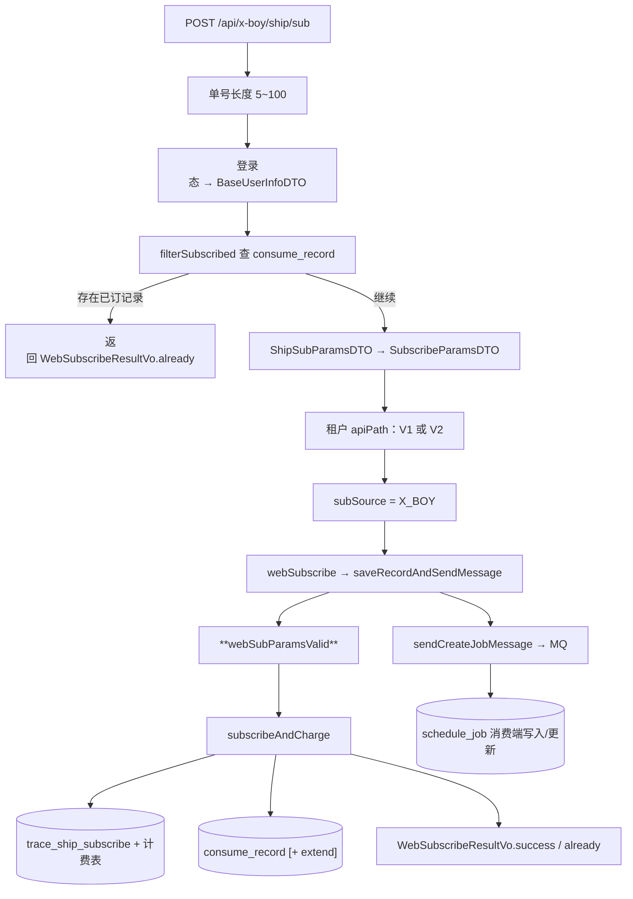
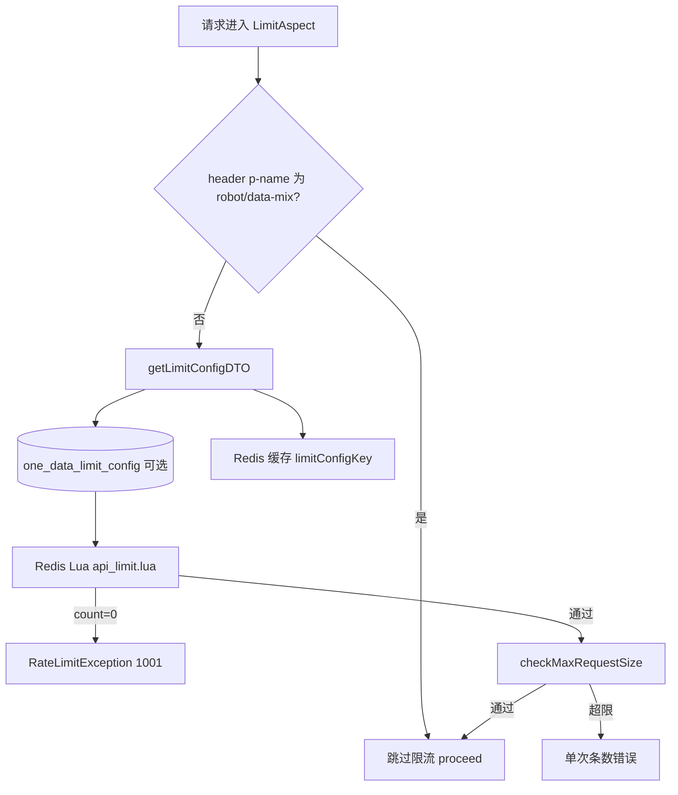

# Iscm\-trace\-subcribe 数据订阅全流程

> 应用内路径：`POST /api/ship` \+ `query/v2`  
> 
> 对外完整路径（示例）：`/trace-subscribe/api/ship/query/v2`  
> 
> API 版本：`2.0`（路径含 `v2` 即判定）  
> 
> 文档范围：以**订阅计费 \+ 调度 MQ \+ 响应组装**为核心；限流配置、海贝配置拉取、WEB/consume\_record 白名单等非主路径仅简要提及。
> 
> 

---

## 1\. 接口定位


|项|说明|
|---|---|
|**语义**|船司查询（自动区分订阅与下载）：无有效订阅则新建并触发抓取；已有订阅则复用并返回已有/空结果|
|**Controller**|`TraceShipSubscribeController#shipQueryV2`|
|**业务服务**|`ShipSubscribeApiService` → 父类 `TraceSubscribeApiService`|
|**计费组件**|`ShipApiChargeProgress` → `AbstractApiChargeProgress`|
|**订阅持久化**|`TraceShipSubscribeOperateServiceImpl`（表 `trace_ship_subscribe`）|
|**结果组装**|`AssembleShipResultData`（Mongo \+ `schedule_job` 状态文案）|

**请求要点**

- Body：`List<SubscribeParamsDTO>`（`subNo`、`carrierCd`、`subType`、`bizKey`、`accessType`、`extraInfo`、`accounts` 等）

- Header：`enterpriseId`（租户）、`companyId`、`userId`、`account`、`source`（默认 `API`）

---

## 2\. 端到端总览



**主调用链（代码顺序）**

```Plain Text
shipQueryV2
  → ShipSubscribeApiService.query
      → saveRecordAndSendMessage
          → checkRequestParameterAndAuthority          // 核心①
          → buildCommonSearchSubscribeRecordDTO        // 核心①（略）
          → apiChargeProgress.subscribeAndCharge       // 核心②
          → sendCreateJobMessage                       // 核心③
      → buildQueryResultData                           // 核心④
      → appendCheckFailResponse                        // 核心④
```

---

## 3\. 核心① 参数校验（V2 特性）

实现：`ShipSubscribeApiService.checkRequestParameterAndAuthority` → `ValidHandler.shipAndPortNumberCheckForQuery`。

**处理原则（V2）**

- 非法单条从本次请求列表**移除**，写入 `DownLoadParamsDTO.failParamsDTOList`，合法项继续。

- 若移除后**无任何合法项**，抛 `NoValidParameterV2Exception`（最终响应仅含失败项）。

**单条校验要点**

|步骤|说明|
|---|---|
|基础字段|`carrierCd`、`subType`（须在船司允许的 subType 列表内）、`subNo` 非空且格式合法|
|船司匹配|非 WEB：按单号前缀查 `carrier_prefix_mapping`（常走 Redis 缓存），得到 `finalUseCode`|
|权限 checkApiAccessResourcePermission|`customer_role`表：是否开通海运大类\(role\.id = type \&\& role\.pid = 0\) \+ 具体船司 code|
|去重|同一请求体内重复 `SubscribeParamsDTO` 抛 `ParameterException`|

非核心：`customer_info` 状态、API 资源权限与海贝计费配置的耦合校验在其它层完成，此处不展开。

---

## 4\. 核心② `subscribeAndCharge` — 计费与订阅落库

入口：`AbstractApiChargeProgress.subscribeAndCharge(SearchSubscribeRecordDTO)`  

船司实现类：`TraceShipSubscribeOperateServiceImpl`（query / batchSave / specialLogicAfterHandler）。

### 4\.1 输入 / 输出

**入参 ****`SearchSubscribeRecordDTO`****（关键字段）**

- `list`：`List<ShipSubscribeRecordDTO>`（已带 `code`、`accessType`、`realTimeTriggerFlag`、`oneTimeJob` 等）

- `apiPath`、`apiVersion`（2\.0）、`subSource`、`subscribeTableEnum=SHIP`、`userInfo`

**出参 ****`ResultSubscribeRecordDTO<ShipSubscribeRecordVO>`**

|字段|含义|
|---|---|
|`newRecordList`|本次**新插入** `trace_ship_subscribe` 的记录（`isNew=true`）|
|`existRecordList`|库中**有效复用**记录（`isNew=false`）|
|`currentApiPath` / `currentUserInfo` / `version`|供后续 MQ、响应、reSubscribe 使用|

### 4\.2 阶段 A：准备

1. 初始化 `ResultSubscribeRecordDTO`。  \(org\.onedata\.strace\.modular\.common\.charge\.AbstractApiChargeProgress \#line100\)

2. `ChargeHandler.getChargeStrategy(apiPath, tenantId, …)` → `TimeCharge` / `VolumeCharge` / `NoCharge`（配置来自海贝 \+ 租户白名单，非本文展开）。

策略对象内部维护 **`chargeList`**：阶段 B 中判定“本条是否要计费”后填入，阶段 C 一次性扣费/写流水。

### 4\.3 阶段 B：逐条 `filterNeedToChargeRecord`（带锁）

对 `list` 中每条执行（**此阶段只读库 \+ 分类，不写订阅表**）：

```Plain Text
1. createUniqueIdentity 设置唯一票标识
   ship + subType + subNo + carrierCd [+ bizKey]

2. Redisson 锁
   key = API_SUBSCRIBE_DEDUPLICATE_KEY + uniqueIdentity + ":" + companyId

3. assignOrderNumberAndAddChargeListIfNeedToCharge (见 **4.3.1**)
   - NoCharge → 跳过
   - 按次(FREQUENCY) → 每次入 chargeList
   - 按票 → 查 trace_charge_ticket_order(businessId)
         已有有效主单/子单 → 不计费，写 paymentIdKey

4. traceShipSubscribeService.query  
   条件：customerId + carrierCd + subType + subNo + bizKey(有/无) 【查 trace_ship_subscribe】
         is_del=0，排除 sub_source=FUSION_API

5. findRecord
   - 普通：effectived=T 且 id 最大
   - 一次性任务(compare_extra=1)：还需 extra 一致才算命中

6. 分流
   - 无有效记录 → needCreateNewRecordList
   - 有有效记录 → existRecordList
       · 扩展字段变更 → needUpdateRecordList（异步 batchModify）
       · accounts 增量 → needToUpdateAccounts（Ship 子类 compareAccounts）
       · 透传 realTimeTriggerFlag、accessType 等到 VO
```

锁在方法 **`finally`** 中统一释放。

### 4\.3\.1 单条计费判定：`assignOrderNumberAndAddChargeListIfNeedToCharge`

实现：`AbstractApiChargeProgress.assignOrderNumberAndAddChargeListIfNeedToCharge` → `ChargeStrategy.needCharge` → `ChargeHandler.needCharge` / `TraceChargerService.needCharge`。

**执行时机**：在 `trace_ship_subscribe` 查询与 new/exist 分流**之前**，仅依赖本条请求的 `uniqueIdentity` 与租户计费配置，**与本次是否新建订阅无关**。因此：同一票在「按票」模式下重复调用 query/v2，通常不会重复扣费。

#### 配置维度（先分清两个概念）

|配置项 `chargeType`|策略类|扣费动作（阶段 C 的 `executeBatchPay`）|
|---|---|---|
|`TIME`|`TimeCharge`|Redis Lua 扣总/月/日调用额度|
|`VOLUME`|`VolumeCharge`|海贝 `apiSubFreeze` 按 `chargeList` 批量冻结|
|白名单|`NoCharge`|不扣费、不写流水|

|配置项 `chargeUnit`|判定逻辑|阶段 C 写入的计费表|
|---|---|---|
|**`FREQUENCY`****（按次）**|见下文「按次」|**`trace_charge_once_order`**|
|**`TICKET`****（按票）** / **`BOX`****（按箱）**|见下文「按票/按箱」|**`trace_charge_ticket_order`**|

> `chargeType` 与 `chargeUnit` 正交：例如包年包月（`TIME`）\+ 按次（`FREQUENCY`）时，阶段 B 仍「每次入 chargeList」，阶段 C 用 Redis 扣次数，流水落在 `trace_charge_once_order`。
> 
> 

#### 调用链（单条）

```Plain Text
assignOrderNumberAndAddChargeListIfNeedToCharge
  ├─ chargeStrategy instanceof NoCharge → return（不入 chargeList）
  ├─ 构建 ChargeInfoDTO
  │     businessId = uniqueIdentity（船司：ship+subType+subNo+carrierCd[+bizKey]）
  │     subTableName = "ship"
  │     orderNumber  = IdUtil.objectId()（createOrderForm 生成，仅 needCharge=true 时写回 item）
  └─ chargeStrategy.needCharge(chargeInfoDTO, item)
        └─ ChargeHandler.needCharge
              ├─ chargeUnit == FREQUENCY → chargeList.add(dto); return true
              └─ 否则 → TraceChargerService.needCharge(dto, item)
```

`ChargeStrategy` 实例（`TimeCharge` / `VolumeCharge`）内部持有本次请求共用的 **`chargeList`**：只有判定为需要计费时才会 `add`；阶段 C 的扣费金额/次数 = **`chargeList.size()`**。

#### 按次（`chargeUnit = FREQUENCY`）

代码：`ChargeHandler.isChargeByOnce` → `needCharge` 直接 `chargeList.add(dto)` 并返回 `true`。

|要点|说明|
|---|---|
|**是否查历史流水**|**不查** `trace_charge_ticket_order` / `trace_charge_once_order`|
|**重复 query**|同一票每次合法请求都会进入 `chargeList`（只要非 `NoCharge`）|
|**与订阅表关系**|即使 `existRecordList` 命中老订阅，仍可能产生新的按次流水|
|**落库**|`TraceChargerService.saveBatch` → `saveChargeOnceOrder` → INSERT **`trace_charge_once_order`**，并写入 Redis 缓存键供清洗侧更新 `has_data`|

```Java
*// ChargeHandler.needCharge — 按次分支*
if (isChargeByOnce(apiChargeConfigInfo)) {
    chargeList.add(dto);
    return true;
}
```

#### 按票 / 按箱（`chargeUnit ≠ FREQUENCY`，通常为 `TICKET` 或 `BOX`）

代码：`TraceChargerService.needCharge`，按 **`businessId`****（= uniqueIdentity）** 查 **`trace_charge_ticket_order`**：

```Java
*-- 逻辑等价*
WHERE tenant_id = ? AND business_id = ? AND sub_table_name = 'ship'
ORDER BY is_master DESC
```

判定顺序（**命中即不再计费，且不会加入 ****`chargeList`**）：



|分支|needCharge|chargeList|item 上的副作用|
|---|---|---|---|
|无任何历史票单|`true`|**加入**|`orderNumber` 写入（海贝/流水用）|
|存在 **子单** `is_master=0`（按箱场景，主单可能已退费）|`false`|**不加入**|`paymentIdKey = "traceChargeTicketOrder," + 首条 id`|
|存在 **已收款主单** `is_master=1` 且 `charge_status=1`|`false`|**不加入**|同上 `paymentIdKey`|
|仅有主单但未收款 / 其它状态|`true`|**加入**|新建票单流水|

```Java
*// TraceChargerService.needCharge — 按票核心（节选）*
List<TraceChargeTicketOrder> ticketOrders = ticketOrderService.lambdaQuery()
    .eq(TraceChargeTicketOrder::getTenantId, dto.getTenantId())
    .eq(TraceChargeTicketOrder::getBusinessId, dto.getBusinessId())
    .eq(TraceChargeTicketOrder::getSubTableName, dto.getSubTableName())
    .orderByDesc(TraceChargeTicketOrder::getIsMaster).list();

if (ticketOrders.isEmpty()) {
    return true;  *// 首次：要计费*
}
if (存在 is_master == 0 的子单) {
    item.setPaymentIdKey("traceChargeTicketOrder," + ticketOrders.get(0).getId());
    return false;
}
if (存在 is_master == 1 && charge_status == 1 的主单) {
    item.setPaymentIdKey("traceChargeTicketOrder," + ticketOrders.get(0).getId());
    return false;
}
return true;
```

**`paymentIdKey`****的作用**

- 格式：`"traceChargeTicketOrder," + 主键 id`（按次则为 `traceChargeOnceOrder,...`，见 `getChargeIdSearchDtoMap`）。

- 当 **不计费** 时写入 `ShipSubscribeRecordDTO`，表示复用已有支付/计费单。

- 用于「同步调用已有数据」等场景，在 `subscribeAndCharge` 的 `updatePaymentConsumer` 回调里关联更新计费表 **`has_data`** 等字段（query/v2 默认 consumer 为空实现，但字段仍会带上供扩展）。

**`orderNumber`****与****`needCharge`**

- 仅当 `needCharge == true`时：`item.setOrderNumber(chargeInfoDTO.getOrderNumber())`。

- `needCharge == false` 时：不生成新冻结单，阶段 C 的 `executeBatchPay` 也不会包含本条（`chargeList` 无此项）。

#### 与「新建 / 复用订阅」的组合（船司 query 常见）

|chargeUnit|订阅库|历史票单|计费行为|
|---|---|---|---|
|FREQUENCY|新建|—|扣次/冻结 \+ INSERT once 流水 \+ INSERT 订阅|
|FREQUENCY|复用<br>|—|扣次/冻结 \+ INSERT once 流水，**不 INSERT 订阅**|
|TICKET|新建<br>|无|扣费 \+ INSERT ticket 流水 \+ INSERT 订阅|
|TICKET|复用|已有已收款主单或子单|**不扣费**，无新 ticket 流水，仅复用订阅|
|TICKET|复用|有主单未收款等|可能再次扣费 \+ 新 ticket 流水|

#### 特殊：`cycleEnd`

若 `ChargeInfoDTO.cycleEnd == true`（上游周期结束强制计费），`TraceChargerService.needCharge` **直接返回 true**，跳过票单查重。船司 open API query 一般不设该字段。

---

### 4\.4 阶段 C：事务 `batchProcessNeedToChargeRecord`

`@Transactional`，失败时 `chargeStrategy.cancel()` 回滚冻结/次数：

```Plain Text
① chargeStrategy.executeBatchPay()
     chargeList 为空 → 直接成功（重复按票 query 常见）
     否则：TimeCharge 扣 Redis 次数 / VolumeCharge 海贝冻结 orderNumber 列表

② batchSave(needCreateNewRecordList)   // INSERT trace_ship_subscribe（仅新建列表）

③ uniqueIdSubIdMap = 新记录 + exist 的 subId（key=uniqueIdentity）

④ chargeStrategy.saveChargeInfo(uniqueIdSubIdMap)
     **chargeUnit=FREQUENCY → INSERT trace_charge_once_order（每条 chargeList）   **
**     chargeUnit=TICKET/BOX → INSERT trace_charge_ticket_order（每条 chargeList）**
     返回 paymentIdbusinessMap：如 "traceChargeTicketOrder,123" → uniqueIdentity
```

**典型 query 场景**

|场景|new 列表|计费|写订阅|
|---|---|---|---|
|首次查某票|有|视配置|INSERT|
|重复查已订阅且已付票|无|常无|无|
|重复查已订阅未付票|无|可能仅写计费|无|

非核心：`UserQueryConsumeRecordServiceImpl_V2.batchSaveUserQueryRecords`（白名单客户写 `consume_record`），多数纯 API 客户跳过。

### 4\.5 阶段 D：同步 / 异步后置

|方法|时机|船司行为|
|---|---|---|
|`specialLogicAfterHandler`|**同步**|更新 `accounts`；**reSubscribe \+ ship query v2** 时 UPDATE `schedule_job.job_status=0`（重开最新 job）|
|`afterHandler`|**异步线程池**|`batchModify` 更新 `extra_field`，并同步 `schedule_job.extra_json`|

> **reSubscribe 与 MQ**：重开 job 在 `specialLogicAfterHandler` 同步完成；是否与下文 MQ 重复触发由 `accessType` 与 `needCreateJobTask` 共同决定（见第 5 节）。
> 
> 

---

### 4\.6 计费相关数据库表（本接口）

本节汇总 **`subscribeAndCharge`**** 计费链路** 涉及的 MySQL 表及读/写时机。判定逻辑详见 **§4\.3\.1**；扣费动作（海贝冻结 / Redis 扣次）不落本库配置表。

#### 4\.6\.1 总览



|分类|表名|本接口是否使用|
|---|---|---|
|**计费流水（二选一）**|`trace_charge_ticket_order`|是（按票 `TICKET` / 按箱 `BOX`）|
|**计费流水（二选一）**|`trace_charge_once_order`|是（按次 `FREQUENCY`）|
|**订阅关联（挂 sub\_id）**|`trace_ship_subscribe`|是（非计费流水表，计费必绑订阅）|
|调度|`schedule_job`|否（属调度；reSubscribe 会 UPDATE，非计费）|
|查询流水|`consume_record`|否（白名单客户可选，非计费主表）|
|权限/租户|`customer_info`、`customer_role`|否（校验阶段；计费规则走海贝 API）|

#### 4\.6\.2 `trace_charge_ticket_order`（按票 / 按箱）

**何时走本表**：海贝返回的 `chargeUnit` 为 **`TICKET`** 或 **`BOX`**（即 `ChargeHandler.isChargeByOnce == false`）。

|操作|阶段|条件 / 说明|
|---|---|---|
|**SELECT**|B · `TraceChargerService.needCharge`|`tenant_id` \+ `business_id`（= `uniqueIdentity`）\+ `sub_table_name='ship'`，`ORDER BY is_master DESC`|
|**INSERT**|C · `saveChargeTicketOrder`|本条进入 `chargeList` 且 `executeBatchPay` 成功后，与 `sub_id` 一并写入|

**SELECT 判定摘要**（决定是否加入 `chargeList`）：

|查询结果|是否再计费|写入 DTO|
|---|---|---|
|无历史记录|是|`orderNumber`|
|存在 `is_master=0` 子单（按箱）|否|`paymentIdKey=traceChargeTicketOrder,{id}`|
|存在 `is_master=1` 且 `charge_status=1`\(已收款\) 主单|否|同上 `paymentIdKey`|
|其它|是|`orderNumber`|

**INSERT 主要字段（逻辑含义）**：`sub_id`、`business_id`、`tenant_id`、`order_number`（海贝单号）、`api_path`、`api_id`、`amount`、`charge_method`（TIME/VOLUME）、`is_master`、`has_data` 等。

实现类：`TraceChargerService`、`TraceChargeTicketOrderService`。

#### 4\.6\.3 `trace_charge_once_order`（按次）

**何时走本表**：`chargeUnit == `**`FREQUENCY`**（按次）。

|操作|阶段|条件 / 说明|
|---|---|---|
|**SELECT**（可选）|C · `copyHasDataField`|同租户 \+ `business_id` \+ `sub_id` 查最近一条 once 单，复制 `has_data` 到新记录|
|**INSERT**|C · `saveChargeOnceOrder`|**不查历史是否已扣次**；阶段 B 每次将 `ChargeInfoDTO` 加入 `chargeList`，阶段 C 批量 INSERT|

按次模式下，**同一票重复调用 query/v2** 仍可能每次新增 once 流水（在非 `NoCharge` 且 `executeBatchPay` 成功前提下）。

实现类：`TraceChargerService`、`TraceChargeOnceOrderService`。

#### 4\.6\.4 `trace_ship_subscribe`（订阅表 · 计费关联）

严格说不属于「计费流水表」，但计费事务中**强依赖**：

|操作|阶段|说明|
|---|---|---|
|**SELECT**|B · `TraceShipSubscribeOperateServiceImpl.query`|判断 new / exist，见 §4\.3|
|**INSERT**|C · `batchSave`|仅 `needCreateNewRecordList`；可写 `order_number`（仅 `needCharge=true` 时由阶段 B 赋值）、`unique_identity`|

阶段 C 构建 `uniqueIdSubIdMap`（`uniqueIdentity → subId`）后，`saveChargeInfo` 才能把计费流水的 **`sub_id`** 填对。  

**exist 复用、未新建订阅** 时：通常只读订阅表 \+ 可能只写计费表（按票且需计费时）。

#### 4\.6\.5 配置维度与落表对应

|`chargeType`（扣费方式）|`chargeUnit`（计费单位）|阶段 C 扣费|落库表|
|---|---|---|---|
|`TIME` 包年包月|`FREQUENCY`|Redis 扣调用次数|`trace_charge_once_order`|
|`TIME`|`TICKET` / `BOX`|Redis 扣次数|`trace_charge_ticket_order`|
|`VOLUME` 按量|`FREQUENCY`|海贝 `apiSubFreeze`|`trace_charge_once_order`|
|`VOLUME`|`TICKET` / `BOX`|海贝冻结|`trace_charge_ticket_order`|
|白名单 `NoCharge`|—|无|**不写** 上述两张 charge 表|

计费配置本身由 **`HaiBeiPay.getApiChargeConfig(apiPath, tenantId)`** 获取，**不读本服务 MySQL 配费表**。

#### 4\.6\.6 典型场景与表操作对照

|场景|`trace_ship_subscribe`|`trace_charge_ticket_order`|`trace_charge_once_order`|
|---|---|---|---|
|首次 query，按票，需计费|INSERT|SELECT 无 → INSERT|—|
|重复 query，按票，已付主单/有子单|—（复用）|SELECT 命中 → 不 INSERT|—|
|每次 query，按次|首次 INSERT / 或复用|—|每次可能 INSERT|
|白名单租户|视是否新订阅|—|—|

#### 4\.6\.7 相关代码入口

|职责|类 / 方法|
|---|---|
|是否计费、入 `chargeList`|`AbstractApiChargeProgress.assignOrderNumberAndAddChargeListIfNeedToCharge` → `ChargeHandler.needCharge` / `TraceChargerService.needCharge`|
|事务扣费 \+ 写表|`ChargeAndSaveRecordService.batchProcessNeedToChargeRecord`|
|写 ticket / once|`TraceChargerService.saveBatch` → `saveChargeTicketOrder` / `saveChargeOnceOrder`|
|写订阅|`TraceShipSubscribeOperateServiceImpl.batchSave`|

---

## 衔接：

```Plain Text
subscribeAndCharge 的 try 块内（上述）：
  batchProcessNeedToChargeRecord  → 扣费 + 写 trace_ship_subscribe + 计费流水
  batchSaveUserQueryRecords       → WEB 写 consume_record
  finally：释放 Redisson 锁
  
subscribeAndCharge 尾部：
  syncAfterHandler → afterHandler → return result

saveRecordAndSendMessage：
  sendCreateJobMessage(result, ...)
```

### 1\. `syncAfterHandler`（同步）

委托 `TraceShipSubscribeOperateServiceImpl#specialLogicAfterHandler`，船司场景核心两件事：

---

### 2\. `afterHandler`（异步）

（阶段 B 发现 extra 变更时塞进 `needUpdateRecordList`。）

## 5\. 核心③ `sendCreateJobMessage` — 调度 MQ

实现：`TraceSubscribeApiService.sendCreateJobMessage`（船司未重写）。

**重要**：本方法**不 INSERT ****`schedule_job`**，仅向 RocketMQ `CreateJob` Topic 发送 `List<ScheduleJob>`，由调度服务消费后创建/触发任务。

### 5\.0 high level 概括

### 5\.1 流程

```Plain Text
getCreateJobDTO
  ├─ base_role_config（船司 type=7，carrierCd → 配置）
  ├─ customer_role（渠道、forceEndDay）
  └─ repeat-use.ships（可重复触发的 subType 列表）

fillScheduleJobList(existRecordList, isNewRecord=false)
fillScheduleJobList(newRecordList,   isNewRecord=true)

jobList 为空 → return
否则 rocketMQTemplate.send(CreateJob, SendJobMessageDTO(url=ship, jobList))
```

船司 **不在** `UN_NEED_TO_CREATE_JOB_BY_EXISTS_PATH`（该列表仅含 terminal query），故**老订阅也会走 exist 分支**，但仍可能被下文规则跳过。

### 5\.2 单条是否进入 `jobList`（船司）

```Plain Text
needCreateJobTask =
    isNewRecord
    OR isHigh                    // query/v2 Controller 传 false
    OR realTimeTriggerFlag
    OR subType ∈ repeat-use.ships

若 needCreateJobTask = false → continue（老单纯 query 且未配置即时/重复类型 → 不发 MQ）

若 isNewRecord = false 且 accessType = query → continue（纯查询，不触发抓取）

若 base_role_config 无对应 carrierCd → warn + continue

否则 buildScheduleJobBySubscribeRecord → jobList + 全链路 SLS 日志
```

**`ScheduleJob`**** 载荷要点**：`subId`、`subNo`、`subType`、`carrierCd`、`version=2.0`、`scheduleType`（一次性/周期）、`hasData`（是否有 shipDataId）、`extraInfo`、`currentChannel`、`forceEndDay`、`realTimeTriggerFlag`、`repeatFlag` 等。

### 5\.3 `accessType` 与 MQ / job 表

|accessType|已有订阅 \+ 满足 needCreateJobTask|已有订阅 \+ 不满足|新订阅|
|---|---|---|---|
|**query**|不发 MQ|不发 MQ|新单仍可能发 MQ（isNew=true）|
|**subscribe** / 空|可发 MQ|不发 MQ|发 MQ|
|**reSubscribe**|可发 MQ \+ **已同步重开 schedule\_job**|仅重开 job（若走 specialLogic）|发 MQ|

非核心：`printFullLinkLog`（SLS 全链路）、Fusion 双 job 逻辑与本接口无关。

---

## 6\. 核心④ `query` 收尾 — 响应组装

### 6\.1 `buildQueryResultData`

```Plain Text
合并 existRecordList + newRecordList（先 exist 后 new）
  → AssembleShipResultData.result(list, "2.0")
  → ResponseData.success(List<JSONObject>)
```

**每条订阅 ****`buildResult`**** 分支**

|条件|resultCode|resultMessage|resultData|
|---|---|---|---|
|有 `shipDataId` 且 Mongo 有数据<br>|`2` QUERY\_HAS\_RESULT|查询成功|V2 船司清洗 JSON \+ queryStop\*|
|无数据且 **isNew=true**|`1` SUBSCRIBE\_SUCCESS|订阅成功|null|
|无数据且 **isNew=false**|`3` QUERY\_NO\_RESULT|查 schedule\_job 采集状态文案|null|

Mongo 集合：**`ODS_SHIP_DOWNLOAD_DATA`**（实体 `SeaBookingInfoDTO`，经 `ShipConversionV2` 转 API 结构）。

V2 外层统一回显请求参数字段（`SubscribeParamsRespDTO`：`carrierCd`、`subNo`、`subType`、`bizKey`、`extraInfo` 等）。

### 6\.2 `appendCheckFailResponse`（V2 船司必走）

`skipErrorParams` 对 **ship query v2** 为 **不跳过** → 将 `failParamsDTOList` 与成功项**合并为同一 ****`data`**** 数组**。

失败项结构（`ValidHandler.buildCheckFailResponseItem`）：

```JSON
{
  "carrierCd": "...",
  "subNo": "...",
  "subType": 1,
  "resultCode": 4,
  "resultMessage": "查询失败,<failMessage>",
  "resultData": null
}
```

**异常路径**：`NoValidParameterV2Exception` 时 `responseData` 可能为 null，仅返回失败项列表。

**resultCode 汇总**

|值|常量|含义|
|---|---|---|
|1|SUBSCRIBE\_SUCCESS|新订阅尚无清洗数据|
|2|QUERY\_HAS\_RESULT|查询成功有数据|
|3|QUERY\_NO\_RESULT|老订阅暂无结果|
|4|QUERY\_FAILURE|入参校验失败|

非核心：V1 接口失败时只改顶层 `message` 不合并 `data`；X\_BOY 来源不合并失败项。

---

## 7\. 核心表与存储（速查）

> **计费表读写字段与场景对照**见 **§4\.6**。
> 
> 

|存储|核心阶段|作用|
|---|---|---|
|**trace\_ship\_subscribe**|subscribeAndCharge|订阅主表；`ship_data_id` 关联 Mongo|
|**trace\_charge\_ticket\_order** / **trace\_charge\_once\_order**|subscribeAndCharge|按票/按次计费流水（详见 §4\.6）|
|**schedule\_job**|响应无数据文案；reSubscribe 重开；MQ 消费端写入|调度状态|
|**base\_role\_config** / **customer\_role**|sendCreateJobMessage|渠道、调度参数|
|**carrier\_prefix\_mapping**|校验|单号前缀匹配船司|
|**Mongo ODS\_SHIP\_DOWNLOAD\_DATA**|buildQueryResultData|轨迹清洗结果|

非核心表：`consume_record`（白名单）、`customer_job_type`、`customer_info`、`one_data_limit_config` 等。

---

## 8\. 三种典型场景（串联）

### 8\.1 首次查询（无订阅）

```Plain Text
校验通过 → subscribeAndCharge：INSERT 订阅 + 可能计费
→ sendCreateJobMessage：isNewRecord=true → 发 MQ
→ 响应：resultCode=1，resultData=null（尚无 shipDataId）
```

客户端需等待调度抓取后再次 query 或走回调。

### 8\.2 重复 query（已有订阅 \+ accessType=query）

```Plain Text
subscribeAndCharge：existRecordList，通常不 INSERT、常不计费
→ sendCreateJobMessage：exist + query → 不发 MQ
→ 响应：有 shipDataId → resultCode=2；否则 resultCode=3 + job 状态文案
```

### 8\.3 reSubscribe（accessType=reSubscribe）

```Plain Text
subscribeAndCharge：existRecordList
→ specialLogicAfterHandler：UPDATE schedule_job job_status=0（最新 job）
→ sendCreateJobMessage：非 query，若 realTimeTriggerFlag/repeat 等满足 → 可能再发 MQ
→ 响应：同 8.2（取决于是否已有 Mongo 数据）
```

---

## 9\. 非核心内容（带过）

|项|说明|
|---|---|
|`@OneDataLimit(shipQueryV2)`|`one_data_limit_config` 限流|
|海贝 `getApiChargeConfig` / 冻结解冻|计费策略与支付，见 `ChargeHandler`、`VolumeCharge`、`TimeCharge`|
|`accounts` \+ 中台用户|白名单客户合并 WEB 查询人，影响 `consume_record`|
|`customer_job_type`|一次性任务、compare\_extra、trigger\_schedule|
|全链路 SLS 日志|`sendCreateJobMessage` 内 `printFullLinkLog`|
|V1 `/api/ship/query`|无 bizKey 批量失败语义、无失败项合并 data、返回结构不同|

---

## 10\. 关键类索引

|类|职责|
|---|---|
|`TraceShipSubscribeController`|HTTP 入口|
|`ShipSubscribeApiService`|船司校验、响应组装|
|`TraceSubscribeApiService`|query 编排、MQ、job 填充|
|`ShipApiChargeProgress`|计费编排（仅增强 accounts）|
|`AbstractApiChargeProgress`|subscribeAndCharge 主流程|
|`TraceShipSubscribeOperateServiceImpl`|船司表 CRUD、reSubscribe 重开 job|
|`ChargeAndSaveRecordService`|事务：扣费 → 存订阅 → 存计费|
|`AssembleShipResultData`|Mongo \+ V2 响应壳|
|`ValidHandler`|入参校验与失败项 JSON|
|`LimitAspect`|`@OneDataLimit` AOP 限流（见 §13）|


---

## 11\. 时序简图（核心四段）



---

## \*\*\*  一条捞测试数据用的 sql \*\*\*

```SQL
SELECT
    ci.middle_id                    AS enterpriseId,
    s.customer_id,
    s.id                            AS sub_id,
    s.sub_type,
    s.carrier_cd,
    s.sub_no,
    s.ship_data_id,
    s.sub_source,
    t.id                            AS ticket_order_id,
    t.charge_status,
    cr_cnt.cnt                      AS has_carrier_role,
    cfg.config_value                AS api_web_sync,
    cr_consume.user_id              AS consume_user_id
FROM trace_ship_subscribe s
-- 订阅上的 customer_id 必须能对应到未删除的客户。ci.middle_id 就是租户id(enterptiseId)
JOIN customer_info ci ON ci.id = s.customer_id AND ci.is_del = 1
LEFT JOIN trace_charge_ticket_order t
       ON t.tenant_id = ci.middle_id
      -- ship_{subType}_{subNo}_{carrierCd}
      AND t.business_id = CONCAT('ship_', s.sub_type, '_', s.sub_no, '_', s.carrier_cd)
      -- charge_status = 1 表示已收款
      AND t.sub_table_name = 'ship' AND t.deleted = 1 AND t.charge_status = 1
LEFT JOIN (
    SELECT customer_id, COUNT(*) cnt
    FROM customer_role
    GROUP BY customer_id
) cr_cnt ON cr_cnt.customer_id = s.customer_id
LEFT JOIN customer_config_dict cfg
       ON cfg.customer_id = s.customer_id AND cfg.is_del = 1
      AND cfg.config_key LIKE '%SYNC%'   -- 按实际 key 调整
LEFT JOIN consume_record cr_consume
       ON cr_consume.sub_id = s.id AND cr_consume.table_name = 'ship' AND cr_consume.is_del = 1
WHERE s.is_del = 1
  AND s.sub_source <> 'FUSION_API'
  AND s.biz_key IS NULL
  -- 推荐：有数据、已付票、避免 NPE
--   AND s.ship_data_id IS NOT NULL
  AND t.id IS NOT NULL
  AND (cfg.id IS NULL OR cr_consume.user_id IS NOT NULL)
ORDER BY s.update_time DESC
LIMIT 10;
```

## 12\. WEB 订阅（`/api/x-boy/ship/sub`）与 Open API `query/v2` 对比

> 入口：`XBoyShipTraceController#sub` → `ShipSubscribeApiService#webSubscribe`  
> 
> 对比对象：本文档主流程 `TraceShipSubscribeController#shipQueryV2` → `ShipSubscribeApiService#query`  
> 
> 说明：WEB 底层 **按租户海贝配置** 可能走 `API_SHIP_QUERY`（V1）或 `API_SHIP_QUERY_V2`（V2）的 `apiPath`；与 Open API 的差异主要在 **壳层**，**汇合点仍是 ****`saveRecordAndSendMessage`**。
> 
> 

### 12\.1 WEB `sub` 流程（简要）



**步骤摘要**

|序号|环节|说明|
|---|---|---|
|1|入口校验|`SubParamsDTO<ShipSubParamsDTO>`；Controller 校验单号长度|
|2|重复预检|`CargoBabySubscribeShip#filterSubscribed` 按 **用户\+公司** 查 `consume_record`；若结果非空则 **整批返回** `already`，不再调底层|
|3|参数转换|`subParamsToSubscribeParamsDTOList`（箱号/SNL/HARBOUR、`realTimeTriggerFlag=true` 等）|
|4|版本与来源|`getTenantOpenedShipApiVersion` 决定 `apiPath`；`subSourceEnum=X_BOY`|
|5|订阅主链|`webSubscribe` = `saveRecordAndSendMessage`（与 API 共用 §4、§5）|
|6|用户记录|`UserQueryConsumeRecordServiceImpl_V2#batchSaveUserQueryRecords` 写/更新 `consume_record`|
|7|响应|`WebSubscribeResultVo`（`already` / `success` 单号列表），**不读 Mongo 轨迹**|

### 12\.2 与 Open API `query/v2` 的核心区别（含表）

**共用主链（两方式均会触及）**

|表 / 存储|作用|
|---|---|
|`trace_ship_subscribe`|订阅主表：query 命中复用 / 无记录则 insert|
|`trace_charge_once_order`|按次计费流水（`chargeUnit=FREQUENCY`）|
|`trace_charge_ticket_order`|按票/按箱计费流水（`chargeUnit=TICKET/BOX`）|
|`schedule_job`|抓取任务（经 RocketMQ `CreateJob` 由消费端创建或 `reSubscribe` 更新）|

**差异表（仅列核心）**

|维度|WEB `/api/x-boy/ship/sub`|Open API `POST /api/ship/query/v2`|
|---|---|---|
|**语义**|页面 **订阅**|**查询**（订阅/复用 \+ 返回结果）|
|**接口服务**|`webSubscribe`|`query` → 额外 `buildQueryResultData`|
|**`subSource`**|固定 `X_BOY`|Header `source`，默认 `API`|
|**`apiPath`**** / 版本**|租户动态 V1 或 V2|固定 `API_SHIP_QUERY_V2`（2\.0）|
|**入参校验**<br>|`webSubParamsValid`；失败 **抛异常**|`ValidHandler.shipAndPortNumberCheckForQuery`；非法条剔除进 `failParamsDTOList`|
|**船司 code**|用户填写，**不做**前缀映射|查 `carrier_prefix_mapping`（常走 Redis）得 `finalUseCode`|
|**Controller 预检**|读 `consume_record`（`filterSubscribed`）|无|
|**响应数据**|仅单号列表|Mongo `ODS_SHIP_DOWNLOAD_DATA` \+ job 状态文案|
|**限流**|无 `@OneDataLimit`|`one_data_limit_config`（`shipQueryV2`）|
|**计费渠道**|海贝 `effectiveChannel` 需含 WEB（1 或 3）|需含 API（2 或 3）|

**按表对比：是否读写**

|表 / 存储|WEB `sub`|API `query/v2`|
|---|---|---|
|`trace_ship_subscribe`|读 \+ 写|读 \+ 写|
|`trace_charge_once_order` / `trace_charge_ticket_order`|按计费策略读/写|同左|
|`schedule_job`|经 MQ 间接写/更新|同左|
|**`consume_record`**|**必写/更新**（页面列表、重复预检）|**默认不写**（仅客户在 consume\_record 白名单时写，见 §9）|
|**`consume_record_extend`**|有 `accounts` 等场景时写|同条件，API 侧少见|
|**`carrier_prefix_mapping`**|WEB 分支 **不用**|校验阶段 **读**（映射船司）|
|**`ODS_SHIP_DOWNLOAD_DATA`****（Mongo）**|**不读**（响应不含轨迹）|**读**（组装查询结果）|
|`cargo_baby_notify_config` 等|不在 `sub` 主链写入|不涉及|

**`bscribe`**** \+ 计费表 \+ ****`schedule_job`** 上同路；MySQL 层最主要差异是 **`consume_record`**** 是否参与**；API V2 另多 **前缀映射 \+ Mongo 结果 \+ V2 部分失败合并**。

### 12\.3 `consume_record`（WEB）读写要点

> 表语义：运小宝 **用户维度查询/订阅列表**（关联 `trace_ship_subscribe.sub_id`）；Open API 默认不写，见 §12\.2 按表对比。
> 
> 

|阶段|动作|
|---|---|
|订阅前|**读**：`filterSubscribed` 判重，命中则直接返回 `already`|
|计费后|**读 \+ 写**：`UserQueryConsumeRecordServiceImpl_V2#batchSaveUserQueryRecords` 绑定 `sub_id`、生成/更新列表行（对应响应 `success` / `already`）|
|重新订阅|**写**：`againSub` 更新已有行，不新建|

`webSubscribe` / `subscribeAndCharge` 阶段本身 **不操作** `consume_record`。

```Plain Text
/sub 主链中的 consume_record：
  [读] filterSubscribed（Controller）
       → webSubscribe / subscribeAndCharge（不写该表）
  [读+写] batchSaveUserQueryRecords（计费后，绑定 sub_id、生成列表行）
```

## 13\. `@OneDataLimit` 限流机制

> 实现：`LimitAspect`（AOP `@Order(4)`）拦截带 `@OneDataLimit` 的方法，在 **Controller 业务执行之前** 完成校验。  
> 
> 与 `subscribeAndCharge` 内海贝/套餐 **计费限流无关**（见 §4、§9）。
> 
> 

### 13\.1 触发与注解（以 `ship/query/v2` 为例）

```Java
@OneDataLimit(key = "shipQueryV2", isDefault = false)
public ResponseData shipQueryV2(...)
```

|注解属性|`shipQueryV2` 取值|含义|
|---|---|---|
|`key`|`shipQueryV2`|限流接口标识，拼 Redis key、查库 `limit_key`|
|`headerKey`|默认 `enterpriseId`|从请求头取租户维度|
|`isDefault`|`false`|**优先读** `one_data_limit_config`，无记录再用注解默认|
|`limitNum` / `seconds`|默认 `10` / `1`|库无配置时的 QPS 窗口兜底|
|`size`|默认 `100`|库无 `limit_count` 时的单次最大条数兜底|

### 13\.2 执行流程



### 13\.3 配置加载

1. 读 Header **`enterpriseId`** → `headerValue`  

2. 计数 Redis key：`trace-subscribe:limit:{key}:{enterpriseId}`（如 `…limit:shipQueryV2:10565`）  

3. 配置缓存 key：上式 \+ `:config`，TTL **24h**（`LimitConstant.EXPIRE_TIME`）  

4. 缓存中没有，且 `isDefault=false` 时查表 **`one_data_limit_config`**** **拿到限流配置：

|字段|用途|
|---|---|
|`limit_key`|与注解 `key` 一致，如 `shipQueryV2`|
|`header_value`|租户 `enterpriseId`|
|`limit_num`|时间窗口内允许通过的 **请求次数**|
|`seconds`|窗口长度（秒）|
|`limit_count`|单次请求 Body 最大 **条数**|

库中无行时：`limit_num`/`seconds`/`limit_count` 回退到注解默认值。

### 13\.4 两层校验

**① QPS / 请求频率（Redis \+ Lua）**

- 脚本：`classpath:api_limit.lua`（Bean `apiLimitScript`）  

- 逻辑：对计数 key `INCR`；窗口内首次请求设 `EXPIRE seconds`；累计值 `> limit_num` 返回 `0` 表示拒绝 

- 拒绝：`ResponseData.REQUEST_TOO_FAST`（**1001**）→ 抛 `RateLimitException` → `GlobalExceptionInterceptor` 返回 JSON  

**② 单次批量条数（解析 Body）**

- 仅 `LimitKeyConstants.needCheckMaxSizeApiList` 中的路径生效（含 `/trace-subscribe/api/ship/query/v2`）  

- V2：Body 为 `List`，**`list.size()`** 与 `limit_count` 比较  

- 超限：错误码 `REQUEST_SIZE_TOO_LARGE_CODE`，文案「单次最大可查询 N 票」

**③ 伪代码示例**

```Java
public ResponseData limitCheck(HttpServletRequest request, OneDataLimit oneDataLimit) throws Exception {
    // 1. 读取限流配置
    LimitEntityDTO limitEntity = getLimitConfigDTO(request, oneDataLimit);

    // 2. 白名单项目不限制
    if (whiteList.contains(request.getHeader("p-name"))) {
        return null;
    }

    // 3. 并发 / 频率限制
    boolean result = !SUCCESS.equals(this.executeLimitLuaScript(limitEntity));
    if (result) {
        return ResponseData.error(REQUEST_TOO_FAST, REQUEST_TOO_FAST_MESSAGE);
    }

    // 4. 单次最大请求量限制
    int limitMaxQuestSize = limitEntity.getLimitCount() == null || limitEntity.getLimitCount() == 0
        ? oneDataLimit.size()
        : limitEntity.getLimitCount();
    return checkMaxRequestSize(request, limitMaxQuestSize);
} 
```

### 13\.5 白名单

请求头 **`p-name`** = `robot` 或 `data-mix` 时，不做上述两层校验（内部/机器人调用）。

### 13\.6 与计费的关系

|维度|`@OneDataLimit`|计费（§4）|
|---|---|---|
|时机|进 `shipQueryV2` **之前**|`subscribeAndCharge` **内部**|
|目的|防刷、租户 QPS、单次条数上限|按 API 套餐扣费/扣次|
|配置|`one_data_limit_config` \+ Redis|海贝 `getApiChargeConfig`、`ChargeHandler` 等|
|失败|1001 / 单次条数错误，**不落库**|`ChargeException` 等，事务回滚|

### 13\.7 运维说明

- 按租户调参：在 **`one_data_limit_config`** 增改 `shipQueryV2` \+ `header_value` 行。  

- 改库后需等待配置缓存过期（24h）或删除 Redis key `trace-subscribe:limit:shipQueryV2:{tenantId}:config` 后生效。  

- Ops 可查全表：`IOpsServiceImpl` 暴露 `one_data_limit_config` 列表（若有运维接口）。


