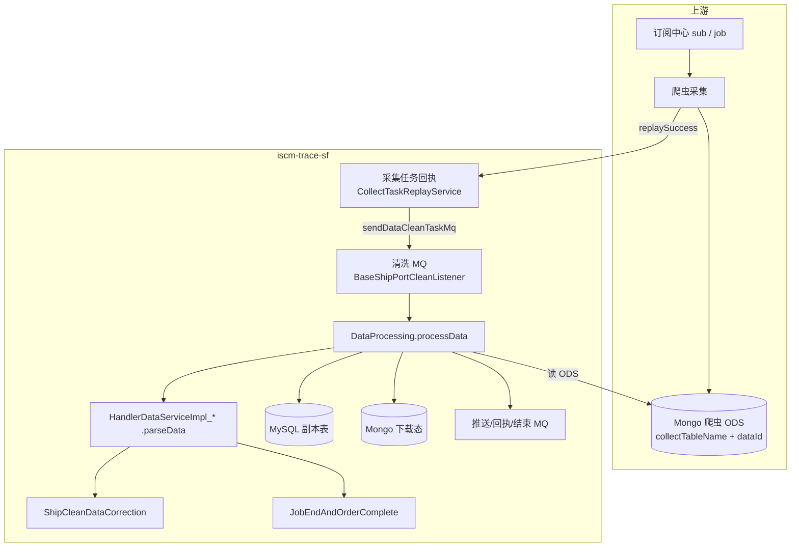
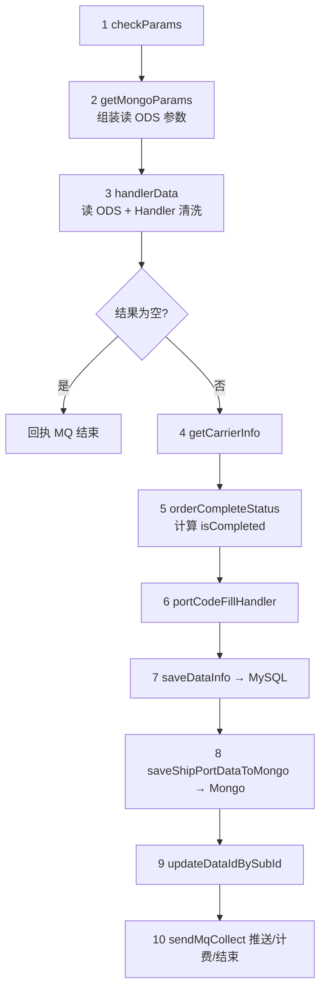
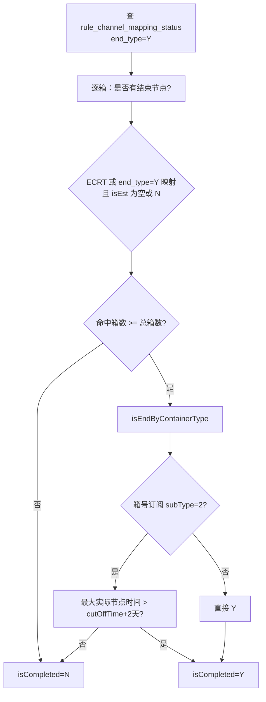

```mermaid
flowchart LR
    subgraph phase1 [阶段一：爬虫 JSON → Params]
        F1[fieldBookingInfoData<br/>rule_channel_mapping_fields]
        F2[cleanXxxValue 船司实现]
    end

    subgraph phase2 [阶段二：Params → 实体]
        ASM[assemblyDataService]
        MAP[mappingStatus<br/>rule_channel_mapping_status]
    end

    subgraph phase3 [阶段三：业务修正]
        SP[specialLogic]
        DC[ShipCleanDataCorrection]
        SP2[specialLogicAfterDataCorrection]
        RST[resetContainerStatusByPriorityEnd]
    end

    ODS[(OneDataDbResult)] --> F1 --> F2 --> ASM --> MAP --> SP --> DC --> SP2 --> RST
    RST --> OUT[ReplicaSaveDataResult]


```

# iscm\-trace\-sf 数据清洗全流程（Ship 链路）

> *本文档基于本仓库代码与对话中的分析整理，以自研船司（ONE\_DATA \+ **`jobType=SHIP`**）为主线，覆盖采集成功后的 Java 清洗全流程，并专门回答字段转换、动态清洗/映射、ETA/ETD 保留、**`isCompleted`**、MySQL/Mongo 落库六个核心问题。*
> 
> 


# 

---

## 项目定位与模块

核心角色：订阅中心下发采集/清洗任务 → 爬虫写入 Mongo ODS → 本服务消费清洗 MQ → 写 MySQL 结构化副本 \+ Mongo 下载态 → MQ 推送/结束 Job。

---

## 端到端总览



采集成功后的入口：`CollectTaskReplayService` 在采集回执成功时设置 `dataId`，触发清洗 MQ：

```Java
if (JobTaskStatus.replaySuccess.getCode().equals(task.getStatus())) {
    scheduleTaskDto.setDataId(scheduleTaskReplayDto.getDataId());
    scheduleTrackingJobTaskService.sendDataCleanTaskMq(scheduleTaskDto);
    task.setStep(TaskStep.dataClean.getCode());
    ...
}
```

清洗 MQ 路由：`BaseShipPortCleanListener` 按 `jobType` / `triggerChannel` / `tags` 分发；自研船司走 `ShipDataProcessingImpl.processData()`：

```Java
if (Constant.SHIP.equals(taskDto.getJobType().toString())) {
    shipDataProcessing.processData(taskDto);
    return;
}
```

---

## 采集成功后：Java 清洗主流程（Ship）

`DataProcessing.processData()` 是所有清洗实现的模板方法，Ship 子类为 `ShipDataProcessingImpl`。



对应代码：

```Java
checkParams(scheduleTaskDto);
MongoDbParams mongoParams = getMongoParams(scheduleTaskDto);
ReplicaSaveDataResult copySaveDataResult = handlerData(mongoParams, scheduleTaskDto);
...
jobEndAndOrderComplete.orderCompleteStatus(scheduleTaskDto, copySaveDataResult);
portCodeFillHandler.fillStandardCodeInfo(scheduleTaskDto, copySaveDataResult);
...
saveDataInfo(result, scheduleTaskDto);          // MySQL
...
SeaBookingInfoDTO data = saveShipPortDataToMongo(scheduleTaskDto, result);  // Mongo
updateDataIdBySubId(scheduleTaskDto, dataId);
this.sendMqCollect(scheduleTaskDto, result, cleanMongoDataDTO, data);
```

`handlerData` 内部（Ship）：

1. 用 `dataId` \+ `collectTableName` 等从 Mongo 读出 `OneDataDbResult`（爬虫原始 JSON 结构）

2. 按船司代码从 Spring 工厂取 `HandlerDataServiceImpl_{CARRIER}`（如 ONE → `HandlerDataServiceImpl_ONE`）

3. 调用 `parseData()` 完成全部 Handler 层清洗，返回 `ReplicaSaveDataResult`

---

## Handler 层：`parseData` 详细步骤

入口：`HandlerDataServiceImpl_SHIP.parseData()`

```Java
ExploreStatusLinerTracking linerTracking = cleanTrackingInfoData(oneDataDbResult);     // 基本信息
List<ExploreStatusLinerTrackingCtnrInfoDto> ctnrInfoList = cleanCntrInfoData(...);   // 箱信息
List<CtnrStatusParams> ctnrStatusParams = cleanCntrStatusData(...);                    // 箱动态(未映射)
List<RouteLegsParams> routeLegsParams = cleanLegsData(oneDataDbResult);               // 航段
...
supplementaryTrackingData(...);                                                        // 船司补充
ShipSaveDataDto saveDataDto = CntrInfoConvert.convertEntity(replicaSaveDataDto);
ReplicaSaveDataResult saveDataResult = assemblyDataService.shipAssemblyData(saveDataDto);
getPortCode(saveDataResult);
ReplicaSaveDataResult replicaSaveDataResult = mappingStatus(saveDataResult, carrierCd); // 动态映射
specialLogic(replicaSaveDataResult, oneDataDbResult);                                  // 船司特殊逻辑
dataCorrection(scheduleTaskDto, replicaSaveDataResult);                                // 公共 dataCorrection
specialLogicAfterDataCorrection(...);
shipCleanDataCorrection.resetContainerStatusByPriorityEnd(...);                         // 禁止再增删动态
return replicaSaveDataResult;
```



---

## 六大核心问题详解

---

### 5\.1 字段转换 —— 爬虫 JSON 转 Java

本质：爬虫 Mongo ODS 里是船司网站原始字段名的 JSON；Java 侧通过 `rule_channel_mapping_fields` 表 \+ `HeaderMappingImpl.fieldBookingInfoData()` 把 key 替换成 Java Params 字段名，再反序列化为 Params 对象。

配置表：`rule_channel_mapping_fields`（按 `channel_code` 船司 \+ `type` 数据块类型）

数据块类型（`SeaStatusEnum.trackingStatusEnum`）：

字段映射核心逻辑：

```Java
public String fieldBookingInfoData(HeaderMappingDto headerMappingDto) {
    ...
    List<RuleChannelMappingFields> tracedFieldMappingEntities =
    iRuleChannelMappingFieldsService.selectRuleChannelMappingFieldList(code, type);
    *// replaceField：网站字段名 → db_field/sql_field*
```

以基本信息为例（`HandlerDataServiceImpl_SHIP.getTrackingInfoParams`）：

```Java
JSONObject bookingInfo = oneDataDbResult.getBookingInfo();
bookingInfoString = headerMapping.fieldBookingInfoData(
   new HeaderMappingDto(bookingInfoString, TRACKING, carrierCd));
TrackingParams trackingParams = JSONObject.parseObject(bookingInfoString, TrackingParams.class);
```

映射完成后，各船司在 `cleanTrackingInfoValue` / `cleanCntrInfoValue` / `cleanCntrStatusValue` / `cleanLegsValue` 中对值做格式化（日期、去前缀、拆分实际/预计等），这是第二层“值清洗”，仍属于字段转换范畴。

实体组装：Params → Explore 实体 → Ship 实体

```Java
BeanUtils.copyProperties(replicaSaveDataDto, saveDataDto);
ExploreStatusLinerTracking linerTracking = replicaSaveDataDto.getLinerTracking();
ShipStatusLinerTracking shipStatusLinerTracking = new ShipStatusLinerTracking();
BeanUtils.copyProperties(linerTracking, shipStatusLinerTracking);
```

航段时间字符串 → `LocalDateTime`：

```Java
routeLegs.setEta(DateTimeUtil.getLocalDateTime(legsParams.getEta(), DateTimeUtil.SIMPLETYPE));
routeLegs.setEtd(DateTimeUtil.getLocalDateTime(legsParams.getEtd(), DateTimeUtil.SIMPLETYPE));
```

---

### 5\.2 动态清洗 —— 箱动态清洗的方法

箱动态在 `parseData` 中分 三步，注意“清洗”和“映射”是分开的：

#### Step A：读原始动态 \+ 字段名映射

```Java
JSONArray cntrStatus = oneDataDbResult.getContainerStatusInfo();
cntrStatusString = headerMapping.fieldBookingInfoData(
    new HeaderMappingDto(cntrStatusString, CNTR_STATUS, carrierCd));
return JSONArray.parseArray(cntrStatusString, CtnrStatusParams.class);
```

#### Step B：`cleanCntrStatusValue()` — 船司 abstract，洗值

- 日期格式统一

- 地点拼接（如 TSL 的 Country \+ Location）

- 过滤无效节点

- 此时尚未映射为标准 `statusCd`

```Java
List<CtnrStatusParams> resultList = cleanCntrStatusValue(cntrStatusParams);
*// 按时间正序/倒序打 systemStatusIndex*
```

#### Step C：公共 `ContainerStatusInfoCorrection.dataCorrection()` — 洗业务

在 `ShipCleanDataCorrection.dataCorrection()` 中调用，主要方法：

#### Step D：`resetContainerStatusByPriorityEnd` — 结束节点优先级

`parseData` 最后一步，注释明确：之后不允许再增删箱动态。

---

### 5\.3 动态转换 —— 爬虫原文 → Java 标准节点

标准节点：`ContainerStatusEnum` 定义的 `statusCd`（如 `LOAD`、`DPOL`、`ECRT`、`APOD` 等）。

映射配置表：`rule_channel_mapping_status`（按船司 `channel_code`）

映射入口：`HandlerDataServiceImpl_SHIP.mappingStatus()` → `ctnrStatusMapping()`

```Java
public ReplicaSaveDataResult mappingStatus(ReplicaSaveDataResult copySaveDataResult, String carrierCd) {
    List<RuleChannelMappingStatus> ruleAirAeMappingStatus =
        headerMapping.getRuleAirAeMappingStatusEntity(carrierCd);
    ctnrStatusMapping(ruleAirAeMappingStatus, copySaveDataResult);
    distinguishBetweenPort(ruleAirAeMappingStatus, copySaveDataResult);  *// 部分船司区分 POL/POT*
    return copySaveDataResult;
}
```

映射逻辑（`HeaderMappingImpl.ctnrStatusMapping`）：

- 输入：爬虫原文 `stateDescription`（及可能的原始 status 字段）

- 匹配：`rule_channel_mapping_status` 中的 `status_desc` → `status_code`

- 输出：`ShipStatusLinerCtnrTrackingStatus.statusCd` = 标准枚举 code

- 部分船司重写 `distinguishBetweenPort`：起运港/中转港描述相同时再细分

结束节点判定也依赖此表：`JobEndAndOrderComplete` 查 `end_type='Y'` 的映射，与 `ECRT` 一起作为订单完成条件（见 5\.4）。

---

### 5\.4 数据补充逻辑 —— ETA/ETD 保留 \+ `isCompleted`

#### 5\.4\.1 ETA/ETD 的三层字段

#### 5\.4\.2 在哪里“首次设置”（补充）

`cleanLegsData` 与 `dataCorrection` 的关系：

- `cleanLegsData`：早期、航段级，处理本次爬虫 `shippingInfo`

- `dataCorrection`：后期、跨层兜底，可读 Mongo 上次值，且能从航段/箱动态反填基本信息

#### 5\.4\.3 保留逻辑（空值不覆盖）

数据源：Mongo `ODS_SHIP_DOWNLOAD_DATA`（`shipDataId`）→ `SeaBookingInfoDTO`

公共 `dataCorrection` 调用顺序：

```Java
baseInfoCorrection.dataCorrection(...);           *// 补 + 保留基本信息 ETA/ETD*
routeLegInfoCorrection.dataCorrection(...);      *// 补航段 + 保留航段 eta/etd*
containerStatusInfoCorrection.dataCorrection(...); *// 补/洗动态 + 保留 ETA/ETD 节点*
historyRecordCorrection.dataCorrection(...);
baseInfoCorrection.fillBaseInfoForEtaDestinationByStatus(result);
```

#### 5\.4\.4 基本信息 `isCompleted` 逻辑

计算时机：`handlerData` 完成之后、`saveDataInfo` 之前：

```Java
jobEndAndOrderComplete.orderCompleteStatus(scheduleTaskDto, copySaveDataResult);
```

写入位置：`ShipStatusLinerTracking.isCompleted`（`Y` / `N`）

正常 Java 清洗（`crawlClean=false`） — `shipStatusEnd()`：

```Java
开始
                      |
          crawlClean == true ?
                /           \
              是             否
              |               |
     获取 isCompleted          根据 jobType
              |               |
       是否 == Y ?             SHIP/PORT
          /      \
        否        是
        |          |
      return   获取箱子列表
                    |
               是否为空
                 /   \
               是     否
               |       |
            return   根据箱型判断
                        |
               更新 isCompleted
                        |
                     return
```



特殊船司：

- MSC：所有箱出现 `Export Returned Empty` 描述 → 结束

- SITC/SNL \+ 箱号订阅：DIPOD/GOPOD 后出现无法映射的新动态 → 结束

爬虫清洗路径（`crawlClean=true`）：仅当爬虫已标 `Y` 时，再用 `isEndByContainerType` 二次校验。

默认值：MySQL 保存前空则 `N`：

```Java
linerTracking.setIsCompleted(ObjectUtil.defaultIfBlank(linerTracking.getIsCompleted(), "N"));
```

下游影响：`isCompleted=Y` → `sendMqCollect` 通知订阅中心停止调度 Job；Mongo 下载态 `SeaBookingInfoDTO.isCompleted` 与 MySQL 同源。

---

### 5\.5 落库 MySQL

入口：`ShipDataProcessingImpl.saveDataInfo()`（`DataProcessing.processData` 第 7 步，带 Redis 分布式锁）

```Java
public boolean saveDataInfo(ReplicaSaveDataResult copySaveDataResult, ScheduleJobTaskDto scheduleTaskDto) {
    Long bid = saveService.saveTracking(linerTracking);                              *// 主表*
    saveService.saveTrackingRouteLegs(copySaveDataResult.getTrackingRouteLegsList(), bid);  *// 航段*
    this.saveCntrInfo(copySaveDataResult.getCtnrInfoList(), bid);                    *// 箱+动态*
    CompletableFuture... shipContainerStatusExtraInfoService.saveContainerStatusInfo(...); *// 异步扩展表*
}
```

表与操作：

MySQL 的定位：结构化内部副本，用于组装对外 Mongo DTO（`handlerShipDownloadData` 会再查 MySQL 主表 id 组装 `SeaBookingInfoDTO`）。


SQL:

主表 ：ship\_status\_liner\_tracking 查 ONEYTAOG84326900

ship\_status\_liner\_tracking\_route\_legs\.bid = ship\_status\_liner\_tracking\.id

ship\_status\_liner\_tracking\_ctnr\_info\.bid = ship\_status\_liner\_tracking\.id

ship\_status\_liner\_ctnr\_tracking\_status\.bid = ship\_status\_liner\_tracking\_ctnr\_info\.id

MONGO:

ODS\_SEA\_AE\_ONE\_202605 采集到的原数据表


---

### 5\.6 落库 Mongo

入口：`ShipDataProcessingImpl.saveShipPortDataToMongo()`（MySQL 之后）

写入集合：

DTO 组装：不是直接把 `ReplicaSaveDataResult` 写入，而是：

```Java
public SeaBookingInfoDTO handlerShipDownloadData(ReplicaSaveDataResult copySaveDataResult, boolean isAutoTest) {
*// 查 MySQL 主表 → bookingService.processShipDataByMemory() 组装完整 SeaBookingInfoDTO*
```

非首次更新流程：

```Java
SeaBookingInfoDTO oldData = mongoTemplate.findById(dto.getId(), ..., ODS_SHIP_DOWNLOAD_DATA);
mongoTemplate.upsert(..., ODS_SHIP_PREVIOUS_DOWNLOAD_DATA);   *// 存快照*
boolean refresh = ObjectCheckUtils.checkDataIsRefresh(oldData, dto);
dto.setDataRefresh(refresh);
saveFirstStatusInfo(...);
mongoTemplate.findAndModify(..., ODS_SHIP_DOWNLOAD_DATA);     *// 更新当前态*
```

Mongo 的定位：对外下载态 / 推送态；订阅中心 `sub.dataId` 指向 `_id`（snowflake）。

读 Mongo（清洗过程中）：

- 读爬虫 ODS：`getMongoParams` → `dataOperateService.getMongodbData`（输入）

- 读上次下载态：`ShipCleanDataCorrection.queryMongoData(shipDataId)`（ETA/ETD 保留、增量修正）

---

## 关键类索引


---

## 阅读建议（按优先级）

1. `BaseShipPortCleanListener` → `DataProcessing.processData` — 掌握主链路骨架

2. `HandlerDataServiceImpl_SHIP.parseData` — 理解清洗 13 步

3. 选一个熟悉船司（如 `HandlerDataServiceImpl_ONE`）对照 `cleanLegsValue` / `specialLogic`

4. `ShipCleanDataCorrection` — 公共补充/保留

5. `JobEndAndOrderComplete` — 结束逻辑

6. `ShipDataProcessingImpl.saveDataInfo` \+ `saveShipPortDataToMongo` — 双写落库

---

## 附录：ETA/ETD 设置时间线（便于排障）

爬虫 bookingInfo/shippingInfo

→ fieldBookingInfoData（字段名映射）

→ cleanTrackingInfoValue / cleanLegsValue（值清洗，航段 eta/etd 在此设）

→ assembly \+ LegsConvert（类型转换）

→ specialLogic（船司设基本信息 etapld/etdpol）

→ dataCorrection（公共从航段/箱动态补 \+ Mongo 保留空值）

→ orderCompleteStatus（isCompleted）

→ saveDataInfo（MySQL）

→ saveShipPortDataToMongo（Mongo 下载态，含 originalEta/history 等）


