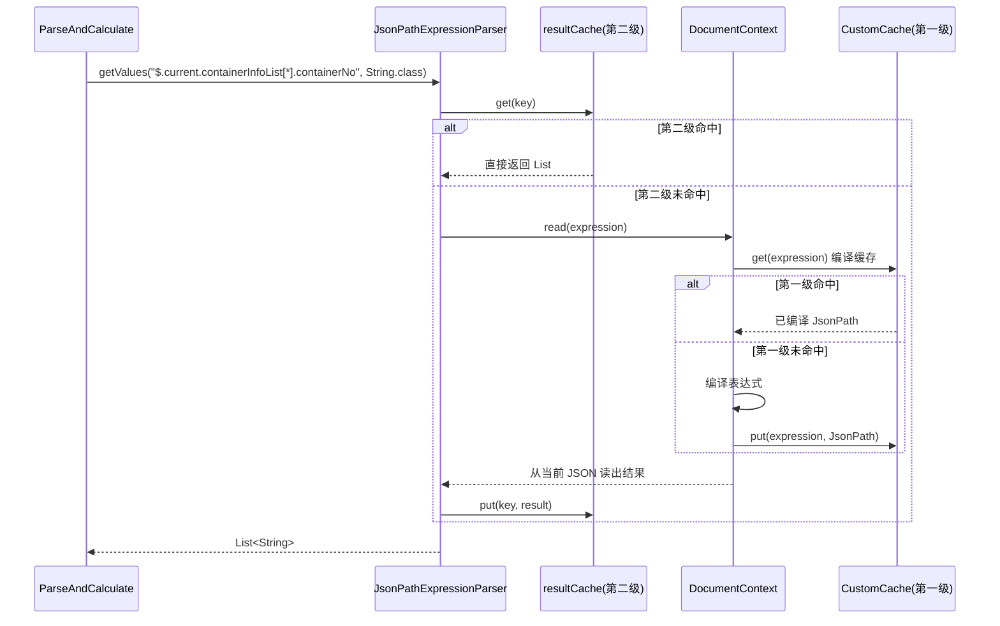
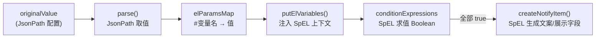

# jsonpath \+ SpEL 技术方案

## 技术文档：JsonPath 技术背景与本项目实践（iscm\-trace\-notify\-platform）

本文档聚焦两件事：

1. **技术背景**：为什么在“轨迹通知/预警”里需要 JsonPath（以及 EL 表达式）  

2. **项目实践**：本项目如何使用 JsonPath（解析器封装、缓存策略、兜底开关、典型写法、性能与坑），并引用代码示例。

---

## 1\. 技术背景：为什么用 JsonPath

### 1\.1 业务问题的本质：规则是“配置”，数据是“变形 JSON”

本项目处理的“轨迹数据”来自不同来源、不同业务线（SHIP/PORT/FUSION），最终以 **清洗后的 JSON** 形式存放在 Mongo download 集合中。通知/预警的判断条件（规则）具备几个典型特征：

- **规则多变**：客户、业务线、节点、预警逻辑经常调整，不能每次都改代码发版

- **数据结构复杂**：单票可能有多箱，多段动态，节点层级深、字段不定

- **判断逻辑组合**：不仅要取字段值，还要做“是否变更/是否超阈值/是否满足时间窗口”等计算

因此系统需要一种“**从 JSON 中灵活取值**”的方式（JsonPath），以及一种“**对取值结果进行布尔/比较/组合计算**”的方式（EL 表达式）。

### 1\.2 本项目的规则引擎形态：JsonPath 负责取值，EL 负责判断

在 Parse 阶段（例如 `ParseAndCalculate`）：

- 先把 `context.getDownloadDataInfo()` 序列化成 JSON 字符串

- 用 JsonPath 从 JSON 中取出规则所需的字段值（可能是列表，也可能是单值）

- 把这些值放入 EL 的上下文变量表

- 用 EL 表达式计算命中（是否 WARNING / CHANGE / ADD 等）

代码入口可以直接看到这一设计（节选 `push/step/parse/ParseAndCalculate.java`）：

```Java
*// 创建解析规则（JsonPath）*
this.jsonPathExpressionParser =
    ParserFactory.createJsonPathExpressionParser(JsonUtil.toJson(context.getDownloadDataInfo()));
```

---

## 2\. 本项目的 JsonPath “基建”：解析器工厂与配置

### 2\.1 ParserFactory：统一创建 JsonPath/EL 解析器

`common/parse/ParserFactory.java` 负责创建解析器：

```Java
public static JsonPathExpressionParser createJsonPathExpressionParser(String json) {
    return new JsonPathExpressionParser(json, OBJECT_MAPPER);
}
```

同时也会创建 EL 解析器，并注入 `now_date_time` 与 `now_timestamp` 等“运行时变量”（用于规则表达式）。

### 2\.2 JsonPathExpressionParser：二次封装 Jayway JsonPath \+ 结果缓存

`common/parse/path/JsonPathExpressionParser.java` 是本项目对 JsonPath 的核心封装，做了三件关键事：

1. **统一 JsonPath 配置**：`ALWAYS_RETURN_LIST`、`SUPPRESS_EXCEPTIONS` 等，避免大量异常与分支判断  

2. **表达式结果缓存**：同一条表达式在同一轮解析中会被多次读取，使用 Caffeine 缓存结果降低 CPU 消耗  

3. **支持 setValue**：允许在解析过程中“写回”一些派生字段到 JSON 上下文，方便后续规则复用

关键代码（节选）：

```Java
Configuration configuration = Configuration.builder()
    .options(Option.DEFAULT_PATH_LEAF_TO_NULL, Option.SUPPRESS_EXCEPTIONS, Option.ALWAYS_RETURN_LIST)
    .mappingProvider(new JacksonMappingProvider(objectMapper))
    .jsonProvider(new JacksonJsonProvider(objectMapper))
    .build();

this.documentContext = JsonPath.parse(json, configuration);

*// 结果缓存：表达式 + 类型作为 key*
this.resultCache = Caffeine.newBuilder()
    .maximumSize(1000)
    .expireAfterAccess(Duration.ofMinutes(5))
    .recordStats()
    .build();
```

取值 API（按本项目习惯）：

- **列表取值**：`getValues(expression, clazz)`  

- **单值取值**：`getValue(expression, clazz)`（内部取列表第一个）  

- **写值**：`setValue(expression, value)`（并 `invalidateAll()` 清空结果缓存）

### 2\.3 JsonPathConfig：控制“表达式编译缓存”与锁竞争（非常重要）

Jayway JsonPath 本身会对“表达式编译结果”做缓存。在高并发、表达式多样时，默认缓存可能导致锁竞争或内存压力。

本项目通过 `config/JsonPathConfig.java` 在启动时替换 JsonPath 的缓存实现：

- 使用 `CustomCache` 区分 **临时缓存** 与 **永久缓存**

- 对包含过滤语法 `"[?("` 的表达式（动态表达式）更谨慎：根据特征决定放临时还是永久

- 提供一个兜底开关 `notify-config.jsonPathCacheGuaranteeModeOpen`：打开后，凡是包含 `"[?("` 的表达式统一走临时缓存

核心逻辑（节选）：

```Java
*// 动态过滤表达式特征*
private final static String FILTER_KEY = "[?(";

*// 如果包含了?[就是动态的*
if (StringUtils.contains(key, FILTER_KEY)) {
    *// 兜底模式：动态表达式统一临时缓存*
    if (this.notifyConfigProperties.currentIsGuaranteeMode()) {
        return true;
    }
    *// 含 containerNo/containerNumber 的动态表达式 → 临时缓存*
    if (keyContains(key, "@.containerNo", "@.containerNumber")) {
        return true;
    }
    *// 含 flightNo 的动态表达式 → 临时缓存*
    return keyContains(key, "@.flightNo");
}
```

**理解要点**：

- 这里缓存的是“表达式编译后的 JsonPath 对象”，不是表达式结果

- “动态表达式”数量可能随箱号/航班等变化爆炸，因此倾向于临时缓存（有过期），避免永久缓存污染

---

## 3\. 项目中 JsonPath 的典型使用方式

### 3\.1 在 Parse 阶段获取“迭代集合”（箱号列表）

JsonPath 最常见用法之一：从 current 数据中取出箱号列表，作为后续逐箱计算的迭代集合。

#### SHIP：箱号来自 current\.containerInfoList

`ShipParseAndCalculateForWarning.before()`：

```Java
List<String> values =
    super.jsonPathExpressionParser.getValues("$.current.containerInfoList[*].containerNo", String.class);
super.setIterationItems(values);
```

#### FUSION：箱号来自 containerNumberList（已做并集）

`FusionParseAndCalculateForWarning.before()`：

```Java
List<String> values =
    super.jsonPathExpressionParser.getValues("$.current.containerNumberList[*]", String.class);
super.setIterationItems(values);
```

#### PORT：箱号来自港区明细；船计划场景可用占位触发“按基础信息维度”规则

`PortParseAndCalculateForWarning.before()`：

```Java
List<String> values = super.jsonPathExpressionParser.getValues(PORT_CONTAINER_NUMBER_JSON_PATH, String.class);
if (CollectionUtils.isEmpty(values) && this.isPortTerminal) {
    super.setIterationItems(Collections.singletonList("BY-INFO-SCOPE"));
    return;
}
super.setIterationItems(values);
```

### 3\.2 使用 setValue 写入“派生字段”，让后续规则更稳定

本项目会在解析过程中把一些“外部查询/业务推导”结果写回 JSON 上下文，避免规则里出现大量 if/else。

#### FUSION：强制 current\.carrierCd 使用订阅码

`FusionParseAndCalculateForWarning.before()`：

```Java
String carrierCd = this.notifyContext.getSubscribeInfo().getCarrierCd();
super.jsonPathExpressionParser.setValue("$.current.carrierCd", carrierCd);
```

这能避免融合数据自身 carrierCd 与订阅码不一致导致规则判断偏差。

#### PORT：写入 terminalInfo / vslNameEn / voy 等船计划信息

`PortDataHandler.resetTerminalInfoAndReturn(...)`（节选）：

```Java
jsonPathExpressionParser.setValue("$.current.terminalInfo", BeanUtil.beanToMap(currentTerminalInfoDTO));
jsonPathExpressionParser.setValue("$.current.vslNameEn", currentTerminalInfoDTO.getVslNameEn());
jsonPathExpressionParser.setValue("$.current.voy", isImportFlag ? currentTerminalInfoDTO.getImportVoy() : currentTerminalInfoDTO.getExportVoy());
```

这类 setValue 会清空 `JsonPathExpressionParser` 的“结果缓存”，确保后续读取拿到新值。

### 3\.3 使用过滤表达式 `[?()]` 做“按箱号定位节点”

过滤表达式是功能强但也最容易引发性能/缓存问题的部分（也正是 `JsonPathConfig` 特别处理的原因）。

例如 `FusionDataSend` 中根据箱号与状态码定位某个动态节点时间（节选）：

```Java
dto.setEcpu(jsonPathExpressionParser.getValue(
  String.format("$.current.containerStatusInfoList[?(@.containerNo == '%s' && @.statusCd == 'ECPU' && @.isEst == 'N' && @.source == 0)].statusTime", containerNumber),
  String.class
));
```

**实践建议（来自代码现状）**：

- 过滤表达式尽量把条件收敛到必要字段（containerNo/statusCd/source/isEst）

- 避免把“高基数变量”写进表达式导致表达式编译缓存膨胀（例如 containerNo），必要时依赖 `JsonPathConfig` 的临时缓存策略

### 3\.4 读取并用于“发布拦截/灰度”逻辑

`ReleaseInterceptTool.needNotify20240723(...)` 用 JsonPath 读取 `$.current.terminalInfo.ata` 做发布期间拦截（节选）：

```Java
String value = jsonPathExpressionParser.getValue("$.current.terminalInfo.ata", String.class);
```

该模式体现了：JsonPath 取值不仅用于规则判断，也可用于一些“运行期保护逻辑”。

---

## 4\. 性能与稳定性设计总结（本项目的关键经验）

### 4\.1 两级缓存：表达式编译缓存 \+ 结果缓存

- **表达式编译缓存**（Jayway JsonPath 层）：由 `JsonPathConfig` 注入 `CustomCache` 控制临时/永久  

- **结果缓存**（本项目封装层）：`JsonPathExpressionParser.resultCache`，避免同一轮解析重复读相同表达式

这两级缓存解决的痛点不同：

- 编译缓存解决“同一表达式重复编译”的 CPU 开销  

- 结果缓存解决“同一表达式重复读取”的 CPU/反序列化开销

### 4\.2 为什么特别关注 `[?(` 动态表达式？

动态表达式往往包含箱号/航班号等高基数变量，导致：

- 编译缓存 key 数量爆炸（内存压力）

- cache put/get 竞争加剧（锁竞争/吞吐下降）

因此项目把动态表达式按特征路由到“临时缓存”，并提供兜底开关：

- `notify-config.jsonPathCacheGuaranteeModeOpen = true` 时：动态表达式统一临时缓存

### 4\.3 ALWAYS\_RETURN\_LIST 的取舍

`JsonPathExpressionParser` 配置了 `Option.ALWAYS_RETURN_LIST`，带来两个好处：

- 上层逻辑统一用 `getValues(...)` 处理，减少 “是数组还是单值” 的分支

- `getValue(...)` 只是“取列表第一个”，约定清晰

代价是部分场景会多一层 list 包装，但在规则引擎里通常可以接受。

---

## 5\. 常见坑与排障建议（JsonPath 相关）

### 5\.1 取值为空不是异常：SUPPRESS\_EXCEPTIONS

由于启用了 `Option.SUPPRESS_EXCEPTIONS`，很多“路径不存在/类型不匹配”不会抛异常，而会返回空列表/空值。

因此排障时应优先：

- 确认 download 数据 JSON 结构（current/previous 是否存在对应字段）

- 确认 JsonPath 表达式是否与业务线数据结构匹配（SHIP/PORT/FUSION 不同）

### 5\.2 setValue 会使结果缓存失效

`setValue(...)` 会 `resultCache.invalidateAll()`，这是正确的（避免读到旧值），但也意味着：

- setValue 频繁会降低缓存收益

- 需要把 setValue 设计为“每 record 一次”而不是“每表达式一次”

### 5\.3 动态过滤表达式过多导致性能问题

如果看到 CPU 飙升/吞吐下降，重点排查：

- 是否大量拼接 `[?(@.containerNo == 'xxx' ...)]` 这种表达式

- 是否需要开启 `jsonPathCacheGuaranteeModeOpen` 做兜底

- 是否可以通过 Assembly 阶段预处理/归一化数据，减少动态过滤表达式数量

---

## 6\. 参考代码索引（便于跳转）

- JsonPath 缓存策略配置：`notify-service/src/main/java/.../config/JsonPathConfig.java`

- JsonPath 解析器封装：`notify-service/src/main/java/.../common/parse/path/JsonPathExpressionParser.java`

- JsonPath 编译缓存实现：`notify-service/src/main/java/.../common/parse/path/CustomCache.java`

- 解析器工厂：`notify-service/src/main/java/.../common/parse/ParserFactory.java`

- Parse 主流程：`notify-service/src/main/java/.../push/step/parse/ParseAndCalculate.java`

- 港区船计划写值逻辑：`notify-service/src/main/java/.../push/port/parse/PortDataHandler.java`

- 动态过滤表达式示例：`notify-service/src/main/java/.../push/fusion/send/FusionDataSend.java`

- 发布拦截示例：`notify-service/src/main/java/.../util/ReleaseInterceptTool.java`


## 两级缓存详解

---

## 第一级：表达式编译缓存（Jayway / `CustomCache`）

谁在用： Jayway 在 `documentContext.read(path)` 内部自动用，业务代码一般不直接碰。

何时写入： 第一次遇到某个表达式字符串时，Jayway 编译成 `JsonPath`，再 `put` 进 `CustomCache`。

缓存 key： 表达式字符串本身，例如：

- `$.current.containerInfoList[*].containerNo`

- `$.current.containerStatusInfoList[?(@.containerNo == 'ABCD1234567' ...)]`

生命周期： 应用启动时通过 `JsonPathConfig` 注入，全 JVM 共享，跨多次 MQ 消费、多个 `JsonPathExpressionParser` 实例。

为什么还要分「临时 / 永久」：

```Java
*// JsonPathConfig：决定某个表达式进哪个桶*
if (contains "[?(") {
    if (兜底模式开启) → 临时缓存
    else if (含 @.containerNo / @.flightNo) → 临时缓存
    else → 永久缓存  *// 含 [?( 但不含箱号/航班号的过滤表达式*
}
*// 不含 [?( → 永久缓存*
```

- 永久缓存：容量约 2000，无过期。适合规则里固定的路径，如 `$.current.containerNumberList[*]`。

- 临时缓存：容量约 50 万，30 分钟无访问过期。适合 按箱号拼接 的 `[?(@.containerNo == 'xxx')]`——每个箱号一条不同表达式，不能无限进永久缓存。

解决的问题： 编译 JsonPath 的 CPU 和 Jayway 默认全局缓存带来的锁竞争。

---

## 第二级：读取结果缓存（`JsonPathExpressionParser`）

```Java
public JsonPathExpressionParser(String json, ObjectMapper objectMapper) {
    if (*log*.isDebugEnabled()) {
        *log*.debug("当前JsonPath缓存类型: {}", CacheProvider.*getCache*().getClass().getSimpleName());
    }
    Configuration configuration = Configuration.*builder*()
            // 总是返回list方便取值
            .options(Option.*DEFAULT_PATH_LEAF_TO_NULL*, Option.*SUPPRESS_EXCEPTIONS*, Option.*ALWAYS_RETURN_LIST*)
            .mappingProvider(new JacksonMappingProvider(objectMapper))
            .jsonProvider(new JacksonJsonProvider(objectMapper))
            .build();
    this.documentContext = JsonPath.*parse*(json, configuration);
    this.resultCache = Caffeine.*newBuilder*()
            .maximumSize(1000)
            .expireAfterAccess(Duration.*ofMinutes*(5))
            .recordStats()
            .build();
}
```

谁在用： 只有走 `getValues` / `getValue` 时才会命中；`parse()` 里直接 `documentContext.read(path)` 不走 这层缓存。

何时写入： 第一次对某表达式调用 `getValues(expression, clazz)` 或 `getValue(expression)` 时。

缓存 key：

```Java
*// getValues*
expression + "|" + clazz.getName()   *// 如 $.current.xxx|java.lang.String*
*// getValue(expression) 无类型重载*
expression + "|OBJ"
```

生命周期： 每个 `JsonPathExpressionParser` 实例各自一份（通常一次 Parse 对应一份 `DownloadDataInfo` JSON），最多 1000 条，5 分钟无访问过期；`finished()` 会打命中率日志。

失效： `setValue()` 会改 JSON 并 `resultCache.invalidateAll()`，避免读到旧值。

```TypeScript
public void setValue(String expression, Object value) {
    documentContext.set(expression, value);
    resultCache.invalidateAll();  *// 第二级全部清空*
}
```

解决的问题： 一轮规则计算里，同一表达式可能被多条规则、多个用户配置重复读取；结果缓存省掉重复的 `read`。

---

## 一次 `getValues` 的完整路径

要点：

1. 第二级命中 → 不再 `read`，第一级也不会被访问。

2. 第二级未命中 → 才 `read`，此时才可能用到第一级编译缓存。

3. `setValue` 之后 → 只清第二级；第一级仍保留编译结果（表达式字符串没变）。



要点：

1. 第二级命中 → 不再 `read`，第一级也不会被访问。

2. 第二级未命中 → 才 `read`，此时才可能用到第一级编译缓存。

3. `setValue` 之后 → 只清第二级；第一级仍保留编译结果（表达式字符串没变


# SpEL 技术背景与本项目实现

> 代码里类名多用 `ElExpressionParser`，底层实现是 Spring 的 `SpelExpressionParser`，下文统一称 **SpEL**。
> 
> 

## 7\.1 为什么用 SpEL 而不是纯 JsonPath？

JsonPath 擅长“读数据”，但不适合表达复杂业务逻辑，例如：

- `currentEta != previousEta && currentEta != null`

- 时间先后比较、滞港小时数阈值、多条件 AND

- 拼接通知文案：`#concat('ETA变更为', #currentEta)`

- 调用项目内置函数：`#formatDateTime(#ata)`、`#transitDemurrageWarningByFusion(...)`

这些逻辑如果全部写死在 Java 里，每加一种预警都要发版。因此把**判断条件**和**展示文案**配置为 SpEL 字符串，存于 `tip_notify_rule_config` 的 `RuleContent` 中。

## 7\.2 规则配置结构（JsonPath 与 SpEL 的分工）

`RuleContent`（`push/rule/RuleContent.java`）是单条规则的核心载体：

|字段|技术|作用|
|---|---|---|
|`originalValue`|**JsonPath**|从 download JSON 取值，结果命名为 SpEL 变量|
|`conditionExpressions`|**SpEL**|命中条件（全部满足才通知），返回 `Boolean`|
|`tipMessage`|**SpEL**|通知提示文案，返回 `String`|
|`showContent.webInfo.detailDescription`|**SpEL**|Web 预警展示描述|
|`showContent.wechatInfo.viewContent.*`|**SpEL**|微信模板各字段|
|`businessProperties`|**SpEL**|业务去重 Key 等|

`OriginalValueInfo` 单条取值配置：

- `name`：变量名（SpEL 里用 `#name` 引用）

- `expression`：JsonPath 路径；箱维度规则里用 `##` 占位符，运行时替换为当前箱号

- `valueType`：单值类型，如 `java.lang.String`

- `resultType`：`single` / `multi`（multi 时不做类型强转）

## 7\.3 SpEL 解析器封装：`ElExpressionParser`

`common/parse/el/ElExpressionParser.java` 对 Spring SpEL 做了薄封装：

```TypeScript
public ElExpressionParser(Map<String, Object> context) {
    this.evaluationContext = new StandardEvaluationContext();
    *// 根对象：可在表达式里用 #root 或省略前缀调用方法*
    this.evaluationContext.setRootObject(new RootEntity());
    this.evaluationContext.setVariables(context);
}

@Override
public <T> T getValue(String expression, Class<T> clazz) {
    Expression parseExpression = GlobalSpElExpressionParser.getInstance().getCachedExpression(expression);
    return parseExpression.getValue(evaluationContext, clazz);
}
```

**两个上下文概念**：

|机制|访问方式|本项目用途|
|---|---|---|
|**变量 Variables**|`#变量名`|JsonPath 取值结果、`now_timestamp`、阈值、客户备注等|
|**根对象 Root**|`#root.xxx()` 或直接 `xxx()`|`RootEntity` 上的业务工具方法（时间比较、滞港判断、字符串处理）|

## 7\.4 全局表达式编译缓存：`GlobalSpElExpressionParser`

SpEL 使用**一级编译缓存**（与 JsonPath 的两级缓存相互独立）：

```Java
private final SpelExpressionParser parser = new SpelExpressionParser(
    new SpelParserConfiguration(SpelCompilerMode.MIXED, classLoader)
);

private final Cache<String, Expression> expressionCache = Caffeine.newBuilder()
    .maximumSize(1000)
    .initialCapacity(500)
    .recordStats()
    .build();

public Expression getCachedExpression(String expressionString) {
    return expressionCache.get(expressionString, parser::parseExpression);
}
```

- **单例 \+ 全 JVM 共享**：同一条件表达式字符串只编译一次

- **`SpelCompilerMode.MIXED`**：热点表达式可 JIT 编译，兼顾解释执行与性能

- **运维查看**：`OpsController` 可读取 `GlobalSpElExpressionParser.getRecordStats()` 命中率

> SpEL **没有**类似 `JsonPathExpressionParser.resultCache` 的“求值结果缓存”：因为每次规则的变量表（`#currentEta` 等）不同，缓存结果意义不大；只缓存 **Expression 编译产物**。
> 
> 

## 7\.5 根对象 `RootEntity`：规则里的“标准库”

`RootEntity` 是挂在 SpEL 根对象上的**业务函数库**（约 1500\+ 行），规则配置人员可在表达式中直接调用，无需写 Java。

典型能力分类：

- **空值/集合**：`collectionIsEmpty`、`firstNotBlank`、`collectionSize`

- **比较**：`eq`、`ne`、`before`、`after`、`between`

- **时间/文案**：`formatDateTime`、`timeChangeMessage`、`statusChangeMessage`、`buildMessage`

- **业务预警**：`transitDemurrageWarningByFusion`、`transitDemurrageWarningByApiMessage`

- **跨步骤状态**：通过 `RootEntityTools` 读写 Redis（解析过程中暂存中间结果，供同一条规则内后续表达式使用）

`RootEntityTools` 提供 Redis、标准港码查询等基础设施，供 `RootEntity` 内部方法调用。

SpEL 调用示例（规则配置侧写法）：

```Plain Text
#formatDateTime(#currentAta)
#eq(#currentVoy, #previousVoy) == false && #nonEmpty(#currentVoy)
#concat('箱号', #containerNumber, ' ETA变更')
```

## 7\.6 JsonPath → SpEL 完整协作流程

核心方法：`AbstractDataParseAndCalculate.parseAndCalculate(...)`，一条规则的处理分三步：



**Step 1 — JsonPath 取值**（`parse` 方法）：

```JSON
*// expression 中的 ## 替换为当前箱号*
path = expression.replace("##", containerNumber);
value = jsonPathExpressionParser.getValue(path, originalValueInfo.getValueType());
resultMap.put(name, value);  *// name 即 SpEL 变量名*

*// 内置变量*
resultMap.put("current_item_number", containerNumber);
resultMap.put("containerNumber", containerNumber);  *// 兜底*
```

**Step 2 — SpEL 条件判断**（`calculate` 方法）：

```Java
elExpressionParser.putVariables(map, NOW_DATE_TIME_KEY, NOW_TIMESTAMP_KEY);
return conditionExpressions.stream().allMatch(expr ->
    elExpressionParser.getValue(expr, Boolean.class)
);
```

多条 `conditionExpressions` 是 **AND** 关系：全部返回 `true` 才算命中。

**Step 3 — 命中后生成展示内容**（`createNotifyItem`）：

```Java
*// 提示文案*
notifyItem.setTipMessage(elExpressionParser.getValue(tipMessage, String.class));
*// Web 预警描述（落库 remark 来源）*
relatedData.put("detailDescription",
    elExpressionParser.getValue(webViewContent.getDetailDescription(), String.class));
*// 微信各字段、业务去重 Key 同理*
```

## 7\.7 每条订阅记录内的 SpEL 上下文注入

`ParseAndCalculate.createParseAndCalculate` 为**同一 consumeRecord 的多条规则**复用同一个 `ElExpressionParser`，并在循环中注入业务变量：

```Java
ElExpressionParser elExpressionParser = this.initElExpressionParser();
for (RuleItem ruleItem : ruleItems) {
    elExpressionParser.putVariable("company_notify_node", configRuleCodes);
    elExpressionParser.putVariable("customerRemark", userRecord.getCustomerRemark());
    elExpressionParser.putVariable("customerRecordCreateTime", ...);
    elExpressionParser.putVariables(thresholdToMap(ruleItem), "now_date_time", "now_timestamp");
    List<NotifyInfoItem> notifyItems = this.parseAndCalculateItem(ruleItem, elExpressionParser);
}
```

`ParserFactory.createElExpressionParser` 还会预置：

- `#now_date_time`：当前时间字符串

- `#now_timestamp`：当前毫秒时间戳

## 7\.8 SpEL 与 JsonPath 的使用边界（写规则时怎么选）

|需求|用 JsonPath|用 SpEL|
|---|---|---|
|从轨迹 JSON 取字段|✅ `originalValue.expression`|❌|
|按箱号过滤数组元素|✅ 路径里写 `##` 或 `[?(@.containerNo=='##')]`|❌|
|判断两字段是否相等/变更|❌|✅ `#eq(#a, #b)`|
|时间先后、阈值、多条件组合|❌|✅ `conditionExpressions`|
|生成通知/展示文案|❌|✅ `tipMessage` / `detailDescription`|
|发送模板附加字段（纯展示）|✅ `templateContent` 仍走 JsonPath|视场景|

`templateContent`（附加信息）和 `originalValue` 走 JsonPath；`conditionExpressions` / 文案类字段走 SpEL——这是项目里固定的技术分界。

## 7\.9 SpEL 常见坑与排障

1. **变量未定义**：`originalValue` 里没有配置某个 `name`，但 `conditionExpressions` 里用了 `#xxx` → 可能得到 `null` 或判断为 false；注意 `containerNumber` 有兜底注入。

2. **变量残留**：同一 `ElExpressionParser` 跨多条规则复用，`putVariables` 会覆盖同名 key，但**不会自动清除**上一条规则多出来的变量；设计上是“每条规则重新 put 阈值等”，依赖 `parse()` 每次生成新的 `elParamsMap` 再 `putElVariables`。

3. **条件为空**：`conditionExpressions` 为空 → `calculate` 直接返回 `false`，不会通知。

4. **根对象方法名拼写**：`RootEntity` 方法必须在表达式里写对，否则 SpEL 运行时报错（无 `SUPPRESS_EXCEPTIONS`）。

5. **与 JsonPath 混淆**：`originalValue.expression` 写的是 `$.current...`；`conditionExpressions` 写的是 `#变量` 或 `#formatDateTime(...)`，不要混用语法。

## 7\.10 SpEL 参考代码索引

- SpEL 解析器封装：`notify-service/.../common/parse/el/ElExpressionParser.java`

- 全局编译缓存：`notify-service/.../common/parse/el/GlobalSpElExpressionParser.java`

- 根对象函数库：`notify-service/.../common/parse/el/RootEntity.java`

- 根对象基础工具：`notify-service/.../common/parse/el/RootEntityTools.java`

- 规则内容模型：`notify-service/.../push/rule/RuleContent.java`、`OriginalValueInfo.java`

- 取值 \+ 条件计算主流程：`notify-service/.../push/step/parse/AbstractDataParseAndCalculate.java`

- 变量注入与规则循环：`notify-service/.../push/step/parse/ParseAndCalculate.java`

- 缓存统计运维接口：`notify-service/.../controller/OpsController.java`

