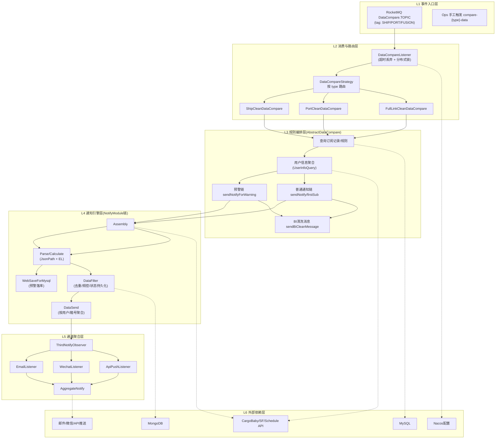
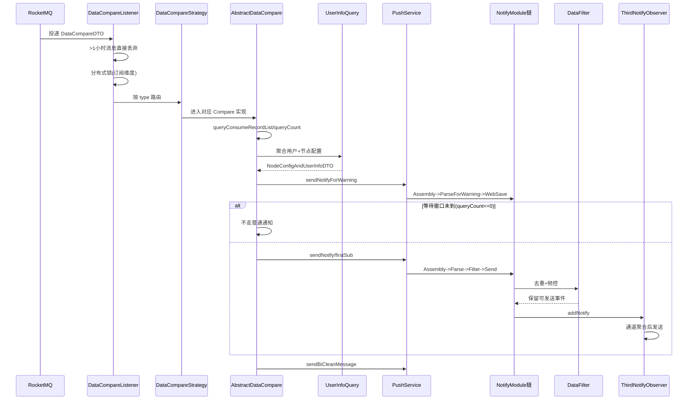

# 项目架构说明

# iscm\-trace\-notify\-platform 分层架构与核心链路

## 1\. 分层架构总览

## 2\. 核心执行时序

## 3\. 关键机制详解

### 3\.1 用户信息聚合（`UserInfoQuery`）

1. 聚合两类通知对象：

- 客户内部用户（用户ID维度，支持邮箱/微信/API账号）

- 通讯录转发用户（联系人邮箱维度）

2. 聚合两类节点配置：

- 用户节点配置（recordId \+ userId）

- 转发节点配置（recordId \+ 联系人邮箱）

3. key 设计：

- 普通用户：`md5(userId, recordId)`；支持全局兜底 `md5(userId, null)`

- 转发用户：`md5(email, recordId)`

4. 最终产物：

- `userNotifyConfigList`：谁可接收通知

- `consumeRecordNodeConfigList`：每人可接收哪些节点（warn/notify/plan）

- `userCodeSetMap`：后续过滤“当前用户不关注节点”的依据

### 3\.2 去重逻辑（四层）

1. 规则结果去重：

- `NotifyInfoItem.uniqueAndBusinessKey()` 避免同业务键重复入集。

2. 持久态去重（最核心）：

- `DataFilter` 从 Mongo `CONTAINER_NODE_NOTIFY_RECORD` 读取历史发送状态。

- 分 `warningNodeNotifyInfoMap` 与 `changeNodeNotifyInfoMap` 两套计数状态。

3. 发送内容聚合去重：

- `DataSend` 在“箱号\+节点\+businessKey”维度合并。

- 冲突按 `sendPriority` 选优先级高者。

4. 通道内去重：

- Email/API：同 `subId + container` 合并并合并 flag。

- Wechat：同 `subId + scope(+container)` 合并模板项。

### 3\.3 频控策略（`FrequencyStrategy`）

支持四种策略：

1. `EVERY`：每次触发都可发。

2. `COUNT`：`eventItem.total < frequency.total` 时可发。

3. `INTERVAL`：距上次通知小时数落入配置区间才可发。

4. `TIME`：满足 cron 且当天发送次数 `< total`。

补充：

- `DataFilter.sendMaxTotal()` 还有总上限保护（默认 10）。

### 3\.4 “X 秒内不发送”的实现

1. X 不是固定值，来自表 `cargo_baby_wait_time_config.wait_time`（秒）。

2. 按类型读取：`ship/port/full_link`。

3. 判定条件本质为：

- `wait_time < TIMESTAMPDIFF(SECOND, create_time, now())`

4. 若不满足：

- 普通通知链被短路（不发邮件/微信/API）

- 预警落库链通常已执行

- BI 清洗消息仍可能发送

## 4\. 三条业务线的模块链

1. SHIP：

- `ShipDataAssembly -> ShipParseAndCalculate -> ShipDataFilter -> ShipDataSend`

- 预警链：`ShipDataAssembly -> ShipParseAndCalculateForWarning -> WebPortAndShipSaveForMysql`

2. PORT：

- `PortDataAssembly -> PortParseAndCalculate -> PortDataFilter -> PortDataSend`

- 预警链：`PortDataAssembly -> PortParseAndCalculateForWarning -> WebPortAndShipSaveForMysql`

3. FUSION：

- `FusionDataAssembly -> FusionParseAndCalculate -> FusionDataFilter -> FusionDataSend`

- 预警链：`FusionDataAssembly -> FusionParseAndCalculateForWarning -> WebFusionSaveForMysql`

## 5\. 关键数据状态（Mongo）

`CONTAINER_NODE_NOTIFY_RECORD`（按订阅记录ID存储）

1. `warningNodeNotifyInfoMap`：预警节点历史发送状态

2. `changeNodeNotifyInfoMap`：变动节点历史发送状态

3. `oldTerminalInfo`：港区链路保留的旧船计划信息

4. `subTableName/updateTime`：状态标识与更新时间

## 6\. 运行排障重点

1. 消息到了但没发通知：

- 先看是否超过 1 小时被消费层丢弃。

- 看 wait\_time 窗口是否未到（queryCount=0）。

- 看 `isOpen`、规则配置、用户通知配置是否为空。

2. 有规则但用户收不到：

- 检查 `userCodeSetMap` 是否把节点过滤掉。

- 检查通知拦截缓存 `NotifyInterceptCache`。

- 检查通道账号字段是否为空（email/openId/businessAccount）。

3. 重复通知：

- 看 Mongo 通知状态是否写入失败。

- 看业务键（`businessKey`）是否正确生成。

- 看频控策略是否配置为 `EVERY`。

