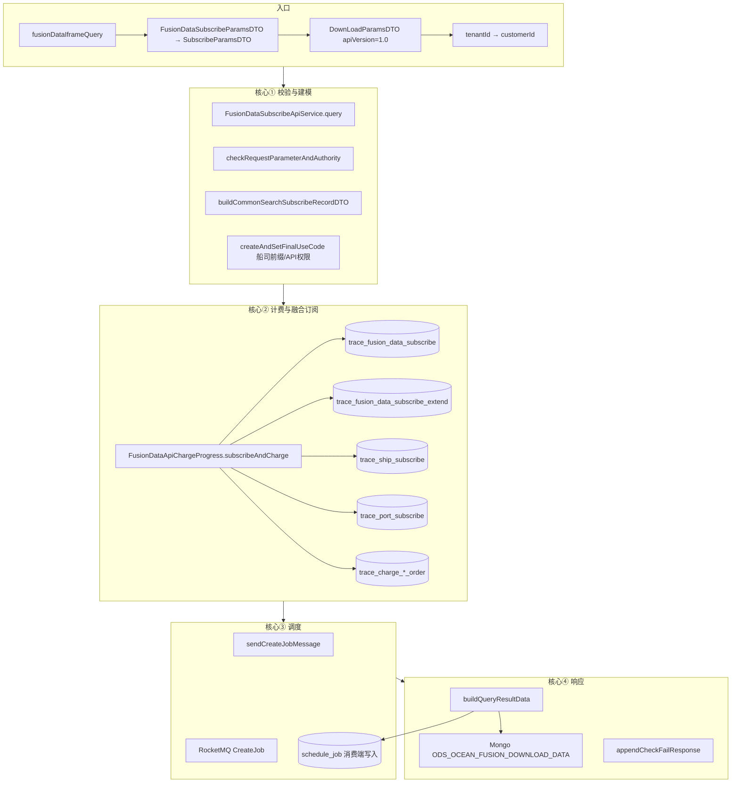
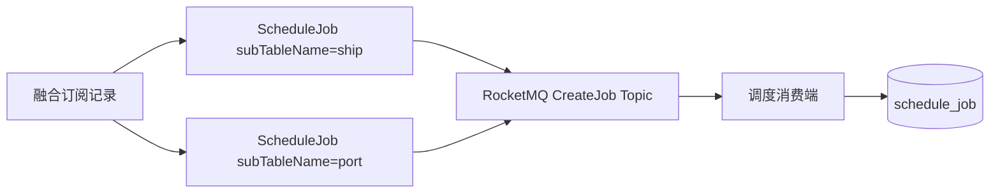

# /api/fusion\_data/query 接口全流程梳理


> 应用内路径：`POST /api/fusion_data/query`  
> 
> 对外完整路径（示例）：`/trace-subscribe/api/fusion_data/query`  
> 
> API 版本：`1.0`（Controller 写入 `DownLoadParamsDTO.apiVersion`）  
> 
> 文档范围：以**参数校验 \+ 计费订阅 \+ 子订阅联动 \+ 调度 MQ \+ 响应组装**为核心；限流、海贝配置、WEB/consume\_record 白名单等非主路径仅简要提及。  
> 
> 说明：本接口已接入统一订阅计费框架（`FusionDataSubscribeApiService`），**不再**走 `TraceFusionDataSubServiceImpl#query` 旧实现（该类中旧逻辑已注释保留）。
> 
> 

---

## 1\. 接口定位

|项|说明|
|---|---|
|**语义**|海运综合（全链路）查询：无有效订阅则新建融合订阅并联动创建船司/港区子订阅、触发抓取；已有订阅则复用并返回已有/空结果|
|**Controller**|`TraceFusionDataSubscribeController#fusionDataIframeQuery`|
|**业务服务**|`FusionDataSubscribeApiService` → 父类 `TraceSubscribeApiService`|
|**计费组件**|`FusionDataApiChargeProgress` → `AbstractApiChargeProgress`|
|**订阅持久化**|`TraceFusionSubscribeOperateServiceImpl`（主表 `trace_fusion_data_subscribe`）|
|**结果组装**|`AssembleFusionDataResultData`（Mongo \+ `schedule_job` 状态文案）|

**请求要点**

- Body：`FusionDataSubscribeParamsDTO`（单条，Controller 包装为 `List<SubscribeParamsDTO>`）

    - 必填：`carrierCd`、`subNo`、`importAndExportFlag`（I/E）

    - 可选：`subType`（默认 1 提单号，支持 1/3）、`portCd`、`extraInfo`、`useIframe`、`accounts`

- Header：`enterpriseId`（租户，映射 `customerId`）、`companyId`、`userId`、`account`

- 注解：`@OneDataLimit(key = "fusionDataQuery")` 接口级限流

---

## 2\. 端到端总览



**主调用链（代码顺序）**

```Plain Text
fusionDataIframeQuery
  → FusionDataSubscribeApiService.query
      → saveRecordAndSendMessage
          → checkRequestParameterAndAuthority          // 核心①
          → buildCommonSearchSubscribeRecordDTO        // 核心①
          → fusionDataApiChargeProgress.subscribeAndCharge  // 核心②
          → sendCreateJobMessage                       // 核心③
      → buildQueryResultData                           // 核心④
      → appendCheckFailResponse                        // 核心④
```

---

## 3\. 核心① 参数校验与请求建模

### 3\.1 Controller 层转换

|步骤|操作|
|---|---|
|DTO 拷贝|`FusionDataSubscribeParamsDTO` → `SubscribeParamsDTO`|
|subType 默认|空则设为 `1`（提单号）|
|包装|单条放入 `DownLoadParamsDTO.subscribeParamsDTOList`，`subSource=API`，`apiVersion=1.0`|
|用户|`BaseUserInfoDTO`：`customerId = CustomerHelper.getCustomerId(tenantId)`（查 `customer_info`）|

### 3\.2 `checkRequestParameterAndAuthority`

实现：`FusionDataSubscribeApiService`

|步骤|说明|
|---|---|
|`apiSubParamsValid`|`importAndExportFlag` 不能为空，必须是 I 或 E|
|`ValidUtil.validParams(..., SHIP_URL)`|船司单号格式校验、非空、去重、长度 ≤50、特殊字符过滤|

### 3\.3 `buildCommonSearchSubscribeRecordDTO`

对每条请求构建 `FusionSubscribeRecordDTO`：

|步骤|数据来源 / 逻辑|
|---|---|
|客户任务配置|读 `customer_job_type` → 是否一次性任务、是否比较 extra、是否即时调度|
|船司最终 code|`createAndSetFinalUseCode`（见下）|
|唯一身份|后续计费阶段生成 `uniqueIdentity`|
|订阅表枚举|`SubscribeTableEnum.FULL_LINK`（code=`full_link`）|

### 3\.4 `createAndSetFinalUseCode`（海运综合特有）

|步骤|说明|
|---|---|
|船司前缀匹配|非箱号订阅：查 `carrier_prefix_mapping`（`ICarrierPrefixMappingService`，常走 Redis 缓存），得到 `yxbCarrierCd`|
|最终船司|`finalUseCarrierCd = yxbCarrierCd ?? userCarrierCd`|
|API 资源权限|`apiLimitHandler.checkApiAccessResourcePermission(customerId, SHIP_URL, [finalUseCarrierCd], apiPath)`|
|扩展字段默认|未传 `extraInfo` 时补 `isExport`（默认 E）；传了则 `userSetExtraInfo=true`|
|船名航次|若传 `queryVslName` \+ `queryVoy` 写入 extraInfo|

---

## 4\. 核心② `subscribeAndCharge` — 计费与订阅落库

入口：`AbstractApiChargeProgress.subscribeAndCharge`  

融合实现：`TraceFusionSubscribeOperateServiceImpl`

### 4\.1 唯一标识

```Plain Text
uniqueIdentity = full_link + subType + subNo + finalUseCarrierCd + importExportFlag
```

并发锁：`RedissonLock`，key 含 `uniqueIdentity + companyId`。

### 4\.2 阶段 A：逐条分类（`filterNeedToChargeRecord`）

对每条 `FusionSubscribeRecordDTO`：

|序号|操作|涉及存储|
|---|---|---|
|1|计费判定 `assignOrderNumberAndAddChargeListIfNeedToCharge`|读/写计费策略；`sub_table_name=full_link`|
|2|查已有融合订阅 `traceFusionSubscribeOperateService.query`|**`trace_fusion_data_subscribe`**|
|3|关联子订阅 ID|**`trace_fusion_data_subscribe_extend`**（type=1 船司，type=2 港区）|
|4|`findRecord`|取 `effectived=T` 且 id 最大的一条|
|5|分流|无有效记录 → 待新建；有 → `existRecordList`，可能异步更新 extra/accounts|

**`trace_fusion_data_subscribe`**** 查询条件（等价）**

- `customer_id`、`sub_no`、`sub_type`

- `carrier_cd = code OR yxb_carrier_cd = code`

- `import_export_flag`

- `version = 1.0`、`is_del = 0`

### 4\.3 阶段 B：批量扣费 \+ 落库（`ChargeAndSaveRecordService.batchProcessNeedToChargeRecord`）

|序号|操作|表 / 系统|
|---|---|---|
|1|`chargeStrategy.executeBatchPay()`|海贝冻结 / Redis 扣次（按租户配置）|
|2|`batchSave` 新建融合订阅|INSERT **`trace_fusion_data_subscribe`**|
|3|联动创建子订阅|INSERT **`trace_ship_subscribe`**（必建）；条件 INSERT **`trace_port_subscribe`**|
|4|写扩展关联|INSERT **`trace_fusion_data_subscribe_extend`**|
|5|保存计费流水|INSERT **`trace_charge_once_order`** 或 **`trace_charge_ticket_order`**|
|6|写用户查询记录（可选）|INSERT/UPDATE **`consume_record`**（白名单租户）|

**新建融合订阅时的子订阅规则（****`createShipPortTerminalSubscribeRecordToDatabase`****）**

|子类型|条件|写入表|
|---|---|---|
|船司|始终创建|`trace_ship_subscribe`（`sub_source=FUSION_API`，`batch_no=fusionSubId`）|
|港区|`portCd` 非空 且 在 `base_role_config` 有配置 且 非「进口\+盐田/蛇口」|`trace_port_subscribe`|
|扩展|每次创建子订阅|`trace_fusion_data_subscribe_extend`（fusion\_sub\_id ↔ sub\_id）|

> 进口 \+ `CNSHK`/`CNYTN`：不创建港区订阅，也不发港区调度 Job（V1 逻辑，`FusionHelper.getNeedToCreatePortSubscribeFlag`）。
> 
> 

### 4\.4 阶段 C：后置处理

|操作|说明|
|---|---|
|`userQueryService.batchSaveUserQueryRecords`|白名单客户写 `consume_record`；`useIframe=true` 时供 iframe 使用|
|`specialLogicAfterHandler`|更新 `first_use_iframe_time`、合并 `accounts` 到融合主表|
|`afterHandler`（异步）|extra 变更时更新融合/船司/港区订阅及 **`schedule_job.extra_json`**|

### 4\.5 计费配置摘要

与船司 query 相同框架，`sub_table_name = full_link`：

|chargeType|行为|
|---|---|
|TIME|Redis 扣调用额度|
|VOLUME|海贝批量冻结|
|NoCharge（白名单）|不扣费|

|chargeUnit|流水表|重复 query 是否再扣|
|---|---|---|
|FREQUENCY|`trace_charge_once_order`|通常每次扣|
|TICKET / BOX|`trace_charge_ticket_order`|同 businessId 已有有效票单则不扣|

---

## 5\. 核心③ 调度 MQ

实现：`TraceSubscribeApiService.sendCreateJobMessage`  

海运综合在 `fillScheduleJobListBySubscribeRecordList` 中对 **`FusionDataSubscribeRecordVO`**** 发两条 Job**：



|Job 字段|船司 Job|港区 Job|
|---|---|---|
|`sub_id`|`shipSubId`（来自 extend）|`portSubId`（无港区订阅则跳过）|
|`carrier_cd`|最终船司 code|`portCd`|
|`sub_type`|原 subType|订舱号\(3\) 转为提单号\(1\)|
|`extra_info`|用户未传 extra 时 Job 侧置 null（仅保留箱号类 key）|完整 extra|
|`source`|API / FUSION\_API|同左|

**是否发送 Job 的条件**

- 新订阅 / 高优先级 / `realTimeTriggerFlag` / 可重复类型 → 发送

- 已存在订阅且非上述情况 → 通常不重复发（由调度侧重用的逻辑决定）

消费端异步写入/更新 **`schedule_job`**，执行船司、港区数据采集，清洗后回写融合主表 **`trace_fusion_data_subscribe.data_id`** 及 Mongo。

---

## 6\. 核心④ 响应组装

实现：`FusionDataSubscribeApiService.buildQueryResultData` → `AssembleFusionDataResultData`

> 注意：V1 接口在组装时传入 `ApiVersionUtil.API_VERSION_2`，因此**响应结构为 V2 包装格式**（含 `resultCode`/`resultMessage`/`resultData`），Mongo 数据体仍按订阅记录 `version=1.0` 读 V1 模型 `BookingInfoDTO`。
> 
> 

### 6\.1 有数据（`data_id` 非空）

|步骤|操作|存储|
|---|---|---|
|1|`mongoTemplate.findById(dataId, BookingInfoDTO, ODS_OCEAN_FUSION_DOWNLOAD_DATA)`|**Mongo ****`ODS_OCEAN_FUSION_DOWNLOAD_DATA`**|
|2|按客户配置过滤箱动态来源|读 **`customer_config_dict`**（key 与 Fusion\.SUB\_TYPE 相关）|
|3|`StandardMessageConversion.toApiJsonObject`|—|
|4|包装 V2 响应|`resultCode=1` 查询成功，`resultData=清洗后 JSON`|
|5|回显请求参数|subNo、carrierCd、portCd、importAndExportFlag、yxbCarrierCd、extraInfo|
|6|iframe|`useIframe=true` 时查 **`consume_record`** 填 `iframeDataId`|

### 6\.2 无数据（`data_id` 为空）

|场景|resultCode|resultMessage 来源|
|---|---|---|
|本次新建订阅|2（订阅成功）|固定「订阅成功」|
|复用老订阅|3（暂无结果）|`scheduleJobService.findNotResultDataReasonByFusion` → 查 **`schedule_job`**（船司侧 subId）|

### 6\.3 返回形态

- 单条接口：取 `resultDataList.get(0)` 作为 `ResponseData.data`（非数组）

- 校验失败项：`appendCheckFailResponse` 合并（本接口 V1 默认不跳过失败参数列表）

---

## 7\. 涉及操作清单

按执行顺序归纳**本接口主路径**上的操作类型：

|类别|具体操作|
|---|---|
|**读**|租户→客户映射；船司前缀；客户角色/任务类型；融合订阅及 extend；计费历史票单；Mongo 融合结果；schedule\_job 状态；customer\_config\_dict 过滤配置|
|**写**|融合订阅 INSERT；船司/港区子订阅 INSERT；extend INSERT；计费流水 INSERT；consume\_record INSERT/UPDATE（白名单）；MQ 发送 CreateJob|
|**更新**|融合表 accounts / first\_use\_iframe\_time；extra 变更时异步更新子订阅与 schedule\_job|
|**外部**|海贝冻结/扣次；RocketMQ；Redis 锁与限流|
|**不算主路径**|限流 `@OneDataLimit`；API 资源权限校验；中台 accounts 用户信息（传 accounts 时）|

---

## 8\. 数据表与存储一览

### 8\.1 MySQL（本接口直接读写）

|表名|角色|
|---|---|
|**`trace_fusion_data_subscribe`**|海运综合主订阅；唯一键逻辑：`customer_id + sub_no + carrier + import_export + version`；存 `data_id`、`unique_identity`、`effectived`|
|**`trace_fusion_data_subscribe_extend`**|融合订阅 ↔ 子订阅映射；`type=1` 船司，`type=2` 港区|
|**`trace_ship_subscribe`**|融合触发的船司子订阅（`sub_source=FUSION_API`）|
|**`trace_port_subscribe`**|融合触发的港区子订阅（条件创建）|
|**`trace_charge_once_order`**|按次计费流水|
|**`trace_charge_ticket_order`**|按票/按箱计费流水|
|**`schedule_job`**|调度任务（读状态文案；extra 变更时 UPDATE）|
|**`consume_record`**|用户查询/Web iframe 记录（白名单或 useIframe）|
|**`customer_info`**|tenantId → customerId|
|**`customer_role`**|客户开通的数据源与渠道配置|
|**`customer_job_type`**|客户级调度策略（一次性/即时触发/compare\_extra）|
|**`base_role_config`**|船司/港区数据源元数据（Job 构建、港区是否可订）|
|**`carrier_prefix_mapping`**|单号前缀 → 船司 code|
|**`customer_config_dict`**|响应时过滤箱动态 `source`|

### 8\.2 MongoDB

|集合|角色|
|---|---|
|**`ODS_OCEAN_FUSION_DOWNLOAD_DATA`**|融合清洗结果；`_id` = `trace_fusion_data_subscribe.data_id`|

### 8\.3 缓存 / 消息

|组件|用途|
|---|---|
|Redis（Redisson）|订阅 dedupe 锁；TIME 计费扣次|
|RocketMQ `CreateJob` Topic|触发 schedule 侧创建/调度 Job|

---

## 9\. 与旧实现的关系

`TraceFusionDataSubServiceImpl#query` 仍保留在代码库中（含异步 `CompletableFuture` 创建子订阅逻辑），但 **`TraceFusionDataSubscribeController`**** 已改为调用 ****`FusionDataSubscribeApiService`**。新旧路径差异：

|对比项|新路径（当前）|旧路径（已弃用于本接口）|
|---|---|---|
|入口|`FusionDataSubscribeApiService`|`TraceFusionDataSubServiceImpl.query`|
|计费|统一 `AbstractApiChargeProgress`|`FusionDataApiLimitApplication`|
|子订阅创建|`batchSave` 内同步事务|异步线程池|
|调度|统一 MQ CreateJob|`traceSubCommonService.buildJobAndSendMq`|

---

## 10\. 关键代码索引

|模块|类 / 方法|
|---|---|
|入口|`TraceFusionDataSubscribeController#fusionDataIframeQuery`|
|业务编排|`FusionDataSubscribeApiService`|
|公共流程|`TraceSubscribeApiService#query` / `#saveRecordAndSendMessage` / `#sendCreateJobMessage`|
|计费|`FusionDataApiChargeProgress` → `AbstractApiChargeProgress#subscribeAndCharge`|
|持久化|`TraceFusionSubscribeOperateServiceImpl#query` / `#batchSave` / `#createShipPortTerminalSubscribeRecordToDatabase`|
|响应|`AssembleFusionDataResultData#result`|
|港区创建规则|`FusionHelper#getNeedToCreatePortSubscribeFlag`|

---

## 11\. 典型场景时序

### 11\.1 首次查询（无订阅、无数据）

```Plain Text
Client → Controller → 校验 → 计费(新票) → INSERT 融合+船司[+港区]+extend
      → MQ(船司 Job [+ 港区 Job]) → 响应 resultCode=2「订阅成功」
      … 异步采集清洗 …
      → UPDATE data_id + Mongo 写入
Client 再次 query → 有 data_id → resultCode=1 + resultData
```

### 11\.2 重复查询（已有订阅、已有数据）

```Plain Text
Client → 查 trace_fusion_data_subscribe 命中 existRecord
      → 按票计费可能跳过 → 不发 Job（除非 realTimeTriggerFlag）
      → Mongo 读 ODS_OCEAN_FUSION_DOWNLOAD_DATA → resultCode=1
```

### 11\.3 已有订阅、采集未完成

```Plain Text
Client → existRecord 但 data_id 为空
      → schedule_job 查原因 → resultCode=3 + 文案（如「暂未查询到结果」/「官网查询无数据」）
```


